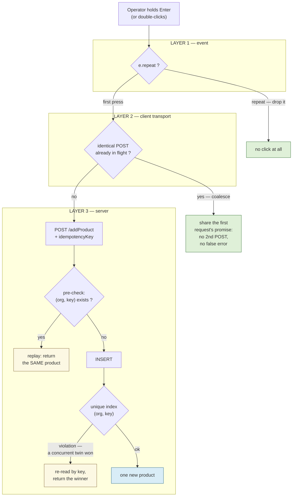

# DUP-1 — Duplicate-submit guard (all forms) + idempotent product create

**Status:** ✅ **IMPLEMENTED + GREEN** — `duplicate-submit-guard.cy.js` **10/10**, run headed 2026-09-12.
Manual acceptance script: https://claude.ai/code/artifact/dcab409c-7b83-4fa0-95c2-96c57631ca79
**Reported:** production, a shop cataloguing products — *"application registered total of 148 products on
single click of addProductAnother or addProduct saving of only one record"*.

---

## 1 · What actually happened

Four links, each verified in the source. None of them is a duplicate event handler — that was my first
suspicion and it is wrong: `#addProductAnother` binds inside the file's top-level IIFE
(`catalog-products.js:16`), `#addProduct` is an inline `onclick`, and the other 20 forms bind through
`$("#add"+buttonV).off().click(…)` (`main.js:451`), which **removes before it adds**. One click is one call.

| # | Link | Evidence |
|---|---|---|
| 1 | Enter past the last field calls `$('#add<Entity>').click()` | `keyboard-forms.js:52-57` |
| 2 | **Nothing checks `e.repeat`** — a held Enter auto-repeats at ~30/s | 0 hits across `enter-chain.js`, `keyboard-forms.js`, `pos-keyboard.js`, `main.js` |
| 3 | `saveProduct()` has no in-flight guard, does not disable its button, and `closeModal` runs *inside* the success callback — so the modal is live for the whole round trip | `catalog-products.js:717-779` |
| 4 | The server accepts every one: product name is **not unique by design**, and the SKU check is `if (sku != null && …)` — a blank SKU skips it entirely | `V10__products_org_name_index.sql:14`, `ProductService.java:110` |

Link 4 predicts something checkable: **those 148 rows must carry a blank SKU.**

`keepCataloguing()` does clear `#prodName` — but only when the response arrives, so it bounds nothing
during the burst. 148 rows ≈ 5 seconds of held Enter. The window is the round-trip latency, which is why
production showed it and a local stack does not.

> **Why no overlay caught it:** `callAjax` is deliberately `nonBlocking: true` (PERF-13 — a save must not
> freeze the till for 80-170 ms). That trade-off is correct and stays. It also means nothing stands between
> the operator's keyboard and the next POST, so the guard has to be the submit itself.

### Scope, measured

| Surface | Count |
|---|---|
| CRUD modals | **21** (business 7, education 9, agriculture 3, welfare 2) |
| …of those, wired Enter→click | **16** — only business and education load `keyboard-forms.js` |
| Inline `onkeypress` Enter→click | **2** (`login.html:119`, `educationDashboard.html:1766`) |
| Direct `$.ajax` POST sites | **66**, across **21** files |
| Shared POST helpers | `callAjax` (8 call sites) + `jsonPost` |
| Writes that disable their control today | **1** (`#addSell`, `main.js:1237`) |

`addSell` is the only protected write in the application, because it is the only one that got burned
before (SF-3). Everything else — every register in four modules — has the same hole the product form has.

---

## 2 · Three layers, because each fixes a different failure



⭐ **The pre-check alone would not have stopped this incident.** All 148 requests overlap, so all 148
pre-checks return empty — the **unique index is what actually arbitrates**, and the violation path is the
one carrying the load. A design with only the fast path looks right and fixes nothing.

Each layer is also the fallback for the one above it: Layer 1 cannot help a genuine double-click, Layer 2
cannot survive a page reload or a network-level retry, Layer 3 does not need the browser to cooperate at
all. Layers 1 and 2 are universal (all 21 forms); Layer 3 lands on product create first.

---

## 3 · Layer 1 — drop auto-repeat

A held key means *one* intent. `KeyboardEvent.repeat` is exactly the browser telling us which events are
the operator and which are the hardware.

**Two places, because the dangerous case bypasses the chain.** When focus sits on the submit button,
`enter-chain.js` returns at line 252 (the button's id is not in the chain) and the **browser** fires the
repeated `click` natively. So:

1. `enter-chain.js` — `if (e.repeat) return;` immediately after `active()`, before the Escape/Enter split.
2. A global suppressor registered on **`window` in the capture phase**, in the new `common/submit-once.js`.
   Window capture precedes document capture in the propagation path, so it runs before every existing
   handler **regardless of script order** — no load-order dependency for a later reader to get wrong.

Deliberate exclusions, so the guard cannot break ordinary typing:
- a held **Space** is suppressed only on a button / `role=button`; in a text box it is typing;
- `<textarea>` keeps plain Enter (what the control is for — the same carve-out enter-chain already makes);
- nothing else is touched: no arrows, no Tab, no modified keys.

---

## 4 · Layer 2 — coalesce identical in-flight writes

**Named pattern:** in-flight request de-duplication (request coalescing), applied as a **Decorator** over
`$.ajax`.

*Why not the obvious `$.ajaxPrefilter`* — a prefilter can only cancel by `abort()`, and an abort runs the
call site's `error` handler. The operator would see **"Could not save the product."** after a save that
succeeded. 66 call sites own those handlers and none can be told "this failure is fake". A decorator can
hand the duplicate **the first request's own promise**, so the second Enter resolves with the first
response: one POST, one success toast, no false error, and no edit to any of the 66 sites.

```
signature = METHOD + url + serialized data        // POST/PUT only; GET is not a write
in flight ? attach(success/error/complete) to the live jqXHR and return it
          : fire, register, and deregister in .always()
```

Bounds, each chosen to keep a legitimate duplicate legitimate:
- **in-flight only** — never a time window. The false-positive window is exactly the round trip, and a
  human cannot fill a form twice in 150 ms. Two products genuinely named the same, saved a second apart,
  both save.
- **opt-out** — `dedupe: false` in the ajax options, for any caller that must fire identical writes twice.
- **skipped when the body cannot be serialized** (`FormData`, a stream) rather than guessed at.
- `GET` untouched; `global: false` background calls are untouched by the affordance below.

**Layer 2b — the affordance.** The coalescing is invisible, and an operator who sees nothing happen presses
again. On `ajaxSend` for a POST, disable the open modal's submit control; re-enable on `ajaxComplete`
(always, including failure). Generic, driven by the convention `keyboard-forms.js` already relies on
(`.crud-overlay.open` + `#add<Entity>` / `data-kbd-submit`), and it disables a **button**, never a field —
`disabled` fields drop out of FormData, which this codebase has already paid for once.

---

## 5 · Layer 3 — idempotent product create

Mirrors SF-3 exactly (`V10__ch_idempotency_unique.sql`) rather than inventing a second mechanism.

**Schema — `V16__products_idempotency.sql`**

```
idempotency_key VARCHAR(191) NULL                         -- 191*4 = 764 B, fits the 1000 B index limit
UNIQUE INDEX uq_products_org_idempotency (organization_id, idempotency_key)
```

information_schema-guarded, so re-running on a migrated DB is a no-op. Existing rows keep NULL, and MySQL
treats NULLs as distinct, so live products are unaffected.

**Entity / DTO / repository**
- `Product.idempotencyKey` — `@Column(name="idempotency_key", length=191)`. ⚠ The length must match the
  migration exactly: catalog-service runs `ddl-auto: update`, and a mismatch invites Hibernate to ALTER the
  column behind Flyway's back.
- `ProductDTO.idempotencyKey` — **required**: `POST /products` binds a typed `@Valid ProductDTO`, and
  Spring Boot drops unknown JSON silently. No field, no key, and every layer above it still looks correct.
- ONE scoped finder, `findByIdempotencyKeyScoped`, reusing `ProductRepository.SCOPE` — the constant the other
  8 scoped queries in that file already share. The first draft of this design called for two derived finders to
  avoid `@Query` (validated at startup, not compile time); reusing SCOPE is better on both counts, since it is a
  proven expression and it carries the `organizationId IS NULL AND userId = :userId` fallback for free instead
  of restating it. A second hand-written copy of the tenancy predicate is how scoping rules come to disagree.

**Where the catch lives, and why it is not in the service.** `ProductService.create()` is `@Transactional`;
a constraint violation marks that transaction rollback-only, so re-reading *inside* it cannot work. The
sale solves this with an untransactional orchestrator over a `REQUIRES_NEW` writer bean. Products need no
new bean: the **controller** is already outside the transaction, so it catches
`DataIntegrityViolationException`, re-reads by key, and answers with the winner's product. `create()` keeps
its single transaction and its pre-check.

**Anti-IDOR.** The pre-check is org-scoped. A single-column UNIQUE on the key alone would be simpler and
NULL-safe, and is **rejected**: an attacker who guessed a key would otherwise replay — and so read —
another tenant's product.

**Known limit, stated rather than papered over:** for a row whose `organization_id` is NULL (legacy,
unstamped), the unique index is inert because MySQL NULLs are distinct. `create()` stamps the org from
`CurrentUser`, so every row created through the UI is covered; a NULL-org caller degrades to Layers 1-2.

### The client key lifecycle — the one way this slice can make things worse

`keepCataloguing()` keeps the modal open on purpose. **If the key is not rotated after a successful save,
the next product replays the previous one** — the operator catalogues twenty items, the shop gets one, and
it is reported as success. That is strictly worse than the bug being fixed.

So, exactly as `getSaleIdempotencyKey()` does: mint lazily, **retire on success at the very top of the
success handler, before anything that can throw** (`saveProductTracking`, `keepCataloguing` and
`loadDataTable` can all throw; SF-3b was caused by precisely this ordering). Rotation sites — **3**, being
every path that clears the identity of the product on screen:

| Site | Line | Why |
|---|---|---|
| `resetProductForm()` | `364` | full reset (cancel / close / after a plain save) |
| `resetProductIdentityFields()` | `677` | the Save-&-Add-Another path |
| `editProduct()` | `611` | an edit must never carry a create key |

A key is **not** retired on failure — that is what makes a retry after a dropped connection safe.

---

## 6 · What this deliberately does not do

- **No idempotency on update/void/delete.** An update is addressed by id and is naturally idempotent.
- **No change to PERF-13's `nonBlocking`.** Re-introducing a blocking overlay would "fix" this by making
  every save feel slower — the trade-off already rejected.
- **No deny-by-default anywhere.** Nothing here can refuse a legitimate save; every layer either drops a
  hardware artefact or returns the record the operator already created.
- **The other 20 forms get Layers 1-2 only** in this slice. They are then protected against key-repeat and
  double-click, but not against a reload mid-save. Layer 3 per register is a follow-up, and the pattern is
  now one file to copy.

> ⚠ **Correction found while implementing, recorded rather than quietly fixed.** The review said 21 modals are
> wired Enter→click. They are not: `keyboard-forms.js` is opt-in per dashboard (its own header says so), and
> only `businessDashboard` and `educationDashboard` load it — so **16** modals carry the Enter→click path and
> agriculture's 3 + welfare's 2 are exposed to double-click only. Both groups are covered either way, because
> `submit-once.js` ships in the shared `fragments/header.html`, but the number in the first draft was wrong.

## 7 · Gate

`cypress/e2e/business/duplicate-submit-guard.cy.js` — every assertion must fail on today's build:

1. 30 synthetic repeat Enters on the product form ⇒ **1** product (Layer 1)
2. `e.repeat` Enter on a focused submit button ⇒ no click (Layer 1, the native path)
3. two identical POSTs fired in the same tick ⇒ **1** network request, **both** callers see success (Layer 2)
4. the dropped duplicate shows **no** error toast (the reason prefilter+abort was rejected)
5. same `idempotencyKey` posted twice sequentially ⇒ **1** product, the same id returned twice (Layer 3 fast path)
6. same key posted concurrently ⇒ **1** product (Layer 3 violation path — the one that fixes the incident)
7. Save & Add Another twice ⇒ **2** products with different ids (the key really rotates — the regression
   that would make this slice worse than the bug)
8. a *different* key with identical field values ⇒ **2** products (a legitimate duplicate is still allowed)
9. Enter in a `<textarea>` still inserts a newline; a held Space in a text box still types spaces

---

## 8 · Result, and what the gate run itself taught

**10/10 green.** Layer 3's race path was additionally verified by direct measurement against the running
stack, because it is the half that actually fixes the incident and a gate alone is a thin place to rest that:

```
8 concurrent POST /addProduct, one idempotencyKey
  → all 8 answered 200 {"success":true,"data":{"id":5511}}   ← the SAME product
  → 34-56 ms each, 845 ms wall clock
```

That measurement proves more than the index: had the key been dropped anywhere on the wire — the monolith's
pass-through `Map`, the typed `ProductDTO` binding — all eight would have inserted. So the whole chain carries
it, and the "Spring drops unknown JSON silently" trap named in §5 was genuinely avoided rather than merely
noted.

**Three false failures on the first run, none of them the product.** Recorded because each would otherwise be
rediscovered by whoever next writes a spec against a modal in this codebase:

| Symptom | Actual cause |
|---|---|
| C-2 `cy.then()` timed out — "a promise that never resolved" | Two things at once: the case handed Cypress a **cross-realm `w.Promise.all`** on a 5 s budget, and the api-gateway was answering **503** because catalog-service had just restarted and Eureka had not reconverged (`myplus-catalog` 7 min old, gateway 28 h). Fixed by racing through the app's own transport with layer 2's `dedupe:false` opt-out and a *polling* 30 s wait. |
| D-1/D-2/D-3 "element is currently animating" | The spec skipped the settle sequence `catalog-product.cy.js` already documents: the overlay hides when the last request completes, and that same `ajaxComplete` rebuilds every picker, growing the modal so a centred dialog slides. The field drifts **after** the page looks ready. |
| D-3 "not visible… covered by `#appAjaxOverlay`" | Helper ordering: `should('be.visible')` is a POSITION check, so `waitForAppReady` must run **before** it, not after. It surfaced only in the last case of the file, because every earlier case adds products and so lengthens that case's list load — a helper whose correctness depends on how much test data exists is not correct yet. |

⭐ The standing lesson from the first of those: **`dedupe:false` is not decoration.** Without it, layer B
coalesces the eight racing requests into one, a single product exists, and C-2 passes just as happily with
layer C deleted — the "gate that goes green testing nothing" failure, in the one case that matters most.
