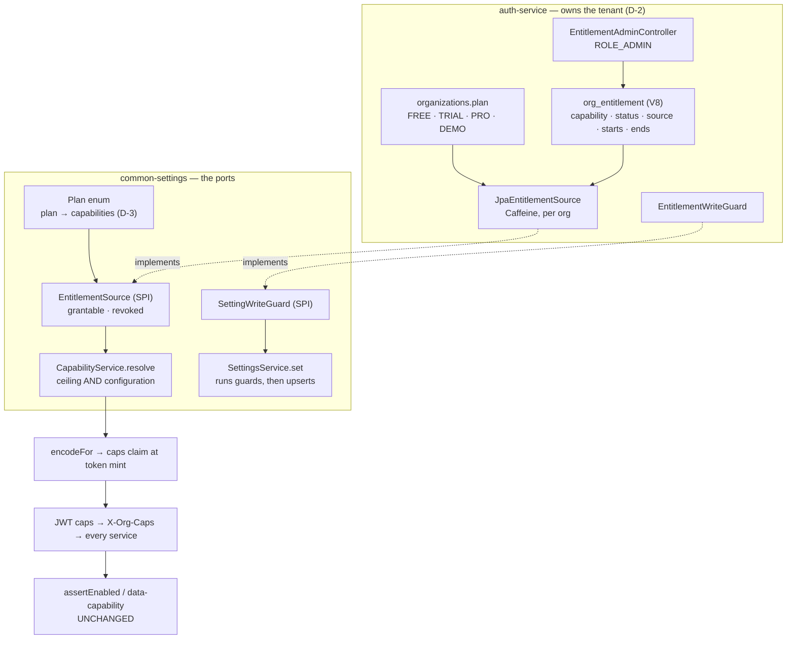
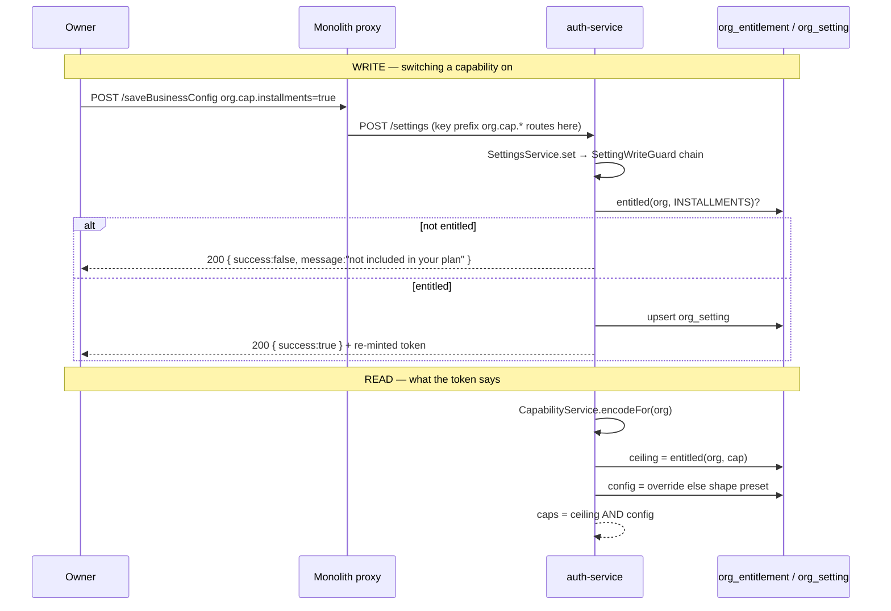

# E1 — the entitlement ceiling

**Status:** ✅ **SHIPPED AND GREEN** (2026-09-01). Gate written before the implementation, per
`SAAS-BUILD-STANDARDS.md` ("The gate is written BEFORE the implementation").
`entitlement-ceiling.cy.js` green, with `capability-gating` / `capability-shapes` / `dashboard-widgets` /
`product-policies` / `capability-enforcement` re-run alongside — they all sit on the `CapabilityService` change.
**Programme:** [`saas-control-plane-review.md`](../saas-control-plane-review.md) · slice E1 of E0..E6.
**Builds on:** [`capability-platform-design.md`](../capability-platform-design.md) (C1..C6, shipped) ·
[`vertical-profile-any-business-design.md`](../vertical-profile-any-business-design.md) (the two axes).
**Rulings taken** (owner, 2026-08-31): D-1 = **(c)** cached read, no hot-path call · D-2 = **auth-service** ·
D-3 = **code**, matching `Shape.preset()` · D-4 = trial expiry folds in, `entryCap` does not (§9).

---

## 1. The defect, in one paragraph

`SettingsService.set(key, value)` refuses a key that is not in the catalog and performs no other check.
`org.cap.*` keys **are** in the catalog — that is how the Configuration screen renders them — and
`SettingsController.save` gates on `ROLE_OWNER or ADMIN_PRIVILEGE`, which every tenant owner holds inside their
own org. So the owner of any tenant can

```
POST /saveBusinessConfig   key=org.cap.installments   value=true
```

and hold a paid capability, permanently, at no charge. Org scoping holds — this is not a cross-tenant leak — it
is a **licensing** hole: the platform has four working layers of control and no ceiling over the third.

---

## 2. The rule this slice adds

```
effective(tenant, capability)  =  ENTITLED    (what was sold — platform decides)
                              AND ENABLED    (what the owner switched on — tenant decides)
                              AND PERMITTED  (privilege — already built)
                              AND IN SCOPE   (branch/location — already built)
```

Only the first term is new. The other three are shipped and green.

**The ceiling never grants.** An entitlement can only *remove* a capability the configuration layer would
otherwise have allowed; it can never switch one on that the owner has not chosen. That single property is what
makes this deploy analysable — see §7.

---

## 3. Benchmark, before the decision (standard 7a)

| System | What it does | Taken / rejected |
|---|---|---|
| **Salesforce** | A user needs **both** a licence and a permission set; the licence bounds what a permission set may grant | **Taken** — this is exactly the entitlement × permission split, and it is the model the proposal cites |
| **AWS Service Control Policies** | An SCP **never grants**; it only bounds what IAM inside the account may allow | **Taken, and it is the sharpest framing available.** "Ceiling, never grant" is why §7's inertness argument works at all |
| **Shopify** | Plan gates features, shop settings configure them, staff permissions authorise | **Taken** — three layers, same order as ours |
| **Odoo** | Features arrive by *installing a module* into the database | **Rejected.** Per-tenant module installation in a shared multi-tenant deployment means per-tenant schema, which contradicts D1 (one Flyway history per service) |
| **NetSuite / SAP** | Full subscription + billing engine driving entitlement | **Deliberately different.** We record what was sold; we do not build billing. An operator sets the record, payment lives outside the platform. Revisit when self-serve upgrade is real |

**Where the benchmark changed the answer:** the first sketch had `EntitlementSource` returning the *set* a tenant
may use, which invites a caller to read it as a grant. The SCP framing forced it to a boolean **bound**
consulted by the existing resolver — one method, no new decision point, and impossible to use as a grant by
mistake.

---

## 4. Design

### 4a. Where each piece lives



**Nothing outside auth-service changes behaviour.** Every other service already reads the ceiling's result,
because C3c made the `caps` claim the answer and this slice only changes how auth computes it. That is the same
move C1 made — *the first slice changes the SOURCE of a decision, never the decision*.

### 4b. The resolution, end to end



### 4c. New and changed artefacts

| Where | Artefact | New/changed |
|---|---|---|
| `common-settings` | `Plan.java` — enum `FREE`/`TRIAL`/`PRO`/`DEMO`, each with a `Set<Capability>` | new |
| `common-settings` | `EntitlementSource.java` — SPI, **two** questions: `grantable` (write) + `revoked` (read) | new |
| `common-settings` | `SettingWriteGuard.java` — SPI, `void check(Long org, String key, String value)` | new |
| `common-settings` | `CommonSettingsAutoConfiguration` — `@Import` the new beans; publish a **permissive default** `EntitlementSource` under `@ConditionalOnMissingBean` | changed |
| `common-settings` | `SettingsService` — run the guard chain in `set()`; emit `locked` + `lockedReason` from `catalogForOrg()` | changed |
| `common-settings` | `CapabilityService.resolve` — `NOT revoked AND (override else preset)` | changed |
| `auth-service` | `V8__org_entitlement.sql` | new |
| `auth-service` | `OrgEntitlement` entity + `OrgEntitlementRepository` | new |
| `auth-service` | `JpaEntitlementSource` — implements both questions; Caffeine per org; dates applied on read | new |
| `auth-service` | `EntitlementWriteGuard` — asks `grantable`; refuses enabling; **never refuses disabling** | new |
| ~~`auth-service`~~ | ~~`EntitlementSeeder`~~ — **deleted in §7b**; the resolver makes the deploy inert, so nothing needs seeding | — |
| `auth-service` | `JpaEntitlementSourceTest` — 8 cases; the service had **no test source root** before | new |
| `auth-service` | `EntitlementAdminController` — `GET/POST /api/auth/admin/entitlements`, `ROLE_ADMIN` | new |
| monolith | `settings-form.js` renders a locked row; `messages*.properties` × 6 gain 2 `ui.js.*` keys | changed |
| cypress | `e2e/platform/entitlement-ceiling.cy.js` + `cy.setEntitlement()` in `support/commands.js` | new |

### 4d. Schema

```sql
CREATE TABLE IF NOT EXISTS org_entitlement (
    id               BIGINT       NOT NULL AUTO_INCREMENT,
    organization_id  BIGINT       NOT NULL,
    capability       VARCHAR(60)  NOT NULL,   -- Capability.code(), e.g. 'installments'
    status           VARCHAR(20)  NOT NULL,   -- ACTIVE | SUSPENDED | EXPIRED
    source           VARCHAR(20)  NOT NULL,   -- PLAN | GRANDFATHERED | CONTRACT | ADMIN_OVERRIDE
    starts_at        DATETIME     NULL,
    ends_at          DATETIME     NULL,
    reason           VARCHAR(255) NULL,
    granted_by       BIGINT       NULL,
    created_at       DATETIME     NULL,
    updated_at       DATETIME     NULL,
    PRIMARY KEY (id),
    UNIQUE KEY uq_org_entitlement (organization_id, capability)
) ENGINE=InnoDB DEFAULT CHARSET=utf8mb4 COLLATE=utf8mb4_0900_ai_ci;
```

`capability` is `VARCHAR`, not a MySQL `enum` — deliberately, and against the platform's usual habit. A new
`Capability` value must not require an `ALTER … MODIFY enum` on a licensing table
(`project_enum_string_mysql_enum_migration` records that cost), and an unknown code here resolves to "no row"
rather than to a broken read.

**The unique key is the index.** `(organization_id, capability)` serves the only lookup this table has and
enforces one-row-per-pair at the same time; no second index is added, deliberately.

### 4e. Plan → capability (D-3: code, not data)

| Plan | Capabilities | Rationale |
|---|---|---|
| `FREE` | `batchTracking`, `expiryTracking`, `looseSelling` | basic stock hygiene; a corner shop is usable, advanced trade is not |
| `TRIAL` | **all** | a trial that hides half the product does not sell it; bounded by `trialEndsAt` (§9) |
| `DEMO` | **all** | the sandbox exists to show everything; bounded by `entryCap` |
| `PRO` | **all** | every operator-provisioned customer today is a paying customer |

A mid tier (`STANDARD`) is **one enum entry** — Open/Closed, no other file changes. That is the whole reason
this is code rather than a table, and it matches `Shape.preset()`, the pattern the platform has proven twice.

**This is a pricing decision, not an engineering one.** It is recorded here so it can be changed in one place
by whoever owns pricing.

---

## 5. The pattern, named (standard 7b)

* **Ceiling / bounded Policy Decision Point.** `EntitlementSource` is a *Specification* that bounds
  `CapabilityService.resolve`. Effective = ceiling ∧ configuration. **SOLID consequence:** the enforcement
  points (`assertEnabled`, `[data-capability]`, the `caps` claim) do not change at all — Open/Closed at the one
  seam that matters, and the reason six existing guards across four services need no edit.
* **Ports and Adapters with a permissive default bean.** `common-settings` declares the port; auth supplies the
  adapter. The default is published as `@Bean @ConditionalOnMissingBean`, so the injection into
  `CapabilityService` stays **required**. This is deliberate: `JpaSettingsStore`'s javadoc records that OMS O3
  shipped a resolver with `required = false` and no store, and it silently did nothing. *A guard that disables
  itself when a bean is missing is worse than no guard, because it reads as protection.*
* **Chain of Responsibility on the write path.** `SettingsService.set` runs `List<SettingWriteGuard>` before the
  upsert. The next rule — a quota guard, a compliance guard — adds a bean, not a branch in `set()`.
* **Segregated queries (CQS, applied to a policy).** `grantable` and `revoked` are two questions with opposite
  safe defaults, deliberately not one predicate. **SOLID consequence:** the read path is structurally incapable
  of consulting a plan, so the §7b defect cannot recur by editing one branch — it would take deleting a method.
* **DRY:** one resolver answers the render side and the refusal side, exactly as C3c required. The `locked` flag
  the screen reads is computed by *asking the guard chain* whether the write would be allowed — so the lock and
  the refusal cannot disagree, because they are the same code.

---

## 6. Performance, on the hot path (standard 7c)

| Path | Before | After |
|---|---|---|
| Sale, purchase, dispense, any `assertEnabled` | map lookup on the `caps` claim | **unchanged** — zero new work, zero new calls |
| Any service other than auth | reads the claim | **unchanged** |
| Token mint (login + refresh, ~1 per 15 min per session) | 1 cached settings read | + 1 **cached** entitlement read per org |
| Configuration screen load | 1 catalog call | **unchanged** — `locked` rides the response that already happens |
| Capability write | 1 upsert | + 1 cached ceiling check |

The entitlement cache is the same shape and bounds as PERF-C1: Caffeine, keyed by organisation, `maximumSize`
bounded, invalidated **exactly on write** with a TTL only as a multi-replica backstop. Keyed by org is the
load-bearing part — a cache keyed without it would serve one tenant's licence to another, silently.

**Net effect on a tenant who never touches this feature: nothing measurable.** The only new query happens once
per token mint and is served from cache after the first.

---

## 7. Why this deploy is inert (F6) — and two wrong turns, kept as the record

> **Read §7b first if you only read one part of this document.** The reasoning below is what led to a seeder
> that no longer exists; it is kept because the mistake is more instructive than the fix.

Every existing tenant is on plan `FREE` — `getOrCreatePrimaryOrg` builds an `Organization` without a plan and
`@Builder.Default` supplies `"FREE"`. Applying `Plan.FREE` directly would strip ten capabilities from every
tenant on the platform, break the 23 green capability tests, and switch off a real customer's headline feature.

**So the ceiling is seeded, not assumed** — and *what* it seeds is the correction that matters here.

| | Pre-E1 value | |
|---|---|---|
| **ceiling** | all capabilities | there was no ceiling; an owner could switch on anything |
| **configuration** | override else preset | what each tenant happened to have on that day |

`EntitlementSeeder` copies the **first**. Copying the second looks more precise and is wrong: a tenant whose
shape preset left `serialTracking` off could freely switch it on yesterday, and a ceiling built from its
configuration would silently take that ability away — `owner.mobile@` on `shape=retail` would be grandfathered
with two capabilities and `serial-register.cy.js` would go red. The property that must survive the deploy is not
*"the same switches are on"* — the ceiling cannot change that, since it only subtracts from what the owner
chose — it is:

> **Every owner can still do exactly what they could do yesterday.** No tenant's effective capability set
> changes, and no owner loses the ability to switch something on. The gate asserts this, and it is the
> assertion that must never be weakened.

So each organization with **no** entitlement rows gets one `ACTIVE` row per capability, `source =
GRANDFATHERED`. From then on the ceiling is real, and bites exactly where it should:

* a **new** capability added to the enum is not grandfathered — such a tenant already has rows and is skipped,
  so it is available on plan terms only, which is F6's requirement;
* a **new** tenant gets its plan's set;
* an **operator** right-sizes an existing customer explicitly, and the tenant loses it within one token refresh.

⚠ **This was got wrong once during the design and is recorded rather than quietly fixed**: the first seeder
grandfathered the *configuration*, which is the same conflation of ceiling and switch that §4a's rejection of a
merged table is about. Reviewing the two layers against each other is what caught it, before any build.

### 7a. It was got wrong a second time — and the fix for THAT was still wrong

The seeder above was correct and still not sufficient, because the inert-deploy guarantee *rested on the seeder
having run*. `capability-shapes.cy.js` reported **every capability off** for `owner.mobile@`.

First patch: `if (snap.rows.isEmpty()) return true;` — "no rows at all means no ceiling". It narrowed the blast
radius and **did not fix the shape of the mistake**, so the gate failed again, identically. That second failure
is the useful one, and the lesson is worth more than the code:

> A fix that makes the symptom rarer without changing the wrong question is not a fix. It buys a quieter
> failure, which is worse than a loud one.

### 7b. The actual defect — one question doing two jobs

The design asked **"is this tenant entitled?"** — meaning *an explicit row, else the plan* — and consulted it
from **both** the write guard and the read path. That answer is right for a write and catastrophic for a read.

Every legacy tenant carries `plan = FREE` from `@Builder.Default` in `getOrCreatePrimaryOrg` — **a value
nothing had ever read for capability**. Reading it as a licensing decision meant the deploy measured every
existing tenant against a plan nobody had sold them. `plan = FREE` was never a statement about capability; it
was a column default. The code turned a default into a decision.

**The fix is a second question, not a wider default:**

```java
grantable(org, cap)   // plan ∪ rows — may the owner switch this ON?   → EntitlementWriteGuard
revoked(org, cap)     // rows ONLY   — has this been WITHDRAWN?        → CapabilityService.resolve
```

`revoked` fires only on positive evidence: a non-`ACTIVE` row, or one whose window has closed. It is
structurally incapable of stripping a tenant that nobody has made a decision about, whatever the plan says and
whatever did or did not run at startup.

**What this deleted, which is the sign it was right:**

* **`EntitlementSeeder` — gone.** It existed to make the deploy inert; the resolver now is. Its `@Order`
  workaround in `SetupDataLoader` went with it, along with 13 × N rows of noise.
* **Stamping plan rows in `createTenant` — gone.** Only needed to stop a *new* tenant inheriting the
  "no rows" exemption; there is no such exemption now, because `grantable` consults the plan directly.
* **`org_entitlement` holds only genuine deviations**, which is what its javadoc claimed all along. Most
  tenants have zero rows, and that is now the correct and expected state rather than a hazard.

One asymmetry, deliberate and stated: a legacy tenant with `installments` already on **keeps** it (no row ⇒ not
revoked) but, on plan `FREE`, could not switch it back on after turning it off. That is the conservative
direction — never take away silently, but do bound a new decision — and the operator can grant.

Covered by `JpaEntitlementSourceTest` (8 cases) and `EntitlementCeilingTest`'s
*"silence is not a decision"*, whose fake source refuses to grant **anything** and still must not turn
anything off.

## 8. Security (standard 7d)

* **Enforced server-side at two points.** The read ceiling (`CapabilityService.resolve`, which feeds the `caps`
  claim and therefore every `assertEnabled`) and the write guard (`SettingsService.set`). The UI lock is
  convenience only — the gate asserts the API refuses when the UI is bypassed entirely.
* **The refusal names the plan, never the key.** *"Not included in your plan."* — a tenant may know its own
  plan; it may not learn the settings namespace by probing. Same rule as the anti-IDOR reads where "not yours"
  and "not there" are deliberately indistinguishable.
* **Disabling is always allowed.** C6's rule, applied to entitlements: a withdrawn capability must not leave a
  tenant unable to turn off the switch that depends on it, or the only way back is a DBA.
* **The refusal happens before any write** — no half-applied state, and the guard chain runs inside the caller's
  transaction, so an exception rolls the upsert back with it.
* **Operator endpoints are gated on the platform `ROLE_ADMIN` role, not on `ADMIN_PRIVILEGE`.** The reason is
  already recorded on `provision-tenant`: company owners hold super privileges inside their own tenant, so a
  privilege gate would let any owner grant themselves entitlements — which is precisely the hole this slice
  closes, reopened one layer up.
* **Freshness, stated plainly.** `jwt.access-token-expiration-ms = 900000` — a revoked entitlement takes effect
  at the tenant's next token refresh, **within 15 minutes**, with no hot-path call (D-1). A write by the tenant's
  own owner re-mints that session's token immediately, as C3c already does. This latency is documented rather
  than hidden: it is the price of the claim-based design, and 15 minutes is an acceptable licensing latency where
  15 minutes of stale *stock* would not be.

---

## 9. D-4 — what folds in and what does not

* **`trialEndsAt` folds in.** A `TRIAL` tenant is entitled to everything *until* `trialEndsAt`; past it, the plan
  contributes nothing and only explicit rows remain. One question, one answer — today the trial date is checked
  in one place and capability in another, and they can disagree.
* **`entryCap` does not fold in.** It is a **limit** ("how many rows"), not a **capability** ("what kind of
  work"). Folding a quota into a capability set would make "installments" and "50 writes" the same kind of thing,
  and the first report that needs to show remaining quota would have to take it apart again.

---

## 10. UI/UX — the locked row

The owner must never meet a control that fails when they use it. Today an unentitled capability would render as
an ordinary checkbox that silently refuses on click.

```
┌─ What this business does ─────────────────────────────── 13 ─┐
│  Sell on installments                          🔒 Not in plan │
│  Sell goods on a payment plan, with a schedule…    [ ✓ ]  ⃠   │
│  ─────────────────────────────────────────────────────────── │
│  Track stock in batches                              [ ✓ ]    │
│  Each delivery keeps its own batch number…                    │
└───────────────────────────────────────────────────────────────┘
```

* The control is `disabled`, and the row carries `.cfg-row--locked` (muted label, normal help text — the owner
  should still be able to read what they are missing).
* A `🔒 Not in plan` badge sits where the "Saved" pill appears, with the server's own `lockedReason` as its
  `title`.
* **The badge is a link to nothing yet.** E2 adds the operator flow; a "contact us" href that goes nowhere is
  worse than a plain badge, so it is plain until there is a destination.
* Labels go through `ui.js.*` in all six bundles — `LocaleInterceptor` ships only that prefix into `window.__MSG`,
  and `t()` returns the key itself when it is missing, which is a silent failure the i18n gate exists to catch.
* **Locked is derived, never stored.** `catalogForOrg()` computes it by asking the guard chain whether the write
  would be permitted. One rule, two readers.

---

## 11. The gate — `cypress/e2e/platform/entitlement-ceiling.cy.js`

Written before the implementation. Tenant: `owner.business@` (the Configuration screen is owner-gated), with
`admin@myplus.com` as the platform operator.

| # | Case | The regression it guards | Note |
|---|---|---|---|
| 1 | **Inert deploy** — the capability map is unchanged **and** no capability reads back `revoked` | §7b. The assertion that must never be weakened. Asserts `revoked`, **not** `grantable` — the plan legitimately bounds what may be switched on, and asserting that here would be asserting the pricing table rather than the migration promise | `/getCapabilities` + `GET /admin/entitlements` |
| 2 | **Positive control** — an entitled capability can still be switched on | a build that refuses *every* capability write would otherwise pass cases 3–5 | must succeed for the right reason |
| 3 | **Refusal** — operator revokes `installments`, owner cannot switch it on | F1, the whole slice | assert the **envelope** (`success:false` on HTTP 200), never the status |
| 4 | **Not applied** — after the refusal, the capability is still off | an after-state assertion is only evidence when the before-state is the opposite: the spec switches it **on first**, confirms on, then revokes, then attempts | the C6 lesson, twice-bitten |
| 5 | **Disabling stays allowed** while unentitled | §8 — a withdrawn capability must not strand the tenant | |
| 6 | **The screen shows it locked** — the Configuration row is rendered `disabled` with the badge | *a slice is not done until something calls it*; C6 shipped a policy with no control on any screen and every API test passed | a **screen** assertion, not `cy.request` |
| 7 | **Expiry** — an entitlement whose `ends_at` is in the past does not entitle | F4; proves dates are evaluated at resolve time, not only at grant time | |
| 8 | **Operator gate** — `owner.business@` calling the entitlement admin API is refused | §8; the hole reopened one layer up | |
| 9 | **Ladder** — `user.business@` cannot write a capability at all | the existing owner/admin gate still holds under the new guard | |

`after()` restores `installments` to entitled **and** to its original enabled value — a spec that sets
server-wide state must clear it (`feedback_leave_no_server_state`), and `owner.business@` is the tenant most
other specs run on.

---

## 12. Build and run

Libraries are **installed**, not packaged, or a stale `~/.m2` contract makes the next build fail while the old
jar keeps running.

```bash
mvn -pl common-settings -am install -DskipTests   # the SPI + Plan + resolver change
mvn -pl auth-service -am install                  # entity, source, guard, seeder, controller, V8
mvn -f pom.xml install -DskipTests                # monolith: settings-form.js + 6 bundles
```

Then restart **auth-service** and the monolith. ⚠ After restarting auth, wait for `SetupDataLoader`'s seeding log
line, not the health check — auth opens its port ~11s before seeding finishes, and a gate fired in that window
fails with `login?error=true` on accounts that are perfectly fine.

Headed run:

```bash
npx cypress run --headed --spec cypress/e2e/platform/entitlement-ceiling.cy.js
```

Re-run alongside it, because this slice changes `CapabilityService` — the class all four sit on:

```bash
npx cypress run --headed --spec "cypress/e2e/business/capability-gating.cy.js,cypress/e2e/business/capability-shapes.cy.js,cypress/e2e/business/dashboard-widgets.cy.js,cypress/e2e/business/product-policies.cy.js,cypress/e2e/business/capability-enforcement.cy.js"
```

---

## 13. Out of scope, on purpose

* The **operator screen** — E2. E1 ships the API the screen will call, because the gate needs a way to revoke
  and because an unreachable capability is this repo's default failure mode.
* **Audit** of grants and toggles — E4.
* **Billing.** Entitlement records what was sold; nothing here charges anyone.
* **Suites, business-profile tables, a general field-policy table, custom fields** — rejected in
  `saas-control-plane-review.md` §5, with reasons.
