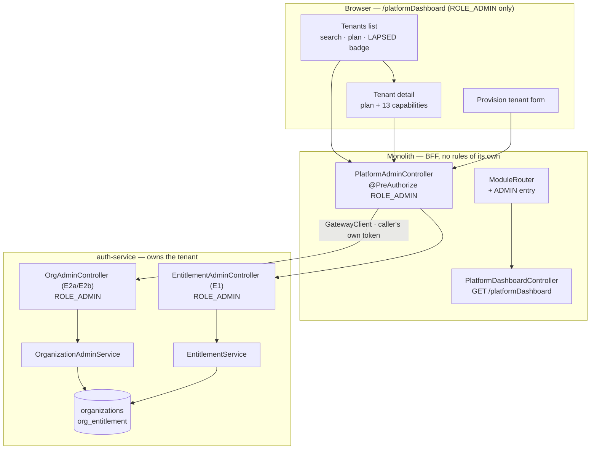
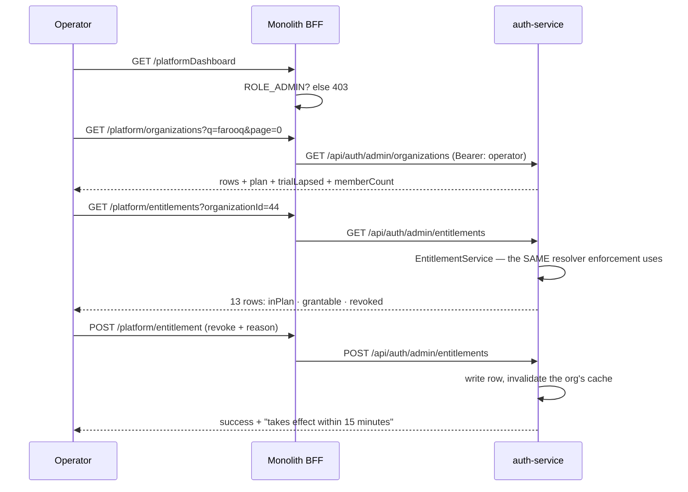

# E2 — the operator portal: design

**Status:** DESIGN. Gate written before the implementation, per `SAAS-BUILD-STANDARDS.md`.
**Analysis:** [`e2-operator-portal-analysis.md`](e2-operator-portal-analysis.md) — read first; every finding
below is evidenced there.
**Programme:** [`saas-control-plane-review.md`](../saas-control-plane-review.md) · **Predecessor:**
[`e1-entitlement-ceiling.md`](e1-entitlement-ceiling.md) (✅ green — this slice puts a screen on its API).

**Answers taken** (owner, "go with recommended"): Q1 scope **includes** provisioning + plan change · Q2 the
tenant list is gated on **`ROLE_ADMIN` alone**, no org filter · Q3 lapsed trials are **shown** in E2 and acted
on through the plan control · Q4 `admin@myplus.com` keeps its accidental org, **recorded not fixed** · Q5 the
gate runs as the operator **and** refuses the whole tenant ladder.

---

## 1. What this slice makes possible

> A MaxTheService operator opens one screen, finds a customer, sees what they are on and what they are using,
> and changes it — without a curl command and without ever touching that customer's trading data.

Three tenant-facing facts stay out of reach by construction: products, invoices and stock. Reaching those is
**E5's audited support session**, and building a shortcut here is how a backdoor gets created by accident (R3).

---

## 2. Benchmark, before the decision (standard 7a)

| System | Its operator console | Taken / rejected |
|---|---|---|
| **Stripe Dashboard** | One customer row → a detail page combining *plan*, *usage* and *history*; every mutation carries a reason and lands in an event log | **Taken.** The list→detail shape, and "the mutation carries a reason" — which is what makes E4's audit a listener rather than a rewrite |
| **Shopify Partners** | Operator sees stores, plans and status; **never** the merchant's orders without an explicit, logged support handshake | **Taken, and it is R3's whole argument.** The separation of *manage the account* from *see their data* |
| **Salesforce Setup → Company Information** | Licences shown as *used / remaining*, per feature | **Partly.** Usage counts need per-capability telemetry we do not collect; E2 shows *entitled* and *enabled*, not *used*. Recorded as a gap rather than faked |
| **AWS Organizations** | Accounts list + policies attached; SCPs bound, never grant | **Already taken** — it is E1's `revoked`/`grantable` split |
| **Odoo / typical "super admin"** | God-mode login as any tenant | **Rejected.** Unaudited impersonation is exactly what E5 exists to replace |

**Where the benchmark changed the answer:** the first sketch put "last login" and "orders this month" on the
tenant row, because every console shows activity. Shopify's separation made it obvious that *how much a tenant
is trading* is the tenant's data, not the account's — so the row shows **account** facts only: plan, trial
state, capabilities, member count. Deciding that now is what stops the list quietly becoming a reporting screen
on other people's businesses.

---

## 3. The pattern, named (standard 7b)

* **Backend for Frontend (BFF).** The monolith's `PlatformAdminController` is a thin proxy over auth's admin
  API — no logic, no second copy of the rules. Exactly the shape `BusinessConfigController` already has for
  C3c. **SOLID consequence:** the operator screen and the E1 gate hit the *same* endpoints, so a rule can never
  hold in one and not the other.
* **List → Detail (master–detail), server-paged.** 40 tenants today and growing; paging and search are
  server-side from the first commit, because a client-side filter would have to be undone (analysis §6, risk 5).
* **Command with a mandatory reason.** Every mutation (`plan`, `grant`, `revoke`) carries `reason`, enforced
  server-side. That single field is what turns E4 into a listener on an existing call rather than a retrofit.
* **DRY:** capability truth comes from `EntitlementService.forOrganization`, which already computes `grantable`
  and `revoked` **through the same resolver enforcement uses**. The screen never recomputes from plan + row.

---

## 4. Design

### 4a. Where each piece lives



**The operator's token is the caller's own.** `GatewayClient` forwards the session's access token, so
`ROLE_ADMIN` is checked **in auth-service**, on the authority that actually travels — not inferred by the
monolith. The monolith gate is a second, weaker line that only stops a page rendering.

### 4b. The journey



### 4c. New and changed artefacts

| Where | Artefact | New/changed |
|---|---|---|
| `auth-service` | `OrganizationAdminService` — search + page tenants, change plan | new |
| `auth-service` | `OrgAdminController` — `GET /api/auth/admin/organizations`, `POST …/organizations/{id}/plan`; `ROLE_ADMIN` | new |
| `auth-service` | `OrganizationRepository` — a paged search query | changed |
| `auth-service` | `EntitlementService.set` — `reason` becomes **required** | changed |
| `common-settings` | — | **untouched** |
| monolith | `PlatformAdminController` — BFF proxy, `ROLE_ADMIN` | new |
| monolith | `PlatformDashboardController` — `GET /platformDashboard` | new |
| monolith | `ModuleRouter.DASHBOARD_BY_TYPE` — `ADMIN` → `/platformDashboard` | changed |
| monolith | `templates/platformDashboard.html` | new |
| monolith | `static/js/platform/platform.js`, `static/css/platform.css` | new |
| monolith | `messages*.properties` × 6 — `ui.js.*` keys | changed |
| cypress | `support/commands.js` — `cy.loginAsOperator()` | changed |
| cypress | `e2e/platform/operator-portal.cy.js` | new |

### 4d. The two new endpoints

```
GET  /api/auth/admin/organizations?q=&page=0&size=25      ROLE_ADMIN
     → { total, page, size, rows:[ { id, name, type, plan, trialEndsAt, trialLapsed,
                                     ownerEmail, memberCount, capabilitiesEnabled } ] }

POST /api/auth/admin/organizations/{id}/plan              ROLE_ADMIN
     { plan: "PRO", reason: "..." }
```

`plan` is validated against the `Plan` enum — closing F2's free-text column at the only place an operator can
write it. `trialLapsed` is **computed server-side**, never left to the browser to derive from a date: the
operator and the resolver must agree about what "lapsed" means, and `JpaEntitlementSource` already owns that
comparison.

---

## 5. Performance, on the hot path (standard 7c)

**There is no hot path here.** Every endpoint is operator-facing, called by a handful of people, and none of
it is reachable from a tenant's session at all. What matters instead:

| Path | Cost | Note |
|---|---|---|
| Tenant list | 1 paged query + 1 count | Server-side `LIMIT/OFFSET`; **never** `findAll()` then filter in Java — 40 rows today, and the query is written for 40,000 |
| Owner email + member count | joined in the same query | A per-row lookup would be the N+1 the platform has already been burned by |
| Tenant detail | 1 `org_entitlement` read + 1 `organizations` read, both cached per org | Reuses `EntitlementService.forOrganization` unchanged |
| Any tenant's own request | **unchanged — zero new work** | The operator portal adds nothing to a shopkeeper's session |

---

## 6. Security (standard 7d)

* **`ROLE_ADMIN` server-side on every endpoint, never `ADMIN_PRIVILEGE`.** Every tenant owner holds
  `ADMIN_PRIVILEGE` inside their own org, so that gate would hand the platform to every customer. Stated on
  `provision-tenant` and E1's API already; E2 is the first *screen* to depend on it.
* **The tenant list is the platform's first deliberate cross-tenant read.** It is gated in auth-service on the
  authority in the token, and the gate asserts an owner, an admin and a user are each refused. Hiding the menu
  is not the control — the API refusing is.
* **`reason` is required by the API, not just the form.** A UI-only requirement is not a requirement.
* **The operator cannot reach tenant trading data**, by construction: no endpoint here proxies to
  business/catalog/inventory. R3.
* **Staleness is displayed, not hidden.** The detail screen states that a change reaches the tenant within
  15 minutes (E1 ruling D-1). An operator who does not know that reports a working system as broken.
* **What the monolith gate is worth:** it stops the *page* rendering. It is not the control, because
  `GatewayClient` forwards the operator's own token and auth re-checks it.

---

## 7. UI/UX — an operator console, not a dashboard

Deliberately **not** the tenant dashboard's shape: no KPI tiles, no charts. An operator arrives looking for one
customer, so the screen opens on search.

```
┌─ MaxTheService · Platform ─────────────────────── admin@myplus.com ─┐
│  [ Search tenants…                    ]        [ + Provision tenant ]│
│                                                          40 tenants  │
│  ┌───────────────────────────────────────────────────────────────┐  │
│  │ Farooq Veterinary & Medicos          PRO      13 capabilities │  │
│  │ owner.pharma@myplus.com · 4 members                        ›  │  │
│  ├───────────────────────────────────────────────────────────────┤  │
│  │ Shahzad Mobile Shop        TRIAL ⚠ LAPSED 12d   13 capabilities│ │
│  │ owner.mobile@myplus.com · 1 member                          ›  │  │
│  └───────────────────────────────────────────────────────────────┘  │
└──────────────────────────────────────────────────────────────────────┘
```

* **The lapsed-trial badge is the one piece of colour on the row.** 14 of 20 trials are lapsed right now and
  invisible; if the screen makes anything obvious, it is that.
* **Detail is two cards:** *Plan* (the tier, the trial date, one control) and *Capabilities* (13 rows —
  label, `in plan`, `enabled by the tenant`, and Grant / Revoke). A capability the tenant has **switched off
  itself** is shown as such, so an operator does not "fix" an entitlement that was never the problem.
* **Revoke asks for a reason** through `uiPromptConfirm` — never `window.confirm` (the shared dialog rule).
* **Every string a `ui.js.*` key** in all six bundles: `LocaleInterceptor` ships only that prefix, and `t()`
  returns the key itself when missing — a silent failure the i18n gate exists to catch.
* **Responsive** on the shared 767/991/1199 scale; the tenant list wraps through `responsive-tables.js`.
* **No auto-focus below 992px** — the focus-flow rule; a search box that grabs a phone keyboard on open is
  hostile.

---

## 8. The gate — `cypress/e2e/platform/operator-portal.cy.js`

Written before the implementation. Runs as `admin@myplus.com` (`ROLE_ADMIN`) and against the tenant ladder.

| # | Case | The regression it guards |
|---|---|---|
| 1 | Operator lands on `/platformDashboard` after login, **not** `/businessDashboard` | analysis §2a — the operator is routed to a shopkeeper's till today |
| 2 | The tenant list renders **on the screen**, with more than one tenant | *a slice is not done until something calls it*; C6 passed every API test while unreachable. A **DOM** assertion |
| 3 | Search narrows the list server-side | risk 5 — proves paging/search is not a client-side filter |
| 4 | A **lapsed trial** is badged as such | analysis §2f — 14 exist and are invisible |
| 5 | ⭐ `owner.business@` is **refused** the API (`/platform/organizations`) | the cross-tenant read; an owner holds `ADMIN_PRIVILEGE`, so this is the case that proves the gate is `ROLE_ADMIN` |
| 6 | ⭐ `owner.business@` visiting `/platformDashboard` does **not** get the page | the screen half of the same rule |
| 7 | `admin.business@` and `user.business@` are likewise refused | the ladder, per `GATE-RUNBOOK.md` |
| 8 | Operator revokes a capability **with a reason** → the tenant's map shows it off | end-to-end through E1's ceiling, via the screen's own endpoint |
| 9 | A revoke **without** a reason is refused | §6 — the API, not the form, is the requirement |
| 10 | Operator changes a plan; an invalid plan is refused | E2b, and F2's free-text column |

`after()` restores the capability and plan it touched — `owner.business@` is the tenant most other specs run
on, and a suspended entitlement left behind would fail them somewhere else entirely, days later.

**⚠ Assert the envelope, never the HTTP status.** A refusal is 200 with `success:false` for the proxied
`ApiResponse` routes. This has caught the codebase five times now.

---

## 9. Out of scope, on purpose

* **Audit of operator actions — E4.** E2 carries `reason` on every mutation *so that* E4 is a listener.
* **Support sessions — E5.** No impersonation, no tenant-data reads.
* **Usage metering.** Salesforce shows licences *used*; we do not collect per-capability usage, and inventing
  a number would be worse than omitting one.
* **Billing.** Entitlement records what was sold; nothing here charges anyone.
