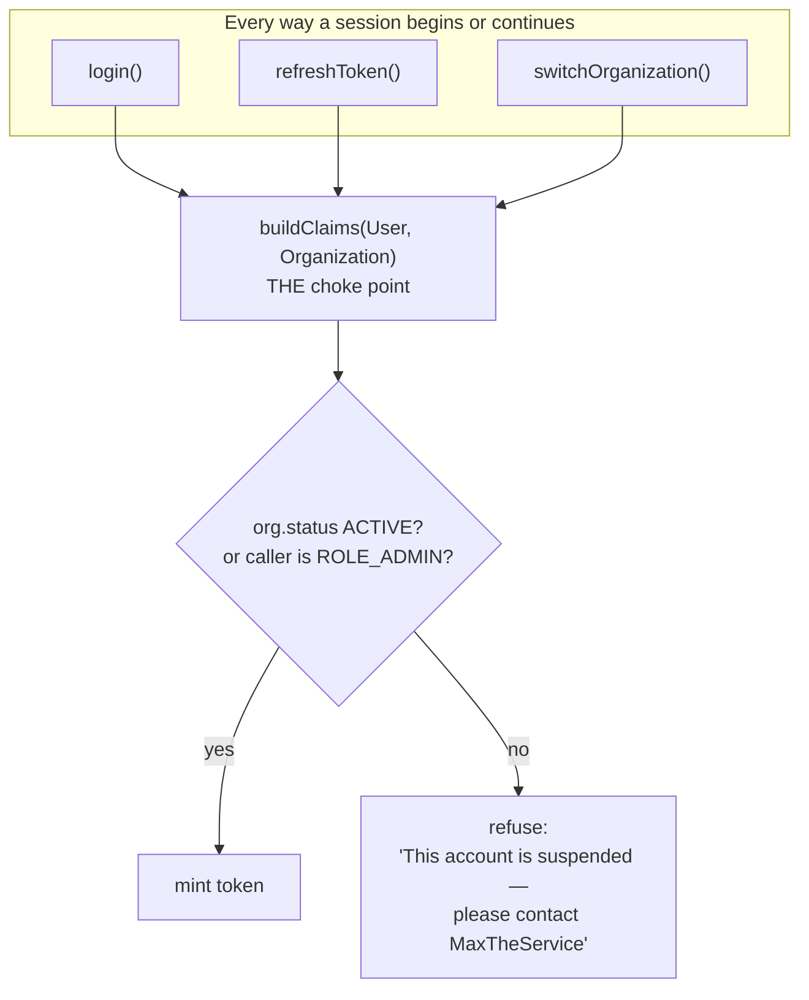

# E3 — tenant lifecycle: design

**Status:** ✅ **SHIPPED AND GREEN** (2026-09-01). Gate written before the implementation, per
`SAAS-BUILD-STANDARDS.md`. `tenant-lifecycle.cy.js` 11/11, with `operator-portal.cy.js` and
`entitlement-ceiling.cy.js` re-run alongside. Manual cases: §F and §D5 of
[`manual-test-platform-operator.md`](../manual-test-platform-operator.md).
**Analysis:** [`e3-tenant-lifecycle-analysis.md`](e3-tenant-lifecycle-analysis.md) — read first. It re-scopes
E3 from *freshness* (already done, §2 there) to **tenant lifecycle** (F8, a real gap).
**Programme:** [`saas-control-plane-review.md`](../saas-control-plane-review.md) · **Predecessors:** E1, E2 — ✅ green.

**Answers taken** (owner: *"proceed as per best industry standard following top brands"*): Q1 three states —
`ACTIVE` / `SUSPENDED` / `CLOSED` · Q2 refused at the door, **not** a read-only mode · Q3 status and plan are
separate axes; a plan change never reactivates.

---

## 1. What this slice makes possible

> A MaxTheService operator can stop a customer trading — and start them again — in one action, with a reason
> on the record, and without touching a line of that customer's data.

Today `Organization.status` is written once at creation, printed on E2's tenant list, and **enforced nowhere**.
The only lever is revoking thirteen capabilities one at a time while the tenant carries on selling.

---

## 2. Benchmark, before the decision (standard 7a)

| System | What it does | Taken / deliberately different |
|---|---|---|
| **Stripe Billing** | `subscription.status`: `active` · `past_due` · `unpaid` · `canceled` · `paused`. *Temporarily blocked* and *ended* are different states | **Taken** — that separation is our `SUSPENDED` vs `CLOSED`. Merging them means never being able to tell dunning from churn on a report |
| **Shopify** | A **frozen** store: storefront off, **admin still reachable so the merchant can pay** | **Deliberately different — argued in §3.** The pattern is right for Shopify because billing lives *in* Shopify. Ours does not (E1 §13: entitlement records what was sold; nothing here charges anyone), so there is no in-app remediation an owner needs access for |
| **Atlassian / AWS** | Lapsed → grace period → access ends → **data retained** (15 / 90 days) before anything is deleted | **Taken, in the half that applies.** `CLOSED` **never deletes**. The grace period belongs to a billing system we do not have — named in §9 rather than faked |
| **Google Workspace** | Suspended user or org; **super-admins exempt** so support can always get back in | **Taken** — E3d. A console that can lock out its own operator is a foot-gun with no undo |
| **Salesforce** | Users are *deactivated*, never deleted; the audit trail outlives the account | **Taken** — status is reversible and nothing is destroyed |

### Where the benchmark changed the answer

The analysis recommended *"refused at login, not a read-only mode"* on cost grounds — read-only means building
and testing a second behaviour for every screen. Shopify's **frozen** state is a genuine challenge to that: it
keeps the owner able to log in *precisely so they can pay*, and locking a paying-customer-to-be out of the
payment screen is self-defeating.

**It does not transfer, and the reason is structural rather than a shortcut:** MaxTheService has no in-product
billing. There is no invoice to settle, no card to update, no screen the owner needs. Payment happens outside
the platform entirely. So the access Shopify preserves would be access to nothing.

**What we take from it anyway:** the refusal message must name the way back. *"Please contact MaxTheService"* is
the substitute for Shopify's payment screen, and it is why the message is part of the design rather than an
afterthought (§7).

---

## 3. The pattern, named (standard 7b)

* **A single choke point — Guard Clause at the claim builder.** All three session paths converge on
  `AuthService.buildClaims(User, Organization)`:

  ```
  login()              → buildClaims(user)      → buildClaims(user, primaryOrg)
  refreshToken()       → buildClaims(user)      → buildClaims(user, primaryOrg)
  switchOrganization() → buildClaims(user, id)  → buildClaims(user, org)
  ```

  Enforcing there covers all three **and any fourth path added later**, which is the property that matters:
  the alternative is three copies that drift, and the fourth caller that forgets. **SOLID consequence:** new
  session paths inherit the check by construction, not by review.

* **State machine as an enum, beside `Plan`.** `OrganizationStatus` in `common-settings` — the same fix E2
  applied to `plan`, which was free text until one write validated it (F2). `status` is free text today.

* **Command with a mandatory reason**, identical in shape to E2's plan and entitlement writes — so **E4 audits
  all three by listening, not by retrofitting**.

* **DRY:** the console reuses E2's tenant list, badge vocabulary and detail card. E3 adds one control and one
  badge; it does not add a screen.

---

## 4. Design

### 4a. Where the check lives



**Why refusing at *refresh* is what makes this work.** A suspension does not need a per-request check anywhere:
an active session simply fails to renew, so it dies **within the 15-minute access-token lifetime**. Zero
hot-path cost, no new remote call, and the bound is the one the platform already lives with.

### 4b. The states

| State | Meaning | Login | Reversible |
|---|---|---|---|
| `ACTIVE` | trading | ✅ | — |
| `SUSPENDED` | temporarily stopped — non-payment, abuse, dispute | ❌ | ✅ by an operator |
| `CLOSED` | the customer has left | ❌ | ✅ (nothing is deleted) |

`CLOSED` differs from `SUSPENDED` only in **intent** today, and that is enough: they answer different questions
on a report, and a merged state can never separate churn from dunning. This is Stripe's `canceled` vs `unpaid`,
in miniature.

### 4c. New and changed artefacts

| Where | Artefact | New/changed |
|---|---|---|
| `common-settings` | `OrganizationStatus` enum — beside `Plan` | new |
| `auth-service` | `AuthService.buildClaims(User, Organization)` — the guard | changed |
| `auth-service` | `OrganizationAdminService.changeStatus(...)` — validated, reason required | changed |
| `auth-service` | `EntitlementAdminController` — `POST /admin/organizations/{id}/status` | changed |
| `auth-service` | `OrganizationAdminServiceTest` — status cases | changed |
| monolith | `PlatformAdminController` — `POST /platform/status` | changed |
| monolith | `platform.js` / `platform.css` — status control + **Suspended** badge | changed |
| monolith | `messages*.properties` × 6 | changed |
| cypress | `e2e/platform/tenant-lifecycle.cy.js` | new |

### 4d. The endpoint

```
POST /api/auth/admin/organizations/{id}/status          ROLE_ADMIN
     { status: "SUSPENDED", reason: "non-payment, invoice 4471" }
```

Validated against the enum — an operator typing `SUSPEND` is told, not silently ignored. `reason` required, as
on every other control-plane write.

---

## 5. Performance (standard 7c)

| Path | Cost |
|---|---|
| Any tenant request | **unchanged — zero.** No per-request check exists or is added |
| Login / refresh / switch | +1 field read on an `Organization` **already loaded** to build the claims |
| Operator status write | 1 update |

The organization is fetched on those paths regardless, so the guard costs a comparison. This is the whole
reason the choke point was chosen over a filter.

---

## 6. Security (standard 7d)

* **Enforced server-side at the only three places a session can start or continue.** There is no UI half to
  this control — a suspended tenant cannot obtain a token at all.
* **`ROLE_ADMIN` is exempt** (E3d). The operator's own organization must never be able to lock the operator out
  of the console that would undo it. Google Workspace exempts super-admins for the same reason.
* **The operator cannot suspend their own tenant** — refused explicitly, with its own message. Defence in depth
  behind the exemption above: two independent reasons the foot-gun cannot fire.
* **`reason` required by the API**, not the form.
* **Nothing is deleted, ever.** `CLOSED` is a status. Salesforce deactivates and keeps; so do we.
* **The refusal does not leak.** It says the account is suspended and who to contact — it does not say why, and
  it is returned only *after* the password check, so it cannot be used to enumerate accounts. Same ordering the
  existing email-verification gate already uses.

---

## 7. UI/UX

**On the tenant list** — a red **Suspended** badge beside the amber lapsed-trial badge. An operator scanning
the list must see a stopped customer at a glance; that is the whole reason `status` is on the row.

**On tenant detail** — status sits in the *Plan* card, because plan and status are the two commercial facts and
an operator reasons about them together:

```
┌─ Plan ──────────────────────────────────────────────────┐
│  [ PRO        ▾ ]  [ Change plan ]      Trial ends —     │
│  [ SUSPENDED  ▾ ]  [ Update status ]    ⛔ Suspended      │
└──────────────────────────────────────────────────────────┘
```

* Suspending asks for a reason through `uiPromptConfirm` — never `window.confirm` (the shared-dialog rule).
* The confirm text says plainly what will happen: **"Everyone at this business will be signed out and unable to
  log in."** An operator must not discover the blast radius afterwards.
* **Unlike an entitlement change, this is not "within 15 minutes" — it is immediate at the door and ≤15 minutes
  for anyone already signed in.** The dialog says so, because the two behave differently and an operator who
  assumes otherwise will suspend a tenant and watch them keep working for a few minutes.
* Every string a `ui.js.*` key in all six bundles.

---

## 8. The gate — `cypress/e2e/platform/tenant-lifecycle.cy.js`

Written before the implementation. Uses a **disposable tenant provisioned by the spec** — suspending a shared
fixture would lock out every other spec that uses it.

| # | Case | The regression it guards |
|---|---|---|
| 1 | ⭐ A suspended tenant's owner **cannot log in** | F8 — the whole slice |
| 2 | ⭐ Reactivating restores access | a one-way door is not a lever; proves the round trip, not just the refusal |
| 3 | The refusal names the account state and the way back | §2 — the substitute for Shopify's payment screen |
| 4 | `CLOSED` also refuses | the second state is real, not decorative |
| 5 | An unknown status is refused | `status` was free text, exactly as `plan` was (F2) |
| 6 | A status change without a reason is refused | the API, not the form |
| 7 | ⭐ `ROLE_ADMIN` still logs in when **their own** org is suspended | E3d — the foot-gun |
| 8 | ⭐ The operator is refused when suspending **their own** tenant | the explicit half of the same protection |
| 9 | A tenant owner cannot call the status endpoint | the cross-tenant gate, as in E2 |
| 10 | The **Suspended badge renders** on the list | a screen assertion; C6 shipped a policy with a green API gate and no control anywhere |
| 11 | A plan change does **not** reactivate | Q3 — status and plan are separate axes |

`after()` reactivates anything it touched and never suspends a shared fixture in the first place.

---

## 9. Out of scope, on purpose

* **Grace periods / dunning** — belongs to a billing system that does not exist. Naming it beats faking it.
* **Data deletion on `CLOSED`** — a different, irreversible conversation.
* **Read-only mode** — §2. Not a cost decision alone: with no in-product billing there is nothing for a
  suspended owner to do.
* **Audit** — E4, which listens to the same `reason`-carrying commands E2 and E3 already emit.

---

## 10. Delivery notes — two decisions taken the harder way

### 10a. A gate that would have passed for the wrong reason

The spec originally provisioned its own throwaway tenant, which reads as good hygiene: nothing shared, nothing
to clean up. It would have been **green and meaningless**.

`provisionTenant` deliberately issues **no password** — the owner sets their own through a reset email — so
every login attempt in the spec would have failed on *credentials*, long before reaching the status check.
Cases 1, 3, 4 and 11 would all have passed against a tenant that was never actually suspended.

Fixed by seeding `owner.lifecycle@myplus.com`, documented in `SetupDataLoader` as sacrificial and off-limits to
every other spec. Its `before()` **asserts the account can log in first**, so a run that begins with the tenant
already suspended (a crashed earlier run) fails on a clear precondition instead of a cascade of green-for-
nothing tests.

> The status check sits *after* the password check on purpose — otherwise it becomes an account-enumeration
> oracle. That ordering is what made the throwaway-tenant approach quietly useless, and it is the right
> ordering regardless.

### 10b. The `force` flag I did not add

Case 8 was written to assert that `ROLE_ADMIN` still signs in while their own organization is suspended. To
reach that state end to end, the spec must suspend the operator's own org — which `changeStatus` refuses, by
design. The obvious unblock is a `force` flag on the endpoint.

**Declined.** An override that defeats a safety guard, added to the product purely so a test can reach a state
the product exists to prevent, makes the product worse to make the test easier — and it would be the first
thing an incident review found.

The assertion moved to `TenantStatusGuardTest`, which pins what actually matters: the exemption keys on the
**role** `ROLE_ADMIN` and must never be loosened to `ADMIN_PRIVILEGE`, which every tenant owner holds inside
their own organization. Cypress case 8 now asserts the visible half — that a refused self-suspension left
nothing behind and the console still answers.

> A test that needs the product to become less safe is testing the wrong layer.
