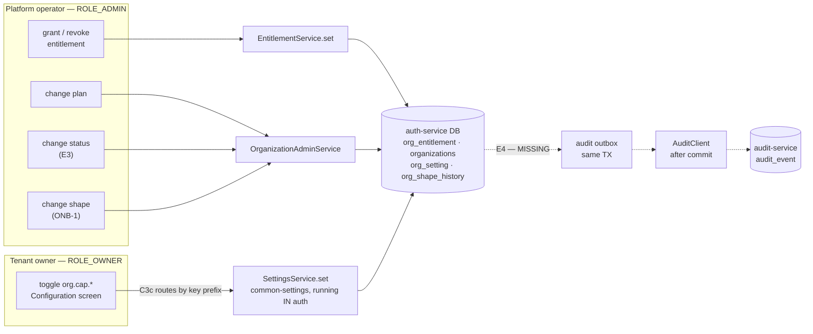

# E4 — analysis: the trail exists, and it cannot say who acted

**Status:** ANALYSIS, shared for review. No design, no code — per `SAAS-BUILD-STANDARDS.md`, *"The standards
analysis is shared for review **before** documenting or designing, not alongside it."*
**Programme:** [`saas-control-plane-review.md`](../saas-control-plane-review.md) — E4 of E0..E6, finding **F5**.
**Predecessors:** [`e1-entitlement-ceiling.md`](e1-entitlement-ceiling.md) ·
[`e2-operator-portal-design.md`](e2-operator-portal-design.md) ·
[`e3-tenant-lifecycle-design.md`](e3-tenant-lifecycle-design.md) · ONB-1/2/3 — all ✅ green.

Read from the source tree on 2026-09-04. No live DB reads: every question E4 asks is answerable from code.

---

## 1. Verdict up front

**E4 is smaller than the programme assumed in one dimension and larger in another, and the second one is the
reason to do it now rather than after E5.**

Smaller: the review called E4 *"a listener, not a retrofit"*, and that is more true than it looked. C3c routed
`org.cap.*` and `org.shape` writes to **auth-service**, and E1/E2/E3/ONB put entitlement, plan, status and shape
writes there too. **All five control-plane mutations already execute inside one service, against one database.**
There is no cross-service retrofit, no second producer, and no distributed transaction. A transactional outbox
already exists and is proven (`common-outbox` + `AuditClient` + `audit-service`, shipped as Audit #6 in
business-service).

Larger, and this is the finding:

> **`audit_event` cannot express "somebody outside this tenant did this."** It has `user_id` and
> `organization_id` and nothing else about the actor. Every event it has ever held was written by a member of
> the tenant it belongs to, so the question never came up. Every event E4 adds is the opposite case.

The table is **append-only by design and by constraint**. Whatever E4 stamps into it is what the trail says
forever. That makes the actor question a schema decision to take **before** the first row, not after — and it
is the same decision E5 (support session) will need for exactly the same reason. Taking it in E4 is the
cheap ordering; taking it in E5 means E4's rows are the ones that can never answer it.

---

## 2. What exists, measured

| Piece | State | Where |
|---|---|---|
| Append-only event store, idempotent on `(org, event_key)` | ✅ shipped | `audit-service` · `V1__baseline.sql` |
| Declarative producer client | ✅ shipped | `commerce-contracts/AuditClient` |
| Transactional outbox + relay state machine | ✅ shipped, one working consumer | `common-outbox/OutboxRelay` · `business-service/AuditService` |
| Producer identity forwarding for background delivery | ✅ shipped | `GatewayIdentityForwarding.runAs(userId, orgId, …)` |
| Gateway route `/api/audit/**` | ✅ shipped | `api-gateway/application.yml` |
| A `reason` on every control-plane write | ✅ shipped by E2 | `EntitlementService.set` throws without one |
| **A producer in auth-service** | ❌ **missing — this slice** | — |
| **An actor axis in the schema** | ❌ **missing — finding A1** | — |
| **Any screen that reads the trail** | ❌ missing | `AuditRestClient` is a raw GET proxy used only by demo reset |

Eleven action codes are already in use — `SALE`, `SALE_EDIT`, `SALE_RETURN`, `VOID_SALE`, `PURCHASE`,
`PURCHASE_EDIT`, `PURCHASE_RETURN`, `VOID_PURCHASE`, `RECEIPT`, `PAYMENT`, `REPOSSESSION`. All are **trading**
events. E4's are **control-plane** events, and nothing in the schema separates the two families.

---

## 3. Findings, ordered by the cost of leaving them

### A1 🔴 The schema cannot name an actor from outside the tenant

`audit_event` records `user_id` and `organization_id`. For every row written so far those two belong together.
An operator granting a capability to tenant 44 is user 7 of the platform org acting on org 44 — and the table
has one slot for a user and one for an org.

Whichever slot is used, something true is lost. If the row is stamped with the operator's org, the customer
can never see what was done to them. If it is stamped with the tenant's org, the customer sees `userId=7`,
which is **not one of their users**, and cannot tell a platform action from their own owner's.

That second reading is worse than it sounds: an owner auditing their own configuration would attribute a
platform revocation to a colleague. **A trail that misattributes is worse than one that is missing** — it is
believed.

### A2 🔴 The ingest service takes the org from the caller, and that default is wrong here

`AuditIngestService.record` reads `CurrentUser.organizationId()` and ignores any org in the payload. The
javadoc is explicit about why — *"so entries can't be spoofed"* — and for a tenant recording its own sale that
is exactly right.

For a control-plane event it silently produces the wrong answer. Without a deliberate decision, an operator's
grant lands in the **operator's** trail: invisible to the customer, mixed in with every other tenant's events,
and **unfixable**, because the table is append-only and the constraint enforces it.

This is the ONB-3 lesson in a new place — *the BFF calls downstream with the operator's own token, so an
endpoint that reads only the token's org answers the operator's figures under the customer's name.* There it
produced a wrong number. Here it would produce a permanent wrong record.

`runAs` already solves the mechanism (business-service's relay impersonates the tenant on every delivery). What
is missing is the ruling about which org is the subject — see D-1.

### A3 🟠 Any authenticated user can read the whole tenant's audit trail

`AuditController.list` carries no `@PreAuthorize`, and `SecurityConfig` requires only `.authenticated()`. So a
cashier can read every `RECEIPT` and `PAYMENT` in the org, with amounts.

Pre-existing and not caused by E4 — but E4 is the slice that makes the trail worth reading, and it is about to
add *"the platform suspended you for non-payment, reason: …"* to a list a cashier can fetch. Raising it here
rather than after.

### A4 🟠 `reason` is now mandatory everywhere and has nowhere structured to go

E2 made a reason required on every control-plane write, by the API and not merely by the form —
`EntitlementService.set` throws without one. The audit schema has `details VARCHAR(500)`, free text, shared
with everything else a producer wants to say.

The review's own §4a rejection applies: *"do not store all entitlement logic in one unstructured JSON blob."*
"Why" is the only question anybody asks of a control-plane trail six months later, and folding it into free
text makes it unqueryable and silently truncatable. A shape change that cleared eleven overrides plus a
sentence of reason will not reliably fit 500 characters, and `AuditIngestService` **truncates without
complaint**.

### A5 🟠 A refusal must not produce an event, and the hook decides that

`SettingsService.set` runs `runGuards(...)` **before** the upsert, inside the caller's transaction, so E1's
refusal rolls back cleanly. An emission hook placed carelessly — before the guards, or outside the transaction
— would record configuration changes that never happened. Given that E1's whole purpose is refusing writes,
this is the failure mode most likely to be reached in practice, and the one a green gate would miss unless it
asserts the absence.

### A6 🟢 `org_shape_history` already records shape changes, for a different purpose

ONB-3 shipped `org_shape_history` recording what each business-type change cleared, so an undo can be built.
That overlaps E4's `SHAPE_CHANGE` event. They are not the same thing — one is operational state feeding a
future feature, the other is the cross-cutting trail — but shipping both without saying so invites someone to
delete one. Needs a ruling, not a fix (D-3).

### A7 🟢 The classpath risk that bit C3c three times does not apply here

auth-service extends the **root aggregator**, not `service-parent`, so it inherits none of the shared libs'
`provided` dependencies — the trap that broke the `common-settings` addition three times in a row. Checked
both poms E4 needs:

* `common-outbox` → `spring-context`, `spring-boot-autoconfigure`, `slf4j-api`
* `commerce-contracts` → `spring-web`, `spring-boot-starter-web`, lombok

auth-service already has all of them. It also already has `caffeine`, a load-balancer cache declared precisely
because it does not extend `service-parent`, and a working `@LoadBalanced` client config
(`NotificationClientConfig`) to mirror for `AuditClient`. **This one comes out clean** — worth recording,
because the memory of that failure would otherwise price the slice higher than it costs.

---

## 4. Rulings needed before design

**D-1 — which organization owns a control-plane event?**
Options: (a) the **subject tenant** — the trail answers *"what happened to this tenant"*, the customer can see
it, and E5 requires exactly that; (b) the **operator's org** — matches the current ingest default and keeps
platform activity in one place; (c) **both**, two rows. **Recommendation: (a)**, delivered via
`runAs(actorUserId, subjectOrgId, …)` as business-service's relay already does. (c) doubles the rows and makes
"did this happen once" a query rather than a row.

**D-2 — how is the actor recorded?** Options: (a) a **V2 migration** adding `actor_org_id` and `actor_type`
(`OWNER` · `ADMIN` · `PLATFORM_OPERATOR` · `SYSTEM`); (b) encode it in `details`. **Recommendation: (a)** —
"who acted, and were they one of us" is precisely the queryable fact, E5 needs the same column, and an
append-only table cannot be corrected later. Cost: one migration on a table that has never had one, plus a
backfill decision for existing rows (recommend `actor_type = 'OWNER'`, `actor_org_id = organization_id`, which
is true of every row written to date).

**D-3 — does a shape change get recorded twice?** **Recommendation: yes, deliberately, with the audit event
carrying the history row's id in `entity_ref`.** `org_shape_history` is state an undo will read;
`audit_event` is the trail. Assembling the trail from N domain tables is how a trail stops being one.

**D-4 — where does the capability toggle hook go?** The write lands in `SettingsService.set`, which lives in
`common-settings` and runs in **eight** services, only one of which should emit. **Recommendation: a
`SettingWriteListener` SPI beside the existing `SettingWriteGuard`** — same `ObjectProvider` injection, same
Chain-of-Responsibility shape, registered only by auth. Guards run before the write and may refuse; listeners
run after it commits and may not. That symmetry is also the answer to A5.

**D-5 — is A3 (unauthorized trail reads) fixed in E4 or its own slice?** **Recommendation: in E4**, as one
`@PreAuthorize` and a ladder case in the gate. It is three lines, and E4 is the slice that makes the data
worth taking.

**D-6 — does E4 ship a screen?** The review's gate sketch is API-only. But E2's own lesson was *"C6 shipped a
policy with a green API gate and no control anywhere"*, and `EntitlementAdminController` records the standard
as *"a slice is not done until something calls it."* **Recommendation: an Activity panel on the existing
operator console's tenant detail**, reusing `platformDashboard.html` / `platform.js`. Tenant-facing visibility
belongs to E5, where it is a stated requirement rather than an inference.

---

## 5. What I would not build

* **No new event bus.** The outbox + relay + `AuditClient` path is shipped and proven; a second transport for
  five events per week would be a framework built ahead of its second use.
* **No `before_json` / `after_json` columns.** The review's proposal listed them. Four of the five events
  change one scalar (`status`, `plan`, `shape`, a boolean); the fifth (shape) changes a set whose contents
  `org_shape_history` already holds in full. Two typed columns plus a reason answer every question a JSON blob
  would, and remain queryable.
* **No retrofit of the eleven trading actions.** They are correct as they are; E4 adds a family beside them.

---

## 6. Gate, sketched — `cypress/e2e/platform/control-plane-audit.cy.js`

Written before the implementation, per the standard. The cases that carry weight:

| # | Case | The regression it guards |
|---|---|---|
| 1 | Grant → an event on the **subject** tenant naming action, actor and the reason **verbatim** | the property, not that a row exists |
| 2 | ⭐ The same event is **absent from the operator's own trail** | the negative half of D-1; without it case 1 passes on an event stamped to the wrong org, because the operator is also the reader |
| 3 | Revoke → `before ≠ after` on the status | a trail that records the new value only cannot show a change |
| 4 | Owner toggles a capability → `actor_type = OWNER`, `actor_org_id` = their own | the discriminating case: proves the actor axis separates an insider from the platform |
| 5 | ⭐ A **refused** write (E1 ceiling, HTTP 200 + `success:false`) emits **no** event | A5 — a refusal is not a change |
| 6 | Shape change → an audit event **and** an `org_shape_history` row | D-3, so a later cleanup cannot silently drop one |
| 7 | Relay re-delivery does not duplicate | `event_key` idempotency, end to end rather than by unit test |
| 8 | Ladder: owner/admin see the trail, a plain user is refused | A3 |

Run as the feature's own tenant and across the owner/admin/user ladder per `GATE-RUNBOOK.md`, with the
operator rung via `cy.loginAsOperator()`.

⚠ Assert the **envelope**, never the HTTP status — a refusal arrives as 200 with `success:false`, and this has
bitten three times. ⚠ `cy.loginAsOwner`/`loginAsTier` restore a cached session and do **not** re-login; case 4
needs `gwLogin` if it depends on a fresh claim.

---

## 7. Cost

One migration adding a column pair, one outbox table in auth, one producer service, one SPI, one
`@PreAuthorize`, one panel. The expensive part is D-1 and D-2, and they are expensive only in the sense that
they cannot be revisited.
