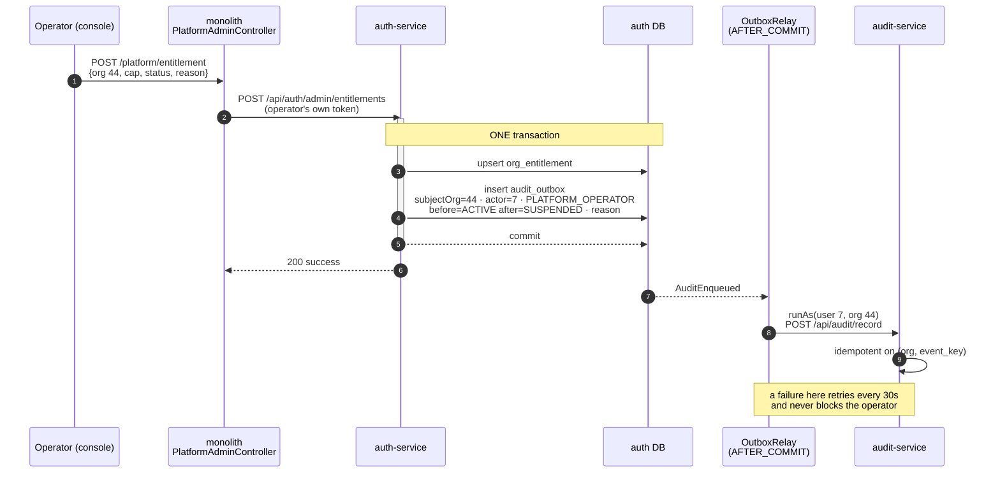
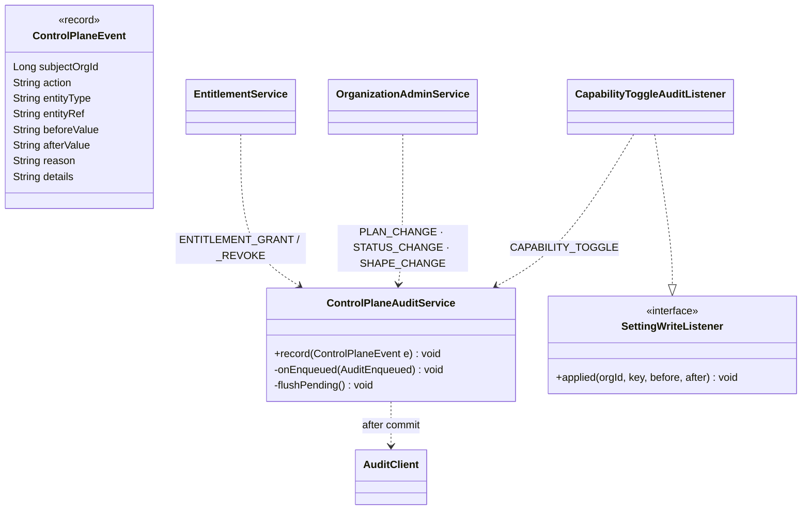

# E4 — design: the control-plane trail, and who is allowed to have written it

**Status:** ✅ **SHIPPED AND GREEN** (2026-09-04). Analysed, designed, built and gated the same day.
**Gate:** `cypress/e2e/platform/control-plane-audit.cy.js` — 10/10, headed. Written before the code.
**Programme:** [`saas-control-plane-review.md`](../saas-control-plane-review.md) — E4 of E0..E6, finding **F5**.
**Analysis:** [`e4-control-plane-audit-analysis.md`](e4-control-plane-audit-analysis.md) — read that first; this
document does not repeat its findings.
**Predecessors:** E1 · E2 · E3 · ONB-1/2/3 — all ✅ green. **Branch:** `feature/pack-loose-selling`.

---

## 1. Rulings taken

Adopted from the analysis' recommendations. Each is reversible until code exists — say the word on any one.

| | Question | Ruling |
|---|---|---|
| **D-1** | Which org owns a control-plane event? | The **subject tenant**, delivered via `runAs(actorUserId, subjectOrgId, …)` |
| **D-2** | How is the actor recorded? | A **V2 migration**: `actor_org_id` + `actor_type`, plus `reason` and a `before`/`after` pair |
| **D-3** | Shape change recorded twice? | **Yes**, deliberately — the audit event carries the `org_shape_history` row id in `entity_ref` |
| **D-4** | Where does the capability-toggle hook go? | A **`SettingWriteListener` SPI** beside `SettingWriteGuard`, registered only by auth |
| **D-5** | Fix the unauthorized trail read (A3)? | **In E4** — one `@PreAuthorize` and a ladder case |
| **D-6** | Does E4 ship a screen? | **Yes** — an Activity panel on the operator console's tenant detail |

### One refinement to D-2, made while designing

The analysis proposed `actor_type` values `OWNER · ADMIN · PLATFORM_OPERATOR · SYSTEM`. **The design narrows
them to `MEMBER · PLATFORM_OPERATOR · SYSTEM`**, because audit-service does not know roles and never will —
encoding one would make the column lie the instant that person's role changed, and a role is already
answerable from `user_id`. The axis the trail actually needs is **inside or outside this tenant**, which is a
fact about the event and does not decay.

### D-7 — a new ruling this design surfaces: two copies of the outbox producer

`business-service/AuditService` is the first audit producer. Auth's would be the second, and the shared parts —
the `OutboxDelivery` channel, the `runAs` delivery, the `@Scheduled` relay, the `toReq` mapping — are the same
~40 lines. `feedback_no_duplicate_functions_dry` and W1's *"extract domain-free at the second consumer"* both
point one way.

| | Option | Cost |
|---|---|---|
| a | Second copy now, extract at the third | The duplication the standard names, in the two places hardest to keep in step |
| **b** | **Extract `common-audit`, migrate business-service in this slice** | Touches the trading path — but `audit-log.cy.js` and `sale-return-audit.cy.js` cover it end to end |
| c | Extract now, migrate business-service later | Two copies *and* a library — worst of both |

**Recommendation: (b).** The safety net exists and the rule is explicit. If you would rather not touch the
trading path in a control-plane slice, (a) is defensible and I will note the debt in the code.

---

## 2. The shape of it



Two properties this shape buys, and both are the reason for an outbox rather than a call:

* **A refused write records nothing.** The outbox insert is in the same transaction as the entitlement upsert.
  E1's guard throws *before* either, so the rollback takes both. (Analysis A5.)
* **A down audit-service never blocks a grant.** Delivery is after commit; the relay re-drives what did not
  land. The control plane keeps working; the trail catches up.

### The producer, and where each of the five events is emitted



**`SettingWriteListener` is the symmetric twin of E1's `SettingWriteGuard`**, and the symmetry is the design:

| | `SettingWriteGuard` (E1, shipped) | `SettingWriteListener` (E4) |
|---|---|---|
| Runs | **before** the upsert | **after** it commits |
| May | refuse, by throwing | not refuse — a listener that can veto is a guard wearing the wrong name |
| Injection | `ObjectProvider<T>` — zero or more | same, and for the same Spring reason |
| Registered by | auth only (`EntitlementWriteGuard`) | auth only (`CapabilityToggleAuditListener`) |

Same Chain-of-Responsibility shape, so the next cross-cutting reaction to a settings write is a bean and not a
branch inside `SettingsService.set` — a method already on the write path of every settings screen in the
platform.

⚠ `common-settings` is `@Import`-wired, **not** component-scanned. `SettingWriteListener` must be added to
`CommonSettingsAutoConfiguration`'s `@Import` or it registers nothing and fails silently — this has bitten
twice (C1's unreachable `CapabilityService`, C3's missing `CapabilityCatalog`).

⚠ The listener must fire **only** for `org.cap.*` and `org.shape` keys. Every other settings key — letterhead,
tax defaults, locale — is ordinary tenant configuration and not control-plane activity. A listener that logged
all of them would bury five interesting events per month under a thousand.

---

## 3. Schema

### `audit-service` — `V2__actor_axis.sql`

```sql
ALTER TABLE audit_event
    ADD COLUMN actor_org_id BIGINT      NULL AFTER user_id,
    ADD COLUMN actor_type   VARCHAR(24) NULL AFTER actor_org_id,
    ADD COLUMN reason       VARCHAR(255) NULL AFTER details,
    ADD COLUMN before_value VARCHAR(64) NULL AFTER reason,
    ADD COLUMN after_value  VARCHAR(64) NULL AFTER before_value;

-- Backfill: true of every row written to date. Each was produced by a member of the tenant it belongs to —
-- that is precisely the assumption the table was built on and the one E4 stops being able to make.
UPDATE audit_event SET actor_org_id = organization_id, actor_type = 'MEMBER' WHERE actor_type IS NULL;

-- The Activity panel filters by family; the trading trail is already served by (organization_id, id).
CREATE INDEX idx_audit_org_action_id ON audit_event (organization_id, action, id);
```

`before_value` / `after_value` are **VARCHAR(64) scalars, not JSON** — four of the five events change one
scalar, and the fifth's full contents are already in `org_shape_history`. Two typed columns answer every
question a blob would and stay queryable. (Analysis §5.)

`reason` gets its own column rather than living in `details`, because *why* is the only question anybody asks
of this trail six months later, `details` is shared free text, and `AuditIngestService` truncates it without
complaint at 500 characters.

### `auth-service` — `V9__audit_outbox.sql`

The same table business-service owns, per the microservice standard that each service owns its own schema,
plus the five control-plane columns. `status` · `attempts` drive the shared `OutboxRelay` state machine.

### Event catalogue

| `action` | `entity_type` | `entity_ref` | `before` → `after` | Emitted from |
|---|---|---|---|---|
| `ENTITLEMENT_GRANT` | `CAPABILITY` | capability code | prior status (or `—`) → `ACTIVE` | `EntitlementService.set` |
| `ENTITLEMENT_REVOKE` | `CAPABILITY` | capability code | `ACTIVE` → `SUSPENDED` / `EXPIRED` | `EntitlementService.set` |
| `PLAN_CHANGE` | `ORGANIZATION` | org id | `FREE` → `PRO` | `OrganizationAdminService.changePlan` |
| `STATUS_CHANGE` | `ORGANIZATION` | org id | `ACTIVE` → `SUSPENDED` | `.changeStatus` |
| `SHAPE_CHANGE` | `ORGANIZATION` | `org_shape_history` row id | `retail` → `pharmacy` | `.changeShape` |
| `CAPABILITY_TOGGLE` | `CAPABILITY` | capability code | `true` → `false` | `CapabilityToggleAuditListener` |

All fit `action VARCHAR(32)`. They sit beside the eleven **trading** actions already in use (`SALE`,
`RECEIPT`, `VOID_SALE`, …), which E4 does not touch.

⚠ `ENTITLEMENT_GRANT` and `ENTITLEMENT_REVOKE` are separate actions rather than one `ENTITLEMENT_CHANGE` with
a status, because "show me every capability we withdrew this quarter" is the query that gets asked and it
should not require parsing `after_value`.

### Trust boundary

Identity — `organization_id`, `user_id` — still comes from the **request headers**, never the payload, exactly
as `AuditIngestService`'s javadoc requires. `actor_org_id` / `actor_type` / `reason` / `before` / `after` are
producer assertions in the body, trusted on the strength of `X-Internal-Secret`. The distinction that matters:
a payload field can **describe** the actor, but it can never move the row to a different tenant.

---

## 4. Fixing A3 — who may read a trail

`AuditController.list` today requires only `.authenticated()`, so any cashier can fetch every `RECEIPT` and
`PAYMENT` in the org with amounts. E4 is about to add *"the platform suspended you for non-payment, reason: …"*
to that same list.

```java
@GetMapping
@PreAuthorize("hasAuthority('ROLE_OWNER') or hasAuthority('ROLE_ADMIN')")
```

`ROLE_ADMIN` is the platform operator; `ROLE_OWNER` is the tenant's owner. Deliberately **not**
`ADMIN_PRIVILEGE` — every tenant owner holds the super privilege set inside their own org, so that gate would
be no gate at all, which is the reasoning E1 and E2 both already record. A refusal reaches the caller as a
**403**, which is only true because E2 fixed the monolith advice that was answering 500 for every
`AccessDeniedException`.

No UI changes for tenant users: nothing in the product reads this endpoint from a tenant screen today.
Tenant-facing visibility is E5's, where it is a stated requirement.

---

## 5. UI/UX — the Activity panel

### 5.1 Where it goes, and why there

Bottom of the operator console's **tenant detail**, below Capabilities. The reading order becomes the
operator's actual reasoning order:

```
Business type   →  what does this customer see at all?
Plan + Status   →  are they paying, and are they trading?
Capabilities    →  what may they do?
Activity        →  ⭐ and what have we already done to them?
```

⭐ **The panel is also the confirmation.** `setEntitlement`, the plan save, the status save and the shape save
all call `openTenant(orgId)` on success, which re-renders the detail — so an operator's own change appears at
the top of Activity a moment after they make it. No toast, no "saved" flash that disappears before it is read:
the evidence the write landed *is* the record it created. That falls out of the existing wiring for free.

### 5.2 Wireframe

```
┌───────────────────────────────────────────────────────────────────────────────┐
│  Activity                                                                  24 │
├───────────────────────────────────────────────────────────────────────────────┤
│  Everything the platform and this business have changed. Records are added,    │
│  never edited or removed.                                                     │
│                                                                               │
│  ┌ All ┬ Entitlements ┬ Plan & status ┬ Business type ┬ Capabilities ┐        │
│  └─────┴──────────────┴───────────────┴──────────────┴──────────────┘         │
├───────────────────────────────────────────────────────────────────────────────┤
│  ⊖  Capability revoked          Serial / IMEI tracking                        │
│     ACTIVE → SUSPENDED                                                        │
│     ⌂ Platform · operator@maxtheservice.com          2 hours ago              │
│     “Downgraded to FREE at the customer's request — ticket 4192”              │
│  ───────────────────────────────────────────────────────────────────────────  │
│  ⇅  Plan changed                Organization                                  │
│     PRO → FREE                                                                │
│     ⌂ Platform · operator@maxtheservice.com          2 hours ago              │
│     “Downgrade effective this billing period”                                 │
│  ───────────────────────────────────────────────────────────────────────────  │
│  ◉  Capability switched off     Loose-unit selling                            │
│     true → false                                                              │
│     ⌂ This business · owner.mobile@…                 yesterday 14:02          │
│  ───────────────────────────────────────────────────────────────────────────  │
│  ⌗  Business type changed       Retail counter → Pharmacy                     │
│     retail → pharmacy                                                         │
│     ⌂ Platform · operator@maxtheservice.com          3 Sept                   │
│     “Onboarded under the wrong template” · 11 switches cleared                │
├───────────────────────────────────────────────────────────────────────────────┤
│                            Show all 24                                        │
└───────────────────────────────────────────────────────────────────────────────┘
```

### 5.3 The five UX decisions that carry weight

**1. ⭐ The actor chip is the whole point of the slice, so it is the most legible thing in the row.**
`⌂ Platform` in operator blue against `⌂ This business` in neutral grey — two visually distinct chips, never
a bare user id. Analysis A1: an owner reading their own trail must not attribute a platform revocation to a
colleague. The chip is what stops that, so it is rendered before the timestamp and never truncated.

**2. Before → after, always both.** `ACTIVE → SUSPENDED`, with the before muted and the after in full weight.
A trail that records only the new value cannot show a change — you cannot tell a revocation from a re-grant
that was already off. This is gate case 3, and it is a rendering rule as much as a schema one.

**3. The reason is quoted, in the operator's own words, never summarised.** Rendered in the existing
`plat-cap__reason` style (amber italic) which the console already uses for entitlement reasons, so it reads as
the same kind of information in the same place. Escaped with `esc()` — it is free text typed by a human into
`uiPromptConfirm` and goes through `.html()`, which is exactly the XSS shape `/js/common/dom-safe.js` exists
for.

**4. ⭐ There is no edit control, no delete control, and no hover-trash — and the panel says so.** The header
note reads *"Records are added, never edited or removed."* An append-only store whose UI looks editable
teaches operators to expect an undo that does not exist, and the first time somebody needs one is during an
incident. Absence of affordance is the design; the sentence makes it deliberate rather than an oversight.

**5. Relative time in the row, absolute on hover.** `2 hours ago` is what an operator scanning wants;
`title="2026-09-04 11:42"` is what an operator writing an incident note needs. Same pattern the console
already uses for trial dates. No calendar input, so `/js/common/date-picker.js` does not come into it.

### 5.4 States

| State | Rendering | Why it is specified |
|---|---|---|
| Loading | `plat__loading` spinner row, same as the tenant list | consistency with the two panels above it |
| Empty | *"No changes recorded for this business yet."* in `plat__empty` | ⚠ **must not read as an error** — a brand-new tenant legitimately has none, and an empty trail that looks broken sends operators looking for a bug |
| Error | The server's own sentence via `apiFailMessage`, hard-coded string only as fallback | standard 8d — the server's sentence wins |
| Filtered to nothing | *"No {family} changes."* | distinct from empty: the operator narrowed it themselves and needs to know that |
| Truncated | 10 rows, then **Show all N** | the panel is a summary; the button loads up to 200 |

### 5.5 Fitting the existing console

Nothing new invented. The panel is built from what E2 and ONB-3 already shipped:

| Element | Reuses |
|---|---|
| Card shell | `.plat-card` / `__head` / `__n` / `__note` / `__body` |
| Filter chips | `.plat-seg` — the same segmented control as *All tenants / Needs a business type* |
| Actor chip | `.plat-badge` + two new modifiers, `--platform` (console blue `#0D3B8C`) and `--member` (neutral `#3d4a5c`) |
| Reason line | `.plat-cap__reason` |
| Async fill | the `#platConflicts` pattern — an empty `<div id="platActivity">` in the markup, filled by `renderActivity(orgId)` **after** `$('#platDetailBody').html(html)`, never before |
| Escaping | the module's own `esc()` on every interpolated value |

New CSS lives in `platform.css` beside the rest — about 40 lines for the timeline rows and the two chips.

### 5.6 Responsive and accessibility

* Per `project_responsive_contract`, the single scale in `/css/responsive.css`: below **767px** the row
  stacks — action and subject on line one, before→after on two, actor and time on three — instead of
  compressing four columns into a phone width. The reason line already wraps.
* Filter chips get `role="group"` and `aria-pressed`, matching `#platNeedsType`.
* The trail is a `<ul>` of `<li>`, not a table: it is a sequence of events, and a screen reader announcing
  "row 3 of 24, column 2" for a sentence is worse than the list semantics.
* Glyph icons are decorative (`aria-hidden="true"`) — every one is accompanied by its text label, so nothing
  depends on distinguishing ⊖ from ⇅.
* Per `focus-flow`, no auto-focus: this panel is read, not typed into.

### 5.7 i18n

⚠ **Every key is `ui.js.*`** and goes into all **six** bundles (en/fr/es/hi/ar/ur). Committed bonus-schemes JS
already ships `t('ui.addOffer')` without the prefix and renders the raw key in every language —
`i18n-js-prefix.cy.js` exists to catch exactly this.

About 18 keys: `ui.js.activity`, `activityNote`, `activityEmpty`, `activityNoneInFilter`, `showAllN`,
`actorPlatform`, `actorMember`, one per action label, one per filter chip.

**Action labels are sentences, not enum codes.** `ENTITLEMENT_REVOKE` renders as *"Capability revoked"*. The
raw code is a machine identifier and the console has a mixed audience; `before → after` keeps the underlying
values visible for anyone who needs them.

⚠ RTL (ar/ur): the `→` between before and after is directional. Use a CSS pseudo-element that flips with
`direction`, not a literal arrow character baked into the translated string — otherwise the Arabic bundle
reads *after → before*.

---

## 6. Files

| File | Change |
|---|---|
| `audit-service/…/db/migration/V2__actor_axis.sql` | new — five columns, backfill, index |
| `audit-service/…/entity/AuditEvent.java` | + `actorOrgId` `actorType` `reason` `beforeValue` `afterValue` |
| `audit-service/…/dto/AuditRecordRequest.java` | the same five |
| `audit-service/…/service/AuditIngestService.java` | map them; `list` unchanged |
| `audit-service/…/controller/AuditController.java` | `@PreAuthorize` on `list` (A3) |
| `common-settings/…/SettingWriteListener.java` | new SPI |
| `common-settings/…/SettingsService.java` | fire listeners after commit; `ObjectProvider` |
| `common-settings/…/CommonSettingsAutoConfiguration.java` | ⚠ `@Import` the new type |
| `common-audit/` *(if D-7b)* | extracted emitter; business-service migrates onto it |
| `auth-service/pom.xml` | + `common-outbox`, `commerce-contracts` — **no `provided` gaps**, checked (A7) |
| `auth-service/…/V9__audit_outbox.sql` | new |
| `auth-service/…/AuditOutbox.java` · repo · `ControlPlaneAuditService` · `AuditClientConfig` | new — mirrors `NotificationClientConfig` |
| `auth-service/…/EntitlementService.java` · `OrganizationAdminService.java` | emit; read the before-value **before** the write |
| `auth-service/…/CapabilityToggleAuditListener.java` | new |
| `monolith/…/PlatformAdminController.java` | BFF proxy `GET /platform/activity` — no rules of its own |
| `monolith/…/platform/platform.js` | `renderActivity` + filter wiring |
| `monolith/…/css/platform.css` | timeline rows, two chips |
| `monolith/…/messages_*.properties` × 6 | ~18 `ui.js.*` keys |

⚠ `EntitlementService.set` currently upserts straight onto the entity. The **before** value has to be captured
before `row.setStatus(st)` or the event records `SUSPENDED → SUSPENDED`. Same in `changePlan` / `changeStatus`
/ `changeShape`. This is the single most likely implementation slip and gate case 3 is what catches it.

---

## 7. Gate — `cypress/e2e/platform/control-plane-audit.cy.js`

Written before the implementation. Eight cases from the analysis, plus the ladder.

| # | Case | Guards |
|---|---|---|
| 1 | Grant → event on the **subject** tenant naming action, actor, reason verbatim | the property, not row existence |
| 2 | ⭐ That event is **absent from the operator's own trail** | D-1's negative half — without it, case 1 passes on a wrongly-stamped row, because the operator is also the reader |
| 3 | Revoke → `before ≠ after` | §6's capture-before-write slip |
| 4 | Owner toggles a capability → `actor_type = MEMBER`, `actor_org_id` = own org | the actor axis actually separates inside from outside |
| 5 | ⭐ A write **refused** by E1's ceiling emits **no** event | A5 — a refusal is not a change |
| 6 | Shape change → an audit event **and** an `org_shape_history` row | D-3 |
| 7 | Re-delivery does not duplicate | `event_key`, end to end |
| 8 | Ladder: owner and operator read the trail; a plain user is **403** | A3 |
| 9 | Screen: the Activity panel renders the event, with the Platform chip | D-6 — E2's lesson, a green API gate with no control anywhere |

Run as the feature's own tenant and across the owner/admin/user ladder per `GATE-RUNBOOK.md`, operator rung via
`cy.loginAsOperator()`.

⚠ Assert the **envelope**, not the HTTP status — refusals arrive as 200 with `success:false`; this has bitten
three times. ⚠ `cy.loginAsOwner`/`loginAsTier` restore a cached session and do **not** re-login; case 4 needs
`gwLogin`. ⚠ Delivery is asynchronous — the spec must poll the trail with a bounded retry, never a fixed
`cy.wait`, or it is green on a fast machine and red on yours. ⚠ Leave no state behind: cases 1/3/6 change a
real tenant's entitlements and shape, so `after()` restores them in the ONB-3 order — shape, then capability,
then flags.

---

## 8. What could go wrong

* **The listener fires for every settings key.** Guarded by the `org.cap.*` / `org.shape` prefix test, and by
  case 4 asserting one event rather than "at least one".
* **`common-settings` `@Import` forgotten** → the listener registers nothing, silently, and case 4 is the only
  thing that notices. Recorded here because it has happened twice.
* **The relay's 30-second cadence makes the gate flaky.** Delivery is `AFTER_COMMIT` and immediate; the relay
  is the retry. If the immediate path is ever made lazy, case 9 goes red first.
* **Auth's outbox grows unbounded.** `POSTED` rows are never pruned in business-service either. Not E4's to
  fix, but the row rate here is five per tenant per month rather than one per sale — worth stating that this
  is the reason it is not urgent.


---

## 9. What changed during implementation

Recorded here rather than silently, because three of these alter what §1–§6 above promised.

### 9.1 ⚠ D-7 was framed wrong: auth is the THIRD producer, not the second

`education-service/EduAuditService` already existed — an audit outbox for marks events — and I did not find it
until the extraction was done. The DRY argument for `common-audit` is therefore stronger than the ruling
stated, and one copy still remains.

**education-service was deliberately NOT migrated, and this is not laziness.** Its `AuditOutbox` is a
different shape: `details VARCHAR(1000)` against the shared `500`, `last_error VARCHAR(1000)` against `500`,
and no `amount` column at all. Folding it onto `AbstractAuditOutbox` would narrow a live column that holds
marks-audit text, which is a **data decision about existing rows**, not a refactor — and the wrong slice to
take it in. The extraction covered the two producers whose shapes genuinely match.

**Recorded debt:** either widen the shared column set to 1000 and migrate education, or leave it as a third
implementation. Worth deciding before a fourth producer appears.

### 9.2 The read needed the ONB-3 operator parameter, which §4 did not mention

`AuditIngestService.list` scoped strictly to `CurrentUser.organizationId()`, so an operator reading a
customer's trail would have got **their own**. The Activity panel would have rendered the operator's history
under the customer's name — a wrong answer, not an error, which is exactly the ONB-3 failure one layer up.

`list` now takes `organizationId` and resolves it through `CurrentUser.organizationIdFor`: honoured for
`ROLE_ADMIN`, silently ignored for everyone else. Without it, §4's `@PreAuthorize` would have been worthless —
an owner permitted to read "their own" trail could simply have asked for somebody else's. Gate case 9 pins it.

### 9.3 `actor_email` was added to the column set

Not in §3. `CurrentUser.email()`'s own javadoc already records the rule — *"an audit trail must still be
readable after the person has left and their user row is gone, so the name is written with the record instead
of resolved when it is read"* — and the §5.2 wireframe was showing an operator address the schema could not
supply. Stamped at write, like `CustomerHistory.bookedByName`.

### 9.4 `SettingWriteListener` needed no `@Import`

§2 warned that `common-settings` is `@Import`-wired and that the new type must be registered. It does not:
the SPI is an **interface**, and the only implementation (`CapabilityToggleAuditListener`) lives in
auth-service's own component-scan path. The warning was right about the class of failure and wrong about this
instance of it.

### 9.5 ⚠ A real defect caught while wiring: `@Autowired(required = false)` on a constructor PARAMETER

The first cut of `AuditEmitter` copied business-service's optional `AuditClient` injection into a constructor
argument. **That annotation does nothing there** — it is honoured on a field or on the constructor itself, not
on an individual parameter — so a service without the bean would have failed to start rather than degrading,
while a service with it looked perfectly fine. The failure mode is the one this codebase keeps meeting: it
would have been invisible in every deployment that worked and fatal in the one that did not.

Now an `ObjectProvider<AuditClient>`, resolved lazily at delivery so a late-initialising configuration is
still found, with `available()` keeping rows PENDING rather than dropping them.

### 9.6 `@EnableScheduling` was missing from auth-service entirely

So `AuditEmitter`'s `@Scheduled` relay would have been present, reviewed and **inert** — rows sitting PENDING
for ever, with a trail full of gaps nobody could explain. The same shape as `@EnableWebMvc` silently making
`spring.web.resources.cache.period` do nothing. Added to `AuthServiceApplication` with the reason on it.

### 9.7 The test helper `Guards` became the generic `Providers`

E1's helper existed because `ObjectProvider.orderedStream()` cannot be written as a lambda. E4 needed the same
thing for listeners, and a second near-identical copy in a test-support file is the duplication least likely
ever to be read. One generic helper, seven call sites updated.

### 9.8 A sacrificial subject tenant was seeded

`owner.audit@myplus.com`, alongside E3's `owner.lifecycle@`. The gate changes a tenant's plan, status and
business type — and a business-type change **clears every `org.cap.*` override**, which is precisely how
`capability-shapes.cy.js` went red once before. A tenant whose only purpose is to be reconfigured removes that
class of cross-spec failure rather than managing it in an `after()` hook.


---

## 10. What the first gate runs found

The gate has not gone green yet. Two runs produced three findings worth keeping, only one of which is E4's.

### 10.1 ⚠ auth-service had no `INTERNAL_SECRET` — the defect E4 surfaced

**Fixed, and the gate went green on the recreate.** ⚠ An environment change needs the container
RECREATED, not restarted — two gate runs were spent on a container that was still holding the old value,
producing output identical to the run before it. `docker compose config` proves what a recreate WOULD
resolve, and cost nothing; checking it first would have saved both.

Every control-plane event was captured correctly and **none** was delivered: audit-service answered
`403 : [no body]` to all 19, eight of them reaching the 20-attempt dead-letter.

`HeaderAuthFilter` skips authentication entirely when a service has a secret configured and the caller's
`X-Internal-Secret` does not match, so the chain answers 403 with no body — a refusal that names nothing.
auth-service was the **only application service in `docker-compose.yml` without the token**, and it had never
mattered: `GatewayIdentityForwarding`'s interceptor copies the header off the INBOUND request, so every
request-scoped call auth makes has always worked. The `runAs` branch does not — it stamps auth-service's own
secret, which was empty, so the header was omitted altogether.

**E4's relay is the first background outbound call auth-service has ever made.** Every future one would have
failed identically, and the same way: silently, with the operation itself succeeding.

Fixed in `docker-compose.yml`. The reasoning is on the line, because the next person to add a service will
copy a block.

### 10.2 The producer is correct, and the run proved it before delivery worked

Worth recording, because it is the part that cannot be checked by reading:

| action | actor_type | subject org | actor org | before → after |
|---|---|---|---|---|
| `CAPABILITY_TOGGLE` | `MEMBER` | 13 | 13 | `true` → `true` |
| `ENTITLEMENT_REVOKE` | `PLATFORM_OPERATOR` | 49 | 8 | `ACTIVE` → `SUSPENDED` |
| `SHAPE_CHANGE` | `PLATFORM_OPERATOR` | 49 | 8 | `general` → `pharmacy` |
| `PLAN_CHANGE` | `PLATFORM_OPERATOR` | 49 | 8 | `FREE` → `PRO` |

Subject ≠ actor org on every operator row, and equal on the tenant's own row — D-1 and D-2 hold, and the
`SettingWriteListener` fires for `org.cap.*` and derives `MEMBER` without being told.

### 10.3 A no-op write still emits an event, and that is deliberate — but say so

The gate's `after()` restores a tenant to values it already held, and the trail duly recorded
`STATUS_CHANGE ACTIVE → ACTIVE` and `PLAN_CHANGE FREE → FREE`.

**Keep them.** An operator pressing "Update status" on a tenant that is already active has taken an action,
with a reason, and a trail that hides no-op actions cannot answer *"who kept trying, and why"* — which is
exactly the question asked after an incident. But the panel should not give them the same weight as a real
change: a follow-up should render `X → X` rows in a muted style rather than with the full before/after
treatment. Not fixed here; the rendering is honest as it stands, just louder than it deserves.

### 10.4 ⚠ Open gap: a dead-lettered audit event is invisible and unrecoverable

`OutboxRelay` marks a row `FAILED` after 20 attempts and nothing ever looks at it again. For a trading event
that is a tolerable trade-off — the sale is in the books either way. **For the control-plane trail it is not:
the row IS the accountability**, and losing it silently defeats the slice.

Eight rows are sitting in that state on the dev database right now, and the only reason anybody knows is that
a gate went red. Needed, and not built: an operator-visible count of undelivered audit events, and a re-drive
control. This belongs with E5 (support session), which raises the same question about access records.

### 10.5 Not E4: `plan_guarantor.role` crash-looped business-service through two runs

`V56__plan_guarantor.sql` declares `role ENUM('GUARANTOR','WITNESS')`; `PlanGuarantor` maps it as
`VARCHAR(16)`; `ddl-auto=validate` refuses to start. R4's, not this slice's — recorded only because it cost
the first run entirely and presented as a Cypress login failure, which is what that failure always looks like.
