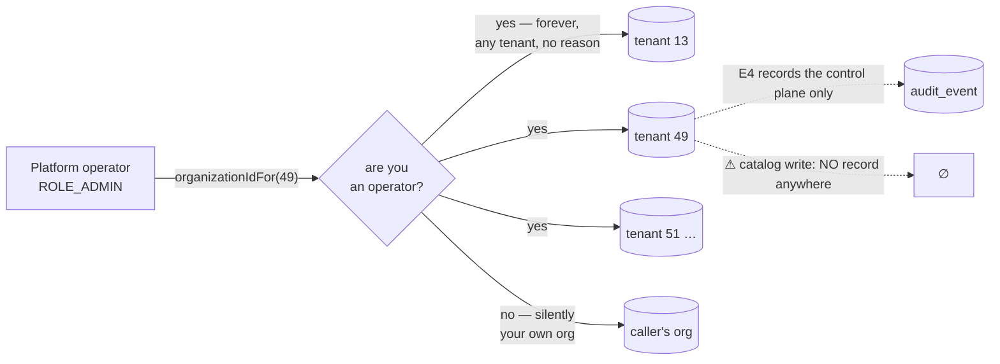

# E5 — analysis: the support door is already open

**Status:** ANALYSIS, shared for review. No design, no code — per `SAAS-BUILD-STANDARDS.md`, *"The standards
analysis is shared for review **before** documenting or designing, not alongside it."*
**Programme:** [`saas-control-plane-review.md`](../saas-control-plane-review.md) — E5 of E0..E6, finding **F3**,
the last 🔴.
**Predecessors:** E1 · E2 · E3 · E4 · ONB-1/2/3 — all ✅ green.

Read from the source tree on 2026-09-04.

---

## 1. Verdict up front

**E5 as briefed describes a door that needs building. The door is already there, and it is propped open.**

F3 says *"there is no impersonation, no time-boxed support session, no consent record — supporting a customer
today means asking for their password."* The first half is true and the second half is now only half true,
because between E2 and today the platform grew a **de facto support access model** nobody designed as one:

> `CurrentUser.organizationIdFor(requested)` answers exactly one question — *"are you a platform operator?"* —
> and if the answer is yes, it hands over **any tenant, for any reason, for ever**. It is now used in **three
> services across four endpoints**, and one of them is a **write**.

That rule was correct when ONB-3 introduced it: the alternative was an operator preview showing the operator's
own figures under the customer's name, which is a wrong number rather than an error. This analysis is not a
criticism of it. The point is narrower and worth stating plainly: **the boundary E2 drew has moved, and nothing
recorded that it moved.**

So E5's subject is not "build impersonation from nothing". It is **turn a permanent capability into a bounded,
explained, visible session** — and audit the write that currently leaves no trace at all.

---

## 2. What an operator can already reach

| Endpoint | Service | Kind | What it exposes |
|---|---|---|---|
| `GET /installmentImpact?organizationId=` | business | read | **Receivables** — open plan count and total outstanding |
| `GET /policy-counts?organizationId=` | catalog | read | How many of the tenant's products carry each policy |
| `GET /policy-conflicts?organizationId=` | catalog | read | **Product names**, up to ten of them |
| `POST /clear-tracking-flags?organizationId=` | catalog | **write** | Clears serial/batch policy on the tenant's products |
| `GET /api/audit?organizationId=` | audit | read | The tenant's trail — E4, deliberate, now `ROLE_OWNER`/`ROLE_ADMIN` |

E2's design recorded the boundary in as many words: *the console shows **account facts only, never trading
data** (Shopify Partners' line; tenant data = E5's audited support session).* Receivables and product names are
trading data. ONB-3 shipped after E2 and crossed that line for a good reason, and E5 is where the crossing gets
its session.

---

## 3. Findings, ordered by the cost of leaving them

### S1 🔴 A cross-tenant WRITE leaves no trace anywhere

`POST /clear-tracking-flags` mutates a customer's product policy on the operator's say-so. **catalog-service
has no audit producer at all** — of nine services, only business, education and auth emit audit events, and
E4 covered auth's *control plane*, not catalog's data.

So the single most consequential thing an operator can do to a customer's records today is the one thing
nothing records. ONB-3's gate deliberately exercises it in bulk (nineteen products in one call), which is a
fair measure of the blast radius.

### S2 🔴 `ROLE_ADMIN` is a standing grant, not a session

The check has no notion of **which** tenant, **why**, or **until when**. Every operator holds every tenant
permanently, and revoking it means removing the role. There is no state to expire, so there is nothing that
*can* expire — which is why "time-boxed" cannot be added as a flag on top; it needs something to bound.

This is the same shape as E1's ceiling before E1: a question with only one answer, asked of a role rather than
of a grant.

### S3 🟠 The customer cannot see that any of it happened

E4 built exactly what makes this answerable — the trail is stamped against the **subject tenant** with
`actor_type = PLATFORM_OPERATOR` and the operator's own address — and then stopped, because a tenant-facing
screen was E5's by the programme. Today the data exists and no customer can reach it.

The E4 review page lists this first under *Not yet verified*, and it is the half of "audited" that means
anything to the person being supported.

### S4 🟠 Asking for the password remains the real workflow

F3's original observation still stands for everything outside those four endpoints. An operator who needs to
see why a sale posted wrongly has no path at all except the customer's credentials — which produces a trail
saying the *customer* did it, and that is worse than no trail. (E4's actor axis exists precisely to make that
distinction; borrowed credentials erase it again.)

### S5 🟠 A dropped access record is worse here than anywhere else

E4 §10.4: `OutboxRelay` dead-letters after 20 attempts and nothing looks again. For a sale that is tolerable —
the money is in the books either way. For an **access** record there is no second copy: if it does not deliver,
nobody can ever show who looked at what. Eight rows are sitting in that state on the development database now.

E5 either fixes this or inherits a hole in its central claim.

### S6 🟢 The pieces E5 needs mostly exist

Worth stating so the slice is not over-priced: the actor axis (E4), the subject-tenant stamping (E4), the
required-reason pattern on every control-plane write (E2), a claim-based scope that reaches every service with
no hot-path call (C3c's `caps`, E1's ruling D-1), and one place where the cross-tenant rule already lives
(`CurrentUser.organizationIdFor`). E5 is mostly composition.

---

## 4. Rulings needed before design

**D-1 — does E5 add impersonation, or only a scoped cross-tenant session?**
**Recommendation: NO impersonation.** Acting *as* a customer's user makes every downstream write
indistinguishable from that user's own, which is the exact failure E4's actor axis was built to prevent —
and it would be self-inflicted rather than inherited. A support session should **widen what the operator may
reach while remaining visibly the operator**. Cost: a support engineer sees the tenant's data but not
literally their screen, so some UI-specific problems stay hard to reproduce. That is the trade, and it is
worth naming before it is made.

**D-2 — consent, or notify-after?** Options: (a) the tenant must approve before access opens; (b) access opens
on a reason and the tenant is told; (c) split — reads notify, **writes** require consent.
**Recommendation: (c).** Blocking every read on approval means support stalls when a customer is asleep, which
is when incidents happen; a write to their records is a different question.

**D-3 — where does the session live, and how does the scope travel?** **Recommendation: auth-service owns it**
(it owns the tenant and mints the token — C3c, E1 D-2), and the scope travels **as a claim** with its own
expiry, so `organizationIdFor` asks *"is there an open session for THIS tenant?"* instead of *"are you an
operator?"*. Zero hot-path calls, same reasoning as E1's D-1. ⚠ The known cost is the mirror of C3c's: a
session **revoked** early stays usable until the token refreshes. That matters more for access than for
capabilities and may justify a shorter token life for operators specifically.

**D-4 — what happens to the four endpoints that exist?** They must move from "any tenant" to "the tenant this
session is open for". ⚠ **This is a behaviour change to shipped, gated code**: ONB-3's `migration-safety.cy.js`
(14 cases) and E4's console panel both call them as a bare `ROLE_ADMIN`. Either those gates open a session
first, or the change breaks them — and a gate edited to keep passing is the thing the standards warn about.

**D-5 — how does catalog's cross-tenant write get audited?** Options: (a) add `common-audit` to
catalog-service — a fourth producer, and the module now exists precisely for this; (b) route operator writes
through a service that already produces. **Recommendation: (a)**, and note that it makes catalog the first
consumer to adopt `common-audit` without having written its own copy first, which is the test of whether the
extraction was worth making.

**D-6 — is S5 (dead-lettered records) in scope?** **Recommendation: yes, minimally** — an operator-visible
count of undelivered audit events and a re-drive control. Not a monitoring system; enough that a dropped
access record is noticed by someone rather than by a red test.

---

## 5. What I would not build

* **No "log in as this user" button.** See D-1. Every SaaS that ships one spends the next year adding
  restrictions to it.
* **No separate support portal.** The operator console (E2) is the surface; a session is a state it enters,
  not a second application.
* **No per-field redaction.** A session that grants a tenant's data grants it. Deciding which of a customer's
  own figures their support engineer may see is a policy with no obvious answer and no requester.

---

## 6. Gate, sketched — `cypress/e2e/platform/support-session.cy.js`

| # | Case | Guards |
|---|---|---|
| 1 | Cross-tenant read **without** an open session is refused | the whole slice: the standing grant is gone |
| 2 | ⭐ Opening a session **requires a reason**, by the API and not just the form | E2's rule; a UI-only requirement is not one |
| 3 | With a session open, the same read succeeds — for **that tenant only** | a session is not a new master key |
| 4 | ⭐ A session for tenant A does **not** open tenant B | the narrowing is real, not decorative |
| 5 | The session **expires**, and the read then fails | "time-boxed" asserted by the clock, not by a field |
| 6 | Every access is recorded against the **subject** tenant as `PLATFORM_OPERATOR` | reuses E4's axis |
| 7 | ⭐ The **tenant** can see that the session happened | S3 — the half that matters to the customer |
| 8 | The catalog write is audited | S1 |
| 9 | Ladder: a tenant owner cannot open a session over anyone, including themselves | `ROLE_ADMIN`, never `ADMIN_PRIVILEGE` |

⚠ Assert the **envelope**, not the HTTP status, on proxied writes. ⚠ Case 5 needs the clock, not a `cy.wait` —
a short configurable session length, set by the spec and restored in `after()` (`feedback_leave_no_server_state`).

---

## 7. Cost, honestly

The session store, the claim, one change to `organizationIdFor`, a console state, a tenant-facing list, and
`common-audit` in catalog. The expensive part is **D-4**: four shipped endpoints and two green gates change
behaviour, and that has to be done without editing either gate to keep it passing.
