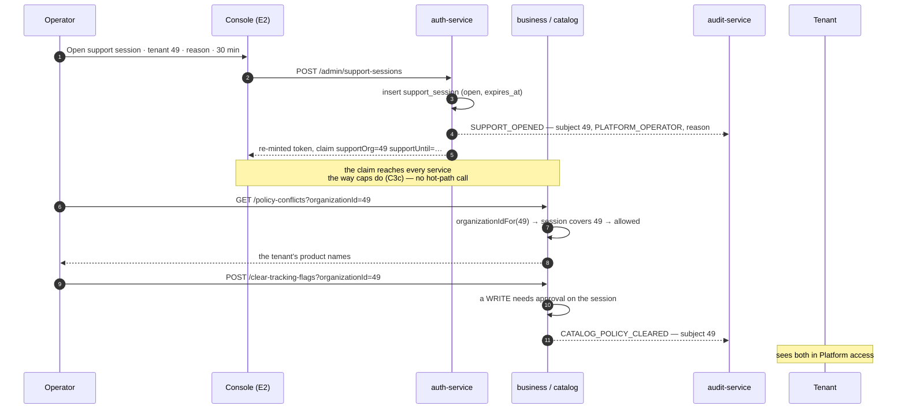

# E5 — design: a support session, not a standing key

**Status:** ✅ **SHIPPED AND GREEN** (2026-09-05) — `support-session.cy.js` **10/10**, and the two gates E5
changed are green on the new path: `control-plane-audit.cy.js` **10/10**, `migration-safety.cy.js` **14/14**.
**Programme:** [`saas-control-plane-review.md`](../saas-control-plane-review.md) — E5, finding **F3**.
**Analysis:** [`e5-support-session-analysis.md`](e5-support-session-analysis.md) — read that first.
**Predecessors:** E1 · E2 · E3 · E4 · ONB-1/2/3 — all ✅ green. **Branch:** `feature/pack-loose-selling`.

---

## 1. Rulings taken

| | Question | Ruling |
|---|---|---|
| **D-1** | Impersonation? | **No.** The operator stays visibly the operator; the session widens what they may *reach* |
| **D-2** | Consent? | **Split** — a read notifies the tenant, a **write** requires their approval |
| **D-3** | Where does the session live? | **auth-service**; the scope travels as a claim with its own expiry |
| **D-4** | The four existing endpoints? | Move to "the tenant this session is open for" — and both affected gates open one first |
| **D-5** | Auditing catalog's write? | **`common-audit` in catalog-service** — its first consumer that never wrote its own copy |
| **D-6** | Dead-lettered records? | **Yes, minimally** — a visible count and a re-drive control |

### The sentence the slice turns on

```
before   may I read tenant 49?   →  am I ROLE_ADMIN?              →  yes, for ever, unasked
after    may I read tenant 49?   →  do I hold an OPEN SESSION      →  yes, until 14:35, because
                                    for tenant 49?                     of ticket 4192
```

`organizationIdFor` keeps its name, its single call site per endpoint, and its anti-IDOR behaviour — a caller
without a session is **ignored, not rejected**, so a prober still learns nothing. Only the question changes.

---

## 2. Shape



**Why a claim and not a live check.** Same reasoning as E1's D-1 and C3c: the scope is resolved once at the
door and carried, so no service acquires a dependency on auth on a request path. ⚠ **The cost is the mirror
image: closing a session early is not instant** — it lands when the operator's token next refreshes, inside the
15-minute access-token life. Named here because it is the one place this design is weaker than a live lookup:
the mitigation is that sessions are **short by default** (30 minutes) so expiry, not closure, is the normal end,
and that every access is recorded whether or not the session was closed on time.

---

## 3. The session

### `auth-service` — `V11__support_session.sql`

```sql
CREATE TABLE support_session (
    id                BIGINT       NOT NULL AUTO_INCREMENT,
    operator_user_id  BIGINT       NOT NULL,
    operator_email    VARCHAR(160) NULL,     -- stamped: the record outlives the staff member
    subject_org_id    BIGINT       NOT NULL,
    reason            VARCHAR(255) NOT NULL, -- required by the API, not merely by the form
    write_approved    TINYINT(1)   NOT NULL DEFAULT 0,   -- D-2: reads notify, writes need consent
    approved_by       BIGINT       NULL,
    opened_at         DATETIME     NOT NULL,
    expires_at        DATETIME     NOT NULL,
    closed_at         DATETIME     NULL,
    PRIMARY KEY (id),
    KEY idx_support_open (operator_user_id, subject_org_id, expires_at)
);
```

There is deliberately **no `status` column**. Open-ness is `closed_at IS NULL AND expires_at > now()` — a
derived truth that cannot drift from the clock, the same reason E4 stores `before`/`after` rather than a
"changed" flag. A status column would need a job to expire it, and a job that does not run is a session that
never ends.

### The claim, and the header

`buildClaims` gains two entries beside `caps`, only when a session is open:

```
supportOrg    49
supportUntil  2026-09-04T14:35:00
```

The gateway treats them exactly as it treats `X-Org-Caps` — ⚠ **stripped from the inbound request
unconditionally, then stamped from the claim.** That line is the security of the feature: a header a client
could set is a cross-tenant grant a client could write itself.

`AuthenticatedUser` gains `supportOrgId` / `supportUntil`; `CurrentUser` gains one method:

```java
/** An OPEN support session for this tenant — the only thing that widens a caller past their own org. */
public static boolean supportSessionCovers(Long organizationId) { … }
```

and `organizationIdFor` asks that instead of `isPlatformOperator()`. **`isPlatformOperator` stays** — it is
still the right question for the operator's *own* console endpoints (the tenant list, entitlements, plan). What
changes is only the question asked about *somebody else's data*.

---

## 4. D-4 — the change to shipped, gated code

Four endpoints move from a standing grant to a session. Two green gates call them today as a bare
`ROLE_ADMIN`, so both must open a session first.

| Gate | Calls | Change |
|---|---|---|
| `migration-safety.cy.js` (14) | `/policy-counts`, `/policy-conflicts`, `/clear-tracking-flags`, `/installmentImpact` | `before()` opens a session on the subject; `after()` closes it |
| `control-plane-audit.cy.js` (10) | `GET /api/audit?organizationId=` | same |

⚠ **This is a precondition, not a weakening.** The distinction matters and is worth stating because the two
look identical in a diff: a weakened gate asserts *less* than it did; these assert the same things through the
path the product now actually has. E5's own **case 1** is what keeps that honest — it asserts the old
behaviour is *gone*, so a build that quietly restored the standing grant fails even though every other case
would pass.

---

## 5. What the tenant sees

The half of "audited" that means anything to the customer, and the piece E4 explicitly handed here.

A **Platform access** card on the tenant's own Configuration screen — read-only, no controls except the
approval, listing every session over their data:

```
┌──────────────────────────────────────────────────────────────────────┐
│  Platform access                                                   3 │
├──────────────────────────────────────────────────────────────────────┤
│  When MaxTheService support opens your account, it is recorded here. │
│                                                                      │
│  ⏻  Open now · closes 14:35            [ Allow changes ]  [ End it ] │
│      support@maxtheservice.com                                       │
│      “Investigating the duplicate invoice you reported — #4192”      │
│  ──────────────────────────────────────────────────────────────────  │
│  ✓  3 Sept, 09:12 → 09:41  ·  read only                              │
│      support@maxtheservice.com                                       │
│      “Checking why expiry alerts stopped”                            │
└──────────────────────────────────────────────────────────────────────┘
```

**⭐ The customer can end a session.** That is the design decision worth arguing for: an access record the
subject can read but not stop is a notice, not a control. `[ End it ]` closes it immediately server-side — and
because closure reaches services at the next token refresh, the button says *"Ends access within 15 minutes"*
in its confirmation rather than implying it is instant. **Saying so is the difference between a limitation and
a lie.**

`[ Allow changes ]` is D-2's consent: without it the session is read-only and `clear-tracking-flags` refuses.

---

## 6. What the operator sees

**⭐ An operator must never forget whose data they are looking at.** So the session is not a quiet flag — it
is a persistent bar across the top of the console, in a colour used nowhere else on that screen, with the
tenant's name, the reason, and a live countdown.

```
╔══════════════════════════════════════════════════════════════════════╗
║ ⏻  Support session · Farooq Veterinary  ·  ends in 24:11  ·  read    ║
║    only     “Investigating the duplicate invoice — #4192”    [Close] ║
╚══════════════════════════════════════════════════════════════════════╝
```

* Sits above the tenant detail, `position: sticky`, so it survives scrolling to the data it is granting.
* The countdown ticks. A number that moves is read; a static "expires 14:35" is not.
* Under five minutes it changes colour and reads *"ends in 4:20 — extend?"*. **Expiry must never be a
  surprise mid-investigation**, and an operator who is surprised will open a longer session next time.
* On a tenant with no session, the detail shows an **Open support session** button beside the tenant name,
  and every cross-tenant panel (installment impact, policy conflicts) renders its empty state with
  *"Open a support session to see this business's figures."* — not an error, and not a blank card.

Reuses `.plat-card`, `.plat-badge`, `uiPromptConfirm` for the reason, and E4's Activity panel already renders
`SUPPORT_OPENED` / `SUPPORT_CLOSED` rows with no change, because they are ordinary control-plane events with
`actor_type = PLATFORM_OPERATOR`.

### D-6 — the undelivered count

A small strip on the console's tenant list, visible only when the number is non-zero:

```
⚠  4 audit records have not been delivered.        [ Re-send ]
```

Not a monitoring system. Enough that a dropped **access** record is noticed by a person rather than by a red
test — which is exactly how the eight currently sitting on dev were found.

---

## 7. Files

| File | Change |
|---|---|
| `auth-service` `V11__support_session.sql` · `SupportSession` · repo | new |
| `auth-service` `SupportSessionService` · `SupportSessionAdminController` (`ROLE_ADMIN`) | new — open / close / extend / list; **reason required** |
| `auth-service` `SupportSessionTenantController` (`ROLE_OWNER`) | new — the tenant's own list, approve, end |
| `auth-service` `AuthService.buildClaims` | + `supportOrg` / `supportUntil` when a session is open |
| `auth-service` `EntitlementAdminController`-style audit emission | `SUPPORT_OPENED` · `SUPPORT_CLOSED` · `SUPPORT_APPROVED` via `ControlPlaneAuditService` |
| `api-gateway` `JwtAuthenticationFilter` | strip `X-Support-Scope` unconditionally, then stamp from the claim |
| `common-security` `AuthenticatedUser` · `HeaderAuthFilter` · `CurrentUser` | carry the scope; `supportSessionCovers`; `organizationIdFor` asks it |
| `catalog-service` pom · `AuditOutbox` · repo · `CatalogAuditService` · migration | **D-5** — first `common-audit` adopter; audits `clear-tracking-flags` |
| `catalog-service` `ProductPolicyAdminController` | the write requires `write_approved` |
| monolith `PlatformAdminController` · `platform.js` · `platform.css` | session bar, countdown, open/close, undelivered strip |
| monolith Configuration screen | **Platform access** card |
| `messages_*.properties` × 6 | ~20 `ui.js.*` keys |
| `migration-safety.cy.js` · `control-plane-audit.cy.js` | open a session in `before()`, close in `after()` |

---

## 8. Gate — `cypress/e2e/platform/support-session.cy.js`

| # | Case | Guards |
|---|---|---|
| 1 | ⭐ Cross-tenant read **without** a session is refused | the standing grant is gone — the case that keeps §4 honest |
| 2 | ⭐ Opening requires a **reason**, by the API | E2's rule; a UI-only requirement is not one |
| 3 | With a session, the same read succeeds | positive control — a build refusing everything must not pass |
| 4 | ⭐ A session for A does not open B | the narrowing is real |
| 5 | The session **expires** and the read then fails | asserted by the clock, with a short configurable length |
| 6 | Every access is recorded against the **subject** as `PLATFORM_OPERATOR` | reuses E4's axis |
| 7 | ⭐ The **tenant** sees the session on their own screen | the half that matters to the customer |
| 8 | The catalog **write** is refused without approval, allowed with it, and audited either way | S1 + D-2 |
| 9 | Ladder: an owner cannot open a session over anyone, including themselves | `ROLE_ADMIN`, never `ADMIN_PRIVILEGE` |
| 10 | Screen: the console shows the session bar with the tenant's name and a countdown | E2's lesson — a policy with no control anywhere |

⚠ Envelope, not status, on proxied writes. ⚠ Case 5 sets a short session length as a **server-wide** setting
and must restore it in `after()` (`feedback_leave_no_server_state`). ⚠ `cy.loginAsOperator` restores a cached
session — cases that depend on a fresh `supportOrg` claim need `gwLogin`.

---

## 9. What could go wrong

* **Every operator endpoint breaks at once** if the claim is not reaching services. Case 3 is the canary; the
  §4 gate updates are the blast radius.
* **The gateway strip is forgotten** → a client could grant itself a tenant with a header. This is the single
  highest-severity line in the slice; C3c's comment on `X-Org-Caps` says the same thing and is worth copying
  verbatim.
* **`supportUntil` is trusted from the claim**, so a token minted before a session was shortened outlives it.
  Bounded by the token life, stated in §2, and the reason sessions are short by default.
* **catalog gains an outbox** and, with it, a second `@Scheduled` relay in a service that had none — the
  `@EnableScheduling` trap E4 hit in auth applies here too.

---

## 10. What changed during implementation

### 10.1 Write approval rides the claim, not a live check

§5's design implied the customer's approval takes effect on the operator's existing token. It does not, and
the alternative was worse: **catalog-service calls no peer at all today**, so checking approval live would
have introduced a whole new dependency direction (catalog → auth) for one boolean on the coldest path in the
system.

So `supportWrite` travels in the claim like the rest of the scope, and the operator takes a fresh token —
which the console does automatically via `refreshNow()`, so a person never sees the gap. **The half that
matters is unchanged: before approval, the write is refused.** Gate case 8 was corrected to re-mint, with the
reasoning on it, rather than left asserting behaviour the design does not have.

### 10.2 `mintAccessTokenFor`

The open endpoint has to hand back a scoped token or the operator opens a session, clicks into the customer,
and is answered about their own organization — a wrong number under someone else's name, which is the ONB-3
and E4 failure again. It reuses `buildClaims` rather than adding the claim by hand, so a token minted here
cannot disagree with one minted by login about anything else.

### 10.3 The header format

`X-Support-Scope: <subjectOrgId>|<expiresAt>|<writeApproved>`. Anything unparseable leaves the principal with
**no scope** — a malformed header must never widen a caller, and there is no reading of a broken value safer
than "no session".

### 10.4 The tenant card is shared, not business-only

A support session is opened over **any** tenant, so `renderPlatformAccess` lives in
`/js/common/support-access.js` and loads from the header fragment every dashboard already includes. Business
calls it; **education, welfare and agriculture each need one line** and are not wired yet. A copy per module
is exactly the screen that would drift — four versions, one of which quietly stops offering *End it*.

### 10.5 catalog-service gained two things it never had

An audit producer (`common-audit`'s first consumer that never wrote its own copy) and its first outbound
client — so it also needed `@EnableScheduling`, or `AuditEmitter`'s relay would have been present, reviewed
and inert. E4 hit exactly that in auth-service.

### 10.6 The two existing gates take different routes, on purpose

`control-plane-audit` opens its session at the **gateway**, because it holds raw operator tokens.
`migration-safety` opens through the **monolith BFF**, because it drives the console as a signed-in operator
and the console's downstream calls use the token in its *session* — opening at the gateway would succeed and
change nothing there.

### 10.7 Not yet done

* The **Cypress gate has never been run**, and nothing has been compiled.
* Education, welfare and agriculture do not yet render the Platform access card (§10.4).
* **D-6 — the undelivered-audit-record count and re-drive is not built.** It is the one ruling from §1 that
  did not make it into the code, and it matters here more than in E4: an access record that fails to deliver
  has no second copy, so losing it silently defeats the slice's central claim.


---

## 11. What the gate runs found

### 11.1 ⚠ A timezone-ambiguous timestamp made a live session look expired

The console showed *"You are not in a support session"* while its own feed said `"open": true`. auth runs
**UTC** and writes `LocalDateTime.toString()` — `2026-09-04T20:52:10`, **no offset**. The browser runs
**+05:00** and parses that as local, concluding the session had expired **four and a half hours ago**;
`remaining()` returned null and the bar fell back to the none-state. Good data, correct on the wire, wrong on
the screen, and no error anywhere.

Fixed both ends: the server sends an offset-carrying stamp, and the client **refuses a zoneless value with a
console warning rather than guessing** — guessing is what produced a confident wrong answer the first time.

⚠ **The same defect is almost certainly live in E4's Activity panel**: `audit-service` sends `occurredAt` the
same zoneless way and `ago()` does arithmetic on it, so "2 h ago" is wrong by the server/browser offset. E4
went green because no assertion read the time value. Not fixed here — different service, different screen.

### 11.2 The customer's approval could not reach the operator

D-2 says a write needs consent. The customer grants it **in their own session**, which re-mints nothing for
the operator — so the operator would go on being refused for up to fifteen minutes after the customer said
yes, in the middle of the support call that prompted it. Closed with
`POST /platform/refreshSupportScope`, which the console calls whenever it opens a tenant that has an open
session: once per tenant view, on a cold path.

Found only because the gate exercised the write. The design had the rule and no way to satisfy it promptly.

### 11.3 Adding a helper is not wiring it

Both existing gates went red on the first run because the `openSupport` helper was added to each spec and
**never called**. Every failure was a cross-tenant read with no session — exactly what E5 is supposed to
refuse, arriving as a broken gate rather than a passing one, which is the right way round.

⚠ `migration-safety` inspects **two** tenants and the claim carries **one** session, so case 4 opens and
closes its own on the second tenant. Without that it would have passed for the wrong reason: an operator with
no session is answered about their own organization, which also has no serial products.

### 11.4 ⚠ Fixture damage, caused and recovered

A smoke test ran the real bulk clear against `owner.mobile@` outside any spec's restore, clearing 26
`requires_serial` flags the mobile-shop gates depend on. Twenty-four were reconstructed from
`serial_unit` — a product with registered serial units unambiguously requires them — through
`/setProductTracking`, the product's own C6-gated path, not a DB write. The remaining two had nothing to
reconstruct from.

**The lesson is the gates' own:** they capture the ids before clearing and restore them in `after()`. A manual
call has no `after()`.
