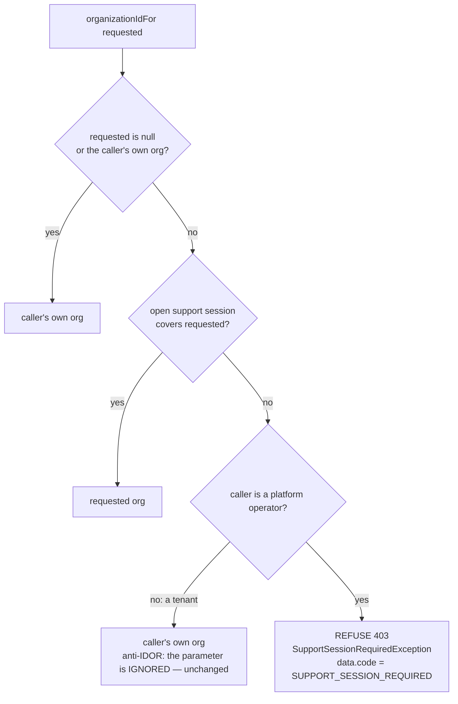

# E5b — an operator naming another business is REFUSED, never answered about their own

**Status:** designed 2026-09-27 · owner ruling "Refuse, never substitute" + "Split the Activity panel".
**Found by:** SET-CERT §9 (control-plane-audit case 10, migration-safety case 3), traced to one shared rule.

## 1. The defect
E5 changed `CurrentUser.organizationIdFor(requested)` from "a platform operator may name any org" to "only under an
OPEN support session". Its fallback stayed the tenant anti-IDOR rule: **silently substitute the caller's own org**.
For a tenant that is right (their `organizationId` parameter is ignored). For an operator it produces the platform
org's (org 8's) data **under the other business's name**:

| # | Call site (7 in 3 services) | Console surface | What the operator got without a session |
|---|---|---|---|
| 1 | audit `AuditIngestService.list` | Tenant → **Activity** | org 8's trail, labelled as the tenant's |
| 2 | business `InstallmentController.installmentImpact` | Business-type change preview | "0 open plans, Rs 0" for a tenant with open plans |
| 3 | catalog `policy-counts` | Business-type change preview | org 8's product counts |
| 4 | catalog `policy-conflicts` | Cleanup list | org 8's products listed as the tenant's |
| 5 | catalog `clear-tracking-flags` | **Clear flags** (a WRITE) | **cleared org 8's own catalogue**, reported under the tenant's name — `crossTenant` computed false because the substitution had already happened |

Not a leak across customers (org 8 is the operator's own) — a wrong answer under somebody else's name, the failure
E5's own javadoc names as the hardest kind to notice. It passed the gates because earlier cases left a session open
(run order); the E5 spec (support-session cases 1, 4, 5) asserted the substitution as correct: "answered, not refused".

## 2. The rule

- `SupportSessionRequiredException extends AccessDeniedException` (common-security) — still a 403 to anything that
  already handles access denied; `common-web` and business-service handlers render it with its sentence and
  `data.code`, instead of the bare "Access denied".
- **Activity is the one split read** (owner ruling): audit-service answers an operator with no session with the
  requested business's **platform actions only** (`actor_type = PLATFORM_OPERATOR` rows for THAT org) — never a
  refusal, never org 8. With a session: everything, as today.

## 3. The console
- Business-type preview (`addImpact`): a count refused with `SUPPORT_SESSION_REQUIRED` sets
  `impact.needsSupportSession = true`; the dialog says *"Open a support session for this business to see how many
  products and open plans this affects."* — instead of silently printing nothing.
- Cleanup list / Clear flags: the refusal sentence reaches the operator (ProxyErrors carries the downstream message).
- Activity: with no open session, a note — *"Showing the platform's own actions on this business. Its staff activity
  needs an open support session."* Repainted when the session state arrives.

## 4. Gates (red first)
| Level | Test | Proves |
|---|---|---|
| unit | common-security `OrganizationIdForTest` | operator+other+no session → refused · +session → requested · own/null → own · tenant+other → own |
| unit | audit `AuditActivityScopeTest` | operator, no session → only that org's PLATFORM_OPERATOR rows; with session → all; tenant → own |
| e2e | support-session.cy.js cases 1/4/5 (rewritten) | refused with the code — never another org's data |
| e2e | control-plane-audit case 10 (+11) | every Activity row belongs to the SELECTED org; platform-only + note without a session |
| e2e | migration-safety case 3 | no session → `needsSupportSession`; session → real open plans and money |
| e2e | support-session: Clear flags with no session | refused, and the operator's own catalogue is untouched |

**Rebuild:** common-security + common-web (`install`), then EVERY service (they all carry both), and the monolith.

## 5. Status (2026-09-27, awaiting a full rebuild)
- Unit, red first: `OrganizationIdForTest` red 3/6 → 6/6 · `AuditActivityScopeTest` red 2/5 → 5/5 ·
  `GlobalExceptionHandlerTest` (403 carries sentence + code) 6/6.
- e2e red on the running build (as designed): support-session 4 (cases 1, 4, 5 now assert the refusal; 5b new),
  control-plane-audit 2 (10 + new 11), migration-safety 1 (case 3). **Case 5b's red run is itself the evidence**: Clear
  flags for business 49 with no session answered `success:true, "0 product(s) updated"` — it ran on org 8, whose
  flagged-product count was 0, so nothing was changed.
- Monolith: preview flag `needsSupportSession`, the Activity scope note, i18n ×6, proxy javadoc corrected.
