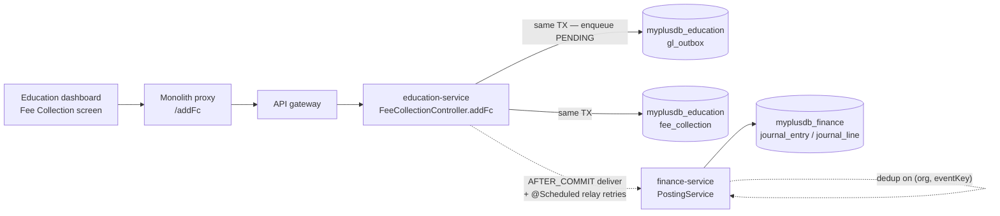
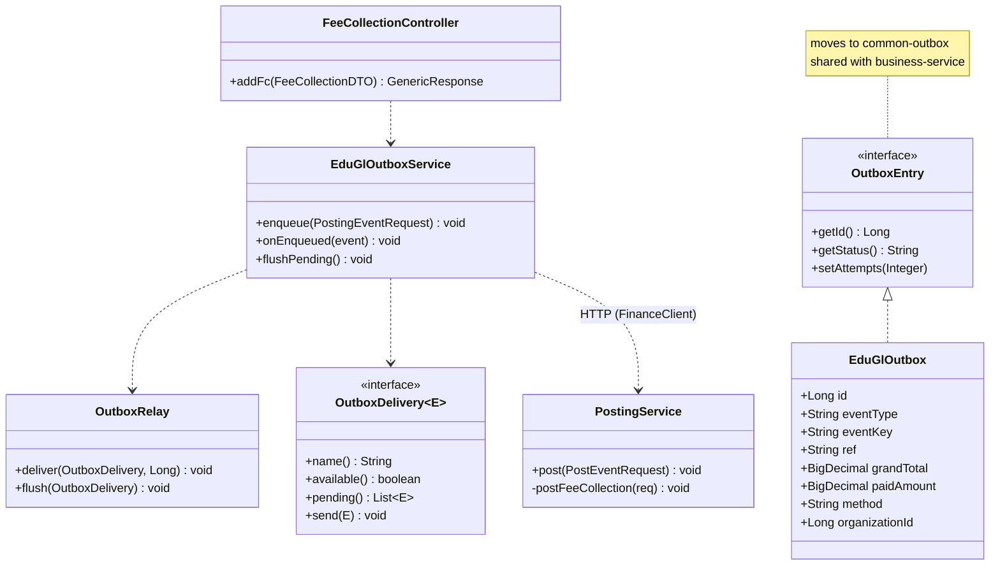

# Slice 0.1 — Education fee collection → General Ledger

**Status: DONE — headed Cypress GREEN (2026-07-30).**
Programme: `education-complete-programme.md` Phase 0.1. Branch: `feature/education-review`.

---

## 1. Document — what and why

When a school collects a fee today, `education-service` writes a `FeeCollection` row and stops. Nothing reaches
`finance-service`. The consequence:

> **A school's entire revenue is invisible to the books the platform already maintains** — journal, trial
> balance, P&L, balance sheet and period close all run, and all show zero income for an education tenant.

`business-service` has solved this: every sale enqueues a `PostingEventRequest` to a transactional outbox, which
`finance-service` turns into a journal entry. Education must do the same.

This is a **§1.2 (compose, don't duplicate) violation**, not a missing feature. business composes 5 platform
services; education composes 1. Fixing it costs less than any new capability and makes every later phase's
reporting correct.

**Value:** an education tenant gets a real P&L, trial balance and period close with **no new screen**.

**Non-goal:** receivables. Dues (`db`) becoming an AR with aging is slice **0.2**. This slice posts only cash
actually collected.

---

## 2. Design

### D1 — Extract `common-outbox` (do NOT copy the machinery)

The reliable-delivery machinery already exists in `business-service` and is **already service-agnostic**:

| Class | Coupling |
|---|---|
| `OutboxEntry` | pure interface — no imports beyond `java.time` |
| `OutboxDelivery<E>` | generic SPI |
| `OutboxRelay` | imports only `java.time`, slf4j, `@Component` |

`OutboxEntry`'s own javadoc says *"Implemented by GlOutbox, AuditOutbox, and any future producer's row"*, and
`OutboxDelivery`'s says *"Open for extension — a new producer (finance, …)"*. business already runs **two**
outboxes over it. The author designed for this.

**Decision:** extract these three types into a new `common-outbox` module; `business-service` and
`education-service` both depend on it. Copying five classes into education would violate DRY outright, and a
third copy is how divergence starts.

**Each service keeps its OWN outbox table.** No shared database — atomicity comes from the outbox pattern, per
microservice-standards. education gets `gl_outbox` in `myplusdb_education`.

Mirrors the `common-settings` extraction precedent exactly: shared contract + logic, per-service store via SPI.

### D2 — New event type `FEE_COLLECTION`

`PostingService` dispatches on `eventType` and **throws** `Unknown event type` for anything outside
SALE / PURCHASE / SALE_RETURN / PURCHASE_RETURN. Add:

```
FEE_COLLECTION:   Dr Cash|Bank (amount collected)   =   Cr Fee Income
```

No tax line (tuition is generally not taxable; a taxable-fee tenant is a later concern). No COGS — a service has
no inventory cost.

### D3 — New account `4100 Fee Income`

Added to `GlService.DEFAULT_COA`. `ensureDefaults()` is **idempotent per account** and its comment records
exactly this case: *"so an account newly added to DEFAULT_COA — e.g. 2200 Store Credit — backfills orgs whose
chart was seeded before it existed. Without this, a new posting rule hits 'Account code not found'."*

So existing tenants backfill with no migration. Revenue lands on its own P&L line rather than being merged into
`4000 Sales`, which would be wrong for a school.

### D4 — Enqueue in the caller's transaction, deliver after commit

Identical to business. The outbox row is written **inside** `addFc`'s transaction, so if the fee collection
commits the GL event is durable; delivery happens on `AFTER_COMMIT`, so **a rolled-back fee collection never
posts a journal**. A `@Scheduled` relay re-drives anything still PENDING.

### D5 — Idempotency

One `eventKey` UUID per enqueue. `finance-service` already dedups on `(organization_id, event_key)` via
`ProcessedEvent`, so a relay retry cannot double-post. Reuses the existing guarantee — nothing new needed.

### D6 — Best-effort: a GL failure must never fail the fee collection

Wrapped like business's: the guardian's payment is recorded regardless. The outbox is what makes "best-effort"
safe — a failed delivery is retried, not lost.

### D7 — Payment method: **CORRECTED — it already exists**

> The approved draft said "`FeeCollection` has no payment-method field" and proposed adding one. **That was
> wrong.** Reading the form revealed `ri` → column `recieved_in`, a required `<select>` with values
> **`Cash` / `Check`**, plus `cn` → `check_no`. No new column, no new UI.

So the posting maps the existing field:

| `receivedIn` | finance `method` | Account |
|---|---|---|
| `Cash` | `CASH` | 1000 Cash |
| `Check` | `CHEQUE` | 1010 Bank |

**Trap to handle:** `PostingService.cashAccount()` tests `m.startsWith("CHEQUE")`. The stored value is
`"Check"`, which does **not** match — it would silently fall through to Cash. The mapping must translate
`Check → CHEQUE` when building the request rather than passing the raw value.

This deletes a Flyway migration and a UI change from the slice.

### D8 — Amount posted = `fp` (payment collected)

Decoded from the fee calculator: `da` = due amount, **`fp` = payment made**, `db = da − fp` = balance owed.
Only `fp` is cash in hand, so only `fp` posts. `db` is the receivable → slice 0.2.

> **Known limitation, stated not hidden:** the tuition (`f`) / transport (`vf`) split is *not* carried into the
> GL — a partial payment cannot be attributed across heads without an allocation policy, which belongs with the
> AR work in 0.2. Until then, `4100 Fee Income` is a single revenue line.

### Data model

```
education (myplusdb_education)
  NEW  gl_outbox              -- same shape as business's; id, event_type, event_key, ref, grand_total,
                              -- paid_amount, method, status, attempts, last_error, organization_id, user_id, …
                              -- indexed (status, id) for the relay + (organization_id) per D3
  -- fee_collection: NO CHANGE. `recieved_in` (Cash|Check) already carries the method — see D7.

finance (myplusdb_finance)    -- no schema change; 4100 arrives via ensureDefaults()
```

### Layer answers (§5b)

| Layer | Answer |
|---|---|
| **UI/UX** | one Payment-method `<select>` on the fee form (i18n key, shared styling). No other visible change — the value is that Finance reports start showing school income |
| **Service/API** | no new endpoint; `addFc` gains an enqueue. Reuses `PostingEventRequest` |
| **Database** | MySQL — relational, transactional, and the outbox row must commit in the same tx as the fee. Correct choice, stated per §5c |
| **Patterns** | transactional outbox + AFTER_COMMIT delivery; DIP via `OutboxDelivery` SPI; contract in `commerce-contracts` |
| **Microservice design** | compose `finance-service`; extract shared machinery rather than duplicate |
| **Configurability** | none in this slice. Deliberate: *whether* revenue reaches the books is correctness, not policy (C1 — a toggle here would be a switch for wrong books). The tuition/transport split in 0.2 IS a policy and will be configurable |
| **DRY** | the entire justification for D1 |

### Security

`addFc` is already org-scoped and anti-IDOR-hardened (education review finding A). The outbox row inherits
`organization_id`/`user_id` from `CurrentUser`; delivery forwards identity so finance scopes the journal to the
same tenant.

---

## 3. Architecture & UML

### Architecture



### Class diagram



### Sequence

```mermaid
sequenceDiagram
  actor Clerk
  participant EDU as education-service
  participant DB as myplusdb_education
  participant FIN as finance-service

  Clerk->>EDU: addFc (enroll, fp, method)
  activate EDU
  Note over EDU,DB: ONE transaction
  EDU->>DB: save FeeCollection
  EDU->>DB: insert gl_outbox PENDING (eventKey=UUID)
  EDU-->>Clerk: SUCCESS
  deactivate EDU

  Note over EDU: AFTER_COMMIT
  EDU->>FIN: POST posting event (FEE_COLLECTION)
  alt already processed (retry)
    FIN-->>EDU: skip — (org, eventKey) seen
  else first delivery
    FIN->>FIN: Dr Cash|Bank = Cr 4100 Fee Income
    FIN-->>EDU: OK → mark POSTED
  end

  alt finance unreachable
    EDU->>EDU: stays PENDING; @Scheduled relay retries
    Note over EDU: fee collection is NOT rolled back
  end
```

---

## 4. Implement — checklist

- [x] **`common-outbox`** new module: `OutboxEntry`, `OutboxDelivery`, `OutboxRelay` moved from business-service;
      registered in the reactor pom after `common-settings`
- [x] **`CommonOutboxAutoConfiguration`** + `.imports` — `OutboxRelay` sits outside every consumer's
      `@ComponentScan` root, so scanning alone would never find it (same footgun as the common-settings
      `@EntityScan` case). Not in the original checklist; found during implementation
- [x] `business-service`: imports repointed (incl. two fully-qualified `implements` clauses a plain import sweep
      missed) + pom dependency — **no logic change**
- [x] `education-service`: `GlOutbox` entity + `GlOutboxRepository` + `GlOutboxService`. No separate publisher
      seam: business needs one because it has two outboxes and a broker plan; here `OutboxDelivery.send()` IS the
      seam, so a `GlEventPublisher` interface with one implementation would be speculative generality
- [x] `education-service`: `FinanceClientConfig` (5s read timeout — behind an outbox, failing fast buys nothing)
- [x] `education-service`: **`@EnableScheduling`** on the app class — absent, so the relay would never have run
      and a failed first delivery would stay PENDING forever. Not in the original checklist
- [x] `education-service`: Flyway `V8` — `gl_outbox` (indexed `(status,id)` + `(organization_id)`).
      **No `fee_collection` change** — see corrected D7
- [x] `education-service`: `addFc` enqueues **on create only**; `glMethod()` translates `Check → CHEQUE`
- [x] `finance-service`: `FEE_COLLECTION` dispatch + `postFeeCollection`; `4100 Fee Income` in `DEFAULT_COA`
- [x] tests: `FeeGlMethodTest` (the Check→CHEQUE trap) + `FeeCollectionPostingTest` (journal shape) — both pure,
      no Docker
- [x] Cypress gate: `cypress/e2e/education/fees-to-gl.cy.js`
- [x] **headed Cypress green** — 5/5 (`fees-to-gl.cy.js`)

---

## 5. Test

| # | Case | Expected |
|---|---|---|
| 1 | Collect a fee of 5000 (CASH) | journal: Dr 1000 Cash 5000 / Cr 4100 Fee Income 5000 |
| 2 | Collect by BANK | debit lands on 1010 Bank, not 1000 Cash |
| 3 | Trial balance after N collections | balances; Fee Income total = sum of `fp` |
| 4 | P&L for the term | shows Fee Income (previously zero) |
| 5 | Deliver twice (same eventKey) | second is skipped — one journal only |
| 6 | finance-service down at collection time | fee saves; outbox PENDING; relay posts it on recovery |
| 7 | `addFc` fails after enqueue (forced rollback) | **no** outbox row, **no** journal |
| 8 | Partial payment (`fp` < `da`) | posts `fp` only; `db` untouched (0.2 owns it) |
| 9 | Existing tenant seeded before 4100 | `ensureDefaults()` backfills; no "Account code not found" |
| 10 | Business sales still post | regression — the extraction changed imports only |

Unit: `postFeeCollection` line-balance (pure, no Docker) · outbox enqueue/retry state machine.
Cypress gate: `cypress/e2e/education/fees-to-gl.cy.js`.
**Regression (not optional):** `cypress/e2e/business/*` — `common-outbox` touches the sell path's GL posting.

---

## 6. Risks

- **The extraction touches business-service**, the most critical service. It is an import-only change with no
  logic edit, but the business Cypress suite is the gate, not an afterthought.
- **`4100` must exist before the first posting.** `ensureDefaults()` handles it; test 9 proves it.
- Fee *edits* and *refunds* are out of scope and will drift the books until 0.2 — the same gap the POS/retail
  audit found for returns/voids. Stated here so it is a known deferral, not a surprise.
