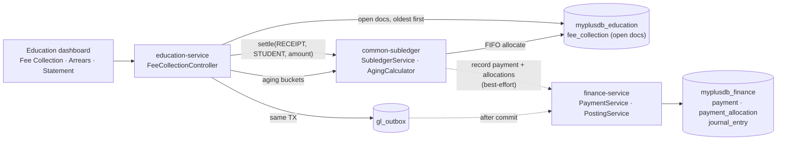
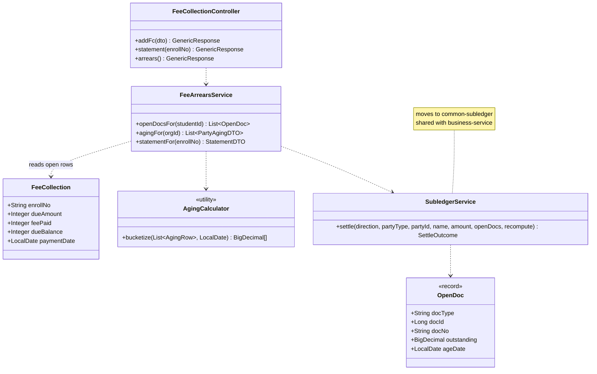
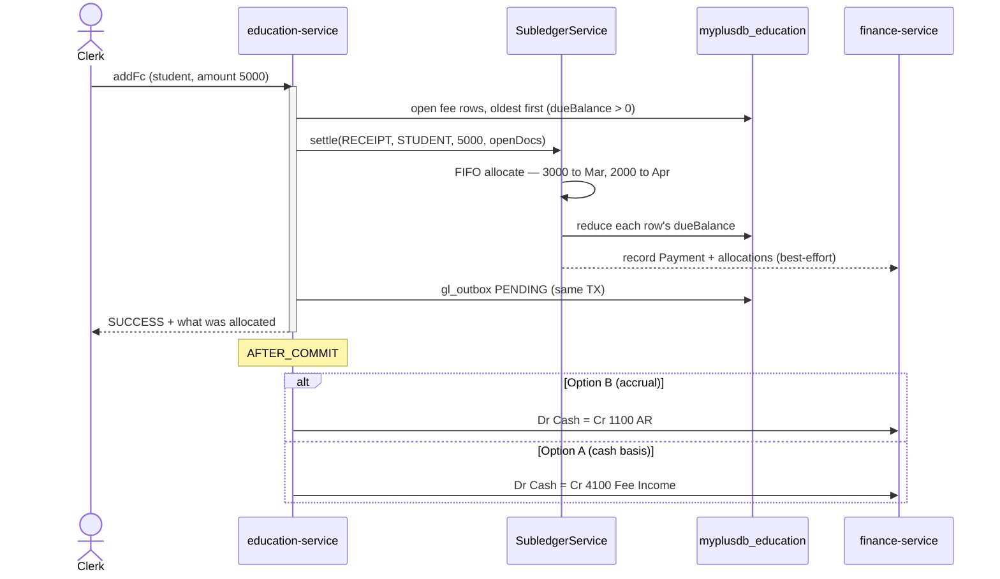

# Slice 0.2 — Fee dues → finance receivables (AR), aging & statements

**Status: 0.2a DONE — headed Cypress GREEN (2026-07-30). 0.2b (fee credit) not started.**
Programme: `education-complete-programme.md` Phase 0.2. Follows 0.1 (fees→GL, green).

---

## 1. Document — what and why

0.1 posts **cash collected**. It deliberately left three things open:

1. **A student's outstanding balance is not a receivable.** `FeeCollection.dueBalance` holds it, but nothing ages
   it, no statement can be produced, and it never reaches the balance sheet.
2. **Fee edits and refunds drift the books.** 0.1 posts on create only, because reversing a payment needs a
   receivable to reverse against. The same gap the POS/retail audit found for returns and voids.
3. **Arrears is a bespoke screen** (`arrearsDiv`) computing its own numbers, while the platform already has an
   aging engine and a settlement path.

### The finding that shapes this slice

Both capabilities already exist — and both are **stuck inside business-service**:

| Class | What its own javadoc says |
|---|---|
| `SubledgerService` | *"The ONE subledger settlement path, shared by AR and AP — **and reusable by any future vertical (education fees, welfare pledges…)**"* |
| `AgingCalculator` | *"pure, party-agnostic aging… Used by BOTH AR and AP… no Spring, no I/O"* |

The author wrote both for this exact case. `SubledgerService` FIFO-allocates a payment across a party's open
documents and records it in finance; `AgingCalculator` buckets 0–30/31–60/61–90/90+ from
`{outstanding, ageDate}` rows. Neither needs redesigning — they need **extracting**, exactly as `OutboxRelay`
did in 0.1.

> Note: aging and statements are **not** in finance-service, contrary to what one might assume. finance owns the
> GL, payments+allocations, period lock and tax register. AR is a GL *account* (1100); the aging *report* is
> computed in business over `customer_history`. That is why this slice is an extraction, not a finance feature.

---

## 2. Design

### D1 — Extract `common-subledger`

New module holding `SubledgerService` + `AgingCalculator` (+ `PartyAgingDTO`). Depends on `commerce-contracts`
(for `FinanceClient` / `PaymentRecordRequest`). business-service and education-service both consume it.

Same shape as `common-outbox`: shared logic, per-service data. Education supplies its own open documents; nothing
about a student's fees enters business's database.

### D2 — A student's open documents are the fee rows that still owe

**No new table.** `FeeCollection` rows with `dueBalance > 0`, oldest first, ARE the open document set —
`SubledgerService.settle()` takes exactly that: a party, an amount, and open docs oldest-first.

| Subledger concept | Education |
|---|---|
| party | the **student** (`partyType = "STUDENT"`, `partyId = student id`) |
| open document | a `FeeCollection` row with `dueBalance > 0` |
| document date / age basis | `paymentDate`, falling back to the row's creation |
| outstanding | `dueBalance` |

`Student.partyId` already exists (the party bridge), so a student is already a first-class party.

### D3 — A payment FIFO-allocates across outstanding dues

Today a fee payment writes one row and computes `dueBalance = dueAmount − feePaid` in isolation. After this
slice, `SubledgerService.settle("RECEIPT", "STUDENT", …)` walks the student's open rows oldest-first, reduces
each in turn, and records the allocation in finance's `Payment`/`PaymentAllocation`. That is what makes a
statement ("what did this guardian pay, against which months?") possible at all.

### D4 — RESOLVED: accrual (Option B) — which makes education MATCH POS and Pharma

> **Investigation result: POS and Pharma are already accrual.** This was checked, not assumed:
> - `postSale` → `Dr Cash(paid) + Dr AR(unpaid) = Cr Sales(sub) + Cr Tax(tax)` — revenue is recognised at the
>   sale, with a receivable for whatever is unpaid.
> - A later customer receipt → `PaymentService.record()` → `postingService.postPayment("RECEIPT", …)` →
>   `Dr Cash = Cr AR`, allocated across open documents by `SubledgerService`.
> - **Pharmacy dispensing reuses business `addSell`**, so it inherits that posting unchanged.
>
> So education's 0.1 cash-basis posting is the **outlier**, not the standard. Option B is alignment, not
> divergence — the whole platform ends up on one basis.

| Vertical | Revenue recognised | Unpaid becomes | Later payment |
|---|---|---|---|
| POS (business) | at sale — `Cr 4000 Sales` | `Dr 1100 AR` | `PaymentService` RECEIPT → `Dr Cash = Cr AR` |
| Pharmacy | same (reuses `addSell`) | same | same |
| Education **(after this slice)** | at charge — `Cr 4100 Fee Income` | `Dr 1100 AR` | same `PaymentService` RECEIPT path |

The one legitimate difference is **event structure, not basis**: a sale is charge-and-payment in one moment, so
business emits a single `SALE`. A school charges monthly and is paid later, so education emits two events. Same
accounting, different business process.

**The posting model:**
```
fee charged (monthly due raised):   Dr 1100 AR        Cr 4100 Fee Income     ← new FEE_CHARGE event
fee collected (guardian pays):        Dr Cash/Bank      Cr 1100 AR             ← existing RECEIPT path
```

**Cutover:** `FEE_COLLECTION` from slice 0.1 recognised revenue on collection. Under accrual that would
double-count (revenue at charge *and* at collection), so **0.1's `FEE_COLLECTION` posting rule is retired** —
see D7. Journals 0.1 already wrote stay as they are; education is pre-production, so no restatement is needed.
Record the cutover date when this ships.

### D7 — Education uses the SAME TWO MECHANISMS as POS, not a bespoke third one

"Same implementation" means reusing the paths, not just matching the debits and credits. Concretely:

| | POS / Pharma | Education (this slice) |
|---|---|---|
| the charge | `SALE` event → outbox → `PostingService` | **`FEE_CHARGE` event → the SAME outbox → `PostingService`** |
| the payment | `PaymentService.record()` + `SubledgerService` allocation | **the SAME `PaymentService` + `SubledgerService`** |

Consequences:

1. **0.1's `FEE_COLLECTION` posting rule is deleted.** A fee payment is a *receipt*, and finance already knows how
   to post a receipt (`postPayment("RECEIPT")` → `Dr Cash = Cr AR`, in-transaction, no outbox needed because it is
   finance's own DB). Keeping a separate education rule would be a third implementation of one concept.
2. **`FEE_CHARGE` is the only new posting rule** — the analogue of `SALE`'s AR leg, minus tax and COGS.
3. Education's `gl_outbox` (V8, from 0.1) is reused unchanged for `FEE_CHARGE`. Nothing new there.

Net effect: the platform ends with **one** revenue-recognition path and **one** settlement path, used by three
verticals — which is what §1.2 (compose, don't duplicate) asks for.

### D5 — Edits and refunds finally reverse correctly

Once a receivable exists, an edited or refunded fee posts a reversing entry against it instead of being ignored.
This closes the gap 0.1 documented. Scope note: this slice covers **edit and refund of a collection**; voiding a
whole fee record is a separate concern if you want it.

### D6 — CORRECTED: there is no arrears *report* to move; two screens must be ADDED

> The approved draft said "the arrears screen moves onto the shared engine". Reading the code showed that was
> wrong. **`arrearsDiv` is not a receivables report** — it is a manual-input helper inside the fee-voucher form
> ("Please specify arrears below for individuals"), where a clerk types arrears per student before printing. It
> has no computed aging to replace.

So the UI work is additive, not a migration:

| Screen | Source | Why it is new |
|---|---|---|
| **Fee Arrears (aging)** | `/getFeeAging` | nothing today shows who owes what, bucketed by age |
| **Student Statement** | `/getFeeStatement?enrollNo=` | nothing today shows charges, payments and a running balance |

The voucher's manual-arrears helper is left alone: it serves a different purpose (composing a voucher), and
conflating it with a receivables view would break the voucher flow.

**Also found in that file:** `populateArrearsDiv` is declared TWICE (education.js ~2586 and ~2622) with `var
arrears` likewise duplicated. The later declaration shadows the earlier, so ~35 lines are dead code. Flagged
rather than silently removed, because the voucher flow depends on the surviving one.

### Layer answers (§5b)

| Layer | Answer |
|---|---|
| **UI/UX** | arrears screen re-pointed at real aging buckets; a **student statement** (charges, payments, running balance) — the thing guardians actually ask for |
| **Service/API** | no new education endpoint for settlement (it rides `addFc`); new read endpoints for statement + aging |
| **Database** | MySQL, and **no new table** — the dues already exist as fee rows. Stated per §5c |
| **Patterns** | FIFO allocation via the shared subledger; best-effort ledger record (a finance hiccup must never block a guardian's payment); reuses 0.1's outbox for the GL side |
| **Microservice design** | extract-then-compose; education keeps its own data |
| **Configurability** | **late fee %** and **grace days** (§5d) — real schools differ. Via common-settings, read on the path that charges them (C1) |
| **DRY** | the whole justification for D1/D6 |

---

## 3. Architecture & UML

### Architecture



### Class diagram



### Sequence — a guardian pays, against the oldest dues first



---

## 4. Implement — checklist (after approval)

- [ ] `common-subledger` module: move `SubledgerService`, `AgingCalculator`, `PartyAgingDTO`; reactor pom;
      auto-configuration if any bean needs registering outside the consumer's scan root (0.1's lesson)
- [ ] `business-service`: repoint imports — **no logic change**; business Cypress is the gate
- [ ] `education-service`: `FeeArrearsService` — open docs, aging, statement
- [ ] `education-service`: `addFc` settles through the subledger instead of computing `dueBalance` alone
- [ ] `finance-service`: add `FEE_CHARGE` (`Dr 1100 AR = Cr 4100 Fee Income`) and **REMOVE** `FEE_COLLECTION`
      (0.1's rule) — a fee payment now goes through the existing RECEIPT path, per D7
- [ ] `education-service`: the monthly-due path (`FeeService.registerOpeningDue` and wherever dues are raised)
      emits `FEE_CHARGE`; `addFc` stops emitting `FEE_COLLECTION` and calls `PaymentService` via the subledger
- [ ] **verify POS/Pharma unchanged** — the point of D7 is that they already do this; nothing about `SALE` or
      RECEIPT may change
- [ ] `common-settings`: `edu.fee.lateFeePercent`, `edu.fee.graceDays` (+ read them where charged)
- [ ] UI: arrears screen on real buckets; student statement screen
- [ ] tests: FIFO allocation (pure) · aging buckets (pure) · Cypress `edu-fees-ar.cy.js`

## 5. Test

| # | Case | Expected |
|---|---|---|
| 1 | Student owes Mar 3000 + Apr 3000; pays 4000 | Mar cleared, Apr reduced to 2000 — **oldest first** |
| 2 | Overpayment (owes 3000, pays 5000) | dues cleared; surplus handled per rule (credit or refuse — decide in impl) |
| 3 | Aging on a 100-day-old due | lands in the 90+ bucket |
| 4 | Statement for a student | charges + payments + running balance, ordered |
| 5 | Refund/edit a collection | receivable restored; reversing journal posted |
| 6 | finance-service down | settlement still succeeds (best-effort ledger), outbox retries the GL |
| 7 | Business AR unchanged | regression — the extraction touched its settlement path |
| 8 | Late fee ON vs OFF | the toggle actually changes the charge (C1/C2) |

Gate: `cypress/e2e/education/fees-ar.cy.js`.
**Required regression:** `cypress/e2e/business/finance-statements.cy.js`, `finance-reports.cy.js`,
`gl-posting.cy.js` — `SubledgerService` is business's live AR/AP settlement path.

---

## 6. Risks

- **Extraction touches business's money path.** `SubledgerService` settles real customer payments and vendor
  payments. Import-only change, but the business finance suite is a hard gate.
- **D4 is a one-way door.** Switching to accrual later, after real school data exists, is far more painful than
  choosing now. That is why it needs your decision before implementation.
- **Overpayment: RESOLVED — issue fee credit, carried forward** (see §7).

---

## 7. Overpayment → fee credit, and the resulting SPLIT into 0.2a / 0.2b

**Decision:** an overpayment issues **fee credit carried forward** to the next charge (not a refusal, not a
negative balance).

### POS already has this concept — so it gets extracted, not rebuilt

`StoreCreditService` (business-service) is `balance` / `issue` / `redeem`-capped-at-balance / `recompute`, with a
`store_credit_txn` ledger and a cached `Customer.creditBalance`, posting to GL liability **2200**. Education's fee
credit is the same idea: a party holds a balance that offsets future charges.

Applying "keep common what is common; specialise only where the domain requires it":

| | Common (extract to `common-credit`) | Domain-specific |
|---|---|---|
| logic | balance, issue, redeem capped at balance, recompute, GL 2200 | — |
| storage | `CreditStore` SPI | business `store_credit_txn` · education `fee_credit_txn` |
| cached balance | `CreditBalanceCache` SPI | `Customer.creditBalance` · `Student.creditBalance` |
| **how it is spent** | — | POS: a `STORE_CREDIT` **tender at checkout** (cashier chooses). Education: **auto-applied to the next charge** (a guardian should not have to ask) |

The last row is the genuine domain difference and the only place the behaviour forks. Same SPI pattern as
`common-settings` and `common-outbox` — shared contract + logic, per-service table.

### Why this splits the slice

0.2 as written would be **three extractions** (subledger, aging, credit) plus education AR, plus `FEE_CHARGE`,
plus fee credit, plus UI, plus tests. That is a phase, not a slice, and a failure anywhere in it would be
ambiguous. Split, each independently valuable and independently gated:

**0.2a — the AR core** *(implement now)*
- extract `common-subledger` (`SubledgerService` + `AgingCalculator` + `PartyAgingDTO`)
- education open documents + FIFO settlement through the shared subledger
- `FEE_CHARGE` added, 0.1's `FEE_COLLECTION` retired (D7)
- arrears screen on real aging buckets + student statement
- **overpayment is REFUSED with a clear message in 0.2a** — an explicit, honest stop rather than a silent
  negative balance, replaced by credit in 0.2b
- gate: `cypress/e2e/education/fees-ar.cy.js` + business finance regression

**0.2b — fee credit** *(next)*
- extract `common-credit` from `StoreCreditService` (SPI for store + balance cache)
- education `fee_credit_txn` + `Student.creditBalance` + Flyway
- overpayment issues credit; the next `FEE_CHARGE` consumes it first
- POS keeps its tender-at-checkout behaviour unchanged — proven by the store-credit specs
- gate: `cypress/e2e/education/fee-credit.cy.js` + `business/store-credit*.cy.js` regression

Sequencing matters: fee credit needs somewhere to *apply* itself, and that is the charge/receivable machinery
0.2a builds. Doing 0.2b first would mean building credit against dues that are not yet receivables.
