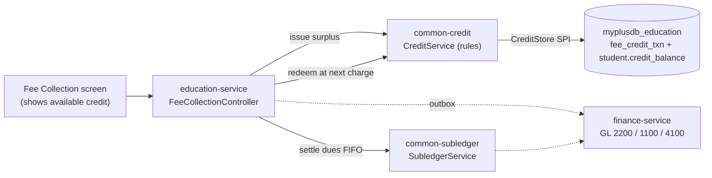
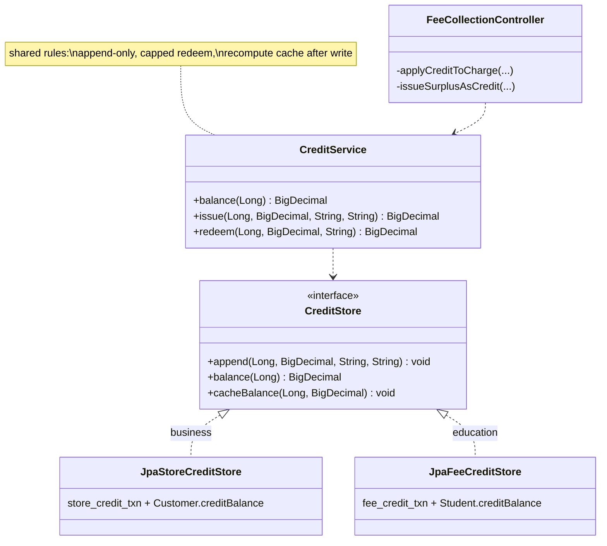

# Slice 0.2b — Fee credit (overpayment carried forward)

**Status: DONE — headed Cypress GREEN (2026-07-31), POS regressions green.**
Follows 0.2a (fees→AR, green). Programme: `education-complete-programme.md` Phase 0.2.

---

## 1. Document — what and why

0.2a **refuses** an overpayment: *"Payment 5000 exceeds the total owed 1000."* That was an honest placeholder,
not a good answer. Guardians routinely pay a round sum, or a term in advance, and a school should take the money
and carry it forward.

**Decision (yours): an overpayment issues fee credit, carried to the next charge.**

POS already has exactly this concept — `StoreCreditService` over a `store_credit_txn` ledger with a cached
`Customer.creditBalance` and GL liability **2200**. Per "keep common what is common", it gets **extracted, not
rebuilt**.

---

## 2. Design

### D1 — Extract `common-credit`

The valuable shared part is not the size of the code, it is the **rules**: a credit ledger is append-only and
signed; a redemption is **capped at the balance** so it can never overdraw; and the cached balance is refreshed
after **every** write. Those are precisely the things a second implementation gets subtly wrong.

```java
// SPI — each service supplies its own table and its own cached-balance owner
public interface CreditStore {
    void       append(Long partyId, BigDecimal signedAmount, String reason, String ref);
    BigDecimal balance(Long partyId);           // org-scoped by the implementation
    void       cacheBalance(Long partyId, BigDecimal balance);
}

// Shared logic — the rules above, and nothing domain-specific
public class CreditService {
    BigDecimal balance(Long partyId);
    BigDecimal issue (Long partyId, BigDecimal amount, String reason, String ref);   // + , returns issued
    BigDecimal redeem(Long partyId, BigDecimal amount, String ref);                  // − , capped, returns taken
}
```

| | business (POS) | education |
|---|---|---|
| ledger table | `store_credit_txn` | **`fee_credit_txn`** (new, Flyway) |
| party | `customerId` | `studentId` |
| cached balance | `Customer.creditBalance` | **`Student.creditBalance`** (new column, Flyway) |
| extra columns | `storeId` | — |

Same SPI pattern as `common-settings`, `common-outbox`, `common-subledger`. Registered by a
`CommonCreditAutoConfiguration` — the scan-root footgun hit in both previous extractions.

### D2 — The one genuine domain difference: how credit is SPENT

This is the only place the behaviour forks, and it is a real business difference, not an inconsistency:

- **POS** — the cashier chooses to apply it: a `STORE_CREDIT` tender at checkout, server-capped.
- **Education** — it is applied **automatically to the next charge**. A guardian should not have to ask for money
  they already paid.

Everything else (ledger, capping, cache, GL account) is identical.

### D3 — GL treatment mirrors store credit exactly

Fee credit is money held on the guardian's behalf — a **liability**, on the same account 2200 POS uses.

```
overpayment (owes 1000, pays 5000):
    Dr Cash 5000   =   Cr 1100 AR 1000   +   Cr 2200 Credit 4000

next month's charge (3000), credit applied first:
    Dr 1100 AR 3000        =   Cr 4100 Fee Income 3000     (the charge, unchanged)
    Dr 2200 Credit 3000    =   Cr 1100 AR 3000             (credit consumed)
```

`postSale` already does the redeem leg as `dr(STORE_CREDIT, sc)` and the issue leg as `cr(STORE_CREDIT, sc)`,
so this reuses the account and the direction convention rather than inventing either.

### D4 — Order of operations at charge time

When a `FEE_CHARGE` is raised and the student holds credit:

1. Raise the receivable (`Dr AR / Cr Fee Income`) — unchanged from 0.2a.
2. Redeem `min(credit, charge)` and settle that much of the new due immediately.
3. Whatever remains outstanding is what the guardian actually owes.

Credit is consumed **oldest-charge-first** through the same subledger path, so the FIFO story stays intact.

### D5 — What replaces the refusal

`checkOverpayment` stops refusing. The surplus becomes credit:

```
tendered 5000, owed 1000  →  settle 1000 through the subledger
                          →  issue 4000 fee credit
                          →  response reports both
```

The clerk sees what was applied and what was carried forward, so the money is never silently absorbed.

### Layer answers (§5b)

| Layer | Answer |
|---|---|
| **UI/UX** | the fee screen shows a student's **available credit** before collection, and the response states what was carried forward. Without that the guardian has no way to know it exists |
| **Service/API** | no new endpoint; credit rides `addFc`. One read for the balance |
| **Database** | MySQL — `fee_credit_txn` is an append-only signed ledger with a cached balance, the same shape that already works for POS. Stated per §5c |
| **Patterns** | append-only ledger + cached projection; SPI/DIP for the shared rules |
| **Microservice design** | extract-then-compose; each service keeps its own table |
| **Configurability** | **`edu.fee.creditOnOverpayment`** (default ON). Off ⇒ 0.2a's refusal. Some schools genuinely will not hold guardian money |
| **DRY** | the whole justification for D1 |

---

## 3. Architecture & UML

### Architecture



### Class diagram



### Sequence — overpay now, consumed next month

```mermaid
sequenceDiagram
  actor Clerk
  participant EDU as education-service
  participant SUB as SubledgerService
  participant CR as CreditService
  participant FIN as finance-service

  Note over Clerk,FIN: March — owes 1000, pays 5000
  Clerk->>EDU: addFc (tender 5000)
  EDU->>SUB: settle 1000 across open dues
  EDU->>CR: issue 4000 credit
  EDU->>FIN: Dr Cash 5000 = Cr AR 1000 + Cr 2200 Credit 4000
  EDU-->>Clerk: "1000 applied, 4000 carried forward"

  Note over Clerk,FIN: April — charge 3000
  Clerk->>EDU: addFc (charge 3000, tender 0)
  EDU->>FIN: Dr AR 3000 = Cr Fee Income 3000
  EDU->>CR: redeem min(4000, 3000) = 3000
  EDU->>SUB: settle 3000 against the new due
  EDU->>FIN: Dr 2200 Credit 3000 = Cr AR 3000
  EDU-->>Clerk: "paid from credit; 1000 credit remains"
```

---

## 4. Implement — checklist

- [ ] `common-credit` module: `CreditStore` SPI, `CreditService`, `CommonCreditAutoConfiguration` + `.imports`
- [ ] `business-service`: `StoreCreditService` refactored onto `CreditService` + a `JpaStoreCreditStore`
      — **behaviour unchanged**; the store-credit specs are the gate
- [ ] `education-service`: `FeeCreditTxn` entity + repo + `JpaFeeCreditStore`; `Student.creditBalance`
- [ ] `education-service`: Flyway `V9` — `fee_credit_txn` (indexed `(organization_id, student_id)`) +
      `student.credit_balance`
- [ ] `education-service`: overpayment issues credit (replaces the refusal); `FEE_CHARGE` consumes credit first
- [x] `finance-service`: `FEE_CREDIT_ISSUED` (Dr Cash = Cr 2200) + `FEE_CREDIT_APPLIED` (Dr 2200 = Cr AR)
- [x] `common-subledger`: `allocate()` extracted from `settle()` — spending credit must reduce dues WITHOUT
      recording a second cash receipt, or the same money counts as received twice
- [x] `education-service`: the cash receipt is capped at `min(tendered, owed)`; the surplus posts as a liability
- [ ] `common-settings`: `edu.fee.creditOnOverpayment` (default ON), read on the path it governs (C1)
- [ ] UI: show available credit on the fee screen; report what was carried forward
- [ ] tests: capped-redeem + issue/balance (pure) · Cypress `education/fee-credit.cy.js`

## 5. Test

| # | Case | Expected |
|---|---|---|
| 1 | Owes 1000, pays 5000 | due cleared; credit 4000; response says so |
| 2 | Next charge 3000 | 3000 taken from credit; 1000 credit left; nothing owed |
| 3 | Charge 3000 with only 1000 credit | credit emptied; 2000 still owed |
| 4 | Redeem more than the balance | capped — balance never goes negative |
| 5 | GL after case 1 | `Dr Cash 5000 = Cr AR 1000 + Cr 2200 4000`, balanced |
| 6 | Setting OFF | reverts to 0.2a's refusal (C4 — verify the OFF path works) |
| 7 | POS store credit unchanged | **regression** — `business/store-credit*.cy.js` |
| 8 | Credit is per student and per tenant | no leakage across students or orgs |

## 6. Risks

- **Touches POS's live store credit.** The refactor is behaviour-preserving, but `store-credit*.cy.js` is a hard
  gate, exactly as the finance suite was for 0.2a.
- **Holding guardian money is a real liability.** Account 2200 must balance; case 5 is not optional.
- **Refunding credit** (a guardian leaves, wanting it back) is **out of scope** — state it, do not silently imply it.
