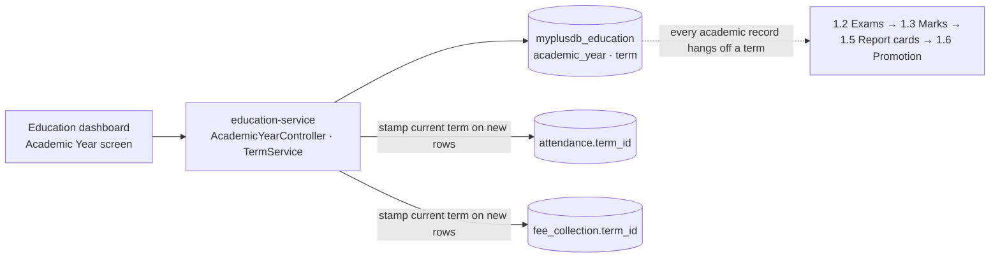
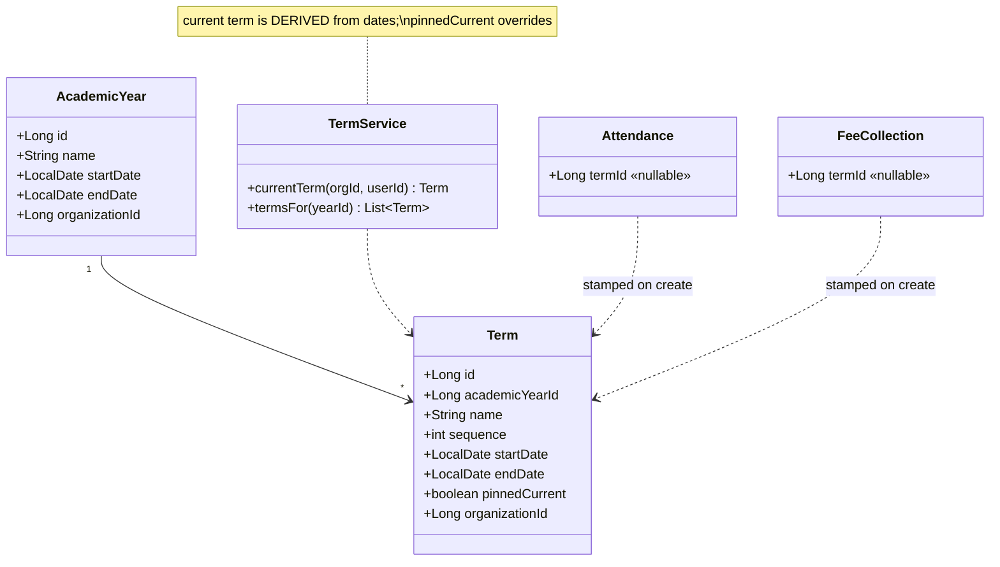
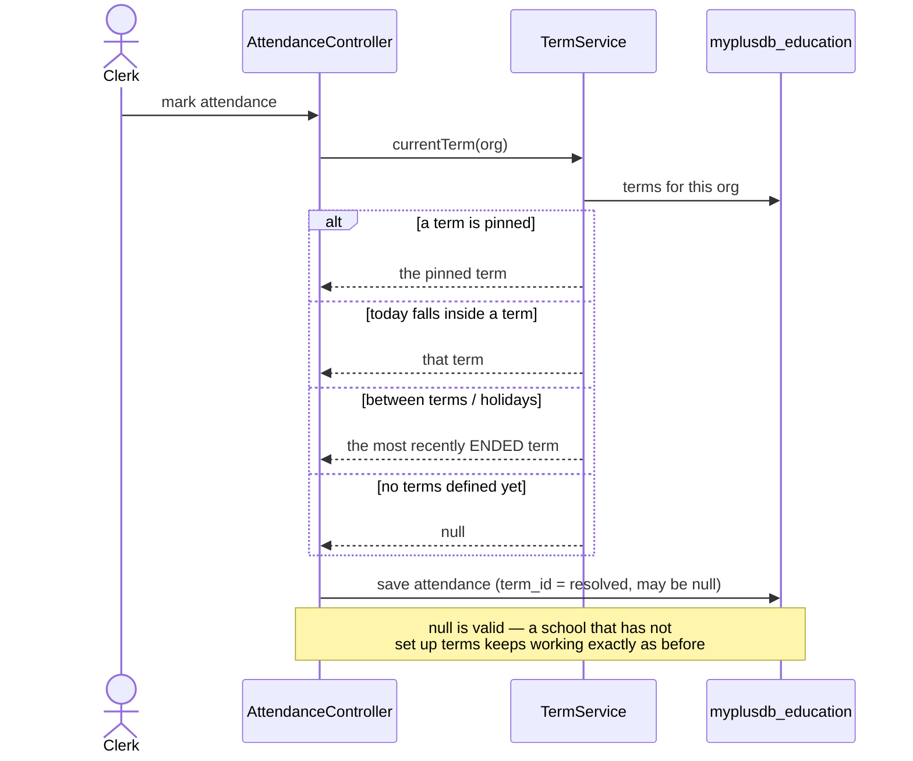

# Slice 1.1 — Academic year & term (the Phase 1 keystone)

**Status: ✅ DONE — `mvn test` + Cypress gate GREEN.** (Programme row 1.1 ✅, "all six green".)
Programme: `education-complete-programme.md` Phase 1.1. First slice of the academic record.

---

## 1. Document — what and why

Phase 1 builds the academic record: exams → marks → grading → report cards → promotion. Every one of those
answers a question that starts with **"in which term?"**

- an exam belongs to a term ("Term 2 mid-year")
- a mark belongs to an exam, therefore to a term
- a report card covers a term, and a transcript spans years
- promotion happens at the **end of a year**
- attendance and fee reporting are asked for per term ("this term's attendance", "Term 1 dues")

Today there is **no such concept**. The closest thing is `Student.ys` / `ys` → `year_start` / `year_end`, which
are per-student enrolment dates — they say when *this child* joined, not what year the *school* is running.

**Why first.** Build exams and marks before this and the term column gets retrofitted into five tables later,
each with its own migration and backfill. The programme calls this the keystone for that reason. It is also the
smallest slice in Phase 1, so the retrofit cost is entirely avoidable.

**What it does NOT do:** no exams, no marks, no reporting changes. It creates the spine those hang off.

---

## 2. Design

### D1 — Two entities, not one

```
AcademicYear   "2026-27"   startDate, endDate                (org-scoped)
   └── Term    "Term 1"    sequence, startDate, endDate
```

A single entity conflating them cannot express *"the third term of 2026-27"*, and promotion is a year-level
event while exams are term-level. Two entities keep both expressible. A school running one term a year simply
creates one.

### D2 — The owner defines the structure; there is no term-count setting

Schools differ: two semesters, three terms, four quarters. The temptation is a `edu.term.count` setting — but the
**entity is the configuration**. The owner creates the terms they run, names them as they name them, and nothing
in the code assumes a number. A config toggle here would be a second, weaker way to say the same thing (C1: it
would change nothing that creating a term does not already change).

### D3 — "Current term" is DERIVED from dates, with an explicit override

Same lesson as the pharmacy `EXPIRED` decision: a date comparison is true the moment it becomes true, whereas a
stored `isCurrent` flag needs a nightly job that can silently stop running and leave a school marking attendance
into last term.

```
current term = the term whose [startDate, endDate] contains today
             → if none (holidays, gap between terms), the most recently ended term
             → an explicit `pinnedCurrent` term, when set, WINS over both
```

The override exists because a real school sometimes keeps a term open past its end date to finish entering
marks. Pinning is deliberate and visible; a silently wrong date is not.

### D4 — Existing records get a NULLABLE term, and are NOT backfilled

`Attendance` and `FeeCollection` gain `term_id`, nullable. New rows are stamped with the current term; existing
rows stay null.

**Deliberately no backfill.** Guessing which term a two-year-old attendance row belonged to means inventing
history — and D5 of the DB standards says never to act on inference about live data. Reports treat null as
"before terms existed" and still show the row.

### D5 — Scope

| In | Out |
|---|---|
| `AcademicYear` + `Term` entities, CRUD, org-scoped | exams, marks (1.2/1.3) |
| current-term resolution (D3) | changing any existing report |
| nullable `term_id` on `Attendance` + `FeeCollection`, stamped on new rows | backfilling old rows |
| Academic Year screen (list/add, set current) | promotion (1.6 — needs marks) |

### Layer answers (§5b)

| Layer | Answer |
|---|---|
| **UI/UX** | one Academic Year screen: years, their terms, which is current. Admin-facing — this is structure, not daily work |
| **Service/API** | `/getAcademicYears`, `/addAcademicYear`, `/addTerm`, `/getCurrentTerm`; `ADMIN_PRIVILEGE` per D-3 (structure tier) |
| **Database** | MySQL — small, relational, read constantly by later slices. `(organization_id)` indexed per D3; `term_id` indexed on the two stamped tables |
| **Patterns** | derive-don't-store (D3), nullable FK for additive change, DTOs at the boundary |
| **Microservice design** | wholly education's domain — no cross-service call, nothing to compose |
| **Configurability** | none, deliberately — see D2. The entity IS the configuration |
| **DRY** | current-term resolution lives in ONE service method; no controller re-derives it |

---

## 3. Architecture & UML

### Architecture



### Class diagram



### Sequence — resolving the current term



---

## 4. Implement — checklist

- [x] `AcademicYear` + `Term` entities, repositories (org-scoped `findScoped` + `findByIdScoped`, indexed)
- [x] `TermService.currentTerm()` — the single place the rule lives (D3), with `resolveCurrent()` split
      out as a **pure static** so every branch is testable without a database
- [x] Flyway `V10` — `academic_year`, `term`, `attendance.term_id`, `fee_collection.term_id` (all
      nullable; the two `ALTER`s are guarded on `information_schema` so the script stays re-runnable)
- [x] `AcademicYearController` — CRUD + `/getCurrentTerm` + `/pinCurrentTerm`, `ADMIN_PRIVILEGE` on
      writes, `DELETE_PRIVILEGE` on deletes
- [x] stamp `term_id` on new `Attendance` and `FeeCollection` rows — resolved **once per batch**, and
      only when the row has no term yet, so an existing stamp is never rewritten
- [x] monolith proxy + Academic Year screen + 9 i18n keys × 6 bundles (verified aligned, no U+FFFD)
- [x] tests: `TermServiceTest` (8 cases, pure) + Cypress `education/academic-year.cy.js` (7 cases)

## 5. Test

| # | Case | Expected |
|---|---|---|
| 1 | Today inside Term 2 | `currentTerm` = Term 2 |
| 2 | Today between terms | the most recently ended term |
| 3 | A term is pinned, today sits in another | the pinned one wins |
| 4 | No terms defined | null — and marking attendance still works |
| 5 | New attendance while Term 2 is current | `term_id` = Term 2 |
| 6 | Pre-existing attendance rows | `term_id` still null, row still listed |
| 7 | Another tenant's years | invisible (org-scoped) |
| 8 | A teacher tries to add a year | 403 — structure is the ADMIN tier (D-3) |

Gate: `cypress/e2e/education/academic-year.cy.js`.
**Regression:** `education/attendance.cy.js`, `fees-to-gl.cy.js` — both write to tables gaining a column.

## 6. Risks

- **Two live tables gain a column.** Additive and nullable, so existing rows and code paths are unaffected — but
  the attendance and fee specs are the gate that proves it.
- **Null term is a legitimate state**, forever. Any later slice that assumes a term exists must handle null, or a
  school that has not set terms up breaks. Report cards (1.5) will need a decision here.
