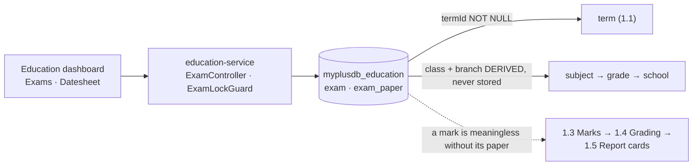
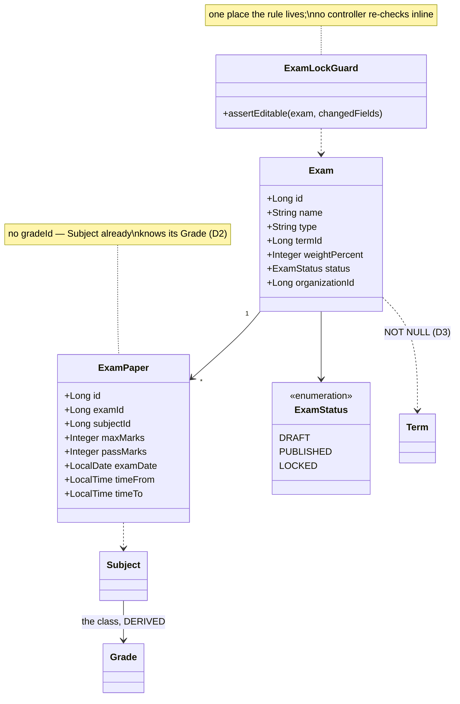
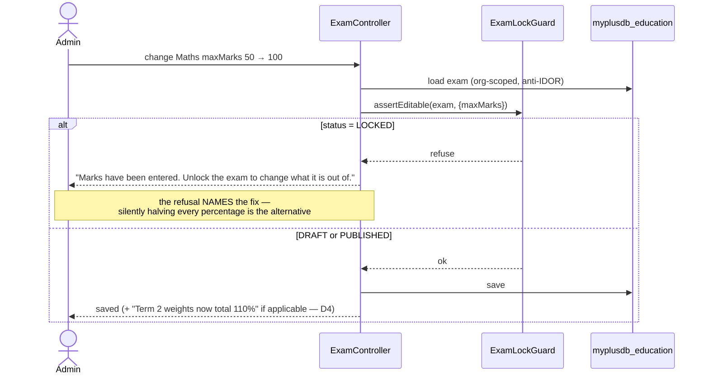

# Slice 1.2 — Examinations

**Status: IMPLEMENTED — awaiting `mvn` verification + the Cypress gate.**
Programme: `education-complete-programme.md` Phase 1.2. Depends on **1.1** (academic year & term), which is done.
Feeds 1.3 (marks entry) → 1.4 (grading scales) → 1.5 (report cards).

---

## 1. Document — what and why

1.1 built the spine: every academic record answers *"in which term?"*. This slice builds the thing marks are
recorded **against**.

Today `education-service` has 19 entities and not one of them represents an assessment. A school can register
students, mark attendance and collect fees, but there is nowhere to say *"Term 2 Mid-Term, Mathematics, out of
50, on 14 November"*. Marks entry (1.3) cannot be built until that exists — a mark is meaningless without the
paper it belongs to and the maximum it is out of.

**What this slice does NOT do:** no marks, no grades or GPA, no report cards, no pass/fail computation. It
defines the assessments; 1.3 fills them in.

### What already exists that this must fit

| Existing | Consequence for this design |
|---|---|
| `Subject` has `@ManyToOne Grade grade` | a subject is ALREADY class-specific — "Maths for Class 5" is a different row from "Maths for Class 6" |
| `Term` (1.1), nullable on stamped rows | an exam must sit in a term, so a school with no terms cannot create exams — D3 |
| `Grade` carries `schoolId` (branch) | branch scoping is derivable through subject → grade → school, no new column |
| D-3 privilege map | exam definition decides what marks are possible → **ADMIN tier** |

---

## 2. Design

### D1 — Two levels: the exam, and its papers

```
Exam        "Mid-Term"  · term · type · weight%        (one per term, school-wide)
   └── ExamPaper   · subject · maxMarks · passMarks · date · time
```

A single flat "exam row per subject" cannot express *"the mid-term counts for 30% of Term 2"* without repeating
that weight on every subject row, where the copies immediately disagree. Splitting the event from its papers
also matches how a school actually works: one exam is announced, then a datesheet of papers is published.

### D2 — The class is DERIVED from the subject, never stored again

`ExamPaper` holds `subjectId` and **no `gradeId`**. `Subject` already has a `Grade`, so storing the class again
would create a second source of truth that can contradict the first — the exact failure the branch-scope slice
avoided by deriving Staff→`grades`→`Grade.schoolId` rather than adding a column.

This means one `Exam` naturally spans the whole school: its papers reference subjects from any class, and
"Class 5's datesheet" is a filter, not a separate exam.

### D3 — An exam REQUIRES a term, and that is a visible consequence of 1.1

1.1 made `term_id` nullable everywhere on purpose: a school that has not set terms up must keep working.
Exams are where that stops being true — *"which term does this exam count toward?"* has no sensible default,
and guessing would silently attach results to the wrong reporting period.

So `Exam.termId` is **NOT NULL**, and the UI must say *"Create an academic year and term first"* rather than
present a form that fails on submit. This is the first place 1.1's null-is-valid rule meets a hard requirement,
and it is better to state it than to let a nullable column imply otherwise.

### D4 — Weight belongs to the exam; marks belong to the paper

| Field | Lives on | Why |
|---|---|---|
| `weightPercent` | `Exam` | "the mid-term is 30% of the term" is a property of the exam, not of Maths |
| `maxMarks`, `passMarks` | `ExamPaper` | Maths out of 100 and Drawing out of 50 in the same exam is normal |

**Weights are validated as a WARNING, not a block.** If a term's exams sum to 90% or 110% the save succeeds and
the screen says so. Schools genuinely run terms mid-setup, and a hard block would make the system unusable for
the week between creating the mid-term and creating the final. 1.5 (report cards) is where a wrong total
actually matters, and it can refuse there with the full picture.

### D5 — LOCK the definition instead of auditing every edit

Changing `maxMarks` from 50 to 100 after marks are entered silently halves every student's percentage. No error,
no trace, and report cards that disagree with the marksheets printed last week.

The programme's answer for 1.3 is auditing every marks edit through `audit-service`. For the *definition* a lock
is both cheaper and stronger — an audit trail tells you afterwards who broke it; a lock stops it.

```
DRAFT ──publish──► PUBLISHED ──first mark entered (1.3)──► LOCKED
                       ▲                                      │
                       └──────── explicit unlock (ADMIN) ─────┘
```

`LOCKED` refuses changes to `maxMarks`, `passMarks`, `subjectId` and `termId` — the fields that restate existing
marks. Name, date and time stay editable, because rescheduling a paper harms nothing. Unlock is deliberate,
ADMIN-only, and the audit hook 1.3 introduces should cover it.

**This slice ships the lock; 1.3 sets it.** Defining the states now means 1.3 does not have to retrofit a column
into a table that already has rows.

### D6 — Exam type is free text, not a setting and not a table

The temptation is an `exam_type` catalog or an `edu.exam.types` setting. Both are the mistake D2 of slice 1.1
warned about: the entity already expresses it. A school that runs "Mid-Term", "Pre-Board" and "Unit Test 3"
types those names; nothing in the code branches on the value.

The form offers a `<datalist>` of common values so the field is discoverable without constraining it. If
reporting later needs to group by type across schools, promote it then — with a real requirement rather than a
guess.

### D7 — Scope

| In | Out |
|---|---|
| `Exam` + `ExamPaper` entities, org-scoped CRUD | marks, grades, GPA, pass/fail (1.3, 1.4) |
| exam ↔ term ↔ subject wiring, derived class | report cards, transcripts (1.5) |
| `DRAFT`/`PUBLISHED`/`LOCKED` states + the lock guard | audit-service wiring (arrives with 1.3) |
| weight-total warning (D4) | exam **eligibility** by attendance % (see §6) |
| datesheet read: papers for a class, ordered by date | seating plans, invigilators, room allocation |
| Exams screen + i18n × 6 | |

### Layer answers (§5b)

| Layer | Answer |
|---|---|
| **UI/UX** | one Exams screen under Register: create the exam, then add papers to it. A datesheet view filtered by class — that is what a school actually pins to the noticeboard |
| **Service/API** | `/getExams`, `/addExam`, `/addExamPaper`, `/getDatesheet`, `/setExamStatus`; writes `ADMIN_PRIVILEGE`, deletes `DELETE_PRIVILEGE` (D-3) |
| **Database** | MySQL — small, relational, read constantly by 1.3/1.5. Indexes on `(organization_id)`, `(term_id)`, `(exam_id)`, and `(organization_id, term_id)` for the term filter every later slice runs |
| **Patterns** | derive-don't-store (D2), state machine with a guard (D5), warning-not-block validation (D4), DTOs at the boundary |
| **Microservice design** | wholly education's domain — nothing to compose. `audit-service` enters at 1.3, where the sensitive data (marks) appears |
| **Configurability** | none, deliberately — D6. Adding a setting here would be a second, weaker way to say what the entity already says |
| **DRY** | the lock rule lives in ONE guard method, the way 1.1's current-term rule lives in one `resolveCurrent`. No controller re-checks the status inline |

---

## 3. Architecture & UML

### Architecture



### Class diagram



### Sequence — editing a paper after marks exist



---

## 4. Implement — checklist

- [x] `Exam` + `ExamPaper` entities; `ExamStatus` enum stored as `@Enumerated(STRING)`
      — **needs an `ALTER … MODIFY enum` if a value is ever added**, see `project_enum_string_mysql_enum_migration`
- [x] Repositories: `findScoped`, `findByIdScoped`, `findByTermScoped`, `findPapersByExamScoped`
- [x] `ExamLockGuard.assertEditable(exam, changedFields)` — the single home of the D5 rule
- [x] Flyway `V11` — `exam`, `exam_paper`, indexes per D3 of the DB standards
- [x] `ExamController` — CRUD + `/getDatesheet` + `/setExamStatus`; `ADMIN_PRIVILEGE` writes, `DELETE_PRIVILEGE` deletes
- [x] weight-total warning returned in the save response (not a separate call)
- [x] guard: refuse `addExam` with a clear message when the tenant has **no terms** (D3)
- [x] monolith proxy + Exams screen + datesheet view + i18n × 6 bundles
- [x] tests: `ExamLockGuardTest` (pure, every field × every status) + `cypress/e2e/education/exams.cy.js`

## 5. Test

| # | Case | Expected |
|---|---|---|
| 1 | Create an exam in Term 2, add three papers | all three come back on the exam, ordered by date |
| 2 | Create an exam when the tenant has **no terms** | refused, message names the fix (D3) |
| 3 | Datesheet for Class 5 | only papers whose subject belongs to Class 5 — proves the derived class (D2) |
| 4 | Edit `maxMarks` while `DRAFT` | allowed |
| 5 | Edit `maxMarks` while `LOCKED` | refused; message tells the admin to unlock |
| 6 | Edit `examDate` while `LOCKED` | **allowed** — rescheduling restates nothing (D5) |
| 7 | Term exams summing to 110% | saved, with a warning in the response (D4) |
| 8 | Another tenant's exam by id | refused (org-scoped, anti-IDOR) |
| 9 | A teacher (`user.education@`) creates an exam | 403 — ADMIN tier (D-3) |
| 10 | Delete an exam that has papers | papers go with it; no orphans left behind |

Gate: `cypress/e2e/education/exams.cy.js`.
**Regression:** `education/academic-year.cy.js` (terms gain a dependent), `privilege-map.cy.js` (new ADMIN endpoints).
Pure unit: the lock matrix — it is a truth table, so it belongs in `mvn test`, not in Cypress.

## 6. Open decision — exam eligibility by attendance

The programme lists *"minimum % attendance for exam eligibility"* against 0.4/1.2 as a per-board configurable.
**Deliberately not in this slice.** Eligibility is a rule about a *student versus a paper*, so it has nowhere to
live until marks entry exists — and it is the first genuinely jurisdiction-specific rule in Phase 1, which makes
it a `common-settings` question tied to blocking decision **D-1 (jurisdiction)**.

Recommendation: land it in **1.3**, where the student × paper pairing exists and the rule has something to
refuse. Flagging it here so it is not silently forgotten between slices.

## 7. Risks

- **The lock is only as good as 1.3 setting it.** This slice ships the mechanism but nothing sets `LOCKED` until
  marks entry exists, so between 1.2 and 1.3 the guard is inert. Test 5 proves the guard works; it cannot prove
  the transition fires. 1.3's checklist must include it.
- **Weight totals are a warning (D4).** A school can reach 1.5 with a term summing to 90% and get quietly wrong
  report cards. 1.5 must refuse rather than compute — noting it here so the requirement travels.
- **`@Enumerated(STRING)` + MySQL enum.** Adding a status later needs an `ALTER … MODIFY`; `ddl-auto` will not
  do it and fails with "Data truncated". Known trap, already bitten once on this platform.
- **One exam spanning the school (D2)** means deleting an exam touches every class's datesheet. Test 10 covers
  the cascade; the UI should confirm with the paper count, not a bare "are you sure".
