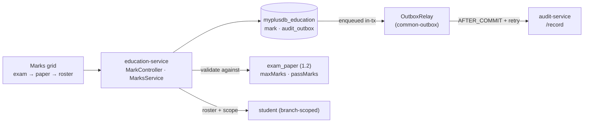
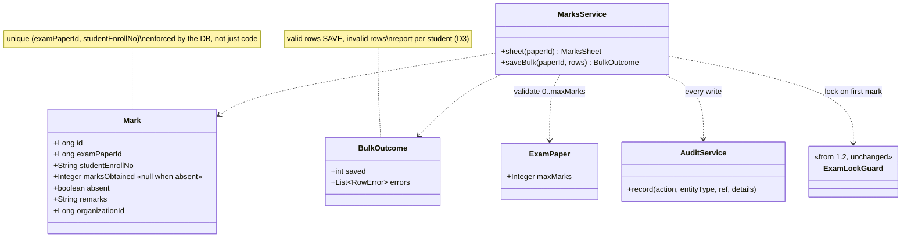
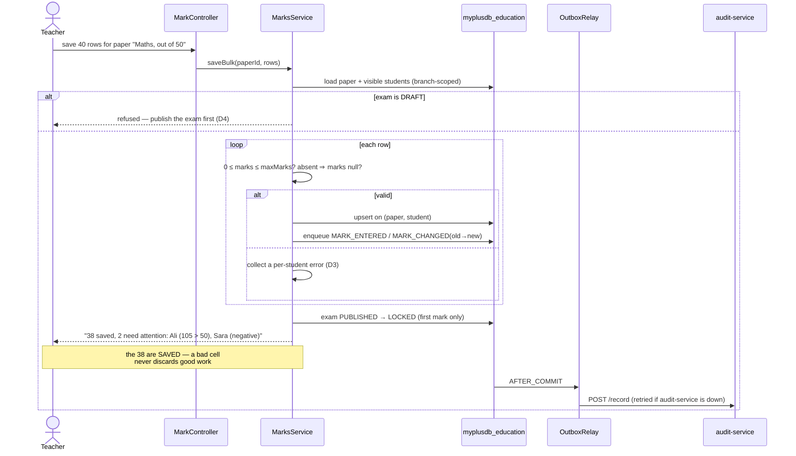

# Slice 1.3 — Marks entry

**Status: IMPLEMENTED — awaiting `mvn` verification + the Cypress gate.**
Programme: `education-complete-programme.md` Phase 1.3. Depends on **1.2** (examinations), which is done.
Feeds 1.4 (grading scales) → 1.5 (report cards) → 1.6 (promotion).

---

## 1. Document — what and why

1.1 gave every academic record a term. 1.2 gave marks something to be recorded *against*. This slice records
them — and it is the first slice in this programme where the data is **a claim about a child that follows them
for years**. A wrong fee is refunded; a wrong mark on a transcript is discovered at university admission.

That difference drives every decision below. Marks entry is not CRUD with a different noun.

**What this slice does NOT do:** no grades, GPA or bands (1.4 — this stores the raw number), no report cards
(1.5), no promotion (1.6), no pass/fail *rendering* — though the pass mark from 1.2 is stored per paper and
compared, the decision of what a fail *means* is 1.4's.

### Three commitments this slice inherits from 1.2

| From | Commitment | Where it lands here |
|---|---|---|
| 1.2 §7 | "the lock is inert until 1.3 sets it" | **D4** — first mark entered transitions the exam to `LOCKED` |
| 1.2 D5 | "the audit hook 1.3 introduces should cover unlock" | **D5** — every marks write AND every status change audited |
| 1.2 §6 | exam eligibility by attendance %, tied to blocking decision **D-1** | **§6** — still deferred, with reasoning |

---

## 2. Design

### D1 — One row per student × paper, and the paper is the unit of work

```
Mark   · examPaperId · studentEnrollNo · marksObtained · absent · remarks
```

A teacher marks **one paper for one class at a time** — that is how a marksheet arrives on their desk. So the
screen is a grid of students for a chosen paper, saved in one submit, exactly like `markAttendanceBulk`.

`(examPaperId, studentEnrollNo)` is **unique**. Re-saving the grid updates in place rather than appending, so a
double-click cannot create two marks for one child. This is enforced by a DB constraint, not just by code —
the constraint is what makes it true under concurrency.

### D2 — Absent is a first-class state, NOT zero

A zero means "sat the paper and scored nothing". An absent student did not sit it. Conflating them corrupts
every average 1.4 computes and every report card 1.5 prints, and it cannot be recovered afterwards.

So `absent` is a boolean, and when it is true `marksObtained` is **null**. 1.4 decides whether absent counts as
zero for an average — a policy question — but it can only decide that if the data kept them distinct.

### D3 — Marks are validated against the paper, and the refusal is per-row

`marksObtained` must be `0 ≤ marks ≤ paper.maxMarks`. A grid of 40 students is submitted at once, so:

- rows that are valid **save**; rows that are not are **reported back per student**
- the response names each rejected student and why

Rejecting the whole batch because one cell says `105` would lose 39 correct entries and teach teachers to
distrust the save button. Accepting `105` silently is worse. Per-row is the only honest option.

### D4 — The first mark LOCKS the exam (1.2's inert mechanism, activated)

The moment a mark exists, the exam definition can restate results, so `ExamStatus` moves to `LOCKED`
automatically on the first successful mark write.

```
PUBLISHED ──first mark saved──► LOCKED
```

**Deliberately automatic, not a button.** Relying on an admin to lock it means the window between "marks
entered" and "someone remembered" is exactly when `maxMarks` gets edited. The guard from 1.2 already refuses
the dangerous edits; this closes the gap where it was never switched on.

An exam still in `DRAFT` **refuses** marks — marks against an unpublished definition mean the datesheet the
students saw was not the one they were graded on.

### D5 — Every marks write is audited, through the outbox that already exists

The programme calls for `audit-service` here, and this is the right place: marks are the first data on this
platform where *who changed what, and when* matters months later.

**Reuse, do not rebuild.** business-service already audits through `common-outbox` — enqueue in-transaction,
deliver AFTER_COMMIT, retry via the shared `OutboxRelay`, with `AuditClient` from `commerce-contracts`.
education already has `common-outbox` (slice 0.1's `gl_outbox`). So this slice adds an `audit_outbox` table and
the same `OutboxDelivery` channel — no new pattern, no new service, no direct HTTP call on the write path.

Audited events:

| Action | Why it matters |
|---|---|
| `MARK_ENTERED` | the original claim |
| `MARK_CHANGED` | **carries the old value and the new** — the one that answers "was this altered?" |
| `EXAM_LOCKED` / `EXAM_UNLOCKED` | unlocking re-opens results to restatement (1.2's commitment) |

A **change** is materially different from an entry, so it is a separate action carrying both values. An audit
that only records the new number cannot answer the question anyone actually asks.

### D6 — Who may enter marks: WRITE, but only for their own class

Marks entry is **day-to-day teacher work**, so it sits in the `WRITE_PRIVILEGE` tier — not ADMIN. Defining the
exam is ADMIN (1.2); filling it in is not.

But the existing branch-scope machinery already answers a sharper question. `visibleStudents()` scopes to the
teacher's campus, and `Subject → Grade` gives the paper's class. So a teacher may enter marks for a paper whose
class is one they can see — reusing the rule, adding no new concept.

**Deliberately NOT a new "class teacher" assignment model.** That is a real feature, but it needs staff↔class
ownership that does not exist yet, and inventing it here would couple this slice to an HR concern. Recorded as a
follow-on.

### D7 — Scope

| In | Out |
|---|---|
| `Mark` entity, unique per (paper, student), org-scoped | grades, GPA, bands, pass/fail meaning (1.4) |
| bulk grid save with per-row validation (D3) | report cards, transcripts (1.5) |
| absent as a distinct state (D2) | promotion (1.6) |
| auto-`LOCKED` on first mark (D4) | class-teacher ownership model (D6, follow-on) |
| `audit_outbox` + 4 audited actions (D5) | eligibility by attendance % (§6) |
| marks grid screen + i18n × 6 | re-mark / re-check workflow (§6) |

### Layer answers (§5b)

| Layer | Answer |
|---|---|
| **UI/UX** | pick exam → paper → the class roster appears with a marks box per student, an Absent checkbox, and the max marks shown in the header. One Save. Per-row errors land next to the student, not in a banner |
| **Service/API** | `/getMarksSheet` (roster + existing marks), `/saveMarksBulk`, `/getStudentMarks`; `WRITE_PRIVILEGE` + branch scope (D6) |
| **Database** | MySQL — relational, unique-constrained, read per paper and per student. Indexes `(organization_id)`, `(exam_paper_id)`, unique `(exam_paper_id, student_enroll_no)`, and `(organization_id, student_enroll_no)` for 1.5's transcript read |
| **Patterns** | bulk-write with per-row outcome (D3), transactional outbox for audit (D5), state transition on first write (D4), derive-don't-store for the class |
| **Microservice design** | composes `audit-service` via `commerce-contracts` + `common-outbox` — the 2nd service education composes, after Party. Marks themselves stay in education: they are its core domain, not a cross-cutting capability |
| **Configurability** | none in this slice. Grading bands and absent-counts-as-zero are 1.4's, and belong in common-settings there — putting a half-answer here would be a second place to look |
| **DRY** | `visibleStudents()` reused for scope; `OutboxRelay`/`OutboxDelivery` reused for audit; `ExamLockGuard` reused unchanged — this slice writes no new guard |

---

## 3. Architecture & UML

### Architecture



### Class diagram



### Sequence — a teacher saves a marksheet



---

## 4. Implement — checklist

- [x] `Mark` entity + repository (`findByPaperScoped`, `findByStudentScoped`, `findByIdScoped`)
- [x] Flyway `V12` — `mark` with **UNIQUE (exam_paper_id, student_enroll_no)** + indexes; `audit_outbox`
- [x] `MarksService.saveBulk()` — per-row validation, upsert, absent handling, first-mark lock
- [x] `education` `AuditService` over `common-outbox` + `AuditClient` bean (mirror `TradeClientsConfig`)
- [x] `MarkController` — `/getMarksSheet`, `/saveMarksBulk`, `/getStudentMarks`; `WRITE_PRIVILEGE` + branch scope
- [x] audit `EXAM_LOCKED` / `EXAM_UNLOCKED` in 1.2's `setExamStatus` (the deferred commitment)
- [x] monolith proxy + marks grid screen + i18n × 6 bundles
- [x] tests: `MarksValidationTest` (pure: bounds, absent, per-row outcome) + `cypress/e2e/education/marks.cy.js`

## 5. Test

| # | Case | Expected |
|---|---|---|
| 1 | Save 40 valid rows | 40 saved; re-reading the sheet returns them |
| 2 | Re-save the same sheet with one changed | **updates in place** — no duplicate row (the unique constraint) |
| 3 | One row exceeds `maxMarks` | that row rejected **by student name**; the others still saved (D3) |
| 4 | Negative marks | rejected, same shape |
| 5 | Absent ticked | stored `absent=true`, `marksObtained` **null** — not 0 (D2) |
| 6 | First mark on a `PUBLISHED` exam | exam becomes `LOCKED` (D4) |
| 7 | Marks on a `DRAFT` exam | refused, message says to publish first |
| 8 | Edit `maxMarks` after marks exist | refused by 1.2's guard — **proves the lock is now live**, not inert |
| 9 | Changing an existing mark | `MARK_CHANGED` audited with **old and new** values |
| 10 | audit-service down during a save | marks still save; event stays PENDING and delivers on recovery |
| 11 | Another tenant's paper | refused (org-scoped, anti-IDOR) |
| 12 | A teacher enters marks | allowed (WRITE tier) — the gate must not lock out its own users |

Gate: `cypress/e2e/education/marks.cy.js`.
**Regression:** `exams.cy.js` (exams now get locked by this slice), `attendance.cy.js` (shares `visibleStudents`),
`privilege-map.cy.js` (new WRITE endpoints).
Pure unit: the validation matrix — bounds × absent × existing-row — belongs in `mvn test`.

## 6. Open decisions — deliberately deferred

**Eligibility by attendance %** (1.2 §6 carried forward). Now that student × paper exists it *could* live here,
but it remains a **jurisdiction rule** tied to blocking decision **D-1**: which board, what threshold, and
whether shortfall blocks the exam or merely flags it. Recommend 1.4, where grading policy and its
`common-settings` group are being built anyway — one configuration screen rather than two.

**Re-mark / re-check workflow.** A parent disputes a mark; the paper is re-evaluated; the mark changes. The
audit trail (D5) already records it, but a formal request → review → revised-mark flow is a process, not a
field. Out of Phase 1; revisit with the parent portal (Phase 3), where the request would originate.

**Marks import from a spreadsheet.** Real schools have them. Deferred until the grid is proven — an importer
that writes through the same `saveBulk` path is a small addition later, whereas building both at once doubles
the surface being validated for the first time.

## 7. Risks

- **This slice makes 1.2's lock real.** Until now no exam could reach `LOCKED`, so nobody has met the guard.
  The first schools to use it may find a legitimate need to fix a genuine typo in `maxMarks` — unlock exists for
  exactly that, is ADMIN-only, and is audited. Test 8 proves the refusal; the unlock path needs to be visibly
  documented in the UI or it will read as a dead end.
- **Per-row partial success (D3) is unusual for this codebase.** Every other bulk endpoint here is all-or-nothing.
  The response shape must be unambiguous or the UI will show "saved" over a partial write. `BulkOutcome` carries
  a count *and* the errors precisely so the screen cannot round it to success.
- **Audit delivery is eventually consistent.** A mark is saved before its audit event reaches audit-service. That
  is the correct trade (a marks save must not fail because an audit service is down), but it means the audit log
  is *complete eventually*, not instantly. Worth stating plainly to anyone treating it as a compliance record.
- **Enrolment number as the student key.** `Mark.studentEnrollNo` follows `Attendance.en` and `FeeCollection`,
  which is consistent — but it means renaming a student's enrolment number orphans their marks. That risk already
  exists platform-wide; this slice inherits rather than introduces it. Flagged for a future integrity pass.
