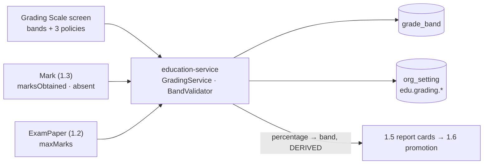
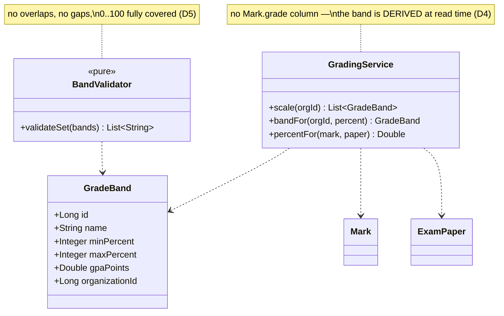
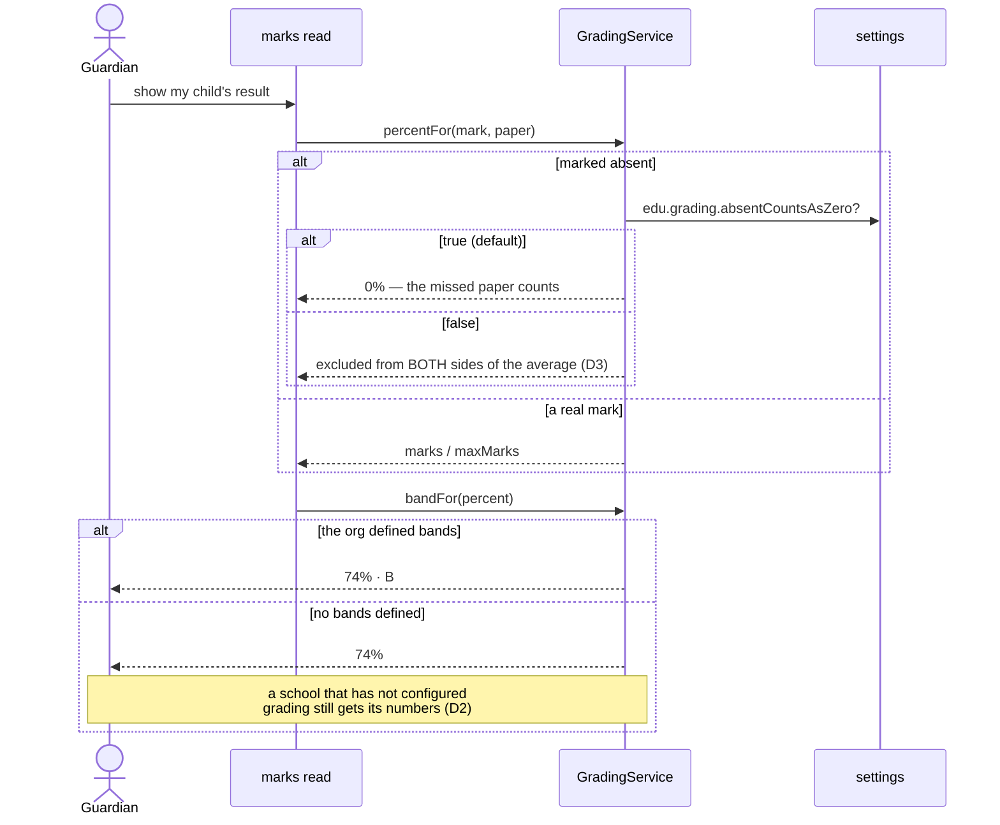

# Slice 1.4 — Grading scales

**Status: DONE — `mvn test` + Cypress gate GREEN (2026-07-31).**
Gate `education/grading.cy.js` (7 cases) passed headed; regression `marks.cy.js`, `exams.cy.js`,
`owner-config.cy.js` green.
Programme: `education-complete-programme.md` Phase 1.4 — *"owner-configurable bands/GPA/pass mark via
common-settings"*. Depends on **1.3** (marks entry), done. Feeds 1.5 (report cards) → 1.6 (promotion).

---

## 1. Document — what and why

1.3 stores the raw number: *37 out of 50*. It deliberately stopped there. This slice answers the question a
guardian actually asks — **"is that good?"** — and it is the first slice in Phase 1 where the right answer differs
per school.

### On D-1: this is NOT blocked, and the plan already said so

The blocking-decisions table lists **D-1 (jurisdiction)** against 1.4. Re-reading what it gates:

> **D-1** — Jurisdiction — grading scale, **statutory return format, TC format** are country/state specific → 1.4, **5.3**

The programme's own answer for 1.4 is *"**owner-configurable** bands/GPA/pass mark"*. Per-org configurability
**is** the resolution: the platform does not need to know which board a school follows, because the school tells
it. D-1 still gates the **statutory return and transfer-certificate formats in phase 5.3**, and it shapes which
**defaults** ship — neither of which prevents building this.

"What defaults ship" is not "can we build it."

### What exists to build on

| Existing | Consequence |
|---|---|
| `Mark.marksObtained` + `absent` kept distinct (1.3 D2) | 1.4 can *decide* whether absent counts as zero — because the data never conflated them |
| `ExamPaper.maxMarks` / `passMarks` (1.2 D4) | a percentage is computable per paper; a per-paper pass mark already exists |
| `Exam.weightPercent` (1.2 D4) | term aggregation is possible — and 1.5 must refuse when it does not total 100 |
| common-settings supports **BOOL, INT, TEXT, SELECT** | scalars only — see D1 |

---

## 2. Design

### D1 — Bands are an ENTITY; policies are settings. The programme's phrase covers both

*"Via common-settings"* means **owner-configurable**, not *"crammed into a settings row"*. A grading scale is a
**list** — `A+ 90–100`, `A 80–89`, … — and `common-settings` stores scalars (BOOL/INT/TEXT/SELECT). Encoding a
band table as a delimited TEXT setting would be a parser nobody can validate and a UI nobody can render.

So the split follows shape, and repeats the lesson from 1.1 D2 and 1.2 D6 — **the entity IS the configuration**
for list-shaped things:

```
GradeBand  (entity, org-scoped)   name · minPercent · maxPercent · gpaPoints · sequence
edu.grading.*  (common-settings)  the scalar POLICIES below
```

| Setting | Type | Default | Why an org changes it |
|---|---|---|---|
| `edu.grading.absentCountsAsZero` | BOOL | **true** | 1.3's deferred question — see D3 |
| `edu.grading.roundHalfUp` | BOOL | true | 74.5% rounds up or it does not; schools disagree |

**CORRECTED BEFORE IMPLEMENTATION — no `edu.grading.passPercent`.** The programme's phrase "bands/GPA/**pass
mark**" implies a global pass percentage, but 1.2 already stores `passMarks` **per paper**, and deliberately so
(1.2 D4: "Maths out of 100 and Drawing out of 50 in the same exam is normal" — pass marks differ per paper for
the same reason maxima do).

Adding a global pass percentage would create **two sources of truth for pass/fail** with nothing to say which
wins — the exact anti-pattern refused in 1.1 D2 (no term-count setting) and 1.2 D6 (no exam-type table).

So this slice contributes the **letter and the GPA only**; pass/fail continues to come from the paper. If a
school later wants a scale-level pass threshold, the honest shape is a `passing` flag on the lowest passing
`GradeBand` — one place, still per-org — not a competing scalar. Deferred until asked for.

Convenient side effect: both surviving settings are BOOL, so `common-settings` needs no new `INT` factory and
the shared library is untouched.

### D2 — A school with no bands still works

If a tenant defines no bands, marks and percentages still compute and display; only the **letter** is absent.
Same rule as 1.1's null term: a school that has not configured the optional thing keeps working. Report cards
(1.5) must render a percentage with no grade rather than refusing.

**No bands are auto-seeded.** Seeding "A/B/C" would impose a jurisdiction the platform deliberately does not
know — and a school that then adds its own would inherit a hidden mix. The screen offers a **one-click preset**
the owner explicitly chooses; that is the difference between a default and an assumption.

### D3 — Absent counts as zero by DEFAULT, and it is configurable

1.3 kept `absent` and `0` distinct precisely so this slice could decide. Both readings are defensible:

- counts as zero — the paper was not sat, the term average reflects that
- excluded — the average reflects only what was attempted

**Default: counts as zero.** A student who sits nothing would otherwise show a flattering average over an empty
set, and a report card that hides a missed paper misleads the guardian it is written for. Schools that run
supplementary exams will switch it off, which is exactly why it is a setting rather than a hardcoded rule.

Excluded absences must not become `0/50` in the denominator either — when excluded, the paper leaves **both**
sides of the fraction.

### D4 — Grading is DERIVED, never stored on the mark

No `Mark.grade` column. The band is computed from `marksObtained / maxMarks` at read time.

Storing it would freeze a letter that the owner can re-band tomorrow, giving two truths with nothing to say
which wins — the same reasoning that made "current term" derived (1.1 D3) and the paper's class derived
(1.2 D2). Bands are small and org-scoped; the lookup is an in-memory scan of a handful of rows.

**Consequence, stated plainly:** re-banding retroactively changes historical letters. That is correct while
results are live, and it is exactly why 1.5 must **snapshot** a published report card rather than re-deriving it
years later. Recorded here so 1.5 inherits the requirement rather than discovering it.

### D5 — Bands must not overlap or leave gaps, and the check is server-side

Overlapping bands make a letter ambiguous; a gap makes some percentage ungradeable. Both are refused on save,
with a message naming the offending pair — the validator pattern from slice B.

Ranges are **inclusive** (`80–89` contains both), so the rule is: sorted by `minPercent`, each band's `min` must
be exactly one more than the previous band's `max`, the lowest must start at 0 and the highest end at 100.

### D6 — Scope

| In | Out |
|---|---|
| `GradeBand` entity, org-scoped CRUD, gap/overlap validation | report cards, transcripts (1.5) |
| the three `edu.grading.*` settings | promotion (1.6) |
| `GradingService` — percentage → band, absent policy | exam **eligibility** by attendance % (§6) |
| grade + GPA on the existing marks reads | statutory return / TC formats (D-1, phase 5.3) |
| Grading Scale screen (bands + presets) + i18n × 6 | subject-wise weighting *within* a term |

### Layer answers (§5b)

| Layer | Answer |
|---|---|
| **UI/UX** | one Grading Scale screen: the band table, the three policies rendered by the existing self-rendering settings form, and a preset button. Marks screens gain a grade column — the number stays primary, the letter is context |
| **Service/API** | `/getGradingScale`, `/saveGradeBand`, `/deleteGradeBand`; `ADMIN_PRIVILEGE` — this is policy, like fee settings. Reads open, because every screen showing a grade needs to name it |
| **Database** | MySQL, `grade_band`, indexed `(organization_id)`. Tiny and read-constantly — a natural candidate for caching later, deliberately not cached now |
| **Patterns** | derive-don't-store (D4), entity-as-configuration for lists + settings for scalars (D1), pure validator (D5), fail-open on absent bands (D2) |
| **Microservice design** | education-local. Grading is its domain; nothing to compose |
| **Configurability** | the whole slice. Bands per org, three policies per org, no jurisdiction assumed anywhere in code |
| **DRY** | ONE `GradingService.bandFor(percent)`; no screen re-implements the comparison. `Validations` (slice B §8) reused for the numeric checks |

---

## 3. Architecture & UML







---

## 4. Implement — checklist

- [x] `GradeBand` entity + repository (`findScoped`, `findByIdScoped`), Flyway `V13`
- [x] `BandValidator.validateSet(bands)` — pure: overlap, gap, 0–100 coverage, min ≤ max, negative GPA
- [x] `GradingService` — `bandFor(percent)`, `percentFor(mark, paper)` honouring the absent policy
- [x] the **two** `edu.grading.*` entries in `EducationSettingsCatalog` (new group "Grading") — passPercent dropped, see the correction in D1
- [x] `GradingController` — CRUD + `/getGradingScale`; `ADMIN_PRIVILEGE` on writes
- [x] grade + percentage added to `/getMarksSheet` and `/getStudentMarks` responses
- [x] monolith proxy + Grading Scale screen + preset button + i18n × 6
- [x] tests: `BandValidatorTest` + `GradingServiceTest` (pure) + `cypress/e2e/education/grading.cy.js`

## 5. Test

| # | Case | Expected |
|---|---|---|
| 1 | Bands 0–32 F, 33–59 C, 60–79 B, 80–100 A | saved; 74% → B |
| 2 | Overlapping bands (80–89, 85–95) | refused, names both |
| 3 | A gap (0–32, 40–100) | refused |
| 4 | Bands not covering 100 | refused |
| 5 | **No bands defined** | marks still return a percentage, grade null (D2) |
| 6 | Absent, policy ON (default) | counts as 0% in the average |
| 7 | Absent, policy OFF | excluded from **both** numerator and denominator |
| 8 | Re-band 74% from B to A | the SAME mark now reads A — derived, not stored (D4) |
| 9 | Another tenant's bands | invisible; by-id refused |
| 10 | A teacher edits a band | 403 — ADMIN tier |
| 11 | Existing marks specs | unchanged — the number is still primary |

Gate: `cypress/e2e/education/grading.cy.js`.
**Regression:** `marks.cy.js`, `exams.cy.js` (marks reads gain fields), `owner-config.cy.js` (catalog grows).

## 6. Open / deferred

**Exam eligibility by attendance %** — deferred from 1.2 §6 and 1.3 §6. It now has a natural home (a grading
*policy* group exists), but it is a rule about a student versus a paper and needs an attendance aggregate this
slice does not build. Recommend **1.5**, where the term-level view is assembled anyway. Third deferral, so it is
called out rather than quietly carried again.

**Subject weighting within a term.** `Exam.weightPercent` weights exams, not subjects. Schools that weight
Maths above Drawing need another dimension — real, but out of Phase 1.

## 7. Risks

- **D4 makes re-banding retroactive.** Correct while results are live, wrong once a report card is issued —
  which is why **1.5 must snapshot**, not re-derive. The single most important thing this slice hands forward.
- **The absent default changes what averages mean.** It is the honest default (D3), but a school expecting
  exclusion will see lower averages until they flip it. Worth surfacing in the UI copy, not just the setting.
- **No seeded bands (D2)** means grading is invisible until an owner sets it up. The preset button exists so
  that is one click, not a data-entry exercise.
