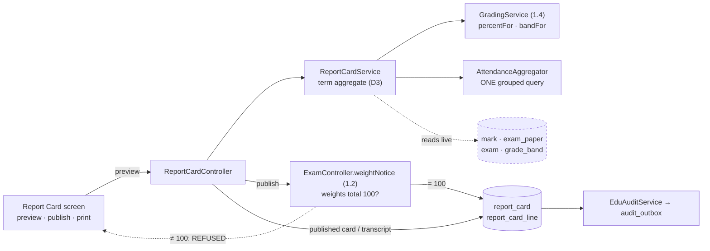
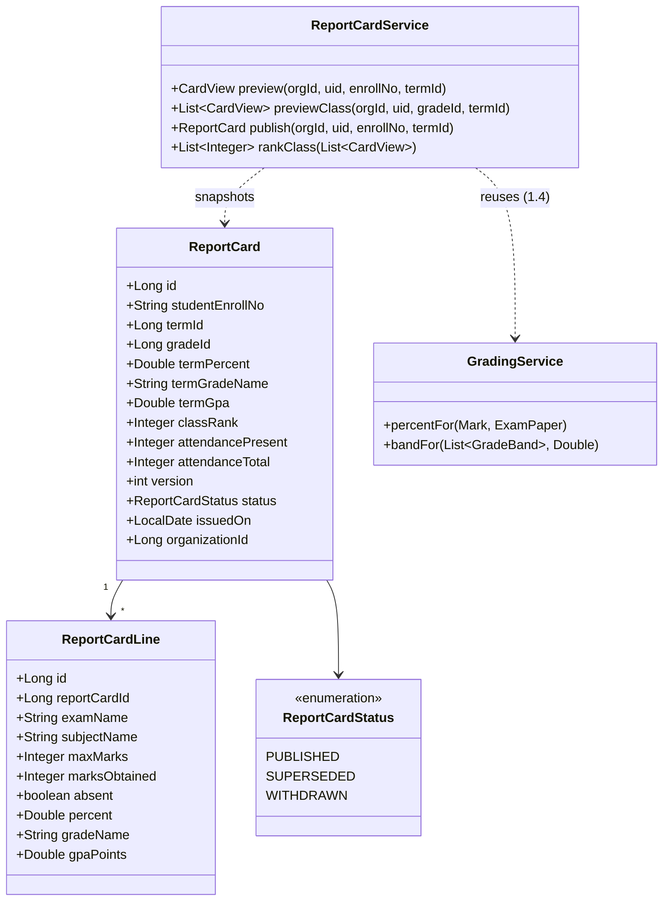
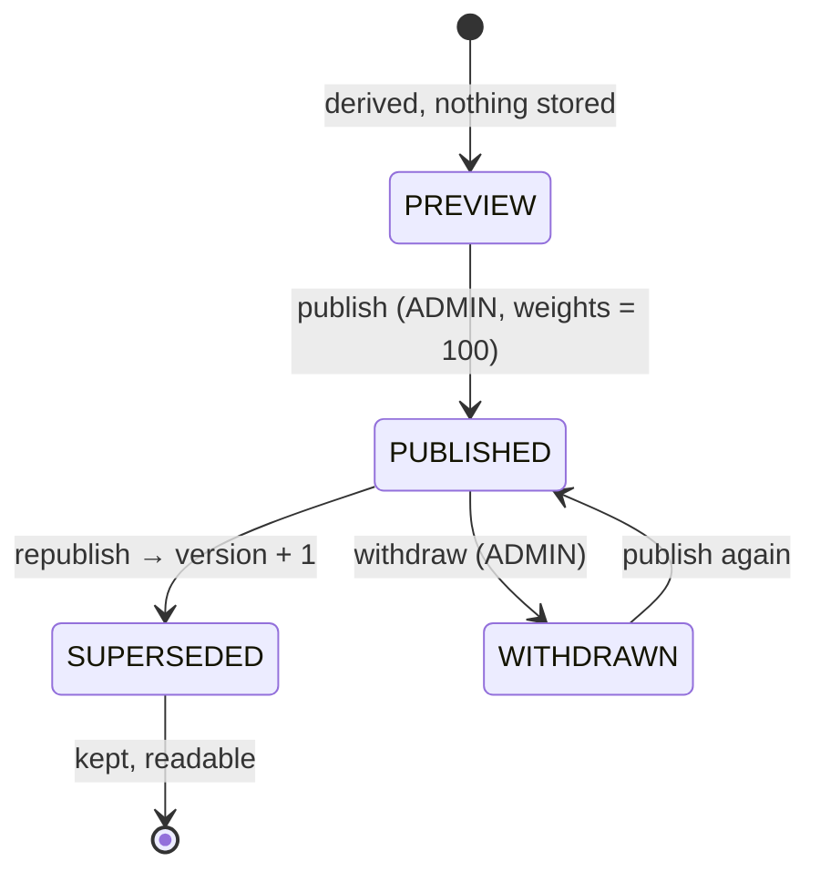

# Slice 1.5 — Report cards & transcript

**Status: DONE — `mvn test` + Cypress gate GREEN (2026-08-01).**
Gate `education/report-cards.cy.js` (7 cases) passed headed; regression `marks.cy.js`, `grading.cy.js`,
`exams.cy.js`, `owner-config.cy.js`, `privilege-map.cy.js`, `attendance.cy.js`, `student-import.cy.js` green.

One item is deliberately **not built** and needs a scope decision: `edu.exam.minAttendancePercent`, because it
is the platform's first `INT` setting and requires an additive change to the shared `common-settings` library.
See §7 and the checklist.
Programme: `education-complete-programme.md` Phase 1.5 — *"Report cards — printable per term + cumulative
transcript"*. Depends on **1.4** (grading scales), done & green. Feeds **1.6** (promotion).

---

## 1. Document — what and why

1.3 records the number. 1.4 turns it into a letter. Neither produces the artefact the school actually hands to
a parent: **one page, one term, every subject, with a total the school is willing to stand behind.**

This is also the first slice in Phase 1 that produces a document with a **life outside the database**. A fee
receipt can be reprinted from live data forever, because the amount paid does not change. A report card cannot —
1.4 made the grade *derived*, so re-banding next year silently restates every card ever printed. That is correct
for live results and unacceptable for issued ones.

### The debt 1.4 handed forward, in its own words

> **Consequence, stated plainly:** re-banding retroactively changes historical letters. That is correct while
> results are live, and it is exactly why 1.5 must **snapshot** a published report card rather than re-deriving
> it years later. Recorded here so 1.5 inherits the requirement rather than discovering it.
> — `edu-1.4-grading-scales.md`, D4

So the central question of this slice is not layout. It is **when a computed thing stops being computed.**

### What exists to build on

| Existing | Consequence for 1.5 |
|---|---|
| `GradingService.percentFor` / `bandFor` (1.4) | the per-paper maths is done and tested; 1.5 aggregates, it does not re-derive |
| `Exam.weightPercent` (1.2 D4) — totals **warn**, never block | 1.5 is where warning is no longer enough (D2) |
| `Mark.absent` distinct from 0 (1.3 D2) + `edu.grading.absentCountsAsZero` (1.4 D3) | the term average already has a defined answer for a missed paper |
| `ExamStatus.LOCKED` (1.2 D5), set by the first mark (1.3 D4) | the inputs to a card are already frozen against silent restatement |
| `Attendance.termId` (1.1) | a per-term attendance summary is a grouped query, not a scan |
| `getStudentMarks` — *"the read 1.5's transcript will build on"* | true, and it is **N+1** — see D8 |

---

## 2. Design

### D1 — A report card is DERIVED until it is PUBLISHED, then SNAPSHOTTED

Two states, one rule:

```
PREVIEW    computed live from marks + the current scale.  Nothing stored.
PUBLISHED  the computed result is WRITTEN DOWN, names and all.  Never recomputed.
```

Preview is not a draft record — it is a query. Storing draft cards would mean a second copy of the marks that
goes stale the moment a teacher fixes a typo, and a "refresh" button nobody trusts.

**The snapshot stores names and numbers, not foreign keys.** `report_card_line` carries `subjectName`,
`examName`, `maxMarks`, `marksObtained`, `percent`, `gradeName`, `gpaPoints` as *values*. Storing `subjectId`
and re-reading the name would reintroduce exactly the drift the snapshot exists to prevent: renaming a subject
from "EVS" to "Environmental Studies" would silently retitle a card issued three years ago.

This is the same reasoning as finance's immutable audit rows, and the opposite of 1.4 D4 — deliberately. A live
result should follow the current scale; an issued document should not.

### D2 — Publishing REFUSES when the term's exam weights do not total 100

1.2 D4 chose to warn:

> a school is legitimately mid-setup between the mid-term and the final

That is right for the exam screen and wrong here. A weighted term total computed from weights summing to 70 is
not a partial answer — it is a **wrong number that looks like a right one**, and once it is on paper in a
parent's hand there is no recall.

| Action | Weights ≠ 100 |
|---|---|
| Preview a card | allowed, with the shortfall named on screen |
| **Publish** a card | **refused**, message naming the total and the exams that make it up |

1.2's `weightNotice` already computes the sum; this reuses it rather than re-summing.

### D3 — The term aggregate, stated precisely so it can be tested

```
paperPercent   = GradingService.percentFor(mark, paper)          ← 1.4, absent policy applied here
examPercent    = mean(paperPercent) over the exam's papers        ← equal weight per subject (see below)
termPercent    = Σ (exam.weightPercent × examPercent) / 100
termGrade      = GradingService.bandFor(scale, termPercent)
```

Three consequences worth naming rather than discovering:

- **Papers are equally weighted within an exam.** Subject weighting (Maths above Drawing) was explicitly put
  out of Phase 1 by 1.4 §6. Equal weight is the honest default, not an oversight.
- **A `null` paperPercent leaves both sides of the mean** — that is 1.4 D3's absent-excluded rule arriving
  intact. It must not become a 0 in the denominator.
- **An exam with no marks at all contributes nothing and its weight is still counted**, which would drag the
  total down. So an exam with zero marked papers is **excluded from the weighted sum and its weight excluded
  from the divisor** — otherwise a card published before the final exam reports a failure rather than a
  partial term.

### D4 — Rank is computed over the CLASS, and hidden by default

The programme flags this: *"whether rank is shown — many schools forbid publishing rank"*.

| Setting | Type | Default | Why |
|---|---|---|---|
| `edu.reportCard.showRank` | BOOL | **false** | publishing rank is prohibited in several jurisdictions; opt-in is the safe direction |
| `edu.reportCard.showAttendance` | BOOL | true | near-universal on a real card, and 1.1 made it cheap |

Rank is over the **class**, not the school — a parent comparing their child against a different year group is
comparing nothing. **Ties share a rank** (two firsts, then third), because breaking a tie arbitrarily invents a
distinction the marks do not support.

Rank is computed at publish time and **snapshotted with the card** (D1). A rank that silently changes when a
classmate's mark is corrected is worse than no rank.

### D5 — A published card is IMMUTABLE; a correction is a new VERSION

No editing a published card. Correcting one means publishing again, which writes `version = 2` and marks the
previous row `SUPERSEDED`.

The card handed to a parent **existed**. Overwriting it means the school cannot answer "what did we send you in
March?" — the question that gets asked precisely when something has gone wrong. Versioning costs one integer
and one status; silent overwrite costs the school its own record.

```
PUBLISHED ──republish──► SUPERSEDED
    │                        (the old row stays, readable)
    └──unpublish (ADMIN)──► WITHDRAWN
```

### D6 — The transcript reads SNAPSHOTS, never a re-derivation

The cumulative transcript is the list of a student's published cards across terms and years, in order. It does
**not** recompute anything.

This is the payoff for D1. A transcript spanning five years crosses at least one grading-scale change in any
real school; re-deriving it would restate a child's entire history against today's bands. Terms with no
published card simply do not appear — the same fail-open rule as 1.4 D2 (a school that has not configured the
optional thing keeps working).

### D7 — "Printable" is a print stylesheet, NOT `document-service`

The programme's `document-service` is real and justified, and **D-5 (document storage backend) gates phase
4.3**, not this slice. A report card needs no stored binary: the school prints from the browser, which is what
schools do today with every other page in this system.

A generated PDF would drag an undecided storage backend, a new service, and a blob lifecycle into a slice whose
actual job is the aggregate. Deferred honestly rather than half-built: if schools later want archived PDFs, the
snapshot rows are exactly what a generator would render, so nothing here is wasted.

### D8 — `getStudentMarks` is N+1, and a transcript multiplies it

Found while designing, not previously recorded. Per mark, the loop does **three** scoped lookups:

```java
for (Mark m : markRepository.findByStudentScoped(enrollNo, org, uid)) {
    ExamPaper p = examPaperRepository.findByIdScoped(m.getExamPaperId(), org, uid)...
    Subject subj = subjectRepository.findByIdScoped(p.getSubjectId(), org, uid)...
    Exam exam = examRepository.findByIdScoped(p.getExamId(), org, uid)...
```

30 marks = **90 queries** for one student. Printing a class of 40 = **3,600**. This slice makes that path the
hot one, so it batches: load the term's papers, subjects and exams **once** into maps, then index. Same
batch-not-per-row discipline as 1.1's term stamping and 1.4's read-the-scale-once.

Adjacent to finding **D** in the review audit but deliberately not merged into it — this is the read 1.5 owns,
and leaving it N+1 while building a class-wide print on top would be knowingly shipping the problem.

### D9 — Scope

| In | Out |
|---|---|
| `ReportCard` + `ReportCardLine` (V14), org-scoped | PDF generation / `document-service` (D7) |
| preview (derived) + publish (snapshot) + republish/withdraw | parent-visible portal (3.1) |
| term aggregate with exam weighting (D3) | subject weighting within a term (1.4 §6, out of Phase 1) |
| class rank, ties shared, opt-in (D4) | promotion decisions (1.6) |
| cumulative transcript from snapshots (D6) | statutory return / TC formats (D-1, phase 5.3) |
| per-term attendance summary, ONE grouped query | back-filling cards for past terms |
| batching the N+1 in `getStudentMarks` (D8) | the rest of finding D (analytics) |
| print stylesheet + i18n × 6 | |

### Layer answers (§5b)

| Layer | Answer |
|---|---|
| **UI/UX** | one Report Card screen: pick term + class → preview a student or the whole class → Publish. A published card renders from its snapshot with an issued date and version. Print stylesheet hides nav/buttons. Rank column appears only when the setting is on |
| **Service/API** | `/getReportCardPreview`, `/getReportCard`, `/publishReportCard`, `/withdrawReportCard`, `/getTranscript`. Preview + reads = WRITE tier (teachers prepare cards); **publish/withdraw = `ADMIN_PRIVILEGE`** — issuing a result to a parent is the same class of act as changing what they owe |
| **Database** | MySQL, `report_card` + `report_card_line` (V14), indexed `(organization_id, student_enroll_no, term_id)`. UNIQUE on `(organization_id, student_enroll_no, term_id, version)` — the DB, not the code, is what makes "one card per version" true under a double-clicked Publish (1.3 D1's lesson) |
| **Patterns** | snapshot-on-issue (D1), immutable + versioned (D5), refuse-at-the-boundary (D2), batch-not-per-row (D8), settings for scalar policy (D4) |
| **Microservice design** | education-local. No new service; audit reuses the existing `audit_outbox` + `EduAuditService` — publishing a result is exactly the kind of contested act 1.3 D5 built that for |
| **Configurability** | rank and attendance per org; no jurisdiction assumed. The aggregate formula itself is **not** configurable — see §6 |
| **DRY** | `GradingService` untouched and reused; `weightNotice` reused for D2; `Validations` for numeric checks; `ScopedDeleter` for withdraw |

---

## 3. Architecture & UML





```mermaid
sequenceDiagram
  actor Admin
  participant C as ReportCardController
  participant S as ReportCardService
  participant W as weightNotice (1.2)
  participant G as GradingService (1.4)
  participant DB as report_card

  Admin->>C: publish(enrollNo, termId)
  C->>W: do this term's exam weights total 100?
  alt weights ≠ 100
    W-->>C: 70 (Mid-Term 30, Final 40)
    C-->>Admin: FAILED — "Term 2 weights total 70%, not 100%"
    Note over C,DB: nothing written; a wrong number never reaches paper
  else weights = 100
    C->>S: aggregate
    S->>G: percentFor / bandFor per paper
    G-->>S: percentages + bands
    S->>S: exam means → weighted term % → rank over the class
    S->>DB: INSERT card + lines (NAMES, not ids)
    Note over S,DB: prior PUBLISHED row → SUPERSEDED, version + 1
    DB-->>C: version 1 issued
    C-->>Admin: SUCCESS — card issued
  end

  Admin->>C: re-band the scale, reopen the card
  C->>DB: read snapshot
  DB-->>Admin: the SAME letters as issued (D1)
```



---

## 4. Implement — checklist

- [x] `ReportCard` + `ReportCardLine` + `ReportCardStatus`, Flyway **V14** (MySQL enum column — `@Enumerated(STRING)` needs an explicit `ALTER … MODIFY` to extend later)
- [x] UNIQUE `(organization_id, student_enroll_no, term_id, version)`; indexes for the transcript and class reads
- [x] `TermAggregator` — D3 aggregate as **pure statics** (named `TermAggregator`, not `ReportCardService`, so the maths has no Spring context at all); `ReportCardService` owns only the data access
- [x] exams with zero marked papers excluded from BOTH the weighted sum and the divisor (D3)
- [x] `TermAggregator.rank` — class-scoped, ties share a rank, unmarked students **unranked rather than last**
- [x] one grouped attendance query — `AttendanceRepository.summariseByStudent`, aggregated in SQL
- [x] publish: refuse when weights ≠ 100 (D2); snapshot names not ids (D1); supersede prior version (D5)
- [x] `EduAuditService.record` on publish / withdraw
- [x] batch the N+1 in `getStudentMarks` (D8); `ReportCardService.loadTerm` reads a whole term in five queries
- [x] two BOOL settings in `EducationSettingsCatalog` (D4), group "Report card"
- [x] Report Card screen + `print.css` + i18n × **6 bundles**, 25 lines each, verified equal
- [x] DOM built with `.text()`/jQuery construction, so names cannot inject markup
- [x] `TermAggregatorTest` (11 pure cases) + `cypress/e2e/education/report-cards.cy.js` (7 cases)
- [ ] **`edu.exam.minAttendancePercent` — NOT BUILT, awaiting a scope decision.** See §7.

### Corrections made during implementation

Recorded here rather than silently, per the docs-stay-honest rule.

**§5b said preview would be WRITE tier. It is not — preview is an ordinary authenticated read.** Gating it
would have been inconsistent with every other education read, including `getMarksSheet`, which already shows
the same marks to the same people. The 3-tier privilege map gates *writes*; reads are protected by org and
branch scoping, which preview applies (`NOT_FOUND` for a student outside the caller's branch). Publishing
remains `ADMIN_PRIVILEGE`, which is the decision that actually mattered.

**The attendance summary is keyed on the term's DATE RANGE, not on `attendance.term_id`.** §1 claimed 1.1 had
made this cheap via the column. It had — but 1.1 D5 deliberately **never backfilled** it ("don't infer
history"), so keying on it would report **0/0 for every term predating 1.1**: a report card stating
confidently that a child attended nothing. A term *is* a date range, so the range is both correct and
complete.

**`StudentVisibilityService` was extracted, unplanned.** `visibleStudents()` existed byte-identically in
`StudentController`, `AttendanceController` and `MarkController`, and this slice needed a fourth copy. Three
copies of a *visibility* rule is a security problem rather than mere duplication: the day one is tightened and
the others are not, nothing in the code says they were meant to agree. All three now delegate.

**The i18n key is `ui.gradeLetter`, not `ui.grade`.** In this domain "grade" already means a class, so a bare
`ui.grade` would have been ambiguous in exactly the screens where the two appear together.

## 5. Test

| # | Case | Expected |
|---|---|---|
| 1 | Two exams, weights 30/70, marks in both | term % = the weighted figure, computed by hand in the test |
| 2 | Weights total 70 → **publish** | refused, message names the total and the exams |
| 3 | Same term → **preview** | allowed, shortfall shown on screen (D2) |
| 4 | Final exam not yet marked | its weight leaves the divisor; term % reflects the mid-term alone (D3) |
| 5 | Absent paper, policy ON | counts as 0% in the mean |
| 6 | Absent paper, policy OFF | leaves **both** sides of the mean |
| 7 | Publish, then re-band the scale, then reopen | letters **unchanged** — the snapshot held (D1, the whole point) |
| 8 | Publish, rename the subject, reopen | the card still shows the **old** subject name (D1) |
| 9 | Republish after a mark correction | version 2 PUBLISHED, version 1 SUPERSEDED and still readable (D5) |
| 10 | Rank with a tie | two students share rank 1, next is 3 (D4) |
| 11 | `showRank` off (default) | no rank on the card or in the response payload |
| 12 | No bands defined | percentages render, letters blank — card still issues (1.4 D2) |
| 13 | Transcript across two terms | reads snapshots; a term with no published card is absent, not zero (D6) |
| 14 | Another tenant's card by id | refused |
| 15 | Teacher publishes | 403 — ADMIN tier; preview still allowed |
| 16 | Class of 40 previewed | query count bounded, not 3× per mark (D8) |

Gate: `cypress/e2e/education/report-cards.cy.js`.
**Regression:** `marks.cy.js`, `grading.cy.js` (the batched read changes `getStudentMarks`), `exams.cy.js`,
`owner-config.cy.js` (catalog grows by two), `privilege-map.cy.js` (new ADMIN endpoints),
**`attendance.cy.js` and `student-import.cy.js`** (the `visibleStudents` extraction touches three controllers).
Pure unit: `TermAggregatorTest` — the aggregate, both exclusion rules, and ranking with ties.

**A note on what the Cypress spec can and cannot prove here.** Several cases depend on the demo org having a
term whose exam weights total 100. Where they do not, the spec logs `SKIPPED-BY-DESIGN` and asserts the
*refusal* path instead of quietly passing — the hollow-green shape that `marks.cy.js` was caught in. To
exercise the snapshot and versioning cases properly, set the term's exam weights to total 100 first.

## 6. Open / deferred

**The aggregate formula is not configurable, deliberately.** Best-of-N exams, dropping the lowest paper, and
subject weighting are all real school policies and all change the shape of D3, not a scalar within it. Making
the formula pluggable before a second school has asked for a second formula would be inventing a framework for
one caller. Revisit when a real requirement names one.

**Exam eligibility by attendance % — fourth appearance, resolved here rather than deferred again.** Deferred
from 1.2 §6, 1.3 §6 and 1.4 §6. This slice builds the attendance aggregate it was always waiting on, so the
data question is answered. The *action* question turns out to be the blocker: **there is no exam-registration
step to block.** Students do not enrol in papers; a marksheet lists the class. So eligibility can only be a
**computed flag** shown on the marksheet and the card, not a gate — and that is what this slice will do, with
`edu.exam.minAttendancePercent` (INT, default 0 = off). Calling it a "gate" would be describing something the
domain has nowhere to put.

**Parent-visible publication.** Publishing here means *issued by the school*, not *visible to a parent* — there
is no parent portal until 3.1. When 3.1 lands, it reads `status = PUBLISHED` and needs no new state.

## 7. Risks

- **The snapshot is only as good as the moment it is taken.** If a school publishes before marks are complete,
  the card is wrong and the fix is a republish (D5), not an edit. Test 9 pins that the trail survives; the UI
  should show what is unmarked *before* the Publish button is pressed.
- **D2 will block schools that are mid-setup.** That is the intent, but it is the one change here a school will
  notice as a refusal. The message must name the shortfall and the exams, or it reads as a bug.
- **Rank defaults off, and some schools will assume it is broken.** A visible, explained toggle in the Report
  card settings group is the mitigation; a silent absence is not.
- **`edu.exam.minAttendancePercent` is the first `INT` setting on the platform, and the shared library is half
  ready.** Checked, not assumed: `SettingType.INT` exists in the enum and `settings-form.js` already renders it
  as a number input (line 40) — but `SettingEntry` has **only** `bool(...)` and `select(...)` factories, and
  `SettingsService` exposes **only** `getBool(...)`. So this slice must add `SettingEntry.intOf(...)` and
  `SettingsService.getInt(...)` to **`common-settings`**, which every service consumes.

  That is a shared-library change riding in a vertical slice, so it is called out rather than slipped in: the
  additions are purely additive (no existing signature changes), but `common-settings` must be rebuilt and
  every dependent service repackaged, or they run against a stale jar — the trap that cost a full cycle in the
  branch-scope slice. If that is unwelcome scope, the fallback is to defer `minAttendancePercent` to 1.6 and
  ship 1.5 with its two BOOLs only; the eligibility flag is the smallest part of this slice.
