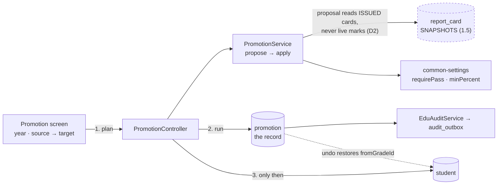
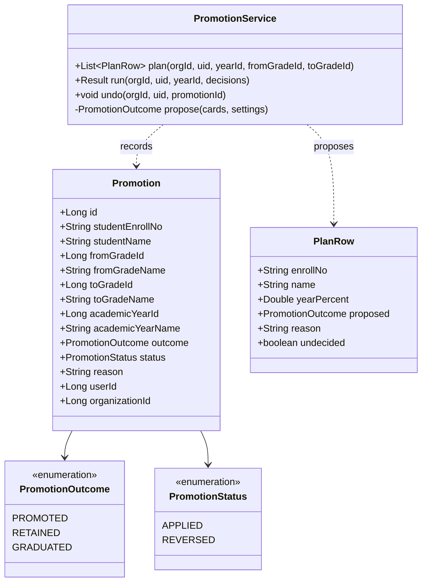
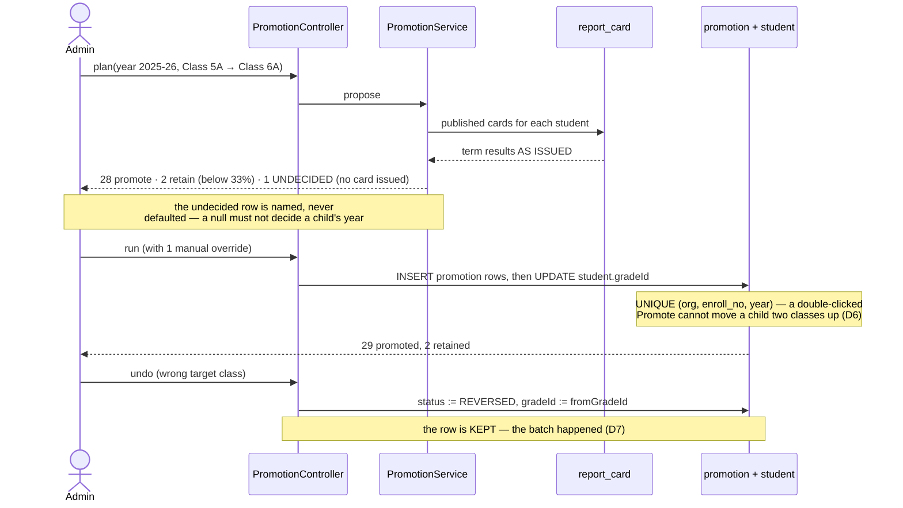
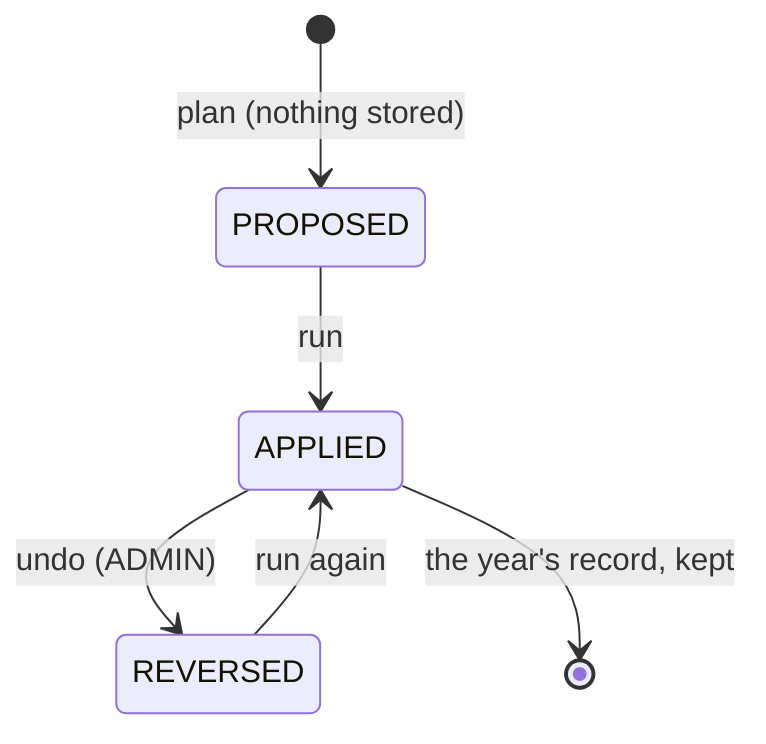

# Slice 1.6 — Promotion

**Status: DONE — `mvn test` + Cypress gate GREEN (2026-08-01).**
Gate `education/promotion.cy.js` (8 cases) passed headed. **This slice completes Phase 1** — the
term → exam → marks → grading → report card → promotion spine is closed end to end.

`common-settings` changed, so the build order matters — see §7 and the commands at the end of §5.
Programme: `education-complete-programme.md` Phase 1.6 — *"Promotion — roll a class forward at year end, with
retained students"*. Depends on **1.1** (academic year), **1.3** (marks) and **1.5** (report cards).
**The last slice of Phase 1** — it closes the term → exam → marks → grading → report card → promotion spine.

---

## 1. Document — what and why

Everything Phase 1 built describes *this* year. Promotion is the one operation that ends a year and starts the
next, and it is the only one that **overwrites data no other slice can reconstruct**: `Student.gradeId` is a
single mutable column, so the moment a child moves from Class 5 to Class 6, the fact that they were ever in
Class 5 is gone.

That makes promotion less a feature than a **records** problem wearing a feature's clothes.

### Two facts about the existing data that shape the whole slice

**1. There is no class ladder.** `Grade` has `name`, `code`, `section`, `schoolId`, `fee`, `room` — and no
ordering of any kind. `Term` got a `sequence` in 1.1; `Grade` never did. So "the next class" is not derivable
from anything in the database today. D1 is about what to do with that.

**2. `Grade` rows *are* sections.** `section` is a column on `Grade`, so "Class 5 A" and "Class 5 B" are two
`Grade` rows. Any ordering scheme therefore has to answer "does 5A go to 6A or 6B?", which is a question about
a specific school's intent, not about arithmetic.

### What exists to build on

| Existing | Consequence for 1.6 |
|---|---|
| `ReportCard` snapshots (1.5 D1) | the promote/retain proposal reads what was *issued*, never live marks — see D2 |
| `AcademicYear` + `Term` (1.1) | a promotion belongs to a year, which is what makes it repeatable and auditable |
| `Student.status` (free text: Active/…) | graduation has somewhere to land without a new column |
| `EduAuditService` + `audit_outbox` (1.3 D5) | promotion is contested data; the audit trail already has a home |
| `common-settings` BOOL/SELECT only | **the rule needs INT** — the deferred library change lands here (D4) |

---

## 2. Design

### D1 — The admin chooses the target class. 1.6 does NOT invent a ladder

Three options, and the reason the third wins:

| Option | Why not |
|---|---|
| `Grade.sequence` INT | cannot disambiguate 6A from 6B, and sections are `Grade` rows (fact 2). It would order the ladder while leaving the actual question unanswered |
| `Grade.nextGradeId` | correct, but it is **setup a school must complete before it can promote at all** — and a wrong link silently sends a whole class to the wrong room |
| **admin picks source → target per batch** | **chosen** |

Promotion happens **once a year** and moves every child in a class; it is inherently supervised. Asking for the
target is one dropdown on a screen the admin is already looking at, and it handles sections, mergers, splits
and renamed classes without any configuration to keep true.

This is the same judgement as the branch-scope slice's *derive, don't add a column* — with the honest
difference stated plainly: **the target is not derived, it is asked for**, because it is a decision rather than
a fact. A `sequence` column could later pre-select a *default* target; it is not needed to make promotion work,
and adding an ordering column now would create a second thing to keep correct with nothing enforcing it.

### D2 — The proposal reads the SNAPSHOT, never live marks

Carried requirement from 1.5 D1. The promote/retain suggestion for each student comes from their **published
report cards** for the year, not from `Mark`.

Re-deriving would mean that re-banding the grading scale in August could change **who was promoted in June** —
the same class of error 1.5 exists to prevent, but with a worse consequence, because a promotion has already
moved a child into a room.

**Consequence, stated rather than discovered:** a student with no published card for the year **cannot be
proposed either way**. They are listed as `UNDECIDED` with the reason ("no report card issued for Term 2"), and
the admin decides explicitly. Silently promoting them would hide an incomplete year; silently retaining them
would be a serious accusation made by a null check.

### D3 — A promotion is RECORDED, because the thing it changes is destroyed

`Student.gradeId` is overwritten in place. Without a record:

- "which class was this child in last year?" has no answer
- `Attendance` and `FeeCollection` denormalise `gradeName`, so last year's rows disagree with the student's
  current class and **nothing explains the gap** — it reads as data corruption
- an accidental batch cannot be undone

So `promotion` stores `studentEnrollNo`, `fromGradeId` + `fromGradeName`, `toGradeId` + `toGradeName`,
`academicYearId` + `academicYearName`, `outcome`, `decidedBy`, `dated`. **Names are snapshotted**, for exactly
the reason 1.5 D1 gives: a class renamed next year must not retitle last year's history.

### D4 — The rule is configurable, and this is where the INT setting lands

The programme's own config row: *"Promotion rule — auto-promote, or pass-marks required"*.

| Setting | Type | Default | Why |
|---|---|---|---|
| `edu.promotion.requirePass` | BOOL | **false** | auto-promote. Many jurisdictions run no-detention policies, and **retention is the consequential act** — a default that never retains a child by accident is the safe direction |
| `edu.promotion.minPercent` | **INT** | 33 | only consulted when `requirePass` is on |
| `edu.exam.minAttendancePercent` | **INT** | 0 (off) | deferred from 1.2 §6 → 1.3 → 1.4 → 1.5; lands here because this is the slice that needs INT anyway |

**This slice adds `SettingEntry.intOf(...)` and `SettingsService.getInt(...)` to `common-settings`** — agreed as
the 1.5 follow-on. Verified before designing against it: `SettingType.INT` already exists in the enum and
`settings-form.js` already renders it as a number input (line 40); only the Java factory and getter are
missing, and `SettingsService.effective(key)` is already public, so `getInt` is a parse over it.

The change is **purely additive** (no existing signature moves), but `common-settings` is consumed by every
service — so it must be rebuilt and dependents repackaged, or they run stale jars. That is a build-order note
in §7, not a design risk.

### D5 — Retention and graduation are OUTCOMES, not side effects

```
PROMOTED   → gradeId := target
RETAINED   → gradeId unchanged, but the decision is still RECORDED
GRADUATED  → no target chosen (the top of the school); Student.status set to a terminal value
```

**A retention writes a row even though nothing moves.** "We considered this child and kept them back" and "we
never got to this child" are different facts, and only a recorded decision can tell them apart next year.

Graduating students are **never deleted**. A school is asked about its alumni for decades.

### D6 — One promotion per student per year, enforced by the DATABASE

UNIQUE `(organization_id, student_enroll_no, academic_year_id)`.

A double-clicked "Promote class" must not move a child **two classes** up. The constraint is what makes that
true under concurrency, not the code that checks first — 1.3 D1's lesson, and the stakes here are higher
because the second write is silently plausible.

### D7 — Promotion is ADMIN, and reversible by explicit undo

`ADMIN_PRIVILEGE`, alongside fee settings and report-card publishing. Undo restores `fromGradeId` and marks the
row `REVERSED` rather than deleting it (1.5 D5's rule): the batch **happened**, and a school that erases the
evidence cannot explain what its records did.

### D8 — Scope

| In | Out |
|---|---|
| `Promotion` entity + `PromotionOutcome` (V15) | a class ladder / `Grade.sequence` (D1) |
| class-at-a-time batch: source → target, per-student override | timetable or room reallocation for the new year |
| proposal from published report cards (D2) | carrying fee arrears forward (fees already span years) |
| retained / graduated outcomes (D5) | alumni records beyond a terminal `status` |
| three settings incl. the first two INTs (D4) | bulk re-sectioning (5A+5B → 6A) as a first-class operation |
| `intOf` / `getInt` in `common-settings` | auto-running promotion on a date |
| undo (D7) + audit events | |

### Layer answers (§5b)

| Layer | Answer |
|---|---|
| **UI/UX** | one Promotion screen: pick year, source class, target class → the roster loads with a proposed outcome per student and the reason → the admin overrides individuals → Promote. `UNDECIDED` rows are visually distinct and block nothing; the count of them is shown before the button |
| **Service/API** | `/getPromotionPlan`, `/runPromotion`, `/undoPromotion`, `/getPromotionHistory`. Writes `ADMIN_PRIVILEGE`; reads scoped as everywhere else |
| **Database** | `promotion` (V15), UNIQUE `(org, enroll_no, academic_year_id)`, index `(org, academic_year_id, from_grade_id)`. `outcome`/`status` are MySQL enums — extending needs `ALTER … MODIFY` |
| **Patterns** | see the named list below |
| **Microservice design** | education-local. The `common-settings` addition is a shared-library change, called out separately in §7 |
| **Configurability** | the rule, the pass mark and the attendance threshold — per org. The *ladder* is deliberately not configuration; it is a per-batch decision (D1) |
| **DRY** | `StudentVisibilityService` (extracted in 1.5) for the roster; `ReportCardRepository.findByStudentScoped` for the proposal; `EduAuditService` for the trail; `Validations` for the numeric checks |

### Patterns applied (named, so they can be argued with)

| Pattern | Where | Why this one |
|---|---|---|
| **Strategy / policy object** | `PromotionPolicy` — a pure function of (cards, settings) → outcome + reason | the rule differs per school. The alternative is `if (org == …)` branching, which the settings store exists to prevent. The policy takes its configuration as an argument rather than reading `SettingsService` itself, so it is testable without a Spring context |
| **Dry-run command (plan → apply)** | `/getPromotionPlan` computes and stores **nothing**; `/runPromotion` takes the reviewed decisions | the operation is destructive and irreversible-in-effect for a whole class. Separating proposal from execution is what makes review possible, and it is the same shape as 1.5's preview → publish |
| **Append-only decision record** | `promotion` rows, `REVERSED` never deleted | already the house pattern — `common-credit`'s signed ledger, finance's immutable audit, 1.5's superseded cards. A promotion is a decision about a child; decisions are appended, not edited |
| **DIP / SPI extension, not a new port** | `SettingEntry.intOf` + `SettingsService.getInt` added to the existing `common-settings` port | the port already exists and `SettingType.INT` is already in its vocabulary. Adding a *second* settings mechanism for integers would be the "second implementation of an existing capability" anti-pattern |
| **DB-enforced idempotency** | UNIQUE `(org, enroll_no, academic_year_id)` | 1.3 D1's lesson: under concurrency the constraint is the guarantee, the pre-check is only a nicer error |
| **Snapshot / value-copy** | class and year **names** copied onto the record | 1.5 D1, applied again. A renamed class must not retitle last year's history |

**Library vs service:** no new service. Promotion owns no data beyond education's own tables, has no external
integration and no independent lifecycle — by the decision rule (*reusable capability → library unless it owns
data + lifecycle + integration → service*) it is not even a library: it is domain logic belonging to
education-service. The only shared-code change is the additive `common-settings` extension above.

---

## 3. Architecture & UML









---

## 4. Implement — checklist

- [x] `SettingEntry.intOf(...)` + `SettingsService.getInt(key, fallback)` in **`common-settings`** (additive; rebuild + repackage every dependent)
- [x] `Promotion` + `PromotionOutcome` + `PromotionStatus`, Flyway **V15**
- [x] UNIQUE `(organization_id, student_enroll_no, academic_year_id)` + two read indexes
- [x] the rule is **`PromotionPolicy`**, a pure strategy object taking `Config` as an argument (named this rather than `PromotionService.propose` so the maths has no Spring context at all)
- [x] `UNDECIDED` when no card was issued; never silently promoted or retained (D2)
- [x] `run` — records the decision FIRST, then moves the student; retention records a row too (D5)
- [x] graduation: no target ⇒ `GRADUATED` + terminal `Student.status`, never deletion
- [x] `undo` — restores `fromGradeId` (or `status` for a graduate), marks `REVERSED`, keeps the row
- [x] three settings (D4), group "Promotion" — **two of them the platform's first INTs**
- [x] `EduAuditService` on run and undo
- [x] Promotion screen + i18n × **6 bundles**, 29 lines each, all 27 new keys verified present in all six
- [x] DOM built with `.text()`/jQuery construction; shared `uiConfirm` via `uiConfirmOrRun`
- [x] `PromotionPolicyTest` (10 pure cases) + `cypress/e2e/education/promotion.cy.js` (8 cases)
- [ ] **`edu.exam.minAttendancePercent` is REGISTERED but not yet CONSUMED** — see the corrections below

### Corrections made during implementation

**`edu.exam.minAttendancePercent` is declared, not wired.** The checklist above said it would be "surfaced on
the marksheet + card". It is in the catalog with its INT type and `0 = off` default, and `getInt` reads it —
but no screen consumes it yet. Registering a setting nothing reads is exactly the "decorative validation"
mistake slice B refused with `@PositiveOrZero`, so it is called out rather than ticked: **the eligibility flag
is a follow-on, and the setting should arguably not ship until the consumer does.** Flagged for your call.

**`getInt` takes an explicit fallback: `getInt(key, fallback)`, not `getInt(key)`.** A malformed override must
not throw — these are read on behaviour paths, and a settings typo taking down a promotion run would be worse
than using the default. Making the caller pass the fallback keeps that choice visible at the call site instead
of buried in the library. (Note: a `getChoice` reader landed in the same file from other work; both are
extensions of the one port, not new mechanisms.)

**The run reports `PARTIAL`, not `SUCCESS`, when anything is skipped.** Not in the design. It follows 1.3 D3's
rule for bulk marks: a run that skipped half the class because those students were already decided is not the
same as one that promoted them, and the UI must not be able to round it up.

**`Promotion.overridden` was added.** The design recorded the *reason* but not the *fact* that a human went
against the proposal. That fact is itself data — reviewing a year later, "the system proposed retention and
the school promoted anyway" is precisely the case worth finding.

## 5. Test

| # | Case | Expected |
|---|---|---|
| 1 | `requirePass` off (default), any result | all proposed PROMOTED |
| 2 | `requirePass` on, `minPercent` 33, student at 28% | proposed RETAINED, reason names the figure |
| 3 | Student with no published card | **UNDECIDED**, reason names the missing term — not promoted, not retained |
| 4 | Run the batch | `student.gradeId` moved; a `promotion` row per student **including retentions** |
| 5 | Run the same batch twice | second run refused by the UNIQUE key; no child moves two classes (D6) |
| 6 | Admin overrides one proposal | the override is what is recorded, with the admin as `decidedBy` |
| 7 | No target class chosen | GRADUATED; student still readable, status terminal |
| 8 | Undo | `gradeId` restored, row `REVERSED` and still readable |
| 9 | Re-band the grading scale, then re-open the history | outcomes unchanged — the proposal read snapshots (D2) |
| 10 | Rename the source class, then re-open the history | the record still shows the **old** class name (D3) |
| 11 | Teacher runs a promotion | 403 — ADMIN tier |
| 12 | Another tenant's promotion by id | refused |
| 13 | `getInt` on an unset INT setting | the catalog default, not 0 or an exception |

Gate: `cypress/e2e/education/promotion.cy.js`.
**Regression:** `report-cards.cy.js`, `marks.cy.js`, `attendance.cy.js`, `owner-config.cy.js` (catalog grows by
three **and gains its first INT rows**), `privilege-map.cy.js`.
**Plus a cross-service smoke:** `common-settings` changed, so at least one non-education settings consumer must
be re-run — `business` owner-config — to prove the shared library still loads everywhere.
Pure unit: `PromotionPolicyTest`.

### Build order — this slice changes a SHARED library

`common-settings` is consumed by every service, so a restart without a rebuild runs the stale jar and the new
INT settings appear as "Unknown setting" — the failure that cost a full cycle in the branch-scope slice.

```bash
cd microservices
mvn -pl common-settings -am clean install          # 1. the shared library FIRST
mvn -pl education-service -am clean package        # 2. then the consumer
cd ..
mvn test                                           # 3. monolith: SupportedLanguageTest guards the 6 bundles
# restart education-service (V15) + monolith
npx cypress run --browser chrome --headed --spec cypress/e2e/education/promotion.cy.js
```

The spec's **first** test asserts that `edu.promotion.minPercent` comes back typed `INT` with its default —
so if step 1 was skipped, that test says so directly instead of leaving a confusing downstream failure.

**This spec moves students between classes.** Every test that promotes reverses itself and an `after()` hook
sweeps up, but if a run is interrupted mid-test, check the Promotion history screen before re-running.

## 6. Open / deferred

**Bulk re-sectioning.** 5A + 5B → 6A/6B/6C with rebalanced rosters is a real annual task and a genuinely
different operation: it is about *distribution*, not progression. Promotion moves a class; re-sectioning
redraws the classes. Worth its own slice if schools ask.

**Fee arrears across the year boundary.** Deliberately untouched: fees are already keyed by student and term,
so arrears follow the child without promotion doing anything. Naming it here so the silence is a decision.

**Auto-running promotion on a date.** Rejected for now — an unattended job that moves every child in the school
is the last thing that should run without someone watching it.

## 7. Risks

- **This is the most destructive operation in the product.** It rewrites `gradeId` for a whole class. D3 (the
  record), D6 (the DB constraint) and D7 (undo) exist because of that, and the tests for 5 and 8 are the two
  that must not be waved through.
- **`common-settings` is shared by every service.** The change is additive, but the build order matters: build
  `common-settings`, then repackage dependents. A restart without a repackage runs the stale jar and the new
  settings appear "unknown" — the exact failure that cost a full cycle in the branch-scope slice.
- **`Student.status` is free text.** Using it for graduation means agreeing a value ("Graduated") that nothing
  currently validates. Worth a follow-up to make it an enum; not worth blocking this slice.
- **The UNDECIDED count could be large in a school that has not published cards.** That is the honest signal,
  but if it is most of the roster the screen should say so plainly rather than presenting a mostly-blank plan.
