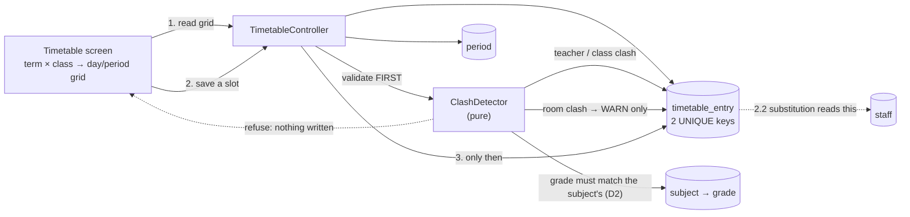
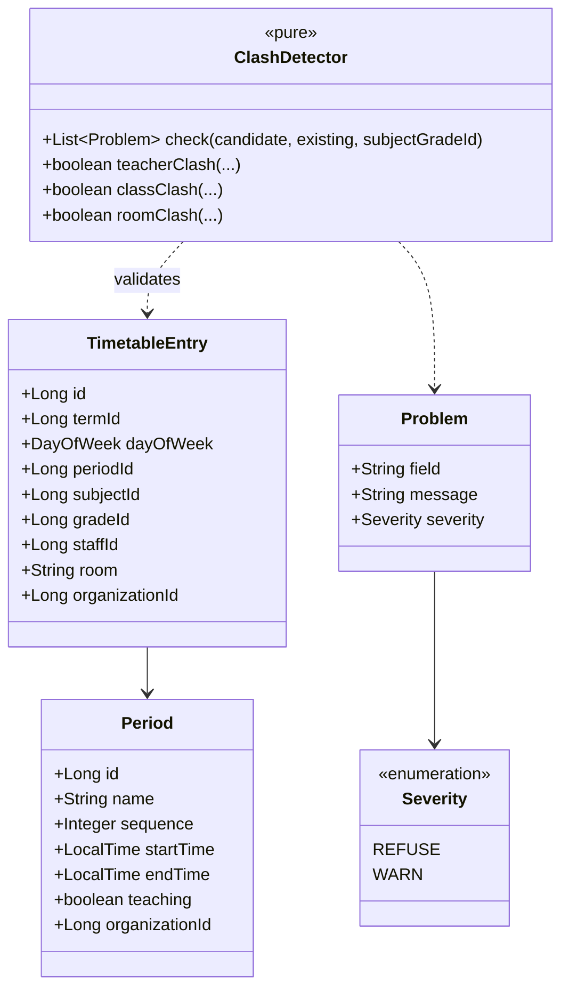
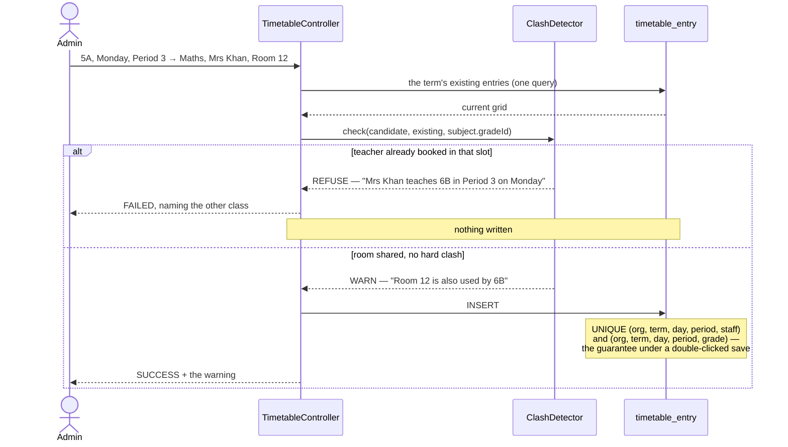

# Slice 2.1 — Timetable

**Status: DESIGN — awaiting approval. No code written.**
Programme: `education-complete-programme.md` Phase 2.1 — *"Timetable — class × period × subject × teacher ×
room, with clash detection"*. **The keystone of Phase 2**: 2.2 substitution reads it, and 2.3 staff attendance
is what makes a substitution necessary.

---

## 1. Document — what and why

Phase 1 answered *what happened* — marks, grades, results. Phase 2 answers *what happens on Tuesday*. The
timetable is the spine: it is the first structure in this system that says **who is where, when**, and almost
everything in Phase 2 reads it.

### What already exists — including one thing an earlier slice said did not

| Existing | Consequence for 2.1 |
|---|---|
| `Subject` has `@ManyToOne Grade` | a subject **already belongs to one class** — "Maths for Class 5" and "Maths for Class 6" are separate `Subject` rows. A slot referencing a subject therefore already implies its class |
| **`staff_grades` join table + `Staff.grades` (`@ManyToMany`, EAGER)** | teacher ↔ class association **exists today** — see the correction below |
| `Grade.timeFrom` / `timeTo` | the class's daily window is already recorded, so periods have an outer bound to validate against |
| `Grade.room` — a bare `Long`, no `Room` entity | there is no room master. D6 |
| `Term` (1.1), nullable everywhere | a timetable belongs to a term, and a school with no terms must still work |

**A distinction worth stating, because it is easy to misread 1.3.** Slice 1.3 D6 declined to build a class
teacher model because it *"needs staff↔class **ownership** that does not exist yet"*. That is exactly right and
is **not** contradicted here: `staff_grades` gives an **association** (Mrs Khan is attached to 5A), not
**ownership** (Mrs Khan is 5A's form teacher, accountable for it). 2.1 needs only the association, which is why
2.1 is not blocked on the HR concern 1.3 was avoiding. The two facts are easy to conflate — I conflated them
while planning this slice — so the difference is recorded rather than left to be re-derived.

### What the association does NOT give us

`staff_grades` says *Mrs Khan is associated with 5A*. It does not say *Mrs Khan teaches **Maths** to 5A*.
A timetable needs the finer fact, and that is what a timetable entry is: the assignment **is** the schedule.
So 2.1 does not add a separate teacher-subject-class mapping — the timetable itself is that mapping, which is
why this slice is not blocked on an HR model.

---

## 2. Design

### D1 — Periods are an ENTITY the school defines; slots reference them, not clock times

A `Period` per org: name ("Period 1", "Break"), `sequence`, `startTime`, `endTime`.

The alternative — free start/end times on each timetable entry — makes clash detection an interval-overlap
problem and buys nothing, because real schools ring a bell. With fixed periods, "two things in the same slot"
is an equality test, which is also what makes it enforceable in the database (D4).

Same shape as 1.1's terms and 1.4's grade bands: **the entity IS the configuration** for list-shaped things.
No `edu.timetable.periodCount` setting — the school creates the periods it runs.

A **non-teaching period** (break, assembly) is just a `Period` with no entries against it. It appears on the
grid as a labelled row and needs no special case.

### D2 — A slot is (day, period, subject, teacher, room). The class comes from the subject… and is ALSO stored

The entry references `subjectId`, and `Subject` already knows its `Grade` — so per **1.2 D2** ("never store the
class twice") the class should be derived and not stored.

**This slice deliberately deviates, and stores `gradeId` on the entry as well.** Two reasons the earlier
precedent does not carry:

1. **The class is the primary query axis.** "Show 5A's timetable" is the single most common read in Phase 2,
   and 2.2 substitution runs it repeatedly. Deriving it means joining through `subject` on every read of the
   busiest screen in the phase.
2. **The clash constraint needs a column.** A class cannot be in two places at once, and per 1.3 D1 / 1.6 D6
   the only thing that makes that true under a double-clicked save is a UNIQUE key — which cannot be built on
   a derived value.

**The cost is named rather than hidden:** two sources of truth for the class. It is contained by validating at
write that `entry.gradeId == subject.grade.id`, refusing the save otherwise. A copy that is checked on every
write is a cache; a copy that is never checked is a bug waiting. If that check is ever removed, this becomes
exactly the drift 1.2 D2 warned about.

### D3 — Three clashes, and they are not equally serious

| Clash | Rule | Why |
|---|---|---|
| **Teacher** in two places in one slot | **refuse** | physically impossible; the timetable is wrong |
| **Class** in two places in one slot | **refuse** | physically impossible |
| **Room** double-booked | **warn** | `Grade.room` is a bare number with no room master (D6). Refusing on data this weak would block legitimate saves — two classes may genuinely share a hall |

The teacher and class checks are hard errors *and* DB constraints (D4). The room check is a message, and says
which other class holds the room.

**Two further checks that cost nothing:** a period outside the class's `timeFrom`/`timeTo` window, and a
teacher assigned outside their `timeIn`/`timeOut`. Both **warn** — the existing time fields are loosely
maintained, and a hard refusal on data nobody curates teaches people to work around the system.

### D4 — What the database enforces

```sql
UNIQUE (organization_id, term_id, day_of_week, period_id, staff_id)   -- a teacher is in one place
UNIQUE (organization_id, term_id, day_of_week, period_id, grade_id)   -- a class is in one place
```

Both are enforceable precisely because D2 stores `gradeId` and D1 makes a slot an equality. Room is **not**
constrained, matching its warn-only status.

**A nullable `term_id` inside a UNIQUE key behaves differently from what people expect** — in MySQL, NULLs do
not collide, so two entries with `term_id IS NULL` in the same slot would both be accepted. That is a real hole
in the constraint for schools with no terms defined. It is closed the way 1.1 chose: the validator refuses the
clash regardless, and the constraint is the second line. Stated here because a constraint that silently does
not apply to some tenants is worse than none if nobody wrote it down.

### D5 — A timetable belongs to a TERM, nullable per 1.1

Timetables change between terms. `term_id` is nullable, so a school with no terms keeps one working timetable —
1.1's rule that "a null term is permanently valid" applies here as it did to attendance and fees.

**Not versioned.** Editing a slot edits it; there is no history. Unlike a report card (1.5) or a promotion
(1.6), a timetable is a *plan*, not a record of what happened to a child — and the thing that records what
actually happened is attendance, which already exists. Versioning is named in §6 rather than assumed away.

### D6 — Room is a free-text label, not a foreign key

`Grade.room` is a bare `Long` and there is no `Room` entity, so there is nothing to reference. The entry
carries a `room` string, defaulting to the class's own room when blank.

Inventing a room master here would be a second slice smuggled into this one, and it is genuinely wanted later
(capacity, facilities, 6.x). Deferred honestly — and it is why room clash only warns (D3).

### D7 — Scope

| In | Out |
|---|---|
| `Period` + `TimetableEntry` (V17), org-scoped | a `Room` entity / room booking (D6) |
| grid read per class and per teacher | substitution (2.2 — reads this) |
| clash detection: refuse teacher + class, warn room (D3) | staff attendance (2.3) |
| two UNIQUE constraints (D4) | timetable auto-generation / optimisation |
| copy-timetable-to-next-term | versioning or history (D5, §6) |
| Timetable screen + print + i18n × 6 | student-level electives (one student in a different set) |

### Layer answers (§5b)

| Layer | Answer |
|---|---|
| **UI/UX** | one Timetable screen: pick term + class → a day × period grid → click a cell to set subject/teacher/room. A teacher view of the same data answers "where am I today". Clashes render on the cell that caused them, not in a summary at the top |
| **Service/API** | `/getPeriods`, `/savePeriod`, `/deletePeriod`, `/getTimetable`, `/saveTimetableEntry`, `/deleteTimetableEntry`, `/copyTimetable`. Periods and entries are **`ADMIN_PRIVILEGE`** — a timetable decides where every teacher stands; reads open, because everyone needs to read it |
| **Database** | `period`, `timetable_entry` (V17); the two UNIQUE keys above; index `(organization_id, term_id, grade_id)` for the class grid and `(organization_id, term_id, staff_id)` for the teacher view — **per standard D3b, indexing the query and not just the scope** |
| **Patterns** | entity-as-configuration for periods (1.1/1.4 precedent); **pure validator** `ClashDetector` (the `BandValidator`/`MarksValidator`/`PromotionPolicy` line); DB-enforced uniqueness (1.3 D1); explicit, argued deviation from derive-don't-store (D2) |
| **Microservice design** | education-local. No new service, no shared-library change |
| **Configurability** | the periods themselves, per org. **No setting decides whether clashes are refused** — "may a teacher be in two rooms at once" is not a policy question |
| **DRY** | `StudentVisibilityService` is not reused (this is staff/class-shaped, not student-shaped); `Validations` reused for the numeric/time checks; the day-of-week vocabulary is one enum, not strings |

---

## 3. Architecture & UML







---

## 4. Implement — checklist

- [ ] `Period` + `TimetableEntry` + `Severity`, Flyway **V17**
- [ ] two UNIQUE keys (D4) + the two query indexes (standard D3b)
- [ ] `ClashDetector` — **pure**, takes the candidate + the existing grid + the subject's gradeId
- [ ] teacher and class clashes REFUSE; room clash, out-of-window period and out-of-hours teacher WARN (D3)
- [ ] `entry.gradeId` must equal the subject's grade — the check that keeps D2's copy honest
- [ ] validator refuses clashes even when `term_id` is NULL, where the UNIQUE key cannot (D4)
- [ ] grid read by class **and** by teacher, each one query
- [ ] `copyTimetable` term → term
- [ ] `ADMIN_PRIVILEGE` on every write; reads open
- [ ] Timetable screen + print + i18n × **6 bundles**; `escHtml`; `.table-scroll`
- [ ] tests: `ClashDetectorTest` (pure, every rule + both severities) + `cypress/e2e/education/timetable.cy.js`

## 5. Test

| # | Case | Expected |
|---|---|---|
| 1 | A clean slot | saved |
| 2 | Same teacher, same slot, different class | **refused**, message names the other class |
| 3 | Same class, same slot, different subject | **refused** |
| 4 | Same room, same slot | **saved with a warning** naming the other class |
| 5 | `gradeId` not matching the subject's grade | refused — D2's copy is checked, not trusted |
| 6 | Clash with `term_id` NULL on both rows | **refused by the validator** — the UNIQUE key cannot see it (D4) |
| 7 | Double-clicked save of the same slot | one row; the second hits the UNIQUE key |
| 8 | Period outside the class's `timeFrom`/`timeTo` | saved with a warning |
| 9 | Teacher assigned outside their `timeIn`/`timeOut` | saved with a warning |
| 10 | Copy a term's timetable to an empty term | every entry copied, no clashes |
| 11 | Copy into a term that already has entries | refused, or merged only where free — **decide at implementation and record it** |
| 12 | Teacher view | that teacher's week, one query |
| 13 | A teacher edits a period or slot | 403 — ADMIN tier |
| 14 | Another tenant's entry by id | refused |

Gate: `cypress/e2e/education/timetable.cy.js`.
**Regression:** `sections.cy.js`, `privilege-map.cy.js` (new ADMIN endpoints), `owner-config.cy.js`
(the catalog is unchanged — assert that it did **not** grow, since periods are an entity not a setting).
Pure unit: `ClashDetectorTest`.

## 6. Open / deferred

**Substitution (2.2)** reads this and is the next slice. Nothing here should be shaped for it beyond keeping
`staffId` on the entry, which it needs.

**A `Room` entity** (D6). Wanted for capacity and facilities; it is what would let room clash graduate from
warning to refusal.

**Versioning / history (D5).** A timetable is a plan, not a record. If a school later needs "what was the
timetable in March", the honest shape is the snapshot pattern 1.5 established, not an audit log.

**Student-level electives.** One student in a different set for one subject breaks the class-is-the-unit
assumption throughout. Real for senior years, and its own slice.

## 7. Risks

- **D2 is a deliberate deviation from an established precedent.** If the `gradeId == subject.grade` check is
  ever dropped, the copy drifts and 1.2 D2's warning comes true. The check is in the checklist and test 5.
- **The nullable `term_id` weakens both UNIQUE keys** for tenants with no terms. Mitigated in the validator,
  and worth re-reading if terms ever become mandatory.
- **`Staff.grades` is `@ManyToMany(EAGER)`.** Loading staff for a timetable screen pulls their grade
  collections whether or not they are needed. Not this slice's to fix, but it is on the read path 2.1 makes hot
  — measure before assuming it is fine, and treat it as a candidate for the finding-D treatment.
