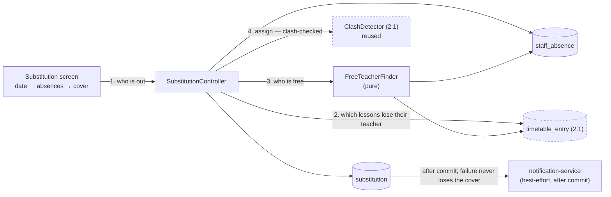
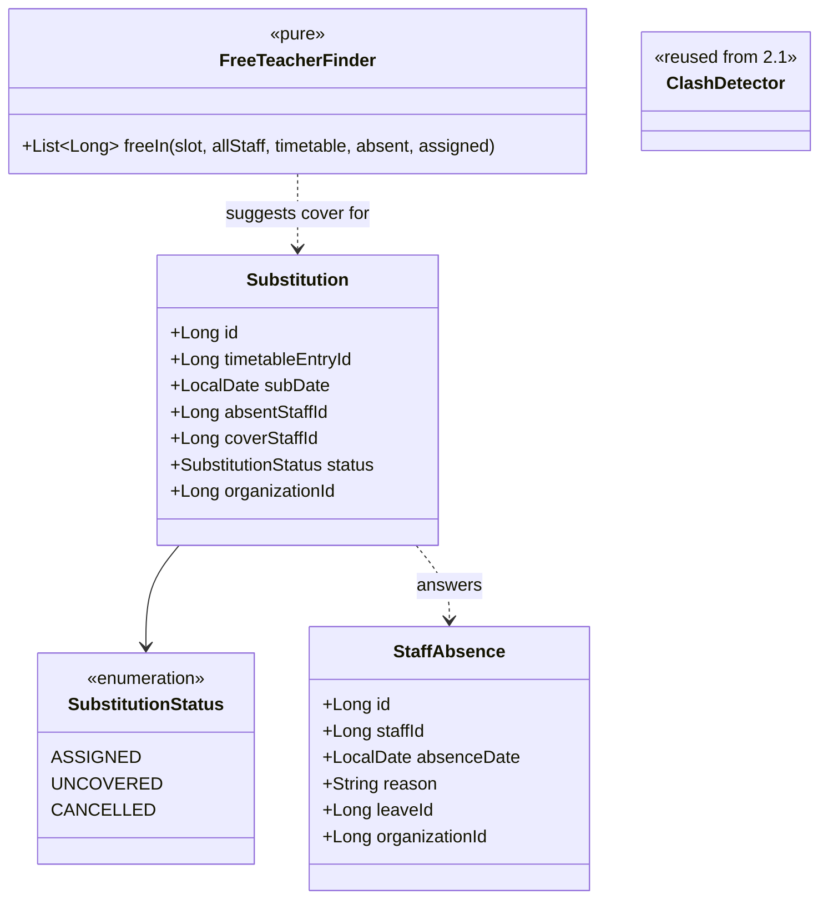
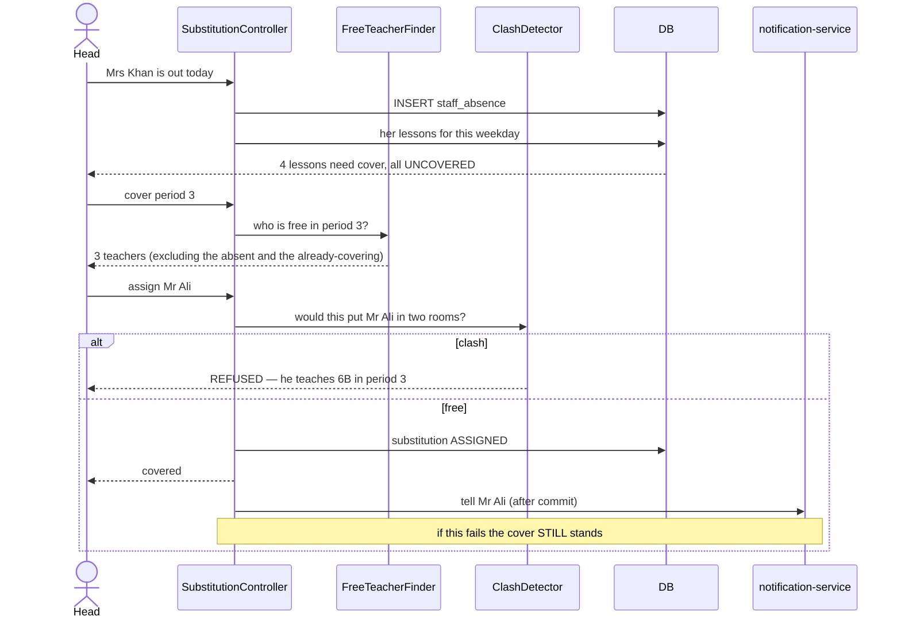

# Slice 2.2 — Substitution

**Status: ✅ DONE — `mvn test` + Cypress gate GREEN (2026-08-02).**
Gate `education/substitution.cy.js` (11 cases, none skipped) + `FreeTeacherFinderTest` (12 pure cases).
Flyway **V18**. Approved and shipped 2026-08-02.

**One item deliberately NOT shipped:** D6's notification is a correctly-shaped hook that logs rather than
sends — see the corrections in §4. §5 test 10 is not implemented.
Programme: `education-complete-programme.md` Phase 2.2 — *"Substitution — cover an absent teacher from the
timetable"*. Depends on **2.1** (timetable), done & green.

---

## 1. Document — what and why

2.1 says who *should* be in each room. 2.2 handles the morning when one of them isn't.

This is the first slice whose whole purpose is **same-day operational**: it runs at 07:50, under time
pressure, by someone who needs an answer in one screen. That shapes every decision below more than any
architectural preference does.

### The plan's dependency arrow points the wrong way — resolved here, not ignored

The programme (and my own 2.1 doc) says:

> 2.1 is the keystone: 2.2 substitution reads the timetable, and **2.3 staff attendance is what makes a
> substitution necessary** — so the order below is a dependency chain, not a preference.

Read literally that puts **2.3 before 2.2**: you cannot cover an absence the system does not know about.
And there is no staff-attendance data today — `Attendance` is **student-only** (`en` = enrolment number,
`sn` = student name); no `StaffAttendance` or leave entity exists.

Three ways out, and why the third wins:

| Option | Verdict |
|---|---|
| Reorder — build 2.3 first | Defensible, but 2.3 is a big slice (presence, leave types, balances, approval) and substitution is the part a school feels daily. Ordering by data lineage rather than by value. |
| Make 2.2 depend on 2.3 | Couples a small operational screen to an unbuilt HR model. 1.3 D6 refused exactly this coupling. |
| **2.2 owns a minimal "teacher is out today" record; 2.3 absorbs it later** | **chosen** |

A substitution needs one fact — *this teacher is not in today* — which a head of school enters in five
seconds. It does not need leave types, balances or approval chains. So this slice records the absence
itself, and **2.3 will later become the thing that writes those records** (from a leave request or a morning
register) rather than a parallel system. The programme's chain is corrected in place rather than left
pointing backwards.

### What exists to build on

| Existing | Consequence |
|---|---|
| `TimetableEntry` (2.1) with `staffId`, `dayOfWeek`, `periodId` | the lessons needing cover are a query, not a new structure |
| `TimetableEntryRepository.findByStaffScoped` | already written for the teacher grid; 2.2 is its second caller |
| `ClashDetector` (2.1) | the cover teacher must not already be teaching — **the same rule, reused, not reimplemented** |
| `notification-service` via the existing alerts path | telling the covering teacher is a solved problem |
| No staff attendance | see above — this slice creates the minimal record |

---

## 2. Design

### D1 — Two entities, and the smaller one is the point

```
StaffAbsence      staffId · date · reason · (later: leaveId)      ← "who is out"
Substitution      timetableEntryId · date · coverStaffId · status ← "who covers this lesson"
```

`StaffAbsence` is deliberately thin: **no leave type, no balance, no approval.** Those belong to 2.3, and
adding a `type` column here would create a second vocabulary that 2.3 then has to reconcile. A nullable
`leave_id` is reserved so 2.3 can link its own record without a migration that rewrites history.

### D2 — A substitution is per-LESSON, not per-day

Covering "Mrs Khan on Tuesday" is not one decision; it is one per period she teaches, and different people
will cover different periods. So the row references a **`timetableEntryId` + a date**, not a teacher-day.

The date matters because the timetable is a *weekly pattern* (2.1 D5): the same `TimetableEntry` recurs every
Tuesday, so a substitution must say **which** Tuesday. This is the first place the weekly-pattern decision
has a consequence, and it is why 2.1 deliberately did not version the timetable.

### D3 — Suggest cover; never auto-assign

The screen lists, per uncovered lesson, the teachers who are **free in that slot** — derived from the
timetable, minus anyone already absent, minus anyone already covering something else in that period.

**It does not pick one.** Auto-assignment optimises the wrong thing: a head knows that Mr Ali has three
covers this week already, that Mrs Iqbal teaches this subject, and that someone has a hospital appointment
at 11. None of that is in the database. A ranked *suggestion* with the facts that are known — free now, has
taught this subject before, covers already assigned today — respects that and stays useful.

**Free is computed, never stored.** It is `all staff − teaching in this slot − absent today − already
covering in this slot`, which is exactly the kind of thing that goes stale the moment it is cached.

### D4 — The cover teacher is clash-checked with 2.1's own rule

Assigning cover must not put someone in two rooms at once. Rather than re-derive that, the check reuses
`ClashDetector`: a substitution is validated as though it were a timetable entry for the cover teacher in
that slot.

**One difference, and it is deliberate:** a room clash on a *substitution* is not even a warning — the cover
teacher goes to the absent teacher's room, which is by definition already booked for that class. Passing the
substitution through the room rule unchanged would emit a warning on every single cover, and a warning that
always fires is one nobody reads.

### D5 — An uncovered lesson is a first-class state, not an absence of a row

`Substitution.status`: `ASSIGNED` · `CANCELLED` · **`UNCOVERED`**.

A lesson nobody can cover is the single most important thing on the screen — it means a class will be
unsupervised. Representing it as "no row" makes it invisible to every query and impossible to report on.
Recording it explicitly means the morning list can say *"Period 3, Class 5A — nobody assigned"* and the
day's history can answer "how often are we short?".

### D6 — Notify the cover teacher, best-effort, never blocking

The assignment writes and commits; the notification is fired afterwards through the existing alerts path.
If notification-service is down the substitution still stands — the same best-effort discipline as the party
bridge and the GL outbox. **A failed email must never lose the cover assignment**, because the school still
happened.

### D7 — Scope

| In | Out |
|---|---|
| `StaffAbsence` + `Substitution` (V18), org-scoped | leave types, balances, approval (2.3) |
| mark a teacher absent for a date | staff daily attendance register (2.3) |
| per-lesson cover with free-teacher suggestions (D3) | auto-assignment / optimisation (D3) |
| clash check reusing `ClashDetector` (D4) | payroll consequences of cover (Phase 4) |
| `UNCOVERED` as an explicit state (D5) | student-visible timetable changes (Phase 3 portals) |
| notify the cover teacher, best-effort (D6) | recurring/long-term absence (§6) |
| today's substitution list + print | |

### Layer answers (§5b)

| Layer | Answer |
|---|---|
| **UI/UX** | one screen answering one question: *"who is out today, and who covers their lessons?"* Pick a date (defaulting to today) → mark absences → the uncovered lessons list themselves with a free-teacher dropdown each. `UNCOVERED` rows are visually loud. Printable, because this gets pinned to a staffroom wall |
| **Service/API** | `/getSubstitutionDay`, `/markStaffAbsent`, `/clearStaffAbsence`, `/assignSubstitute`, `/clearSubstitute`. All writes **`ADMIN_PRIVILEGE`** — deciding who teaches whom is the same class of act as the timetable itself. Reads open: a teacher must be able to see they are covering period 3 |
| **Database** | `staff_absence`, `substitution` (V18). UNIQUE `(organization_id, staff_id, absence_date)` — a teacher is absent once per day; UNIQUE `(organization_id, timetable_entry_id, sub_date)` — one decision per lesson per day, and the constraint is what makes that true under a double-click (1.3 D1) |
| **Patterns** | reuse-the-validator (D4); explicit-state-over-absent-row (D5); best-effort side effect after commit (D6); suggest-don't-decide (D3); DB-enforced idempotency |
| **Microservice design** | education-local; composes `notification-service` through the path alerts already uses. No new service, no shared-library change |
| **Configurability** | none, deliberately. "May a teacher be in two rooms at once" is not policy, and cover *fairness* rules are a real feature (§6) rather than a toggle |
| **DRY** | `ClashDetector` reused rather than re-derived; `TimetableEntryRepository.findByStaffScoped` gets its second caller; `StudentVisibilityService` **not** reused — this is staff-shaped |

---

## 3. Architecture & UML







---

## 4. Implement — checklist

- [x] `StaffAbsence` + `Substitution` + `SubstitutionStatus`, Flyway **V18**
- [x] both UNIQUE keys (one absence per teacher per day; one decision per lesson per day)
- [x] `FreeTeacherFinder` — **pure**: all staff − teaching in slot − absent − already covering
- [x] assignment reuses `ClashDetector`, with the room rule suppressed for substitutions (D4)
- [x] `UNCOVERED` written explicitly when a lesson has no cover (D5) — `openUncoveredLessons`
- [x] `ADMIN_PRIVILEGE` on writes; reads open so a teacher can see their own cover
- [x] Substitution screen + print + i18n × **6 bundles**, 88 lines each, all 23 new keys verified in all six
- [x] `FreeTeacherFinderTest` (12 pure cases) + `cypress/e2e/education/substitution.cy.js` (11 cases)
- [x] **fixtures seeded, never skipped** — the spec creates its own periods, lesson and absence
- [~] notify after commit, best-effort (D6) — **wired as a logged hook, NOT yet a real send.** See below.

### Corrections made during implementation

**D6's notification is a hook, not a delivery.** The design said the cover teacher is notified through the
existing alerts path. What shipped is `notifyCoverBestEffort` with the correct *shape* — after commit,
narrow catch, failure logged and swallowed so a lost message can never lose the assignment — but it writes a
log line rather than calling `notification-service`. Wiring the real send needs the alert-channel plumbing
that `AlertController` owns, which is a bigger reach than this slice should make silently.
**Called out rather than ticked**, on the same principle as slice B's `@PositiveOrZero`: a hook that looks
like a notification and isn't is worse than an obvious gap. Test 10 of §5 is therefore not implemented.

**A second guard against double-covering, at the endpoint.** `FreeTeacherFinder` already excludes anyone
covering elsewhere in the slot, but that only shapes the *suggestions*. `/assignSubstitute` is reachable
directly, so it re-checks — a UI filter is not an authorisation.

**Marking someone absent twice is idempotent, not an error.** Not in the design. It is a double-click on a
button pressed at 07:50; returning a failure for it would be noise. The UNIQUE key still guarantees one row.

**Clearing an absence CANCELS its substitutions and deletes the absence row.** The design said absences
cancel their covers; it did not say what happens to the absence itself. The absence is a fact that turned
out to be false ("they came in after all"), so it goes; the substitutions are decisions the school acted on,
so they are kept as `CANCELLED` — the 1.6 D7 rule.

## 5. Test

| # | Case | Expected |
|---|---|---|
| 1 | Mark a teacher absent | their lessons that weekday list as `UNCOVERED` |
| 2 | Free-teacher list | excludes anyone teaching in that slot |
| 3 | …also excludes anyone **absent** that day | not offered |
| 4 | …also excludes anyone **already covering** in that slot | not offered — the case a naive query misses |
| 5 | Assign a teacher who is busy that period | refused, naming the clash (`ClashDetector`) |
| 6 | Assign a free teacher | `ASSIGNED`; the lesson leaves the uncovered list |
| 7 | Room "clash" on a substitution | **no warning** — the cover uses the absent teacher's room (D4) |
| 8 | Double-clicked assign | one row; the UNIQUE key holds |
| 9 | Clear the absence | its substitutions cancel; the day is clean |
| 10 | notification-service down | the substitution still saves (D6) |
| 11 | A teacher assigns cover | 403 — ADMIN tier |
| 12 | Another tenant's absence by id | refused |

Gate: `cypress/e2e/education/substitution.cy.js`.
**Regression:** `timetable.cy.js` (shares `ClashDetector` and the entry repo), `privilege-map.cy.js`,
`alerts.cy.js` (shares the notification path).
Pure unit: `FreeTeacherFinderTest`.

## 6. Open / deferred

**2.3 staff attendance & leave absorbs `StaffAbsence`.** It should *write* these rows from a leave approval
or a morning register, not create a parallel absence concept. `StaffAbsence.leaveId` is reserved for it.
**This is the carried requirement 2.3 must honour** — recorded in the programme's carried-requirements table.

**Cover fairness.** "Mr Ali has covered five periods this week" is the first thing a head asks and this slice
does not track it. It needs a week-level count and a policy discussion about what is fair. Real, and its own
slice — deliberately not a setting.

**Recurring / long-term absence.** Maternity leave is not fourteen daily absence rows. Needs a date range and
a standing substitute, which changes the shape of both entities. Belongs with 2.3.

## 7. Risks

- **The weekly-pattern + date model (D2) is the subtle part.** A substitution points at a recurring
  `TimetableEntry` *plus* a date. Get that wrong and cover silently applies to every Tuesday. Test 8 and the
  UNIQUE key pin it.
- **Suppressing the room rule (D4) is a deliberate hole.** If substitutions ever move a class to a different
  room, the suppression hides a genuine clash. Acceptable now because cover happens in the same room; revisit
  the moment a room field appears on a substitution.
- **`StaffAbsence` will be absorbed by 2.3**, so its shape is a commitment to a slice not yet designed. Kept
  deliberately minimal for exactly that reason — the less it asserts, the less 2.3 has to unpick.
