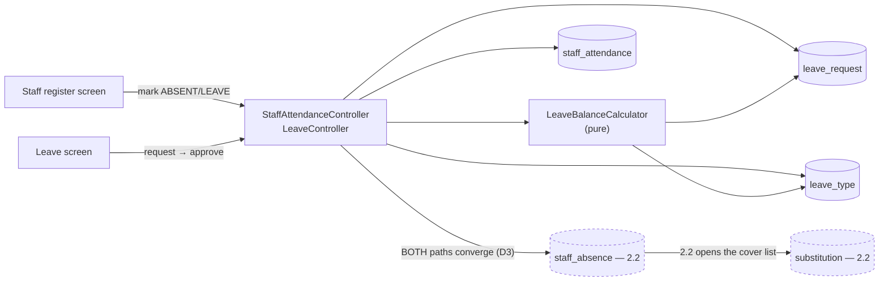
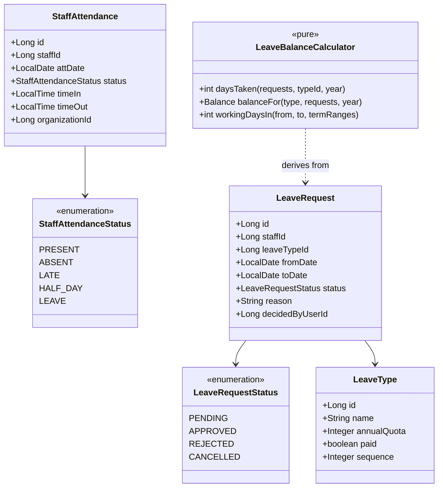
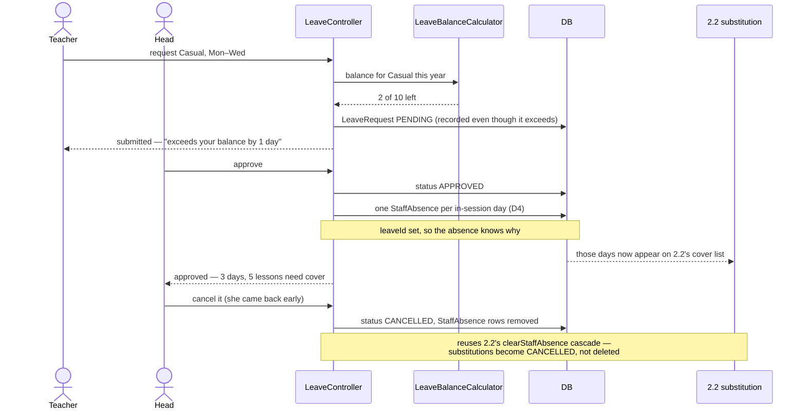

# Slice 2.3 — Staff attendance & leave

**Status: ✅ DONE — `mvn test` + Cypress gate GREEN (2026-08-03).**
Gate `education/staff-leave.cy.js` (11 cases, none skipped) + `LeaveBalanceCalculatorTest` (16 pure cases).
Flyway **V19**. Regression green, including `substitution.cy.js` — which is what proves the
`StaffAbsenceService` extraction left 2.2's behaviour unchanged.

**The gate earned its keep twice on this slice** — see the corrections in §4: it caught a real defect
(the over-quota warning was inert in the default configuration) that no unit test could have seen, because
the calculator was correct and the *call site* was wrong.
Programme: `education-complete-programme.md` Phase 2.3 — *"Staff attendance & leave — presence, leave types,
balances"*. Depends on **2.2** (substitution), done & green.

**Carried requirement this slice must honour:** 2.2 owns `StaffAbsence`. 2.3 must **write those rows**, not
build a parallel absence concept. `StaffAbsence.leaveId` was reserved for exactly this.

---

## 1. Document — what and why

2.2 answered *"cover the teacher who is out."* 2.3 answers the two questions behind it: **was everyone in
today**, and **is this absence authorised**.

Those look like one feature and are really two, joined at one point:

```
register  → "Mrs Khan is not here"        ─┐
                                            ├─→ StaffAbsence (2.2) ─→ substitution
leave     → "Mrs Khan is approved off"    ─┘
```

The join is the whole design. Both paths must converge on the record 2.2 already reads, or the school ends
up with a teacher who is on approved leave *and* marked present, with no cover arranged.

### The precedent to learn from, not copy

Student attendance exists and works. Two things about it should **not** be repeated:

| Student `attendance` | For staff |
|---|---|
| **No UNIQUE key** on `(org, enroll_no, att_date)` — it upserts via `findFirstBy…`, a check-then-act race. Two concurrent saves of one register create two rows | **UNIQUE from day one.** Same class of defect the review's finding D exposed in twelve duplicate checks; there is no reason to ship a thirteenth |
| Cryptic columns (`en`, `sn`, `grid`, `gn`, `dt`, `rem`) — still on slice 0.4's remainder list | readable names from the start |

Its **good** decision is worth copying: one row per person per day, marked in a batch for a whole group.

### What exists to build on

| Existing | Consequence |
|---|---|
| `StaffAbsence` (2.2) — staffId · date · reason · reserved `leaveId` | the convergence point; 2.3 becomes its main writer |
| `Substitution` + the morning screen (2.2) | approving leave automatically opens the cover list — no new plumbing |
| `Staff.timeIn` / `timeOut` | a contracted day already exists, so "late" is computable rather than guessed |
| `common-settings` with `intOf` (1.6) | scalar policies (grace minutes, half-day threshold) have a home |
| `EduAuditService` | a rejected leave request is contested data |

---

## 2. Design

### D1 — Three entities, and a balance that is NOT one of them

```
StaffAttendance   staffId · date · status · timeIn · timeOut      ← was everyone in
LeaveType         name · annualQuota · paid · sequence            ← what leave exists here
LeaveRequest      staffId · typeId · from · to · status · reason  ← is it authorised
```

**Balance is DERIVED, never stored:** `quota − approved days taken in the year`. A stored balance is a cache
of a sum, and the moment a request is cancelled, back-dated or corrected it is wrong with nothing saying so.
This is 1.4 D4's rule (grading is derived) and 1.1 D3's (current term is derived), applied to the number a
teacher will argue about — which is exactly the number that must not be able to drift.

The cost is a query per staff member per type. That is bounded by (staff × leave types), tens of rows, and
it is computed in **one grouped query**, not per person — standard D3b.

### D2 — `LeaveType` is an entity; the *policies* are settings

Same split as 1.4 (bands are an entity, `edu.grading.*` are settings) and 1.1 (terms are an entity, no
count setting). A school's leave types are a **list** — Casual, Sick, Earned, Unpaid — and lists do not fit
a scalar store.

| Setting | Type | Default | Why an org changes it |
|---|---|---|---|
| `edu.attendance.staffGraceMinutes` | INT | 15 | how late is "late" |
| `edu.leave.requireApproval` | BOOL | true | small schools mark leave directly; large ones approve it |

No `edu.leave.typeCount`, no hard-coded type list. **No `edu.leave.allowNegativeBalance`** — see D5.

### D3 — Marking the register and approving leave BOTH write `StaffAbsence`

The carried requirement, made concrete:

| Action | Writes |
|---|---|
| register marks `ABSENT` or `LEAVE` | a `StaffAbsence` for that day, `leaveId` null (register) or set (leave) |
| leave request **approved** | one `StaffAbsence` per day in range, each carrying `leaveId` |
| leave request cancelled / rejected after approval | those `StaffAbsence` rows removed, and **2.2's substitutions for them cancelled** |
| register corrected to `PRESENT` | the `StaffAbsence` for that day removed, same cascade |

2.2's `clearStaffAbsence` already cancels substitutions and keeps them as `CANCELLED`; this slice reuses that
path rather than duplicating the cascade. **One absence concept, three ways in, one way out.**

### D4 — A leave request spanning days is ONE record, expanded on approval

The request is a **range** (a teacher asks for Monday–Wednesday, once). The absences are **per day**, because
that is what a substitution needs.

So approval expands the range into daily `StaffAbsence` rows — **skipping days the school does not work**.
That raises the obvious question, and the honest answer is that the platform has no holiday calendar: `Term`
has start/end dates but nothing marks a Sunday or a public holiday. So:

- days outside every `Term`'s range are skipped (the school is not in session)
- **weekends are NOT skipped**, because "which days are the weekend" varies by country — Friday–Saturday in
  much of the region this platform serves — and guessing wrong silently deducts the wrong number of days

A holiday calendar is named in §6. Until it exists, **a leave day that lands on a non-working day is visible
and correctable** rather than silently swallowed, which is the safer failure for a number people count.

### D5 — Over-quota WARNS, and the request still records

A teacher with two days left who asks for five is a conversation, not an error. The system says *"this
exceeds the Casual balance by 3 days"* on both the request and the approval screen, and approves it if the
head approves it.

**Deliberately not a setting.** "May balances go negative?" sounds configurable, but the honest behaviour is
the same either way: the school decides case by case, and the system's job is to make the overage impossible
to miss. A toggle would add a way to *hide* it.

### D6 — Status flow, and why REJECTED is kept

```
PENDING ──approve──► APPROVED ──cancel──► CANCELLED
   │                                          ▲
   └──reject──► REJECTED ─────────────────────┘  (kept, never deleted)
```

A rejected request is contested data — "I asked and was refused" is precisely what gets disputed later — so
it is audited (`EduAuditService`) and never deleted. Same rule as a superseded report card (1.5 D5) and a
reversed promotion (1.6 D7).

When `edu.leave.requireApproval` is off, a request is created `APPROVED` directly; the state machine does not
change, only the entry point.

### D7 — Scope

| In | Out |
|---|---|
| `StaffAttendance` daily register (+UNIQUE), batch-marked | payroll deduction for unpaid leave (Phase 4) |
| `LeaveType` CRUD, org-scoped | carry-forward / accrual of unused balance (§6) |
| `LeaveRequest` with the D6 flow | a holiday calendar (§6, and D4 depends on it) |
| **derived** balances (D1) | leave for non-staff (students already have attendance) |
| both paths writing `StaffAbsence` (D3) | approval chains beyond one approver |
| two settings; late derived from `Staff.timeIn` | biometric/device attendance capture |

### Layer answers (§5b)

| Layer | Answer |
|---|---|
| **UI/UX** | two screens. **Staff register**: a date, the staff list, one status each, marked in a batch — the shape the student register already proves. **Leave**: types (ADMIN), a request form, and a pending queue with the balance and any overage shown *at the point of approval*, not buried |
| **Service/API** | `/getStaffRegister`, `/markStaffAttendanceBulk`, `/getLeaveTypes`, `/saveLeaveType`, `/deleteLeaveType`, `/getLeaveRequests`, `/saveLeaveRequest`, `/decideLeaveRequest`, `/getLeaveBalances`. Register + type CRUD + decisions are **`ADMIN_PRIVILEGE`**; **requesting** leave is `WRITE_PRIVILEGE` (a teacher asks for their own) |
| **Database** | `staff_attendance`, `leave_type`, `leave_request` (V19). **UNIQUE `(organization_id, staff_id, att_date)`** — the thing student attendance lacks. Indexes `(org, att_date)` and `(org, staff_id, status)` per D3b |
| **Patterns** | derive-don't-store for balances (1.4 D4); entity-for-lists + settings-for-scalars (1.1/1.4); converge-on-one-record (D3); explicit state machine kept, never deleted (1.5/1.6); batch-not-per-row |
| **Microservice design** | education-local. `StaffAbsence` stays in education; no new service. Payroll will later *read* approved unpaid leave — a reason to keep `LeaveType.paid` honest now |
| **Configurability** | grace minutes and approval-required, per org. **Not** the leave types (a list), **not** negative balances (D5) |
| **DRY** | 2.2's `clearStaffAbsence` cascade reused rather than reimplemented; `StaffAbsence` reused rather than forked; the batch-register shape follows `markAttendanceBulk` |

---

## 3. Architecture & UML







---

## 4. Implement — checklist

- [x] `StaffAttendance` + `StaffAttendanceStatus`, `LeaveType`, `LeaveRequest` + `LeaveRequestStatus`, Flyway **V19**
- [x] **UNIQUE `(organization_id, staff_id, att_date)`** — the constraint student attendance never got
- [x] `LeaveBalanceCalculator` — **pure**: quota, requests and term ranges in; days-taken and balance out
- [x] balances read the year's requests in ONE query and compute in memory, never a query per staff member
- [x] approving a request writes one `StaffAbsence` per in-session day, carrying `leaveId` (D3/D4)
- [x] cancelling/rejecting removes them **through the shared owner**, not a copy — see the extraction below
- [x] register `ABSENT`/`LEAVE` writes `StaffAbsence`; correcting to `PRESENT` removes it
- [x] over-quota **warns** and still records (D5)
- [x] `REJECTED` kept and audited via `EduAuditService` (D6)
- [x] two settings (D2); `LATE` derived from `Staff.timeIn` + grace minutes
- [x] register + leave screens + i18n × **6 bundles**, 54 lines each, all 45 new keys verified in all six
- [x] `LeaveBalanceCalculatorTest` (14 pure cases) + `cypress/e2e/education/staff-leave.cy.js` (11 cases)
- [x] **fixtures seeded, never skipped** — the spec creates its own capped and uncapped leave types

### Patterns applied (named, so they can be argued with)

| Pattern | Where | Why this one |
|---|---|---|
| **Extract Class / single owner of an invariant** | `StaffAbsenceService` | six paths now mean "this teacher is in/out"; a copied cascade drifts into an unsupervised classroom |
| **Derived read model** | `LeaveBalanceCalculator` — nothing stored | a stored balance is a cache of a sum that silently goes wrong on any correction (1.4 D4 applied) |
| **Pure function core / imperative shell** | calculator + controllers | the arithmetic a teacher will argue about tests with no Spring, no DB, no Docker |
| **Entity-for-lists, settings-for-scalars** | `LeaveType` vs `edu.attendance.*` | 1.1 (terms) and 1.4 (bands) reached the same split; a list does not fit a scalar store |
| **DB-enforced idempotency** | UNIQUE `(org, staff_id, att_date)` | the student register's missing key is a live check-then-act race; this one does not repeat it |
| **Snapshot / value-copy** | `leave_type_name`, `staff_name`, `days_counted` | renaming a type must not retitle a decision already taken (1.5 D1) |
| **State machine, append-only** | `LeaveRequestStatus`, REJECTED kept | "I asked and was refused" is what gets disputed later |

**Library vs service:** no new service and no new library. Staff attendance owns no data outside education,
has no external integration and no independent lifecycle — by the decision rule (*reusable capability →
library unless it owns data + lifecycle + integration → service*) it is education's domain logic. The one
cross-slice extraction is a **class**, not a module, because it has exactly one bounded context.

### Corrections made during implementation

**`StaffAbsenceService` was extracted, and 2.2 was refactored onto it.** The design said 2.3 would "reuse
2.2's cascade". In fact that cascade lived *inside* `SubstitutionController`, so reusing it literally would
have meant a controller calling a controller. It is now a service that both slices delegate to — the same
extraction `StudentVisibilityService` got in 1.5, for the same reason. **2.2's behaviour is unchanged**, so
`substitution.cy.js` is the regression that proves the refactor was safe.

**The register links an existing absence rather than writing a second one.** Not in the design. If the
register marks someone ABSENT in the morning and their leave is approved that afternoon, the second write
now *links* `leaveId` onto the existing row. Two rows for one day is exactly what the UNIQUE key forbids, and
"absent" and "absent, authorised" are the same fact with more known about it.

**Withdrawing leave only removes absences that leave created.** `withdrawAbsences` checks
`leaveId == request.id` before clearing. A register-marked absence on the same day is a separate fact and
must survive the leave being cancelled — otherwise cancelling a request would silently mark someone present
who genuinely was not.

**The overage was computed AFTER the insert, and was therefore always 0 — caught by the gate, fixed
2026-08-03.** `saveLeaveRequest` read `daysTaken` after saving and passed `taken - days`. But `daysTaken`
counts **APPROVED only**, and with `requireApproval` on — the default — the new row is `PENDING` and was
never in `taken`; subtracting removed it a second time. Result: **`overage` came out 0 for every request in
the default configuration**, so the warning D5 exists for never fired. The feature would have shipped
silently inert.

*Fixed* by reading the prior balance **before** the insert (`alreadyTaken`), which is correct whether or not
approval is required — the old form only worked in the auto-approve case.

**Worth noting how this got through:** `LeaveBalanceCalculator.overageFor` was correct all along and its
unit test passed. The defect was the **argument at the call site**, which no test of the callee can see.
`LeaveBalanceCalculatorTest` now states the contract explicitly (`alreadyTaken` = days taken *before* this
request) and keeps the buggy call as a counter-example, plus a test that a PENDING request is not counted —
the fact that made the subtraction wrong.

**`requireApproval` fails to REQUIRING approval.** Standard C3 (a safety flag fails ON): if the setting
cannot be read, granting leave nobody approved is the worse mistake.

## 5. Test

| # | Case | Expected |
|---|---|---|
| 1 | Mark the register for a whole staff list | one row each; re-marking updates, never duplicates |
| 2 | Mark the same day twice concurrently | one row — the UNIQUE key, not the pre-check |
| 3 | Mark `ABSENT` | a `StaffAbsence` appears, and 2.2's day shows their lessons needing cover |
| 4 | Correct it to `PRESENT` | the absence and its substitutions clear |
| 5 | Approve a Mon–Wed request | three `StaffAbsence` rows, each with `leaveId` |
| 6 | …and 2.2's cover list | shows every lesson across those three days |
| 7 | Cancel the approved request | absences removed; substitutions `CANCELLED`, not deleted |
| 8 | Balance after approving 3 of 10 | 7 — **derived**, and still 7 after the row is read again |
| 9 | Request exceeding the balance | recorded, with the overage named (D5) |
| 10 | Reject a request | `REJECTED`, kept, audited, and **no** absence written |
| 11 | Arrive after `timeIn` + grace | `LATE`, not `ABSENT` |
| 12 | Leave days outside any term | skipped, and the count says so (D4) |
| 13 | A teacher requests their own leave | allowed (WRITE tier) |
| 14 | A teacher approves a request | 403 — decisions are ADMIN |
| 15 | Another tenant's request by id | refused |

Gate: `cypress/e2e/education/staff-leave.cy.js`.
**Regression:** `substitution.cy.js` (2.3 writes what it reads — **the most important one**),
`timetable.cy.js`, `attendance.cy.js` (student register untouched, prove it), `privilege-map.cy.js`,
`owner-config.cy.js` (catalog grows by two).
Pure unit: `LeaveBalanceCalculatorTest`.

## 6. Open / deferred

**A holiday calendar.** D4 skips days outside a term but cannot skip weekends or public holidays, because
the platform has no concept of either and the weekend is not Saturday–Sunday everywhere this ships. It is the
missing piece that would make leave-day arithmetic exact. Its own slice, and it also improves the timetable
and the term-length maths.

**Carry-forward and accrual.** "Five unused days roll into next year" is real policy and needs a year-close
step plus a stored opening balance — which is the first legitimate reason to store a balance at all, and it
should be an explicit opening figure, never a cached total.

**Payroll consequences.** Unpaid leave should reduce salary. `LeaveType.paid` is recorded now so Phase 4 has
the fact; nothing here acts on it.

**Student attendance's missing UNIQUE key.** Found while designing this slice (§1). It is the same
check-then-act race as the review's finding D, still open on the student register. Not fixed here — adding a
constraint to a live table with possible duplicates needs the audit-first discipline of DB standard D5 — but
it is now recorded rather than folklore.

## 7. Risks

- **The convergence in D3 is the slice.** If either path forgets to write `StaffAbsence`, a teacher is on
  leave with no cover arranged and nothing looks wrong. Tests 3, 5 and 6 exist for that, and
  `substitution.cy.js` is the regression that matters most.
- **Derived balances are recomputed on every render.** Correct, and cheap at this scale, but it is a sum over
  a growing table — measure once a school has a few years of history rather than assuming.
- **D4 counts weekend days as leave** until a holiday calendar exists. Deliberate and visible, but a school
  will notice, so the screen must show the day count it derived rather than just the range.
- **This slice is larger than 2.1 or 2.2** — three entities and two screens. If it needs splitting, the clean
  line is *register* (D1 first row + D3 register path) then *leave* (the rest); they share only
  `StaffAbsence`.
