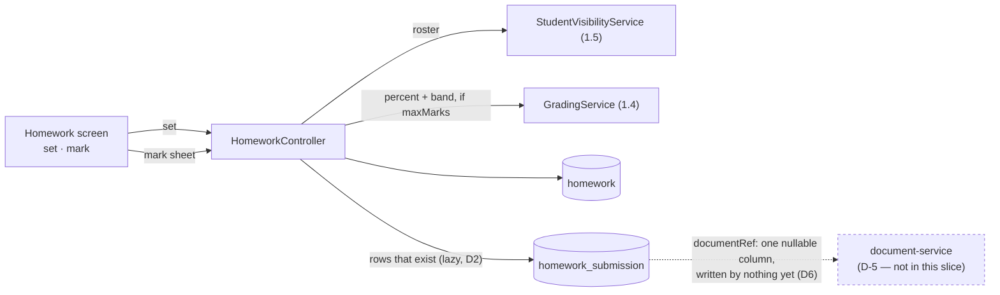
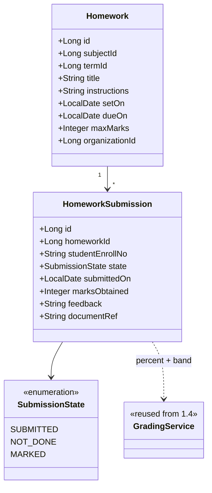

# Slice 2.4 — Homework / assignments

**Status: ✅ DONE — `mvn test` + Cypress gate GREEN (2026-08-03).**
Gate `education/homework.cy.js` (10 cases, none skipped) + `HomeworkRulesTest` (14 pure cases). Flyway **V20**.
**This completes Phase 2 bar 2.5 (discipline log).**

> **Gate run 1 was red — and it was the FIXTURE, not the product.** Six tests collapsed on an empty mark
> sheet because the spec chose `subjects[0]` and never checked that any student was in that subject's class.
> `getHomeworkSheet` was right: an empty class has an empty sheet. The spec now prefers a subject whose class
> has students and **seeds one if none does**.
>
> **Third time in Phase 2 that a fixture, not an assertion, was the defect** (2.1 test 3 counted against an
> unverified fixture; 2.4 assumed a populated class). The recurring lesson: *a spec must verify its own
> preconditions loudly — never assume the demo org's shape.*
Programme: `education-complete-programme.md` Phase 2.4 — *"Homework / assignments — set, submit, mark
(attachments via `document-service`)"*. Depends on **2.1** (timetable) for the class×subject spine.

**Ships without attachments, deliberately — and that is a correction to the plan.** See §1.

---

## 1. Document — what and why

Phase 2 so far is about staff: where they teach (2.1), who covers them (2.2), whether they were in (2.3).
2.4 is the first slice in this phase that reaches the **student** — and the first thing in the whole system
a guardian will look at more than once a term.

### The plan says "attachments via document-service". That gates on D-5, and this slice does not wait

The blocking-decisions table listed **D-5 (document storage backend: DB blob / filesystem / S3)** against
phase **4.3**. It is wrong by two phases: **2.4 reaches it first**, because homework attachments need the
same `document-service` that student documents will.

Three options, and why the third wins:

| Option | Verdict |
|---|---|
| Wait for D-5 and `document-service` | Blocks a whole slice on a platform decision and a new service. The homework *lifecycle* needs neither |
| Store files in education-service | Directly against §1.2 (compose, don't duplicate) and the standards' own note that a blob column in MySQL will not scale. It would also have to be undone |
| **Ship set → submit → mark without file upload; add attachments when D-5 lands** | **chosen** |

A teacher setting homework, a student marking it submitted, and a teacher grading it is the whole workflow.
File upload is one field on it. Shipping the workflow now and attaching files later costs a nullable column;
the reverse — waiting — costs the slice. **The programme's D-5 row is corrected in place** rather than left
pointing only at 4.3.

### What exists to build on

| Existing | Consequence |
|---|---|
| `Subject` → `@ManyToOne Grade` (1.2 D2) | homework is set for a *subject*, which already implies the class. No `gradeId` needed — and unlike 2.1 D2, nothing here needs a UNIQUE key on it, so the derive-don't-store rule holds |
| `Mark` (1.3) — per student × paper, `absent` distinct from zero | the precedent for per-student rows against a shared guardian, including the not-marked-yet distinction |
| `Term` (1.1), nullable | homework belongs to a term for reporting, and a school without terms keeps working |
| `StudentVisibilityService` (1.5) | who a teacher may set homework for is already answered |
| `EduAuditService` | a changed grade is contested data, exactly as marks are |

---

## 2. Design

### D1 — Two entities: the task, and one row per student

```
Homework            subjectId · title · setOn · dueOn · maxMarks · status   ← what was set
HomeworkSubmission  homeworkId · studentEnrollNo · state · marks · feedback ← one per student
```

Directly the `Exam`/`Mark` shape from 1.2/1.3, and for the same reason: the thing set once and the thing
recorded per child are different lifecycles. A flat row-per-student would copy the due date onto every row,
where copies drift.

### D2 — Submissions are created LAZILY, not pre-seeded for the class

Setting homework for a class of 40 does **not** write 40 submission rows. A row appears when there is
something to record — a submission, a grade, or an explicit "not done".

The alternative is tempting because it makes the mark-sheet a simple read. It is wrong here: pre-seeding
asserts 40 facts that are not yet true, and every student who joins the class afterwards is silently
missing. The roster comes from `StudentVisibilityService` at read time — the same call the marks grid
already uses (1.3) — and submissions are joined onto it.

### D3 — The state machine says what is TRUE, and "not submitted" is the absence of a row

```
(no row)  ──student submits──►  SUBMITTED  ──teacher marks──►  MARKED
    │                               │
    └──teacher records────────►  NOT_DONE ─────────────────────┘
```

**`NOT_DONE` is an explicit teacher judgement, not a default.** The difference from 2.2's `UNCOVERED` is
deliberate and worth stating: an uncovered lesson is a fact about *today* that must be visible before it
happens, so it is written eagerly. A missing homework is only a fact once someone decides the deadline has
passed and it counts — before that, "no row" honestly means "nothing recorded yet". Writing `NOT_DONE`
automatically at the due date would make the system accuse a child on a timer.

### D4 — Grading reuses 1.4's scale; it does NOT invent a second one

If `maxMarks` is set, a graded submission gets a percentage and a band through the existing
`GradingService` — the same call the marksheet and report card use.

**But homework does NOT flow into the report card.** 1.5's term aggregate is over exams weighted by
`Exam.weightPercent`; adding homework would change a published number's meaning with no way to see it had
changed. Continuous assessment is a real feature with its own weighting rules — §6, not a side effect here.

### D5 — Late is DERIVED from the due date, never stored

`submittedOn > dueOn` is late. Storing a `late` flag would freeze a judgement that changes the moment a
teacher extends a deadline — 1.4 D4's rule again.

Extending `dueOn` therefore un-lates every submission that beat the new date, which is the correct
behaviour and the reason not to store it.

### D6 — Attachments: one nullable column now, `document-service` later

`HomeworkSubmission.documentRef` — a nullable string, written by nothing in this slice.

Not a `@OneToMany` to a local `Attachment` table: that is the duplication §1.2 forbids and would have to be
migrated away. A single opaque reference is what a `document-service` client will populate, so the schema
does not change when D-5 lands. **A column nothing writes is normally a smell** (the D10 pattern this
codebase has been bitten by); it is justified here only because the alternative is a migration on a table
that will already hold real data, and it is recorded in §6 so it cannot be forgotten.

### D7 — Scope

| In | Out |
|---|---|
| `Homework` + `HomeworkSubmission` (V20), org-scoped | file upload / `document-service` (D6, gated on D-5) |
| set · list by class/subject · edit · delete-when-unmarked | homework counting toward report cards (D4, §6) |
| student submit + teacher `NOT_DONE` (D3) | guardian/student portal — this is the teacher's view (Phase 3) |
| grading with 1.4's scale + feedback (D4) | plagiarism, peer review, group assignments |
| derived late (D5), derived class-completion count | notifications to guardians (§6 — 2.2's hook is still a stub) |

### Layer answers (§5b)

| Layer | Answer |
|---|---|
| **UI/UX** | one screen, two modes. *Set*: subject, title, due date, optional marks. *Mark*: the class roster with each student's state, a marks box and feedback — the marks-grid shape teachers already know from 1.3. Overdue-and-unrecorded is visually distinct without being an accusation |
| **Service/API** | `/getHomework`, `/saveHomework`, `/deleteHomework`, `/getHomeworkSheet`, `/saveSubmissionBulk`. Setting and grading are **`WRITE_PRIVILEGE`** — this is teacher work, exactly as marks entry is (1.3 D6), not the ADMIN policy tier |
| **Database** | `homework`, `homework_submission` (V20). **UNIQUE `(organization_id, homework_id, student_enroll_no)`** — one row per child per task, enforced by the DB (1.3 D1). Indexes `(org, subject_id, due_on)` and `(org, homework_id)` per D3b |
| **Patterns** | guardian/child lifecycle split (1.2 D1); lazy row creation (D2); derived-not-stored for late and grade (1.4 D4); per-row partial success on bulk save (1.3 D3); DB-enforced idempotency; forward-compatible opaque reference (D6) |
| **Microservice design** | education-local. `document-service` is the one future edge, kept to a single nullable column so composing it later is additive |
| **Configurability** | none. "Is 23:59 late?" is arithmetic, not policy. A late-penalty rule would be policy — and it is §6, not a toggle bolted on |
| **DRY** | `GradingService` (1.4) for percent/band; `StudentVisibilityService` (1.5) for the roster; `EduAuditService` for grade changes; the bulk-save shape follows `saveMarksBulk` |

---

## 3. Architecture & UML





```mermaid
sequenceDiagram
  actor Teacher
  participant C as HomeworkController
  participant V as StudentVisibilityService
  participant DB
  participant G as GradingService

  Teacher->>C: set "Fractions ex. 4", Maths, due Friday, /20
  C->>DB: INSERT homework
  Note over C,DB: NO submission rows — 40 rows would assert<br/>40 facts that are not yet true (D2)

  Teacher->>C: open the mark sheet
  C->>V: who is in this class?
  V-->>C: 40 students
  C->>DB: the submissions that EXIST
  C-->>Teacher: roster + state each; no row = nothing recorded yet

  Teacher->>C: 17/20 for Ayesha, "not done" for Bilal
  C->>G: 17 of 20 → 85%, band A
  C->>DB: upsert both rows
  Note over DB: UNIQUE (org, homework_id, enroll_no) —<br/>a double-clicked save cannot make two rows
  C-->>Teacher: saved; late is DERIVED from the due date (D5)
```

---

## 4. Implement — checklist

- [x] `Homework` + `HomeworkSubmission` + `SubmissionState`, Flyway **V20**
- [x] UNIQUE `(organization_id, homework_id, student_enroll_no)` + the two read indexes
- [x] submissions created LAZILY — setting homework writes no student rows (D2)
- [x] `NOT_DONE` only when a teacher records it; never on a timer (D3)
- [x] percent + band via `GradingService`; **no** report-card contribution (D4)
- [x] late DERIVED from `dueOn`, never stored (D5)
- [x] `documentRef` nullable, written by nothing, documented as awaiting D-5 (D6)
- [x] per-row partial success on bulk save, status `PARTIAL` not `SUCCESS` (1.3 D3)
- [x] `WRITE_PRIVILEGE` on set and grade; delete refused once anything is marked
- [x] audit grade changes via `EduAuditService`
- [x] screen + i18n × **6 bundles**, 34 lines each, all 26 new keys verified in all six
- [x] pure tests + `cypress/e2e/education/homework.cy.js` (10 cases) — **named `HomeworkRulesTest`**, not
      `HomeworkStateTest`: it covers lateness, overdue, marks bounds and delete safety, which is more than
      state (14 cases)
- [x] **fixtures seeded, never skipped**

### Patterns applied (named, so they can be argued with)

| Pattern | Where | Why this one |
|---|---|---|
| **Guardian/child lifecycle split** | `Homework` + `HomeworkSubmission` | 1.2/1.3's Exam/Mark shape: a flat row-per-student copies the due date onto every row, where copies drift |
| **Lazy row creation** | no rows on set (D2) | pre-seeding asserts facts that are not yet true and silently misses later joiners |
| **Derived, not stored** | lateness (D5), percentage, band | extending a deadline must un-late everyone who beat the new date — a stored flag cannot |
| **Pure function core** | `HomeworkRules` | the judgements test with no Spring, DB or Docker |
| **Extract shared helper** | `GradingService.percentOf` | homework and exam marks now round by ONE rule; two rules would band 74.5% differently on two screens |
| **Per-row partial success** | `saveSubmissionBulk` → `PARTIAL` | 1.3 D3 — one bad cell must not lose 39 good ones, and the UI must not round it up |
| **Forward-compatible opaque reference** | `documentRef` | a `document-service` client populates it later with no migration on a table that will hold real data |

**Library vs service:** neither. Homework owns no data outside education and has no independent lifecycle;
`document-service` is the one future edge, deliberately kept to a single nullable column.

### Corrections made during implementation

**`GradingService.percentOf` was extracted, and `percentFor(Mark, ExamPaper)` now delegates to it.** The
design said homework would "reuse 1.4's scale", but the only public entry point took a `Mark` and an
`ExamPaper` — neither of which a homework submission has. Rather than duplicate `marks * 100 / max` with
its own rounding, the shared arithmetic moved into one method. **Two rounding rules in one school would put
74.5% in different bands on the marksheet and the homework sheet**, which is undebuggable from a screenshot.

**A blank state is SENT, and clears the row.** Not in the design, which only said rows are created lazily.
The corollary matters: if a teacher clears a state back to blank, the row is *deleted* rather than set to
some default — silence has to be restorable, or the lazy-creation rule only works in one direction.

**`HomeworkRules` rather than the planned `HomeworkStateTest`.** The pure surface turned out to be wider
than state transitions: lateness, overdue-vs-not-done, marks bounds and delete safety are all judgement
calls worth pinning. Named for what it holds.

## 5. Test

| # | Case | Expected |
|---|---|---|
| 1 | Set homework for a class | saved; **zero** submission rows created (D2) |
| 2 | Open the mark sheet | every student in the class listed, all with no state |
| 3 | Record a submission | one row; the rest still have none |
| 4 | Grade it out of 20 | percent + band from 1.4's scale, matching the marksheet's answer |
| 5 | Save the same grade twice | one row — the UNIQUE key, not the pre-check |
| 6 | Submit after the due date | reported late |
| 7 | Extend `dueOn` past it | **no longer late** — derived, not stored (D5) |
| 8 | Mark one student `NOT_DONE` | recorded as a judgement; others unaffected |
| 9 | A student who joins the class after homework was set | appears on the sheet with no state (the pre-seeding bug D2 avoids) |
| 10 | Delete homework that has grades | refused |
| 11 | Report card after grading homework | **unchanged** — homework does not feed it (D4) |
| 12 | Another tenant's homework by id | refused |
| 13 | Grading by a teacher | allowed (WRITE tier, as 1.3) |

Gate: `cypress/e2e/education/homework.cy.js`.
**Regression:** `marks.cy.js` and `grading.cy.js` (shared `GradingService`), `report-cards.cy.js`
(**case 11 is the one that matters** — proving homework did not leak into a published figure),
`privilege-map.cy.js`.
Pure unit: `HomeworkStateTest` — late derivation, state transitions, and the percent/band delegation.

## 6. Open / deferred

**Attachments (D6) — the reason this slice is smaller than the plan implied.** Needs D-5 and
`document-service`. The column is in place so adding them is additive.

**Continuous assessment.** Homework counting toward a term result is a real requirement and a change to
1.5's aggregate, which is a published number. It needs its own weighting model and its own slice — adding
it quietly here would change what a report card means without anyone deciding to.

**Late penalties.** "10% off per day late" is policy, so it belongs in `common-settings` — but only once
someone asks, and it interacts with continuous assessment above.

**Guardian visibility.** Homework is one of the two things a guardian will check daily. That is Phase 3.1's
portal reading this data; nothing here should be shaped for it beyond keeping the state honest.

**Notifying students/guardians when homework is set.** Wants the notification path — which 2.2 left as a
logging stub. Worth doing once, properly, for both.

## 7. Risks

- **D2 (lazy rows) makes the mark sheet a join, not a table read.** Correct, and it is the same shape the
  marks grid already uses — but it means "who has not submitted" is computed, so the roster query must stay
  the one place it is derived.
- **D4's boundary will be tested by users, not just by tests.** A teacher who grades homework out of 20 will
  reasonably expect it on the report card. The screen should say plainly that homework is not part of the
  term result, or the first support question will be why the numbers disagree.
- **`documentRef` is a column nothing writes.** Justified in D6, but it is exactly the shape of the
  `Student.fee`/`Student.vf` finding from slice B §8 — an unreachable field. It must stay documented, or a
  future audit will read it as the same defect.
