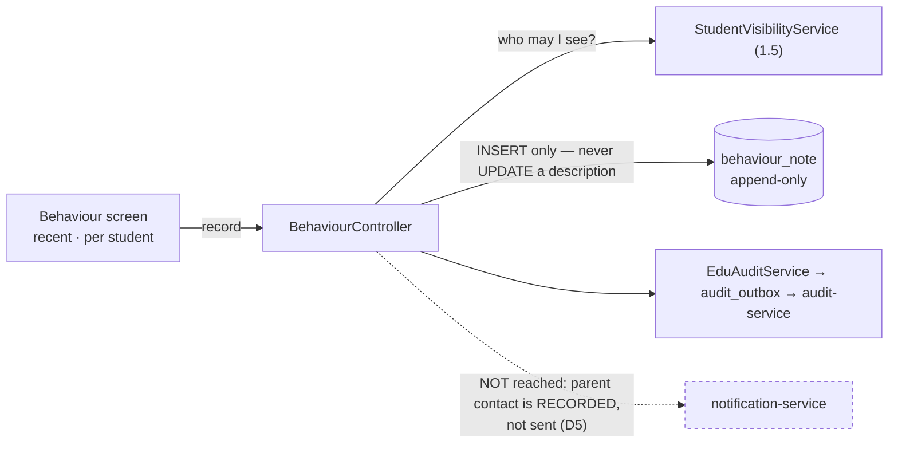
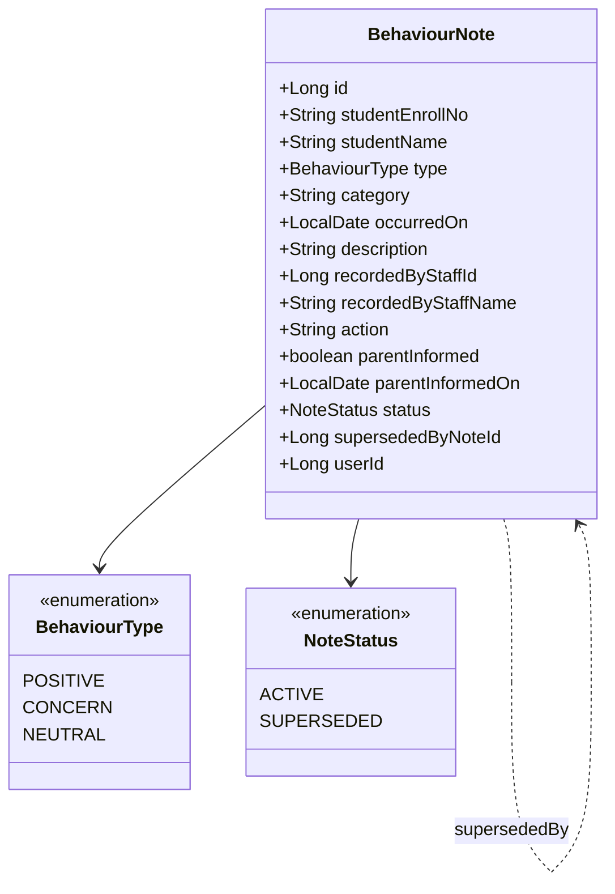

# Slice 2.5 — Discipline / behaviour log

**Status: ✅ DONE — `mvn test` + Cypress gate GREEN (2026-08-03).**
Gate `education/behaviour.cy.js` (11 cases, none skipped) + `BehaviourNoteRulesTest` (12 pure cases).
Flyway **V21**. **This completes PHASE 2.**

> **One gate-run correction, and it was the test's model of the platform.** The XSS case asserted a
> description is *stored verbatim and escaped at render*. Wrong: `com.security.XssSanitizingFilter` wraps
> every request in `XssRequestWrapper`, so `XssSanitizer` **strips tags on input** — defence-in-depth,
> mirrored in the services, and its javadoc names this exact payload. The test now asserts the real
> contract: the note saves, the tag and handler are gone, and the human text survives (a sanitizer that ate
> the whole description would pass a naive check).
Programme: `education-complete-programme.md` Phase 2.5 — *"Discipline / behaviour log"*.
**The last slice of Phase 2.** Depends on nothing new; reuses the student spine and `audit-service`.

---

## 1. Document — what and why

Every other Phase 2 slice records a fact: who teaches when, who was in, who did the homework. This one
records a **judgement about a child's conduct**, and that difference should drive the whole design.

### This is the most sensitive data the platform holds, and the plan says three words about it

The programme's row is *"Discipline / behaviour log"* — no more. Left at face value that is a CRUD table of
incidents, which is exactly the wrong instinct. Four properties make behaviour records different from
everything shipped so far:

| Property | Consequence |
|---|---|
| It is an **opinion**, not a measurement | a mark can be re-marked from the paper; "was rude in class" cannot be re-derived from anything. It is one person's account |
| It **follows a child for years** and is read by people who were not there | so it must carry *who said it and when*, always, and never lose that to an edit |
| It is **contested** — by the student, the parent, sometimes the school | so an edit history is not a nice-to-have; it is the point |
| It is **not only negative** | a log that records only misconduct becomes a punishment ledger nobody trusts. Recognising good conduct is the same shape and costs one enum value |

### What this deliberately is NOT

**Not a discipline *workflow*.** No detentions to schedule, no suspensions to approve, no escalation chain.
Those are process, they vary enormously by jurisdiction (a suspension has statutory meaning in some
systems), and they need the D-1 answer this platform does not have. The log records **what happened and
what was decided**; it does not run the decision.

**Not automatic anything.** No "three lates = a detention" rule. That is a policy engine attached to a
child's record, and it is the single feature most likely to be wrong in a way nobody notices.

---

## 2. Design

### D1 — One entity, and `category` is the only classification

```
BehaviourNote  studentEnrollNo · type · category · occurredOn · description
               recordedByStaffId · action · parentInformed · status
```

Deliberately one table. An `IncidentType` entity was considered and rejected: unlike leave types (2.3 D2) or
grade bands (1.4 D1), the *vocabulary* here shapes what people record. A school that invents twenty
categories produces a log nobody can summarise; the value is in the note, not the taxonomy.

So `category` is **free text with a datalist** — the same conclusion 1.2 D6 reached for exam type, for the
same reason: nothing branches on the value.

### D2 — `type` is POSITIVE or CONCERN, and that is not decoration

The enum is `POSITIVE` · `CONCERN` (plus `NEUTRAL` for a factual note that is neither).

A behaviour log that can only record problems is a punishment ledger, and teachers learn not to open it. The
same screen recording "helped a new student settle in" is one people use — which is what makes the *concern*
entries credible when they appear. One enum value, and it changes what the feature is for.

### D3 — A note is IMMUTABLE once saved; a correction is a superseding note

No editing the description. Correcting a note writes a **new** note that supersedes it; the original stays,
marked `SUPERSEDED`.

This is the 1.5 D5 / 1.6 D7 rule, and it matters more here than anywhere it has been applied so far: the
whole value of a behaviour record is that it says what someone reported **at the time**. A silently edited
account of an incident is worse than no record, because it carries the authority of a contemporaneous note
without being one.

Typos are the obvious objection. The answer is that a superseding note costs one click and preserves the
trail; a mutable description costs the record its meaning.

### D4 — Every note carries its author, and the author is not the logged-in user by default

`recordedByStaffId` is explicit, because the person entering a note is often not the person who witnessed
the incident — an office clerk types up what a teacher reported. Defaulting to the session user would
silently attribute an account to the wrong person.

The **session user is recorded separately** as `userId` (who typed it). Both matter, and conflating them
loses the distinction exactly when it is being disputed.

### D5 — Parent contact is a RECORDED FACT, not an action this slice performs

`parentInformed` (boolean) + `parentInformedOn`. The school ticks it when they have spoken to the parent.

**This slice does not send anything.** Notification is still a logging stub across 2.2 and 2.4, and bolting
a third half-wired sender onto the most sensitive data in the system would be the worst place to do it.
Recording *whether* the parent was told is the part a school actually needs for its own protection; sending
is §6, once the notification path is real.

### D6 — Visibility follows the existing student scope, and there is no new tier

Who may read a note is exactly who may see the student — `StudentVisibilityService` (1.5). No per-note
confidentiality flag.

That is a deliberate limit, stated rather than hidden: a genuinely confidential safeguarding record (abuse
disclosure, medical) needs a different access model, an audit of *reads* as well as writes, and probably a
separate service. **This slice is for ordinary school discipline, and §6 says so** — the alternative is a
half-built confidentiality feature that a school might trust with something it should not.

### D7 — Scope

| In | Out |
|---|---|
| `BehaviourNote` (V21), org-scoped | detention/suspension workflow, escalation chains |
| positive · concern · neutral (D2) | automatic rules ("3 lates = detention") |
| immutable notes + supersede (D3) | safeguarding / confidential records (D6, §6) |
| explicit author vs typist (D4) | sending anything to a parent (D5, §6) |
| `parentInformed` as a recorded fact | behaviour analytics / trend reporting (§6) |
| per-student history + a school-wide recent view | student-visible notes (Phase 3 portal) |
| every write audited via `EduAuditService` | |

### Layer answers (§5b)

| Layer | Answer |
|---|---|
| **UI/UX** | one screen: recent notes school-wide, and a per-student history. Recording a note is deliberately a few seconds — student, type, category, what happened. POSITIVE and CONCERN are visually distinct without the log looking like a charge sheet. A superseded note stays visible, struck through, with its replacement linked |
| **Service/API** | `/getBehaviourNotes`, `/saveBehaviourNote`, `/supersedeBehaviourNote`. **`WRITE_PRIVILEGE`** to record — this is teacher work like marks (1.3 D6). **No delete endpoint at all** (D3) |
| **Database** | `behaviour_note` (V21). Indexes `(org, student_enroll_no, occurred_on)` for the history and `(org, occurred_on)` for the recent view — standard D3b. **No UNIQUE key**: two genuine incidents on one day for one child is normal, so uniqueness would be wrong here (unlike every other Phase 2 table) |
| **Patterns** | append-only / immutable record with supersede (1.5 D5, 1.6 D7); free-text-with-datalist over a taxonomy table (1.2 D6); reuse-the-scope (1.5); audit-via-outbox (1.3 D5) |
| **Microservice design** | education-local. `audit-service` via the existing outbox; `notification-service` deliberately NOT reached (D5) |
| **Configurability** | none. Categories are free text; there is no policy to toggle, and a "hide negative notes" switch would be a way to falsify a record |
| **DRY** | `StudentVisibilityService` for scope, `EduAuditService` for the trail, the datalist pattern from 1.2's exam type |

---

## 3. Architecture & UML





```mermaid
sequenceDiagram
  actor Teacher
  participant C as BehaviourController
  participant V as StudentVisibilityService
  participant DB
  participant A as audit-service

  Teacher->>C: CONCERN · "disrupted the lesson twice" · witnessed by Mrs Khan
  C->>V: is this student in my scope?
  V-->>C: yes
  C->>DB: INSERT (author = Mrs Khan, typist = the session user)
  C->>A: BEHAVIOUR_NOTE_ADDED
  C-->>Teacher: recorded

  Teacher->>C: correct it — it was one lesson, not two
  Note over C,DB: the description is NEVER updated
  C->>DB: INSERT the corrected note; original → SUPERSEDED, linked
  C->>A: BEHAVIOUR_NOTE_SUPERSEDED
  C-->>Teacher: both visible; the original struck through
```

---

## 4. Implement — checklist

- [x] `BehaviourNote` + `BehaviourType` + `NoteStatus`, Flyway **V21**
- [x] indexes for the two reads; **no UNIQUE key** (two incidents in a day is legitimate), stated in the migration so an audit does not read it as an oversight
- [x] `POSITIVE` / `CONCERN` / `NEUTRAL` (D2) — and the UI defaults to `NEUTRAL`, not `CONCERN`
- [x] **no update-description path and no delete endpoint**; supersede writes a new row and links it (D3)
- [x] author (`recordedByStaffId`) distinct from typist (`userId`), both stored and both returned (D4)
- [x] `parentInformed` recorded; **nothing is sent** (D5)
- [x] scope via `StudentVisibilityService`; no per-note confidentiality (D6)
- [x] `WRITE_PRIVILEGE`; both writes audited via `EduAuditService`
- [x] screen + i18n × **6 bundles**, 60 lines each, all 24 new keys verified in all six
- [x] descriptions rendered with `.text()` throughout — never concatenated into HTML
- [x] `BehaviourNoteRulesTest` (12 pure cases) + `cypress/e2e/education/behaviour.cy.js` (11 cases)
- [x] **fixtures seeded, never skipped**

### Patterns applied (named, so they can be argued with)

| Pattern | Where | Why this one |
|---|---|---|
| **Append-only / immutable record** | no edit, no delete; supersede + link | the record's value is that it says what was reported AT THE TIME; a silent edit carries that authority without earning it |
| **Immutability by ABSENCE, not by check** | the operations do not exist | a `@PreAuthorize` refusal is a promise a future change can relax; a missing endpoint is not |
| **Pure function core** | `BehaviourNoteRules` | the rules protecting the most sensitive record test with no Spring, DB or Docker |
| **Free text + datalist over a taxonomy table** | `category` | 1.2 D6's reasoning: nothing branches on the value, and twenty invented categories make the log unsummarisable |
| **Provenance split** | author vs typist (D4) | an office clerk typing a teacher's account is normal; conflating them misattributes it exactly when disputed |
| **Reuse-the-scope** | `StudentVisibilityService` | no new access tier — and §6 says plainly that safeguarding needs one this slice does not provide |

**Library vs service:** neither. One table, education's own domain, no external integration. `audit-service`
is reached through the existing outbox; `notification-service` is deliberately NOT reached (D5).

### Corrections made during implementation

**The school-wide view is filtered by visible students in the controller, not the query.** The design said
scope comes from `StudentVisibilityService`; the by-student read uses `isVisible`, but the *recent* view
reads org-scoped notes and filters them against the caller's visible roster in memory. That is correct but
**it is an O(notes) filter** — fine at a school's scale, and the same shape 2.2's day view uses, but it
would need a join if a note table ever grows past a term's worth. Recorded rather than left to be found.

**A correction inherits the original's author when none is supplied.** Not in the design. The typist of a
correction is usually a different person, but the account is still the original teacher's, restated — so
`recordedByStaffId` carries forward unless explicitly overridden. Losing the author on correction would
quietly strip the provenance D4 exists to protect.

**An unresolvable author is dropped, not guessed.** If `recordedByStaffId` does not resolve within the
tenant, both author fields are left null rather than falling back to the session user. A wrong name on a
contested record is worse than no name.

## 5. Test

| # | Case | Expected |
|---|---|---|
| 1 | Record a CONCERN | saved with author, typist, date |
| 2 | Record a POSITIVE for the same student | both appear; the log is not concern-only |
| 3 | Two notes for one student on one day | both saved — no UNIQUE key, deliberately |
| 4 | Supersede a note | a NEW row exists; the original is `SUPERSEDED` and still readable, linked to its replacement |
| 5 | Attempt to edit a description directly | **no endpoint exists** — asserted by absence, not by a 403 |
| 6 | Per-student history | ordered, includes superseded rows marked as such |
| 7 | School-wide recent view | most recent first, across students in scope |
| 8 | A student outside the caller's branch | not visible, and recording against them is refused |
| 9 | `parentInformed` ticked | recorded with its date; **no notification is sent** |
| 10 | Every write | an audit event is enqueued |
| 11 | Another tenant's note by id | refused |
| 12 | Description with HTML | rendered escaped, not executed |

Gate: `cypress/e2e/education/behaviour.cy.js`.
**Regression:** `privilege-map.cy.js`, `student-import.cy.js` (shared student scope), `alerts.cy.js`.
Pure unit: `BehaviourNoteRulesTest` — supersede transitions and the author/typist distinction.

## 6. Open / deferred

**Safeguarding records need a different model (D6).** Confidential disclosures require read-auditing,
a narrower access tier, and probably separation from ordinary discipline data. Recording that here as an
explicit non-goal so no school is invited to misuse this table for it.

**Telling the parent.** D5 records *whether*; sending is blocked on the notification path being real —
which 2.2 and 2.4 both also want. **Three slices now need it; it is the strongest candidate for the next
non-phase slice.**

**Behaviour analytics.** "Which class has the most concerns this term" is genuinely useful to a head and
genuinely dangerous as a teacher-performance metric. Needs a deliberate decision about what is shown to
whom, not a chart bolted onto a log.

**Detentions and sanctions workflow.** Real, jurisdiction-shaped, and gated on D-1 in the same way the
statutory return formats are.

## 7. Risks

- **Immutability will be argued with.** Someone will want to fix a typo in place. The design's answer is
  supersede-and-link, and the screen must make that one click, or people will work around it by recording
  nothing.
- **Free-text categories drift.** Twenty variants of "late" make the log unsummarisable. The datalist
  mitigates it; if a school genuinely needs a controlled vocabulary, that is a settings-shaped follow-up —
  not a reason to build a taxonomy table nobody asked for.
- **This table will be read in disputes.** The author/typist distinction (D4) and the audit trail are what
  make it defensible; neither should be relaxed for convenience later.
