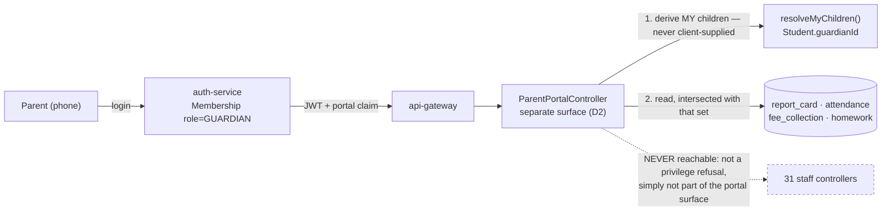
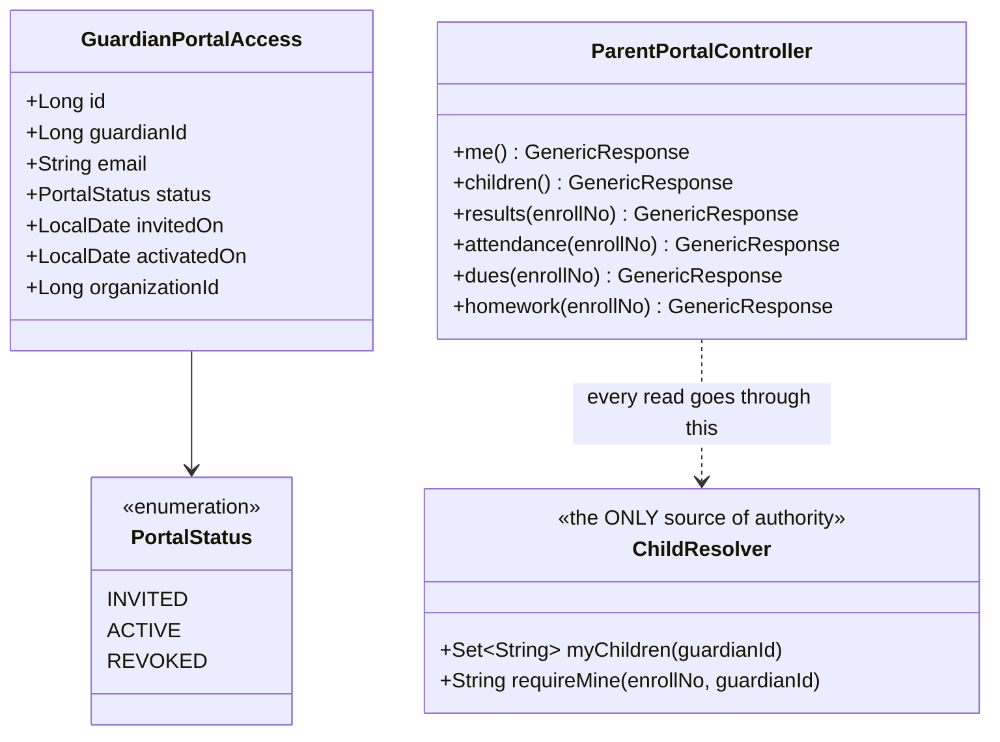
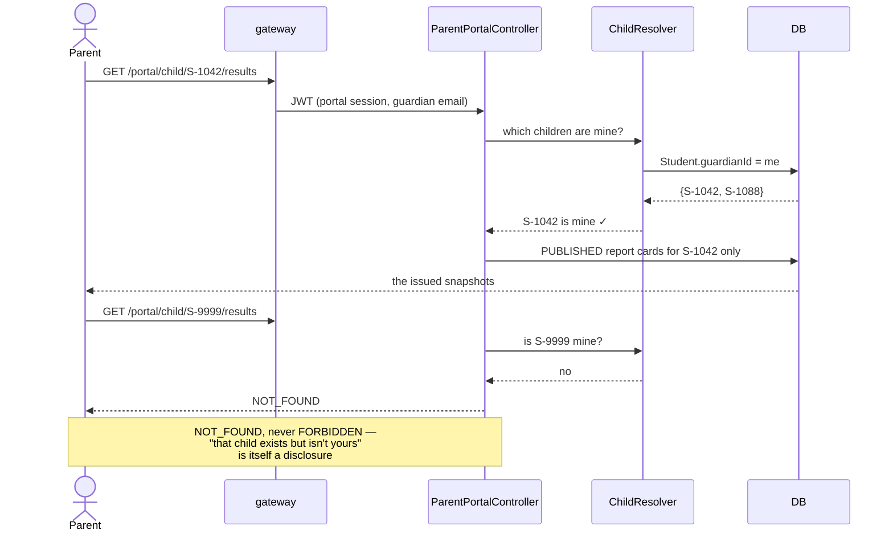

# Slice 3.1 — Parent portal

**Status: DESIGN — awaiting approval. No code written.**
Programme: `education-complete-programme.md` Phase 3.1 — *"Parent portal — results, attendance, dues,
homework for **my** children (auth-service user type `GUARDIAN`)"*. **First slice of Phase 3.**

**Not blocked.** D-4 gates **3.2** (payment provider), not this. D-2's ordering question was settled by the
decision to keep phase order intact.

---

## 1. Document — what and why

Everything built so far serves people *inside* the school. This is the first slice that lets someone
**outside** it log in — and that single fact makes it the most security-sensitive slice in the programme,
more so even than 2.5's behaviour log.

### The plan says "auth-service user type GUARDIAN". It does not exist

Checked before designing against it. `Membership.role` is a **free-text String** whose javadoc reads:

```java
/** Role within this org: OWNER | ADMIN | TEACHER | STUDENT | GUARDIAN | ... */
private String role;
```

Nothing seeds `GUARDIAN`, nothing enforces it, and no parent has ever logged in. The plan's parenthetical
describes an intention, not a mechanism.

### The real problem is not a new role. It is a new SHAPE of access

Every read in education-service is org-scoped:

```java
findScoped(orgId, userId)   // → every row in the organization
```

filtered, at most, to the branches a staff member is granted. **That model cannot express what a parent
needs.** A parent must see exactly two children and nothing else — not the school's students filtered, but
a set defined by relationship. Bolting `GUARDIAN` onto the existing role list would hand a parent an
org-scoped token and rely on every future query remembering to narrow it.

That is the failure the education review's **finding A** already found once: a scoping rule that had to be
remembered in each controller was forgotten in seven of them. Repeating it with **a stranger's login** is a
materially worse bet.

So the central decision (D1) is: the parent's identity carries the children, and the data path refuses
anything else — rather than the parent getting a normal token that screens are trusted to narrow.

### What exists to build on

| Existing | Consequence |
|---|---|
| `Student.guardianId` → `Guardian` | the relationship already exists in data; it has simply never been an access path |
| `Guardian.email` | the natural login identity, and already collected |
| Every read that matters (results, attendance, fees, homework) is already **per student** | so a child-scoped read is a filter over existing queries, not new reporting |
| `party-service` bridges Guardian (P3) | a guardian already has a `partyId` — identity work is not starting from zero |
| `auth-service` multi-org `Membership` | the seam a parent membership fits into, without a second identity system |

---

## 2. Design

### D1 — A parent's access is CHILD-scoped, derived server-side, and never client-supplied

The portal's every read resolves the caller's children first:

```
guardian (by authenticated email)
   → Student.guardianId = guardian.id           ← the ONLY source of "my children"
   → every read filtered to that enrolment set
```

**No endpoint takes an `enrollNo` the caller supplies and trusts it.** A parent asking for a child's
results passes an id, and the service intersects it with the derived set — the anti-IDOR discipline
already used across education, applied where it matters most.

The set is derived **per request**, not stamped into the JWT. A child transferring out, or a guardian link
being corrected, must take effect immediately rather than at next login.

### D2 — A parent gets a SEPARATE controller, not a `GUARDIAN` role on the existing endpoints

`ParentPortalController` exposes a small, purpose-built read surface. Existing education endpoints stay
staff-only and are **not** opened to parents with a privilege check.

This is the heart of the slice, and it is a deliberate rejection of the cheaper option:

| Option | Why not |
|---|---|
| Add `GUARDIAN` to the role list, `@PreAuthorize` the existing endpoints | every one of ~31 controllers becomes a place a parent might reach. Finding A proved that "remember to scope it" fails at 7 controllers; it will not hold at 31 with an external user |
| **A separate, small, child-scoped surface** | **chosen** — the attack surface is what the portal explicitly exposes, and nothing else. A new staff endpoint is not automatically a parent endpoint |

The cost is a handful of read endpoints that resemble existing ones. That duplication is worth it: it is
**explicit** rather than emergent, and it is the difference between an allowlist and a denylist.

### D3 — Parent login reuses `auth-service`; it does NOT create a second identity system

A `Membership` with `role = GUARDIAN` in the school's org, linked to the guardian record. Same login, same
JWT, same gateway.

What is new is small and deliberate: the token carries a claim marking the session as a **portal** session,
so the gateway and services can distinguish a parent from staff without inspecting roles. A parent hitting
a staff endpoint is refused because the endpoint is not part of the portal surface (D2), not because a role
string happened not to match.

**Invitation, not self-registration.** The school invites a guardian by email; nobody claims a child by
typing an enrolment number. Self-service registration against a child's identifier is an obvious
account-takeover path, and the school already knows who the parents are.

### D4 — Read-only, and that is the whole slice

The portal shows: results (published report cards only), attendance, fee dues, homework, behaviour notes.
It changes nothing.

Two consequences worth stating:

- **Report cards: PUBLISHED only.** 1.5 made an issued card a snapshot precisely so it could be shown
  outside the school. A draft or superseded card must never appear — a parent seeing a mark that later
  changes is exactly the harm snapshotting prevents.
- **Behaviour notes: a real question, deliberately answered NO for now.** 2.5's log includes staff
  judgements written without any expectation that a parent would read them tomorrow. Exposing them
  retroactively changes the contract under which they were written. §6 — it needs a per-note "shared with
  parent" decision, which is a feature, not a filter.

### D5 — Fee dues are shown; paying is 3.2

The portal shows what is owed, from the existing AR/aging path (0.2a). The **Pay** button belongs to 3.2 and
is gated on **D-4**.

Showing a balance without a way to pay it is a legitimate half-step: parents currently have no way to see it
at all, and the arithmetic is already correct because finance owns it.

### D6 — Scope

| In | Out |
|---|---|
| `GuardianPortalAccess` (V22) + invitation flow | self-registration by a parent (D3) |
| child-scoped reads: results · attendance · dues · homework | **any write at all** (D4) |
| separate `ParentPortalController` surface (D2) | online payment (3.2, gated on D-4) |
| published report cards only (D4) | behaviour notes (D4, §6 — needs a per-note decision) |
| a parent-facing page, mobile-first | student portal (3.3), PTM booking (3.4), circulars (3.5) |
| every portal read audited | messaging between parent and teacher |

### Layer answers (§5b)

| Layer | Answer |
|---|---|
| **UI/UX** | a **separate, mobile-first page** — not the education dashboard with things hidden. Parents are non-technical, on phones, checking one thing. A child switcher when there are several; otherwise no chrome at all |
| **Service/API** | `/portal/me`, `/portal/children`, `/portal/child/{enrollNo}/results`, `/attendance`, `/dues`, `/homework`. All GET. All intersect the requested child with the derived set (D1) |
| **Database** | `guardian_portal_access` (V22): guardianId, email, status, invitedOn, activatedOn. **The child list is NOT stored here** — it is derived from `Student.guardianId` on every request (D1) |
| **Patterns** | allowlist-not-denylist surface (D2); derive-authority-server-side (D1); read-only projection; invitation over self-service (D3); reuse the identity provider rather than forking it (D3) |
| **Microservice design** | education-local reads; `auth-service` for identity; `finance-service` (already composed) for dues. No new service |
| **Configurability** | `edu.portal.enabled` (BOOL, default **false**) — a school opts in. A portal that goes live the moment the code deploys is not something to spring on a school |
| **DRY** | reuses report-card snapshots (1.5), attendance, the fee AR path (0.2a) and homework reads (2.4) — the portal is a projection, not new reporting |

---

## 3. Architecture & UML







---

## 4. Implement — checklist

- [ ] `GuardianPortalAccess` + `PortalStatus`, Flyway **V22**; UNIQUE `(organization_id, guardian_id)`
- [ ] `ChildResolver` — **the only** source of "my children"; derived per request, never from the client
- [ ] `ParentPortalController` — GET only, every read intersected via `requireMine` (D1)
- [ ] a **separate** surface: no `GUARDIAN` privilege added to any existing controller (D2)
- [ ] auth: `Membership role=GUARDIAN` + a portal claim; **invitation only**, no self-registration (D3)
- [ ] published report cards only; behaviour notes NOT exposed (D4)
- [ ] dues read-only, no payment (D5)
- [ ] `edu.portal.enabled` BOOL default **false**
- [ ] every portal read audited via `EduAuditService` — an external party reading a child's record is worth a trail
- [ ] a separate mobile-first page + i18n × **6 bundles**
- [ ] tests: `ChildResolverTest` (pure) + `cypress/e2e/education/parent-portal.cy.js`
- [ ] **fixtures seeded, never skipped**

## 5. Test

**The security cases are the point of this gate.** A functional pass with a scoping hole is worse than a red.

| # | Case | Expected |
|---|---|---|
| 1 | Parent sees their own children | exactly those, no others |
| 2 | **Parent requests another guardian's child by enrolment number** | **NOT_FOUND** — the case this slice exists to get right |
| 3 | Parent requests a child in another **tenant** | NOT_FOUND |
| 4 | Parent hits a staff endpoint (`/getUserStudent`, `/saveBehaviourNote`) | refused — not reachable from a portal session |
| 5 | Results | **published cards only**; a draft or superseded card never appears |
| 6 | Attendance / dues / homework | scoped to that child, matching what staff see |
| 7 | Behaviour notes | **not exposed anywhere** in the portal (D4) |
| 8 | Any write attempt | no write endpoint exists on the portal surface |
| 9 | `edu.portal.enabled` = false | portal reads refused even for an ACTIVE guardian |
| 10 | A `REVOKED` guardian | refused |
| 11 | A child whose `guardianId` is cleared mid-session | disappears on the **next request** — derived, not cached (D1) |
| 12 | Every portal read | an audit event is written |

Gate: `cypress/e2e/education/parent-portal.cy.js`.
**Regression:** `privilege-map.cy.js` (a new principal type must not widen staff access), `save-takeover-idor.cy.js`,
`report-cards.cy.js`, `fees-ar.cy.js`.
Pure unit: `ChildResolverTest` — the intersection rule, including the empty and cross-tenant cases.

## 6. Open / deferred

**Behaviour notes in the portal (D4).** Needs a per-note "shared with parent" flag and a conversation about
notes written before such a flag existed. Exposing 2.5's log retroactively would change the contract its
authors wrote under.

**Paying the dues (3.2).** Gated on **D-4**.

**Student portal (3.3)** reuses `ChildResolver`'s shape with the student as their own subject — worth
building on the same surface rather than a third one.

**Parent contact details as login identity.** `Guardian.email` is currently free text with no verification.
Invitation-only mitigates it, but a wrong email in the guardian record now sends a portal invitation to a
stranger. **Worth an email-verification step before this goes to a real school.**

## 7. Risks

- **This is the first external login. The blast radius of a scoping mistake is a stranger reading a child's
  record.** D1 (derived) and D2 (separate surface) exist for that; tests 2, 3 and 4 are the ones that must
  not be waved through.
- **A separate controller duplicates some reads.** Accepted deliberately — explicit duplication over an
  emergent allowlist. If it grows past a handful of endpoints, that is a signal to extract a shared
  read-model, not to start reusing staff endpoints.
- **`Guardian.email` is unverified** (§6). Invitation-only limits it, but a typo sends a child's portal
  invite to the wrong address.
- **One guardian, many children, many schools.** A parent with children at two branches of the same group
  should see both; the derived set handles that naturally, but it must be tested with a real two-child
  fixture rather than assumed.
