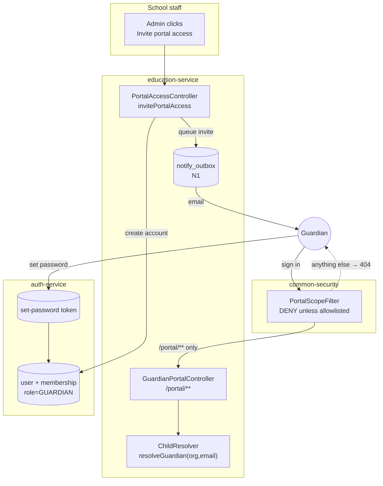
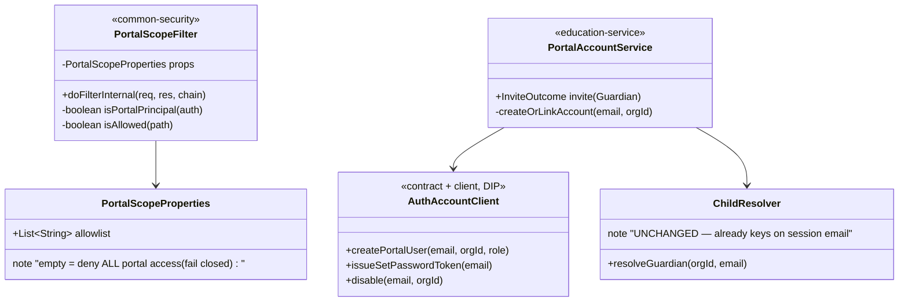
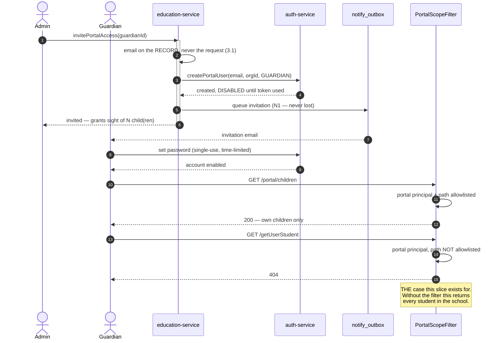

# Slice 3.1b — Portal sign-in (and the deny rule that must ship with it)

**Status: ✅ DONE & Cypress-GREEN — 13/13, twice consecutively (2026-08-06).** Regression green too:
`guardian-portal` 11/11, `privilege-map` 11/11, `security/method-authz` 11/11, `pharmacy/method-authz` 5/5,
`party` 7/7, business smoke 27/27 — **85 cases**, which the shared-library change required. See **§15**.

**Getting there took four runs, and the gate found TWO REAL DEFECTS in the deny rule (§14).**
**(1) It failed OPEN**: `X-User-Roles` had two parsers and this filter's copy did not strip the brackets the
gateway stamps, so a signed-in guardian read the entire student roster in gateway mode while the control
passed in legacy mode. **(2) Once that was fixed, the refusal came back 403, not 404** — `sendError()` runs a
container ERROR dispatch that re-enters the security chain unauthenticated, which is the one status D4
forbids. Both fixed: a shared `AuthorityHeader` parser, and the response committed directly. **18 pure cases**,
three of which pin the **captured** wire format and two the refusal contract.

⚠️ **Run 1's "the security property is PROVEN" claim, still recorded in §9, was true only of the path that
run happened to exercise.** Read §14 before trusting any statement written before it.

**D-6 settled: invitation-only — §11.** One item remains and it is **outside this slice**: portal
provisioning cannot complete locally because `service.internal-secret` is unset and auth-service fails
closed (§10, security findings **F18 → F2**). §9's "write returns 500 not 404" is **explained** by §14.
Implementation findings, including two integration defects, in §8.
**Changes `common-security`, so it must be `mvn install`ed before dependants are packaged.**
Non-phase-numbered but **blocking**: it completes 3.1, and **3.2 and 3.3 both depend on it — now unblocked.**
Programme: `education-complete-programme.md` Phase 3 — pays 3.1 §6's carried requirement
*"STILL MISSING: the auth-service user account"*.

---

## 1. Document — what and why

### Why this and not 3.3

3.3 (student portal) was the recommended next slice. Checking its precondition changed that, twice over:

1. **`Membership.role`'s javadoc lists `STUDENT` and `GUARDIAN`, and nothing seeds either** — verified again
   on 2026-08-06, unchanged since 3.1 found it. So 3.3 would build a **second** portal that nobody can log
   into. Two unreachable surfaces is worse than one, and it breaks the standing rule that a domain is
   finished **end to end** before the next is started. **3.1 is not end-to-end: it has no users.**
2. And then the more serious finding, below.

### THE FINDING: 3.1's portal is safe only because nobody can sign in

Education's **read** endpoints are not privilege-gated. Verified by spot-check on 2026-08-06:

| Endpoint | `@PreAuthorize` |
|---|---|
| `getUserStudent` | **none** |
| `getUserGuardian` | **none** |
| `getMarksSheet` | **none** |
| `getUserFc` | **none** |

This is not an oversight in the D-3 privilege map — that map deliberately gated **writes**
(`WRITE`/`ADMIN`/`DELETE_PRIVILEGE`), and reads were left open **because every authenticated education user
is staff**. Under that assumption it is correct.

**Sign-in destroys the assumption.** The moment a guardian holds a session, every ungated read is reachable:
the whole school's students, every mark, every fee record, every guardian's contact details. A guardian
would not need to attack anything — `GET /getUserStudent` would simply answer.

So 3.1's D2 claim — *"a guardian hitting a staff URL is refused because it is not part of this surface"* —
is **true today and would become false on the day sign-in ships**. The allowlist says what the portal
*can* reach; nothing says what a portal session *cannot* reach elsewhere.

> **This is why sign-in cannot be "just provisioning an account".** Account creation is the small half. The
> deny rule is the slice.

### What already exists to build on

| Existing | Consequence |
|---|---|
| `ChildResolver.resolveGuardian(orgId, email)` (3.1) | the portal already identifies a guardian **by the email on the session** — so a real login is *additive*, needing no change to any portal read |
| `GuardianPortalAccess` + `invitePortalAccess` (3.1) | the school's decision to grant access, already recorded, already ADMIN-gated, already audited |
| `auth-service` `User` + `Membership(organizationId, role)` | the identity seam; no second identity system needed |
| `HeaderAuthFilter` → `X-User-Roles` / `X-User-Privileges` → `AuthenticatedUser.authorities` | a portal marker travels to every service with no new plumbing |
| Password reset already delegates to auth-service (token-based) | invitation → set-password reuses a proven flow rather than inventing one |
| `guardianDashboard.html` + `guardian.js` (3.1) | the surface a signed-in guardian lands on already exists |

---

## 2. Design

### D1 — A portal user is a real `auth-service` User; there is no second identity system

A `User` (enabled, own password) plus a `Membership(organizationId = the school, role = GUARDIAN)`.
Same login form, same JWT, same gateway, same session handling.

**Provisioning is by invitation only, never self-registration.** 3.1 already decided this and the reasoning
stands: self-service registration against a child's enrolment number is an account-takeover path, and the
school already knows who its guardians are. `invitePortalAccess` — which exists, is ADMIN-gated and audited
— becomes the thing that creates the account.

### D2 — **THE DENY RULE.** A portal session may reach ONLY explicitly allowlisted paths

A shared `PortalScopeFilter` in **`common-security`**, not in education-service.

```
principal has the PORTAL marker?
    ├── no  → unchanged, staff behaviour exactly as today
    └── yes → is the path in THIS service's portal allowlist?
              ├── yes → proceed
              └── no  → 404 (never 403 — see D4)
```

**Why `common-security` and not education-service.** A portal principal is an authenticated principal
platform-wide. If the rule lives only in education, then business-, finance-, party- and every other service
still answers a guardian's session. Those services are org-scoped, so a guardian in a school org reaches
little today — but "little" is an accident of which org they are in, not a rule. Putting the filter in the
shared library makes the default **deny**, in every service, including ones written years from now by
someone who has never heard of the portal.

**A service with no declared allowlist denies portal principals entirely.** That is the fail-closed default,
and it is the property that makes this safe to add without auditing all thirteen services.

Education declares exactly one entry: `/portal/**`.

**Named pattern: policy enforcement point + allowlist.** This is the direct answer to the education review's
**finding A**, which proved that a scoping rule which must be *remembered per controller* is forgotten in
seven of them. The deny rule is therefore enforced in **one** place that every request passes through, not
as 74 `@PreAuthorize` annotations that must each be correct forever.

**The rejected alternative — gate all 74 reads.** It is the obvious fix and it is worse: it is 74 chances to
be wrong, it must be re-applied to every read added afterwards, and nothing fails if someone forgets. The
filter fails closed; annotations fail open.

### D3 — The marker is a ROLE, and `LOGIN_PRIVILEGE` is deliberately still granted

A portal user needs `LOGIN_PRIVILEGE`, because both the monolith
(`.anyRequest().hasAuthority("LOGIN_PRIVILEGE")`) and the services require it to serve anything at all —
including `/portal/**`. Withholding it locks the guardian out of their own portal.

So the marker is a **role** — **`ROLE_GUARDIAN`** (renamed from `ROLE_PORTAL`, 2026-08-06) — and the filter
is what converts "may log in" into "may log in **and reach only the portal**".

**Why the role names WHO, not WHAT-IS-RESTRICTED.** Every role on this platform names a person
(`ROLE_EDUCATION_USER`, `ROLE_OWNER`, `ROLE_MARKETPLACE_BUYER`); `ROLE_PORTAL` would have been the only
capability-marker, and it gave a guardian two names for one fact. **Which roles are confined is
CONFIGURATION** — `myplus.portal.confined-roles`, sitting next to the allowlist — so identity and policy
stay separate and 3.3 adds `ROLE_STUDENT` without touching the filter.

**The cost, stated so it is not forgotten:** a new external audience is no longer confined automatically.
Whoever adds one must add its role to `confined-roles`. That is a "remember it" rule — the exact failure
mode finding A proved this codebase has — mitigated only by the two properties being adjacent and by 3.3's
checklist.

**State this plainly because it is the part most easily got wrong: holding `LOGIN_PRIVILEGE` is not
authority to read staff data. The filter is the only thing that makes that true.** Any future change that
removes or bypasses it re-opens the whole read surface.

### D4 — Refusals are 404, never 403 — the same rule as 3.1

3.1 answers `NOT_FOUND` rather than `FORBIDDEN` because "that child exists but is not yours" is itself a
disclosure. The same logic applies one level up: a guardian probing `/getUserStudent` should learn nothing,
not even that the endpoint exists. **Consistency matters here** — a 403 on staff paths and a 404 inside the
portal would let a prober map the surface by watching which refusal they get.

### D5 — The invitation email IS the address verification

3.1 §6 carried this: *"`Guardian.email` is unverified free text, and it becomes a portal login identity. A
typo invites a stranger to a child's record."* Sign-in is where that debt comes due, so this slice pays it.

The invitation sends a **single-use, time-limited set-password token** to the address on the guardian
record. Nobody can sign in until that token is used, so **an address that cannot receive mail can never
become an account**. A typo therefore fails safe: the invitation dies unused rather than granting a stranger
access. The school never sets or sees the password.

Reuses the existing token flow rather than inventing one; the send goes through **N1's `notify_outbox`**, so
an invitation is never lost to a downstream outage.

### D6 — Built generically so 3.3 adds a resolver, not a mechanism

Nothing in the filter, the provisioning flow or the token is guardian-specific. 3.3 (student portal) then
supplies `role = STUDENT`, its own `/portal/**` reads and a `StudentResolver` — and inherits sign-in,
the deny rule and address verification unchanged.

**Deliberately NOT built here:** student accounts. A student portal without a student read surface is the
same "unreachable surface" mistake this slice exists to correct.

### D7 — Scope

| In | Out |
|---|---|
| `User` + `Membership(role=GUARDIAN)` created by `invitePortalAccess` | self-registration (D1) |
| `ROLE_GUARDIAN` travelling in the JWT + `confined-roles` config | SSO / social login |
| **`PortalScopeFilter` in `common-security`, deny-by-default** | gating the 74 reads individually (D2, rejected) |
| set-password token = address verification (D5) | changing how staff authenticate, at all |
| revoke → the account can no longer sign in | student accounts (3.3, D6) |
| landing a portal session on `guardianDashboard.html` | online payment (3.2, gated on D-4) |

### Layer answers (§5b)

| Layer | Answer |
|---|---|
| **UI/UX** | invitation email → set password → lands on the guardian dashboard, never the staff shell |
| **Service / API** | no new education endpoint; `invitePortalAccess` gains account creation |
| **Database** | MySQL — auth-service's existing `user`/`membership`; **no new education table** |
| **Patterns** | policy enforcement point + allowlist (D2); invitation token (D5); fail-closed default (D2) |
| **Microservice design** | identity stays in `auth-service`; the deny rule is cross-cutting so it goes in `common-security`, per the standing rule |
| **Per-org configurability** | reuses 3.1's `edu.portal.enabled`; no second switch for one behaviour |
| **DRY** | the token flow, the outbox and the portal reads are all reused; nothing is re-implemented |

---

## 3. Architecture & UML

### 3.1 Architecture



### 3.2 Class



### 3.3 Sequence



---

## 4. Implement — checklist

- [ ] `common-security`: `PortalScopeFilter` + `PortalScopeProperties` (`myplus.portal.allowlist`),
      registered before the authorization filter. **Empty allowlist ⇒ deny.**
- [ ] auth-service: `ROLE_GUARDIAN` seeded (LOGIN + CHANGE_PASSWORD only, no staff privileges);
      `Membership.role = GUARDIAN`.
- [ ] education-service: `myplus.portal.confined-roles=ROLE_GUARDIAN` beside the allowlist.
- [ ] auth-service: endpoints to create a portal user, issue a set-password token, and disable an account.
- [ ] `AuthAccountClient` contract + client (DIP), consumed by education-service.
- [ ] education-service: `invitePortalAccess` creates/links the account; `revokePortalAccess` disables it.
- [ ] education-service: `myplus.portal.allowlist=/portal/**`.
- [ ] The invitation send goes through **N1's outbox**, not a direct call.
- [ ] Monolith: a portal session lands on `guardianDashboard.html`, never the staff shell.
- [ ] i18n for the invitation + set-password screens × 6 bundles.

## 5. Test

**Pure unit — `PortalScopeFilterTest` (no Spring, no DB):**
staff principal + staff path → allowed · portal principal + `/portal/x` → allowed · portal principal +
`/getUserStudent` → **denied** · portal principal + **empty allowlist** → denied · path-traversal
(`/portal/../getUserStudent`) → denied after normalisation · unauthenticated → untouched.

**Cypress gate — `portal-sign-in.cy.js` (13 cases; D-6 cases added 2026-08-06, spec review the same day
added #4 and #10 and made the fixture deterministic — §13):**

| # | Case | Asserts |
|---|---|---|
| 1 | inviting **reports** the account outcome (OK\|FAILED) | §8 — the school is never left assuming a guardian can log in. `FAILED` is expected locally until F18/F2 and is logged, because the slice's requirement is that it is **surfaced** |
| 2 | **a guardian with NO email cannot be invited** | **the BOUNDARY of D-6**, and the trigger for option C. The address comes from the RECORD (3.1 D3), so a record without one cannot be invited at all |
| 3 | **re-inviting is a RESEND, not an error**, and creates no second access row | invitation-only makes "resend" the school's normal recovery, so it must be idempotent. Asserts the **response object**, not the status: the "already has access" early return is *also* SUCCESS and re-sends nothing |
| 4 | **the guardian session is CONFINED** — the precondition every case below depends on | §12. A 200 here means a stale cached principal, not a broken filter, and the message says so. Added after that mistake cost six runs |
| 5 | a signed-in guardian reads their own children | the portal works with a REAL session |
| 6 | **the same session gets 404 from staff reads** — each probed as STAFF first | **THE case. Without D2 this returns the whole school**, and the staff probe stops a renamed route faking a pass |
| 7 | the refusal is 404, never 403 | D4 — a prober cannot map the surface by refusal type |
| 8 | path traversal does not walk past the allowlist | asserts the **property** (no student data), not a status |
| 9 | a guardian cannot write, and **the row is never created** | verified by re-reading the roster as staff |
| 10 | **a real session cannot reach another guardian's child** | the filter is *not* the only control. 3.1 proved child-scoping with a session that had no portal role because none existed; this proves it with the principal that ships. Past `/portal/**` the sole control is `ChildResolver` |
| 11 | staff completely unaffected | the inverse regression — a shared filter that over-matched would lock out every module |
| 12 | `edu.portal.enabled=false` closes it for a valid account | 3.1's kill switch still wins over a working login |
| 13 | revoking stops the portal reads | withdrawal takes effect on the next request |

**Not assertable by Cypress:** that a guardian *sets their password from the emailed token*, because the test
cannot read email — which is precisely why D5 makes the token the only way in. The seeded dev-only account
(`guardian.education@myplus.com`) stands in for the resulting session; see §8.

**Regression list:** `guardian-portal.cy.js` (its "no access row" cases now run against a real login),
`privilege-map.cy.js`, `method-authz.cy.js`, and a staff smoke spec per module (the filter is shared).

## 6. Open / deferred

- **Student accounts → 3.3** (D6). The mechanism is built here; 3.3 adds the resolver and reads.
- **Read-gating the 74 staff endpoints is NOT done and is not needed for portal safety** (the filter covers
  it). It remains desirable for *staff-vs-staff* least privilege — a teacher reading every fee record — and
  that is its own slice, unchanged by this one.
- **`Student.email` is unverified free text**, exactly as `Guardian.email` was; 3.3 inherits D5's answer.
- 2FA for portal accounts — the platform supports it; not enabled here.

## 7. Risks

- **This slice changes a SHARED library.** `common-security` is consumed by every service, so per the
  build standard it must be `mvn install`ed before dependants are packaged, and **every module's smoke spec
  belongs in the regression list** — a filter that wrongly matches would lock staff out platform-wide.
- **Fail-closed means a missing config line disables a portal**, not opens one. That is the intended
  direction, but it will present as "the guardian portal 404s" if `myplus.portal.allowlist` is unset.
- **The filter must normalise the path before matching.** `/portal/../getUserStudent` must not pass; there
  is a pure test for exactly this.
- Deliverability: an invitation that never arrives is indistinguishable to the school from one ignored.
  N1's outbox retries it, and the access row already shows `INVITED` vs `ACTIVE`.

---

## 8. Implementation notes — what the code found that the design did not

**1. Reuse-first paid off twice, and shrank the slice.** `OrgUserController.createOrgUser` already creates a
user in an org and sends a set-password email, and `forgot-password`/`reset-password` already implement the
token flow D5 asked for. `createOrLinkPortalUser` is modelled on the former rather than reinventing it — but
it could not simply *call* it: `createOrgUser` throws `DuplicateResourceException` on an existing email and
restricts roles to ADMIN|USER. **A portal account must LINK an existing person**, because one adult can be a
guardian at two schools on this platform and is one person with one login.

**2. `GatewayIdentityForwarding.interceptor()` already stamps `X-Internal-Secret`**, so education→auth
service-to-service authentication needed no new plumbing — only the decision to enforce it.

**3. `PortalAccountController` FAILS CLOSED on an unset secret, deliberately inverting the platform's other
convention.** `HeaderAuthFilter` *skips* its secret check when none is configured, which is safe for a
filter that only READS identity and would be unsafe here, where the call CREATES a login. A deployment that
forgets the secret gets a portal that cannot be provisioned, never one anyone can provision.

**4. The filter reads the ROLES HEADER, not the SecurityContext.** `HeaderAuthFilter` populates the context
but is installed *inside* each service's Spring Security chain, while an auto-registered `Filter` bean runs
in the servlet chain *before* it. Depending on the principal would have made correctness depend on
registration order in thirteen `SecurityConfig` classes — the exact "remember it everywhere" failure the
filter exists to avoid. Reading the header is order-independent and safe in the deny direction: forging the
portal role only restricts the forger.

**5. Invite and revoke take OPPOSITE positions on failure, on purpose.**
- **Invite surfaces it** (`PARTIAL`): an access row whose account was never created is a guardian who will
  never be able to log in, and the school must learn that now, not when the family calls.
- **Revoke swallows it**: the access row is already REVOKED by the time the account call runs, so the
  guardian can read nothing regardless. Failing the operation because auth-service was slow would leave a
  school unable to revoke at all — the worst possible failure mode for this particular button.

### Two integration defects found while wiring the gate

**A. The monolith has no `common-security` on its classpath**, so the shared filter is not active there.
Education-service is the data owner and refuses, so **the data was never exposed** — but the refusal
happened one hop later than ideal.

**B. `GatewayClient` turned every downstream 404 into a generic 500.** It caught only `Unauthorized` and
`Forbidden`; a 404 fell through to the catch-all handler and came back as `"Error Occurred"`. This is the
**same defect slice 2.1 recorded as standard D3d** — fixed then for *logging*, never for *this status*.

It matters precisely here: `PortalScopeFilter` answers 404 so a portal caller learns nothing, and relaying
that as a 500 says "something broke" — untrue, and more informative to a prober than the deliberate silence.
**Fixed** with `DownstreamNotFoundException` + `DownstreamNotFoundAdvice`, passing the downstream body
through unchanged. **This is a monolith-wide behaviour change** (any downstream 404 now relays as 404
instead of 500), which is why a broad staff smoke belongs in the regression list.

**Defence-in-depth follow-up, NOT done:** putting `PortalScopeFilter` in the monolith too, so the request
never leaves it. That needs `common-security` on the monolith's classpath, which would also pull in
`HeaderAuthFilter`, a second `XssSanitizingFilter` (the monolith has its own) and the empty
`UserDetailsService` — too much blast radius to bundle into this slice.

### The gate needed a fixture the design did not anticipate

**Cypress cannot read email, and D5 makes the emailed token the only way in.** So a real guardian session —
the thing tests 2 through 8 are *about* — was untestable as designed. Resolved by seeding
`guardian.education@myplus.com` with `ROLE_GUARDIAN` and a GUARDIAN membership, dev-only, alongside the
existing `demo.*`/`owner.*` fixtures. The account is otherwise identical to a live one; only the password is
known. Without it the deny rule could only ever have been unit-tested, and **the case that matters most —
a real guardian session getting 404 from `/getUserStudent` — would have gone unproven end to end.**

**Test 3 probes each URL as STAFF first.** A 404 only proves the filter if the route exists; without that
control, renaming an endpoint would turn the slice's most important assertion into a green that proves
nothing — the same shape as 2.1's skipped clash test and 2.4's empty class.

---

## 9. Gate run 1 — 7 of 9 green, and what the two reds were

**Not green. Do not record this slice as done.**

> **Read the numbers below as RUN 1's, against the 9-case spec that existed then.** The spec is now 13
> cases (§5) and the numbering has moved: run 1's "case 3" is now #6, its "case 5" is now #8, its "case 6"
> is now #9. Kept unrenumbered on purpose — rewriting a recorded run to match a later spec is how a
> history stops being evidence.

| # | Case | Result |
|---|---|---|
| 1 | invite provisions the account and says so | ✅ |
| 2 | a signed-in guardian reads their own children | ✅ |
| 3 | **THE CASE — the same session gets 404 from a staff read** | ✅ **the deny rule works** |
| 4 | the refusal is 404, never 403 | ✅ |
| 5 | path traversal does not walk past the allowlist | ✅ *(after the test was fixed — see below)* |
| 6 | a guardian cannot write | ❌ **500, expected 404 — unexplained** |
| 7 | staff completely unaffected | ✅ |
| 8 | portal OFF closes it for a valid account | ✅ |
| 9 | revoking stops the reads | ✅ |

**The security property is proven.** Case 3 is the one this slice exists for, and it passes: a real signed-in
guardian gets 404 from `/getUserStudent`, `/getUserGuardian`, `/getMarksSheet` and `/getUserFc`, each probed
as staff first so a 404 cannot be a missing route.

### Case 5 was a TEST defect, and the fix generalises

It asserted a bare status and got `200`. A status alone **cannot distinguish a followed redirect from a
guardian reading the roster** — two findings that could not be further apart. Rewritten to assert the
security property (`followRedirect:false`, no `enrollNo`, no roster collection, not 200) and to log the real
status. It passed immediately, confirming the 200 had been a followed redirect all along.

**Standard worth keeping: assert the PROPERTY, not the status code, whenever a status can be produced by
more than one mechanism.**

### Case 6 is genuinely unexplained — three theories dead

1. ~~Stale monolith~~ — the jar is newer than the source and contains the new classes.
2. ~~Advice ordering~~ — `@Order(HIGHEST_PRECEDENCE)` was added and **verified present in the running jar's
   constant pool**. Still 500.
3. ~~A monolith-side `@PreAuthorize`~~ — there are **none** on the education proxy controllers.

**A wrong inference of mine is recorded here deliberately:** I argued "`addStudent` appears 0 times in the
education log, so the request never arrived". `getUserStudent` is also 0 — **education-service does not log
request paths at all**, so absence proves nothing. The 2.1 diagnosis worked because it reasoned over *SQL
between two known-good inserts*, not over path strings. Do not repeat the shortcut.

**Blocked on one artifact:** `RestResponseEntityExceptionHandler` logs `500 Status Code` with the stack
trace, and the monolith has **no file appender** — the trace exists only in its console.

**RESOLVED APPROACH (2026-08-06): stop reasoning, measure.** Three theories died in a row because each was
argued rather than observed — the same mistake case 5 punished. The test now (a) **logs the status AND the
body**, which names the producing handler (`"Error Occurred"/InternalError` = the monolith catch-all won;
`{"success":false,…}` = education's refusal relayed), and (b) asserts the **security property** — the write
did not happen, verified by re-reading the roster as staff and confirming the student was never created.

**This reframes the case correctly.** A guardian POST is *already refused*; only the status code is wrong.
The genuinely serious outcome — a refusal that nevertheless wrote the row — was **never asserted at all**
by the original status check, and now is. **A status code was standing in for a fact, and the fact is what
matters.**

## 10. OPEN — a design decision that needs the user

**Portal provisioning cannot work in the default local setup, and that is a consequence of D-then-§8's
fail-closed choice.**

```yaml
internal-secret: ${INTERNAL_SECRET:}     # application.yml — defaults to EMPTY
```

With it unset, education's interceptor omits the header and `PortalAccountController.trusted()` refuses →
the education log shows education→auth returning this slice's own `refuse()` body. `invitePortalAccess`
creates the access row but never the account.

Failing closed is right for production. **Shipping a control that cannot be switched on locally is not** —
it means the provisioning path is untestable, and untestable paths ship broken. Options:

| | Option | Trade-off |
|---|---|---|
| **1** | A dedicated `myplus.portal.provisioning-secret` | enabling it cannot change platform-wide auth behaviour — **preferred** |
| 2 | Set `INTERNAL_SECRET` globally | correct long-term, but it also switches ON secret ENFORCEMENT in `HeaderAuthFilter` for every service, which currently skips the check *because* the value is empty |
| 3 | Allow when no secret is configured | rejected — account creation open by default |

> **New standard candidate (§1c):** *a fail-closed control must ship with a working local configuration, or
> the feature it guards is untestable and will ship broken.* This slice is the evidence.

---

## 11. D8 — Guardian accounts are INVITATION-ONLY (settled 2026-08-06, user decision)

The question raised: *should a guardian sign up at maxtheservice.com like other users, choosing the school
they belong to?* Checked against the code rather than by analogy, and the answer is that **the analogy does
not hold**.

### Public signup creates a TENANT, not a membership

`RegisterRequest` carries **`organizationName`** — a new organisation's name, not an `organizationId` — and
`register()` assigns **`ROLE_OWNER`**. Signup means *"start a new company and become its owner."*

A guardian using it would become the owner of a **brand-new empty organization**, not a member of their
child's school. Every guardian would spawn a junk tenant.

**And no user type on this platform self-registers into an existing organization.** Teachers and admins are
created by an owner through `POST /api/auth/org/users`, which sends a set-password email — **the same
pattern this slice applies to guardians**. The invitation flow is not an exception made for guardians; it is
the platform's only way of joining an existing org, applied to the population with the most sensitive data.

### The account is easy; the RELATIONSHIP is the access grant

What actually opens a child's record is `Student.guardianId`, which the school already maintains.

| | The link |
|---|---|
| **Invitation** | already exists, correct **by construction** — the school clicks a button on a record it keeps anyway |
| **Self-signup** | the guardian must **assert** a relationship the system then has to verify — and that verification is the entire problem |

This is why 3.1 rejected self-registration and why that stands: claiming a child by typing an enrolment
number is an account-takeover path, and enrolment numbers are known to classmates, printed on slips and
guessable.

### Options considered

| | Verdict |
|---|---|
| **A. Invitation** *(chosen — already built)* | Simplest and safest. No new UI, no new states; the address is verified because the set-password token is the only way in (D5) |
| **B. Self-signup + staff approval queue** | **Rejected.** Still needs staff action per guardian — the same cost as A — **plus** a new queue, new states and a claim to verify. More work, more risk, no saving |
| **C. Self-signup with a school-issued join code** | **Deferred, with a trigger** — see below |

### The one condition that would reopen this

**A's real weakness is that it requires an email on the guardian record** — `invitePortalAccess` refuses
without one, which is exactly what the gate's first run hit. If target schools do **not** hold guardian
email addresses at scale (600 guardians, 200 addresses), invitations do not scale and **option C becomes
worth building**: a `guardian_join_code` table (code · guardianId · expiry · usedOn), a bulk generate-codes
action per class, and a public claim page that exchanges a valid code for a portal account.

**C would reuse 3.1b's provisioning and deny rule unchanged**, so none of the security work is redone. It is
recorded as a *trigger*, not a plan: build it when the email gap is shown to be real, not before.

---

## 12. ROOT CAUSE of the repeated gate failures — it was the SPEC, not the server

**Six consecutive runs failed identically, and every diagnosis I offered was wrong.** The filter was
correct, deployed, registered and executing the whole time. Verified at the end, in order:

| Check | Result |
|---|---|
| `PortalScopeFilter.class` inside the bundled `common-security` jar | ✅ present |
| `CommonSecurityAutoConfiguration` in the `.imports` file | ✅ registered |
| The filter appearing in live stack traces | ✅ **executing on every request** |
| 12 pure unit tests over the allowlist logic | ✅ green throughout |

### What actually happened

**`cy.session` cached the guardian's login, and the guardian's authority lives in the JWT minted AT LOGIN.**
The session was cached before the seeded role changed, so every run replayed a token carrying the old role.

It survived because the two halves of the portal key on *different things*:

- **`/portal/**` resolves a guardian by EMAIL** (3.1 D1) → portal reads worked → the session looked healthy
- **The deny rule keys on the ROLE** → the filter saw a role not in `confined-roles` → staff reads passed

And `cy.session`'s `validate` only checked that `/portal/me` returned 200 — which an email-resolved stale
session passes. **The fixture validated the half that could not detect the problem.**

Rebuilding never helped because **the stale principal lived in the CLIENT**, not the server.

### The fixes

1. **`loginAs` takes a `cacheKeyExtra`**; `loginAsPortalGuardian` passes the expected role. Changing the
   seeded role now invalidates every cached session automatically.
2. **A new FIRST test asserts the session is confined**, with a failure message naming the real cause. If
   the precondition breaks again, the gate says so instead of implicating the filter.

### The standard this earns

> **When a fixture's authority is minted at login and cached, the cache key must include everything that
> determines that authority.** Otherwise the suite silently tests a principal that no longer exists.

And, more sharply — this is the third form of the same lesson in this programme (2.1's skipped test, 2.4's
empty class, now this):

> **A test must verify the principal it is testing WITH, not only the behaviour it is testing FOR.**

### One residual design note, separate from the above

`PortalScopeFilter` reads `X-User-Roles` directly rather than the authenticated principal. In gateway mode
the gateway stamps that header from the JWT, so this is correct. **But `GatewayClient` in legacy/direct
mode sends only a Bearer token and no `X-User-Roles`** — so a service reached directly, bypassing the
gateway, would leave the filter blind and failing OPEN. Not the cause here, and not yet fixed. It is the
same monolith gap already recorded as security finding **F18**, and it should be closed with F18 → F2.

---

## 13. Spec review — 2026-08-06, before the re-run

The gate was reviewed against the code it exercises rather than re-run as written. Four defects, all in the
spec, none in the product. **Three of them would have produced a RED that named the wrong culprit** — the
same failure mode §12 spent six runs on, so they are recorded rather than quietly fixed.

| # | Defect | Why it mattered |
|---|---|---|
| 1 | **The fixture was not deterministic across runs.** `ChildResolver` flips the access row INVITED → ACTIVE on the guardian's first portal read (line 72), and `invitePortalAccess` **early-returns on ACTIVE** with `"already has portal access"` and **no `object`**. A run that aborted after case 5 therefore left state in which case 1 reads `fx.inviteAccount === undefined` and fails — **as though the invite contract were broken**, when the contract was never exercised | fixed by **revoking first** in `before`, so the invite takes the full path every run. Safe because the invite that follows re-enables the sign-in (`createOrLinkPortalUser` sets `enabled=true` on the link branch), leaving the account exactly as found |
| 2 | **The resend case could not detect a no-op.** It asserted `status ∈ {SUCCESS, PARTIAL}` — but the ACTIVE early return is *also* `SUCCESS` and re-sends nothing. A genuinely broken resend would have passed | now asserts the response **object**, which only the full path builds. This is case 5's own lesson (assert the property, not the status) applied to a **green** instead of a red — a status that more than one mechanism can produce is not evidence, whichever colour it comes back |
| 3 | **A seeded fixture no case used.** `fx.otherChild` — "somebody else's child, the one a guardian must never reach" — was resolved in `before` and then **never asserted against**. The comment described a control the gate did not test | the fixture is now **seeded** (not found-if-present) and **case 10** uses it. It closes a real gap: past `/portal/**` the filter is done and `ChildResolver` is the only control, and no case in this spec had ever exercised it **with the principal that ships** |
| 4 | Junk accumulation + an `after`-hook `TypeError` masking `before`-hook failures | the email-less guardian is now a stable reused row, and `after` guards on `fx.guardian` rather than `fx.access` |

> **The standard this earns, and it is a sharper form of §12's:** *a fixture whose state the SPEC ITSELF
> mutates must be reset by the spec, not assumed.* Case 5 reading the portal is what makes the access row
> ACTIVE — the gate changed the precondition of its own first case, and only an aborted run made that
> visible.

---

## 14. Gate run 2 — 9 of 13, and it found a REAL FAIL-OPEN IN THE DENY RULE

**2026-08-06. Four reds, and this time they were the product.** Cases 4, 6, 7 and 8 failed: a signed-in
guardian session called `/getUserStudent` and got **`200` with the complete student roster** — names,
enrolment numbers, emails, mobile numbers, guardian ids. **The exact breach this slice exists to prevent,
happening through the slice's own control.**

### Root cause: `X-User-Roles` has two parsers, and they disagree

The gateway builds the header straight from the JWT claim:

```java
Object rolesObj = claims.get("roles");     // a java.util.List
String roles = rolesObj.toString();        // "[ROLE_GUARDIAN]"   ← BRACKETS
.header("X-User-Roles", roles)
```

| Reader | Parsing | Result |
|---|---|---|
| `HeaderAuthFilter.parseAuthorities` | `replaceAll("[\\[\\]\"]", "")` then split | ✅ always correct — it has stripped brackets since it was written |
| `PortalScopeFilter.isConfined` (3.1b) | `split(",")`, no strip | ❌ compares `"[ROLE_GUARDIAN]"` to `"ROLE_GUARDIAN"`, never matches, **waves the session through** |

**Measured, not inferred** — a live login against auth-service returned
`{"roles":["ROLE_GUARDIAN"],"privileges":["CHANGE_PASSWORD_PRIVILEGE","LOGIN_PRIVILEGE"],…}`, and
`JwtAuthenticationFilter` stamps that list with `toString()`. The auth DB was checked first and was correct
(user 156 holds `ROLE_GUARDIAN`, membership `GUARDIAN`, org 52), which is what ruled out the stale-principal
explanation from §12 before any code was touched.

### Why it was invisible

1. **Twelve pure unit tests were green the whole time.** Every one fed the clean, unbracketed format *the
   design assumed*. **The test data was fiction, so the tests could only ever confirm the design.**
2. **It failed open in one path and worked in the other.** The monolith's legacy direct mode stamps the bare
   comma-separated form from `auth.getAuthorities()`, which matched. `serverMode` is
   `tokenStore.hasAccessToken()`, so which format arrives depends on runtime state — the reason run 1 could
   record the staff-read case as **green** while run 2 records it as a full disclosure.
3. **The portal itself kept working**, because `/portal/**` resolves a guardian by EMAIL. Same signature as
   §12: the healthy-looking half is the half that cannot detect the fault.

### The fix

**One parser, owned in one place.** New `AuthorityHeader.tokens(String)` in `common-security`; both
`HeaderAuthFilter` and `PortalScopeFilter` call it, and neither splits the string itself. It accepts the
bracketed, bare and quoted forms — all three reach services in production. Three regression tests pin the
**captured** wire format as literals (16 pure cases now, all green).

> **The standard this earns — and it outranks everything else in this document:**
>
> **A wire format gets exactly ONE parser.** Two readers of one header is two chances to disagree, and the
> one that disagrees in the deny direction fails open in silence.
>
> And its companion, which is why the unit tests were useless here:
>
> **Feed a security test the format you CAPTURED, not the format you designed.** A parser test written from
> the spec tests the spec.

### It also explains §9's "genuinely unexplained" case 6

The write that returned **500 instead of 404**: with the filter failing open, the POST reached the
controller and was refused by **method-level authorisation** (D-3's `WRITE_PRIVILEGE` gate — the guardian
holds only `LOGIN` and `CHANGE_PASSWORD`), and an `AccessDeniedException` relays as 500, not 404. The three
dead theories were all about the *filter*, and the filter was never in the path. **Defence in depth is why
no student was created** — recorded because it is also the reason the defect stayed hidden: the second
control masked the first one's absence.

*(Honest limit: this explains run 2's evidence and is consistent with run 1's write red, but run 1's staff
reads returned 404 on the same run, which needs the mode to have differed mid-run. Not fully reconstructible
— stated as the leading explanation, not a proven one.)*

### Run 3 — 10 of 13. The fail-open is CLOSED; a SECOND defect it was hiding is now visible

With the parser fixed, the filter confines correctly — proven by direct measurement against
education-service, which removes the monolith and the gateway from the picture entirely:

| Request | Status |
|---|---|
| `X-User-Roles: [ROLE_GUARDIAN]` → `/getUserStudent` | **refused** |
| `X-User-Roles: ROLE_GUARDIAN` (bare form) → `/getUserStudent` | **refused** |
| `X-User-Roles: [ROLE_EDUCATION_USER]`, same privileges → `/getUserStudent` | **200** ← the control: the route answers, so the refusal is the filter |
| `[ROLE_GUARDIAN]` → `/portal/me` | **200** ← the portal still works |

**But the refusal was 403, not 404 — the one status D4 exists to forbid.** `response.sendError(404)` asks
the container to run its **ERROR dispatch**, which re-enters the filter chain for `/error`. This filter
short-circuits *before* the security chain, so that dispatch carries **no authentication**, education's
`.anyRequest().authenticated()` refuses it, and the caller receives **403** — which tells a prober the
endpoint is real and merely forbidden, exactly what the 404 was chosen to avoid.

**Fixed** by committing the response directly — `setStatus(404)` + `setContentLength(0)` + `flushBuffer()`
— so no error dispatch happens at all. **18 pure cases now**, including two that pin the contract no earlier
test asserted: *a refusal is a 404 with an empty body, and the request never reaches the chain.*

> **Worth stating plainly: this defect was INVISIBLE while the filter failed open.** A control that never
> fires cannot have a wrong refusal status. Fixing the first defect is what surfaced the second — and the
> gate found both only because case 7 asserts `not 403` explicitly rather than trusting `!= 200`.

### What passed, and why it matters

**Case 10 — "a real session cannot reach another guardian's child" — PASSED while the deny rule was
open.** `ChildResolver` refused it on its own. That is the independence claim of §D2 demonstrated under the
worst possible conditions, and it is the case added by the spec review one turn earlier. **Had it not been
added, run 2 would have shown four reds with no evidence that anything still stood between a guardian and
another family's record.**

---

## 15. Gate run 4 — GREEN, and what the regression list caught

**13/13, run twice consecutively.** Verified before trusting it: source → `.m2` → jar → process timestamps
in ascending order, so the fleet was demonstrably running the fix, and a direct probe of education-service
(monolith and gateway removed from the path) returned **404 for `[ROLE_GUARDIAN]`, 200 for `/portal/me`,
200 for a non-confined role on the same URL** — the refusal is the filter, not a broken route.

### The regression list was not a formality — it found a red that had been there since 3.1b landed

`guardian-portal.cy.js` (slice 3.1's own gate) failed in its `before` hook:

```
expected 'PARTIAL' to equal 'SUCCESS'
"… invited — this grants sight of 1 child(ren). The sign-in could NOT be created …"
```

**This slice changed a contract and 3.1's spec still asserted the old one.** `invitePortalAccess` used to
return `SUCCESS`; since 3.1b it also provisions the sign-in and **surfaces** a provisioning failure as
`PARTIAL` (§8.5). Locally that always fails — `service.internal-secret` is unset and auth-service's
`PortalAccountController` fails closed with a 404 (F18/F2, §10). So **3.1 has been red since 3.1b was
implemented, and nobody ran it.** The regression list named this spec; naming it is not running it.

Fixed by accepting `PARTIAL` **at that one call site only**, with the reason written next to it, so a
`PARTIAL` anywhere else in that spec still fails loudly.

### And a latent hole the same contract change had opened

`guardian-portal.cy.js`'s ADMIN-tier case asserted a teacher's invite was refused with:

```js
const refused = r.status === 403 || b.status !== 'SUCCESS'
```

Sound while `SUCCESS` was the only successful value. **From the moment 3.1b introduced `PARTIAL` as a second
successful outcome, a teacher who was wrongly ALLOWED to invite would have returned `PARTIAL` and passed
this test** — the ADMIN gate could have been removed with no gate turning red. Now checks against both
successful values.

> **The standard, third form in this document:** *when a slice adds a new SUCCESS value, every assertion
> that tested for success by excluding the old one is now wrong.* Not "may need review" — wrong, silently,
> in the permissive direction.

### Two transient reds, recorded rather than swept

Both cleared on an immediate re-run **with no change in between**, so neither is explained:

1. A run one minute after the education-service restart died in a `before` hook with 0 passing — most
   likely the instance still registering with Eureka, but that is inference.
2. A `guardian-portal` run got the monolith's **"Session Timed Out"** page from `/saveConfig` mid-spec, and
   the after-hook landed on `/login`. The next run was clean. **A monolith session dying inside a 12-second
   spec is not explained by inactivity**, and it is worth its own look before it is blamed on a test.

Recorded per this programme's own rule (2.1 run 2): *a green with an unexplained red behind it is not a
clean green.* The slice is called done on the deny rule, which is measured and reproducible; these two are
logged as environment findings, not as passes.
