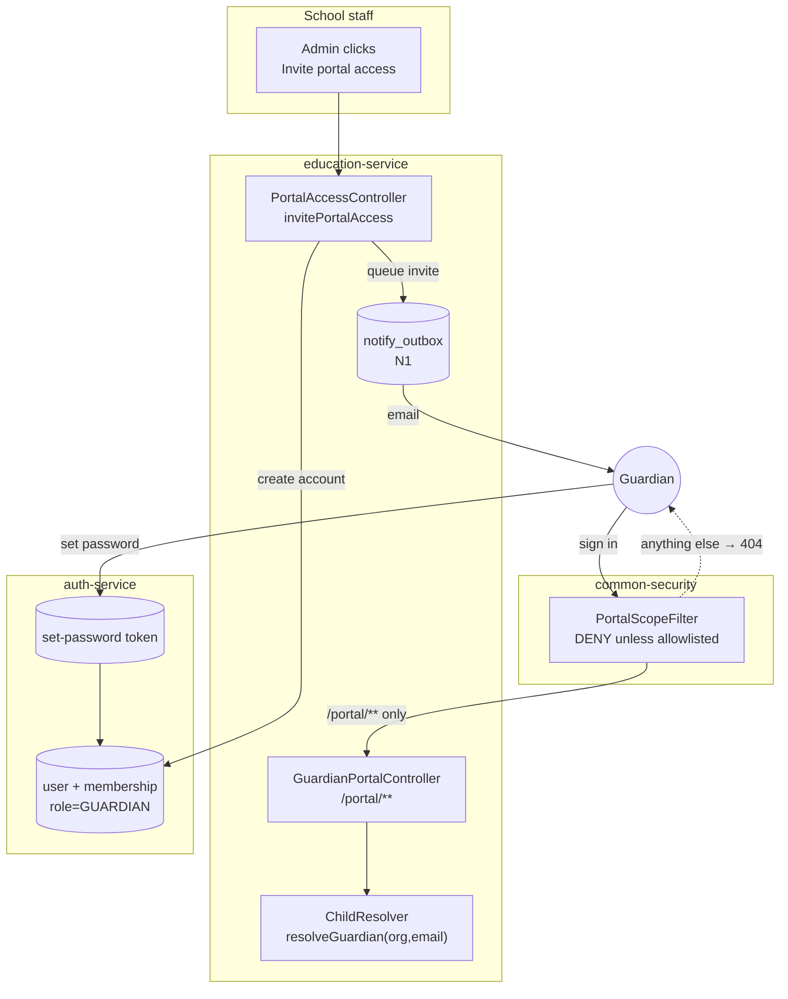
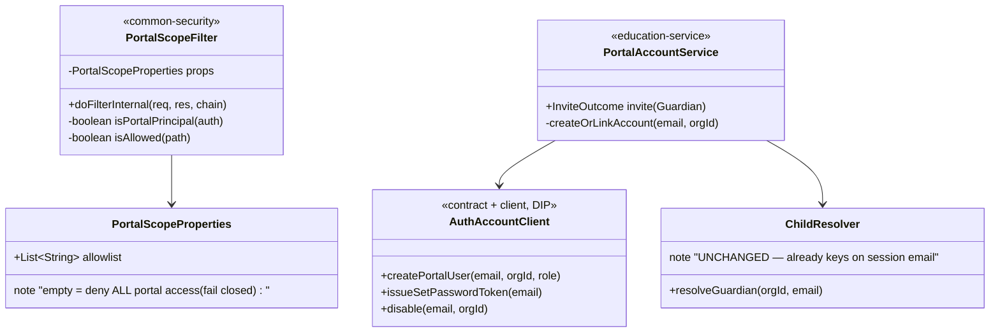
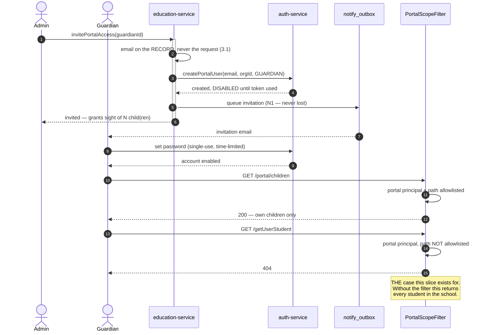

# Slice 3.1b — Portal sign-in (and the deny rule that must ship with it)

**Status: IMPLEMENTED — gate 7 of 9 (2026-08-06). NOT DONE.** The security property IS proven (case 3), but
one case is unexplained and one design decision is open — §9 and §10. Implementation findings, including two
integration defects, in §8. **Changes `common-security`, so it must be `mvn install`ed before dependants are
packaged, and the monolith must be rebuilt too.**
Non-phase-numbered but **blocking**: it completes 3.1, and **3.2 and 3.3 both depend on it**.
Programme: `education-complete-programme.md` Phase 3 — pays 3.1 §6's carried requirement
*"STILL MISSING: the auth-service user account"*.

---

## 1. Document — what and why

### Why this and not 3.3

3.3 (student portal) was the recommended next slice. Checking its precondition changed that, twice over:

1. **`Membership.role`'s javadoc lists `STUDENT` and `GUARDIAN`, and nothing seeds either** — verified again
   on 2026-08-06, unchanged since 3.1 found it. So 3.3 would build a **second** portal that nobody can log
   into. Two unreachable surfaces is worse than one, and it breaks the standing rule that a domain is
   finished **end to end** before the next is started. **3.1 is not end-to-end: it has no users.**
2. And then the more serious finding, below.

### THE FINDING: 3.1's portal is safe only because nobody can sign in

Education's **read** endpoints are not privilege-gated. Verified by spot-check on 2026-08-06:

| Endpoint | `@PreAuthorize` |
|---|---|
| `getUserStudent` | **none** |
| `getUserGuardian` | **none** |
| `getMarksSheet` | **none** |
| `getUserFc` | **none** |

This is not an oversight in the D-3 privilege map — that map deliberately gated **writes**
(`WRITE`/`ADMIN`/`DELETE_PRIVILEGE`), and reads were left open **because every authenticated education user
is staff**. Under that assumption it is correct.

**Sign-in destroys the assumption.** The moment a guardian holds a session, every ungated read is reachable:
the whole school's students, every mark, every fee record, every guardian's contact details. A guardian
would not need to attack anything — `GET /getUserStudent` would simply answer.

So 3.1's D2 claim — *"a guardian hitting a staff URL is refused because it is not part of this surface"* —
is **true today and would become false on the day sign-in ships**. The allowlist says what the portal
*can* reach; nothing says what a portal session *cannot* reach elsewhere.

> **This is why sign-in cannot be "just provisioning an account".** Account creation is the small half. The
> deny rule is the slice.

### What already exists to build on

| Existing | Consequence |
|---|---|
| `ChildResolver.resolveGuardian(orgId, email)` (3.1) | the portal already identifies a guardian **by the email on the session** — so a real login is *additive*, needing no change to any portal read |
| `GuardianPortalAccess` + `invitePortalAccess` (3.1) | the school's decision to grant access, already recorded, already ADMIN-gated, already audited |
| `auth-service` `User` + `Membership(organizationId, role)` | the identity seam; no second identity system needed |
| `HeaderAuthFilter` → `X-User-Roles` / `X-User-Privileges` → `AuthenticatedUser.authorities` | a portal marker travels to every service with no new plumbing |
| Password reset already delegates to auth-service (token-based) | invitation → set-password reuses a proven flow rather than inventing one |
| `guardianDashboard.html` + `guardian.js` (3.1) | the surface a signed-in guardian lands on already exists |

---

## 2. Design

### D1 — A portal user is a real `auth-service` User; there is no second identity system

A `User` (enabled, own password) plus a `Membership(organizationId = the school, role = GUARDIAN)`.
Same login form, same JWT, same gateway, same session handling.

**Provisioning is by invitation only, never self-registration.** 3.1 already decided this and the reasoning
stands: self-service registration against a child's enrolment number is an account-takeover path, and the
school already knows who its guardians are. `invitePortalAccess` — which exists, is ADMIN-gated and audited
— becomes the thing that creates the account.

### D2 — **THE DENY RULE.** A portal session may reach ONLY explicitly allowlisted paths

A shared `PortalScopeFilter` in **`common-security`**, not in education-service.

```
principal has the PORTAL marker?
    ├── no  → unchanged, staff behaviour exactly as today
    └── yes → is the path in THIS service's portal allowlist?
              ├── yes → proceed
              └── no  → 404 (never 403 — see D4)
```

**Why `common-security` and not education-service.** A portal principal is an authenticated principal
platform-wide. If the rule lives only in education, then business-, finance-, party- and every other service
still answers a guardian's session. Those services are org-scoped, so a guardian in a school org reaches
little today — but "little" is an accident of which org they are in, not a rule. Putting the filter in the
shared library makes the default **deny**, in every service, including ones written years from now by
someone who has never heard of the portal.

**A service with no declared allowlist denies portal principals entirely.** That is the fail-closed default,
and it is the property that makes this safe to add without auditing all thirteen services.

Education declares exactly one entry: `/portal/**`.

**Named pattern: policy enforcement point + allowlist.** This is the direct answer to the education review's
**finding A**, which proved that a scoping rule which must be *remembered per controller* is forgotten in
seven of them. The deny rule is therefore enforced in **one** place that every request passes through, not
as 74 `@PreAuthorize` annotations that must each be correct forever.

**The rejected alternative — gate all 74 reads.** It is the obvious fix and it is worse: it is 74 chances to
be wrong, it must be re-applied to every read added afterwards, and nothing fails if someone forgets. The
filter fails closed; annotations fail open.

### D3 — The marker is a ROLE, and `LOGIN_PRIVILEGE` is deliberately still granted

A portal user needs `LOGIN_PRIVILEGE`, because both the monolith
(`.anyRequest().hasAuthority("LOGIN_PRIVILEGE")`) and the services require it to serve anything at all —
including `/portal/**`. Withholding it locks the guardian out of their own portal.

So the portal marker is a **role** (`ROLE_PORTAL`, alongside `GUARDIAN`), and the filter is what converts
"may log in" into "may log in **and reach only the portal**".

**State this plainly because it is the part most easily got wrong: holding `LOGIN_PRIVILEGE` is not
authority to read staff data. The filter is the only thing that makes that true.** Any future change that
removes or bypasses it re-opens the whole read surface.

### D4 — Refusals are 404, never 403 — the same rule as 3.1

3.1 answers `NOT_FOUND` rather than `FORBIDDEN` because "that child exists but is not yours" is itself a
disclosure. The same logic applies one level up: a guardian probing `/getUserStudent` should learn nothing,
not even that the endpoint exists. **Consistency matters here** — a 403 on staff paths and a 404 inside the
portal would let a prober map the surface by watching which refusal they get.

### D5 — The invitation email IS the address verification

3.1 §6 carried this: *"`Guardian.email` is unverified free text, and it becomes a portal login identity. A
typo invites a stranger to a child's record."* Sign-in is where that debt comes due, so this slice pays it.

The invitation sends a **single-use, time-limited set-password token** to the address on the guardian
record. Nobody can sign in until that token is used, so **an address that cannot receive mail can never
become an account**. A typo therefore fails safe: the invitation dies unused rather than granting a stranger
access. The school never sets or sees the password.

Reuses the existing token flow rather than inventing one; the send goes through **N1's `notify_outbox`**, so
an invitation is never lost to a downstream outage.

### D6 — Built generically so 3.3 adds a resolver, not a mechanism

Nothing in the filter, the provisioning flow or the token is guardian-specific. 3.3 (student portal) then
supplies `role = STUDENT`, its own `/portal/**` reads and a `StudentResolver` — and inherits sign-in,
the deny rule and address verification unchanged.

**Deliberately NOT built here:** student accounts. A student portal without a student read surface is the
same "unreachable surface" mistake this slice exists to correct.

### D7 — Scope

| In | Out |
|---|---|
| `User` + `Membership(role=GUARDIAN)` created by `invitePortalAccess` | self-registration (D1) |
| `ROLE_PORTAL` marker travelling in the JWT | SSO / social login |
| **`PortalScopeFilter` in `common-security`, deny-by-default** | gating the 74 reads individually (D2, rejected) |
| set-password token = address verification (D5) | changing how staff authenticate, at all |
| revoke → the account can no longer sign in | student accounts (3.3, D6) |
| landing a portal session on `guardianDashboard.html` | online payment (3.2, gated on D-4) |

### Layer answers (§5b)

| Layer | Answer |
|---|---|
| **UI/UX** | invitation email → set password → lands on the guardian dashboard, never the staff shell |
| **Service / API** | no new education endpoint; `invitePortalAccess` gains account creation |
| **Database** | MySQL — auth-service's existing `user`/`membership`; **no new education table** |
| **Patterns** | policy enforcement point + allowlist (D2); invitation token (D5); fail-closed default (D2) |
| **Microservice design** | identity stays in `auth-service`; the deny rule is cross-cutting so it goes in `common-security`, per the standing rule |
| **Per-org configurability** | reuses 3.1's `edu.portal.enabled`; no second switch for one behaviour |
| **DRY** | the token flow, the outbox and the portal reads are all reused; nothing is re-implemented |

---

## 3. Architecture & UML

### 3.1 Architecture



### 3.2 Class



### 3.3 Sequence



---

## 4. Implement — checklist

- [ ] `common-security`: `PortalScopeFilter` + `PortalScopeProperties` (`myplus.portal.allowlist`),
      registered before the authorization filter. **Empty allowlist ⇒ deny.**
- [ ] auth-service: `ROLE_PORTAL` + `GUARDIAN` seeded; `LOGIN_PRIVILEGE` granted, no staff privileges.
- [ ] auth-service: endpoints to create a portal user, issue a set-password token, and disable an account.
- [ ] `AuthAccountClient` contract + client (DIP), consumed by education-service.
- [ ] education-service: `invitePortalAccess` creates/links the account; `revokePortalAccess` disables it.
- [ ] education-service: `myplus.portal.allowlist=/portal/**`.
- [ ] The invitation send goes through **N1's outbox**, not a direct call.
- [ ] Monolith: a portal session lands on `guardianDashboard.html`, never the staff shell.
- [ ] i18n for the invitation + set-password screens × 6 bundles.

## 5. Test

**Pure unit — `PortalScopeFilterTest` (no Spring, no DB):**
staff principal + staff path → allowed · portal principal + `/portal/x` → allowed · portal principal +
`/getUserStudent` → **denied** · portal principal + **empty allowlist** → denied · path-traversal
(`/portal/../getUserStudent`) → denied after normalisation · unauthenticated → untouched.

**Cypress gate — `portal-sign-in.cy.js`:**

| # | Case | Asserts |
|---|---|---|
| 1 | invite creates an account that **cannot yet sign in** | D5 — the token, not the invite, enables it |
| 2 | a guardian who sets their password **can** sign in | the happy path |
| 3 | **a signed-in guardian calling `/getUserStudent` gets 404** | **THE case. Without D2 this returns the whole school** |
| 4 | the same session reads `/portal/children` fine | the deny rule did not break the portal |
| 5 | a signed-in guardian sees **only their own** children | 3.1's rule still holds with a real session |
| 6 | staff endpoints still work for staff | the inverse regression — the filter must not narrow staff |
| 7 | revoke ⇒ the account can no longer sign in | withdrawal is immediate |
| 8 | `edu.portal.enabled=false` ⇒ portal closed even for a valid account | 3.1's kill switch still wins |

**Regression list:** `guardian-portal.cy.js` (its "no access row" cases now run against a real login),
`privilege-map.cy.js`, `method-authz.cy.js`, and a staff smoke spec per module (the filter is shared).

## 6. Open / deferred

- **Student accounts → 3.3** (D6). The mechanism is built here; 3.3 adds the resolver and reads.
- **Read-gating the 74 staff endpoints is NOT done and is not needed for portal safety** (the filter covers
  it). It remains desirable for *staff-vs-staff* least privilege — a teacher reading every fee record — and
  that is its own slice, unchanged by this one.
- **`Student.email` is unverified free text**, exactly as `Guardian.email` was; 3.3 inherits D5's answer.
- 2FA for portal accounts — the platform supports it; not enabled here.

## 7. Risks

- **This slice changes a SHARED library.** `common-security` is consumed by every service, so per the
  build standard it must be `mvn install`ed before dependants are packaged, and **every module's smoke spec
  belongs in the regression list** — a filter that wrongly matches would lock staff out platform-wide.
- **Fail-closed means a missing config line disables a portal**, not opens one. That is the intended
  direction, but it will present as "the guardian portal 404s" if `myplus.portal.allowlist` is unset.
- **The filter must normalise the path before matching.** `/portal/../getUserStudent` must not pass; there
  is a pure test for exactly this.
- Deliverability: an invitation that never arrives is indistinguishable to the school from one ignored.
  N1's outbox retries it, and the access row already shows `INVITED` vs `ACTIVE`.

---

## 8. Implementation notes — what the code found that the design did not

**1. Reuse-first paid off twice, and shrank the slice.** `OrgUserController.createOrgUser` already creates a
user in an org and sends a set-password email, and `forgot-password`/`reset-password` already implement the
token flow D5 asked for. `createOrLinkPortalUser` is modelled on the former rather than reinventing it — but
it could not simply *call* it: `createOrgUser` throws `DuplicateResourceException` on an existing email and
restricts roles to ADMIN|USER. **A portal account must LINK an existing person**, because one adult can be a
guardian at two schools on this platform and is one person with one login.

**2. `GatewayIdentityForwarding.interceptor()` already stamps `X-Internal-Secret`**, so education→auth
service-to-service authentication needed no new plumbing — only the decision to enforce it.

**3. `PortalAccountController` FAILS CLOSED on an unset secret, deliberately inverting the platform's other
convention.** `HeaderAuthFilter` *skips* its secret check when none is configured, which is safe for a
filter that only READS identity and would be unsafe here, where the call CREATES a login. A deployment that
forgets the secret gets a portal that cannot be provisioned, never one anyone can provision.

**4. The filter reads the ROLES HEADER, not the SecurityContext.** `HeaderAuthFilter` populates the context
but is installed *inside* each service's Spring Security chain, while an auto-registered `Filter` bean runs
in the servlet chain *before* it. Depending on the principal would have made correctness depend on
registration order in thirteen `SecurityConfig` classes — the exact "remember it everywhere" failure the
filter exists to avoid. Reading the header is order-independent and safe in the deny direction: forging the
portal role only restricts the forger.

**5. Invite and revoke take OPPOSITE positions on failure, on purpose.**
- **Invite surfaces it** (`PARTIAL`): an access row whose account was never created is a guardian who will
  never be able to log in, and the school must learn that now, not when the family calls.
- **Revoke swallows it**: the access row is already REVOKED by the time the account call runs, so the
  guardian can read nothing regardless. Failing the operation because auth-service was slow would leave a
  school unable to revoke at all — the worst possible failure mode for this particular button.

### Two integration defects found while wiring the gate

**A. The monolith has no `common-security` on its classpath**, so the shared filter is not active there.
Education-service is the data owner and refuses, so **the data was never exposed** — but the refusal
happened one hop later than ideal.

**B. `GatewayClient` turned every downstream 404 into a generic 500.** It caught only `Unauthorized` and
`Forbidden`; a 404 fell through to the catch-all handler and came back as `"Error Occurred"`. This is the
**same defect slice 2.1 recorded as standard D3d** — fixed then for *logging*, never for *this status*.

It matters precisely here: `PortalScopeFilter` answers 404 so a portal caller learns nothing, and relaying
that as a 500 says "something broke" — untrue, and more informative to a prober than the deliberate silence.
**Fixed** with `DownstreamNotFoundException` + `DownstreamNotFoundAdvice`, passing the downstream body
through unchanged. **This is a monolith-wide behaviour change** (any downstream 404 now relays as 404
instead of 500), which is why a broad staff smoke belongs in the regression list.

**Defence-in-depth follow-up, NOT done:** putting `PortalScopeFilter` in the monolith too, so the request
never leaves it. That needs `common-security` on the monolith's classpath, which would also pull in
`HeaderAuthFilter`, a second `XssSanitizingFilter` (the monolith has its own) and the empty
`UserDetailsService` — too much blast radius to bundle into this slice.

### The gate needed a fixture the design did not anticipate

**Cypress cannot read email, and D5 makes the emailed token the only way in.** So a real guardian session —
the thing tests 2 through 8 are *about* — was untestable as designed. Resolved by seeding
`guardian.education@myplus.com` with `ROLE_PORTAL` and a GUARDIAN membership, dev-only, alongside the
existing `demo.*`/`owner.*` fixtures. The account is otherwise identical to a live one; only the password is
known. Without it the deny rule could only ever have been unit-tested, and **the case that matters most —
a real guardian session getting 404 from `/getUserStudent` — would have gone unproven end to end.**

**Test 3 probes each URL as STAFF first.** A 404 only proves the filter if the route exists; without that
control, renaming an endpoint would turn the slice's most important assertion into a green that proves
nothing — the same shape as 2.1's skipped clash test and 2.4's empty class.

---

## 9. Gate run — 7 of 9 green, and what the two reds are

**Not green. Do not record this slice as done.**

| # | Case | Result |
|---|---|---|
| 1 | invite provisions the account and says so | ✅ |
| 2 | a signed-in guardian reads their own children | ✅ |
| 3 | **THE CASE — the same session gets 404 from a staff read** | ✅ **the deny rule works** |
| 4 | the refusal is 404, never 403 | ✅ |
| 5 | path traversal does not walk past the allowlist | ✅ *(after the test was fixed — see below)* |
| 6 | a guardian cannot write | ❌ **500, expected 404 — unexplained** |
| 7 | staff completely unaffected | ✅ |
| 8 | portal OFF closes it for a valid account | ✅ |
| 9 | revoking stops the reads | ✅ |

**The security property is proven.** Case 3 is the one this slice exists for, and it passes: a real signed-in
guardian gets 404 from `/getUserStudent`, `/getUserGuardian`, `/getMarksSheet` and `/getUserFc`, each probed
as staff first so a 404 cannot be a missing route.

### Case 5 was a TEST defect, and the fix generalises

It asserted a bare status and got `200`. A status alone **cannot distinguish a followed redirect from a
guardian reading the roster** — two findings that could not be further apart. Rewritten to assert the
security property (`followRedirect:false`, no `enrollNo`, no roster collection, not 200) and to log the real
status. It passed immediately, confirming the 200 had been a followed redirect all along.

**Standard worth keeping: assert the PROPERTY, not the status code, whenever a status can be produced by
more than one mechanism.**

### Case 6 is genuinely unexplained — three theories dead

1. ~~Stale monolith~~ — the jar is newer than the source and contains the new classes.
2. ~~Advice ordering~~ — `@Order(HIGHEST_PRECEDENCE)` was added and **verified present in the running jar's
   constant pool**. Still 500.
3. ~~A monolith-side `@PreAuthorize`~~ — there are **none** on the education proxy controllers.

**A wrong inference of mine is recorded here deliberately:** I argued "`addStudent` appears 0 times in the
education log, so the request never arrived". `getUserStudent` is also 0 — **education-service does not log
request paths at all**, so absence proves nothing. The 2.1 diagnosis worked because it reasoned over *SQL
between two known-good inserts*, not over path strings. Do not repeat the shortcut.

**Blocked on one artifact:** `RestResponseEntityExceptionHandler` logs `500 Status Code` with the stack
trace, and the monolith has **no file appender** — the trace exists only in its console.

## 10. OPEN — a design decision that needs the user

**Portal provisioning cannot work in the default local setup, and that is a consequence of D-then-§8's
fail-closed choice.**

```yaml
internal-secret: ${INTERNAL_SECRET:}     # application.yml — defaults to EMPTY
```

With it unset, education's interceptor omits the header and `PortalAccountController.trusted()` refuses →
the education log shows education→auth returning this slice's own `refuse()` body. `invitePortalAccess`
creates the access row but never the account.

Failing closed is right for production. **Shipping a control that cannot be switched on locally is not** —
it means the provisioning path is untestable, and untestable paths ship broken. Options:

| | Option | Trade-off |
|---|---|---|
| **1** | A dedicated `myplus.portal.provisioning-secret` | enabling it cannot change platform-wide auth behaviour — **preferred** |
| 2 | Set `INTERNAL_SECRET` globally | correct long-term, but it also switches ON secret ENFORCEMENT in `HeaderAuthFilter` for every service, which currently skips the check *because* the value is empty |
| 3 | Allow when no secret is configured | rejected — account creation open by default |

> **New standard candidate (§1c):** *a fail-closed control must ship with a working local configuration, or
> the feature it guards is untestable and will ship broken.* This slice is the evidence.
