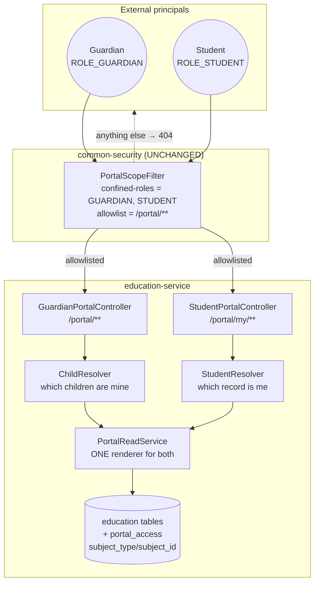
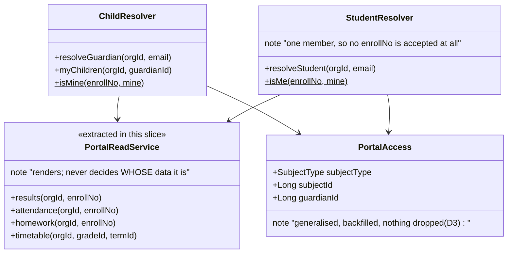
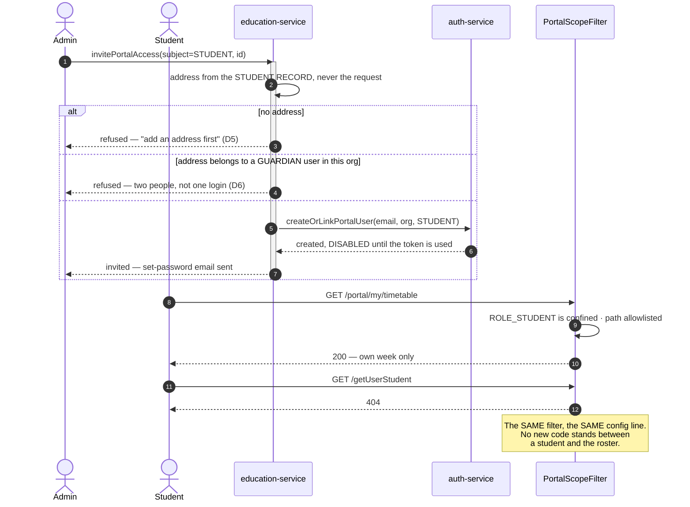

# Slice 3.3 — Student portal

**Status: ✅ DONE & Cypress-GREEN — 13/13 on the FIRST run (2026-08-07).** Regression green: `guardian-portal`
11/11, `portal-sign-in` 13/13, `privilege-map` 11/11, `homework` 10/10, `report-cards` 7/7,
`security/method-authz` 11/11, `pharmacy/method-authz` 5/5, `business/customer` 14/14 — **82 regression
cases**, plus **200 education unit tests** and the six i18n bundles aligned.
Produced and delivered 2026-08-06/07. Programme: `education-complete-programme.md` Phase 3.

**It shipped under D-7 option A (invitation only, refuse without an address), as designed.** The boundary is
gated rather than hidden — see §12 for what implementation found that this design did not.

> **Why it went green first time, stated because the two previous slices did not:** the mechanism was
> already proven. 3.1b D6 claimed this slice would need "a resolver, not a mechanism", and the deny rule
> genuinely took **one configuration line** — `PortalScopeFilter` was not touched, and
> `PortalScopeFilterTest`'s `confined_set_is_extensible` case, written before a second audience existed,
> was already asserting it.

---

## 1. Document — what, why, and what the precondition check found

### What it is

The student's own view of their own record: **my week, my results, my homework, my attendance.** Read-only,
one person, no child-picker — the entire difference from 3.1, which serves an adult who may have several
children.

### Why now

3.1b makes it possible for the first time. Before it, a student portal would have been a second surface
nobody could log into — which is precisely why the plan reordered 3.3 behind 3.1b rather than building it.

### The precondition check, run first — because that is what found the last breach

The programme's most valuable finding to date came from checking a precondition instead of building
(`education-complete-programme.md` §9c). Repeated here, and it changed the slice twice:

| # | Checked | Found |
|---|---|---|
| 1 | Is there a student identity to attach a login to? | ✅ `Student.email` exists (line 50). **But see finding A — its existence is not its availability.** |
| 2 | Does `ROLE_STUDENT` exist? | ❌ **No.** `Membership.role`'s javadoc lists `STUDENT`; nothing seeds a role. 3.1b turned this into a one-line job: seed the role, add it to `myplus.portal.confined-roles`. **The mechanism is done; this slice adds a resolver, not a mechanism** (3.1b D6) |
| 3 | Are the reads already written? | ⚠️ **Yes — inside `GuardianPortalController`, per child.** Building them again would be the DRY violation the standing rules name explicitly. **Finding B.** |
| 4 | Is a student's week one query? | ✅ `TimetableEntryRepository.findByGradeScoped(gradeId, termId, org, user)` — one call, already indexed and org-scoped (2.1) |
| 5 | Does the deny rule cover a second audience? | ✅ **by configuration, not by code.** `confined-roles` was made a property in 3.1b for exactly this; `PortalScopeFilterTest` already asserts `ROLE_STUDENT` is confined once listed and *not* confined until it is |

### Finding A — **the invitation model does not transfer unchanged, and this is D-6's recorded trigger**

D-6 settled guardian provisioning as **invitation-only**, and its stated weakness was written down at the
time: *"A's real weakness is that it requires an email on the guardian record."* For guardians that is a
mild constraint — a school holds parent contact details because it has always needed them.

**For students it inverts.** The population least likely to hold a personal email address is exactly the
population this slice serves, and it is age-shaped:

| Cohort | Realistic `Student.email` coverage | Consequence |
|---|---|---|
| Secondary / college | usually present, often school-issued | invitation works unchanged |
| Primary | rare, and frequently *the guardian's address re-used* | **invitation cannot provision them at all** |

And re-using the guardian's address is not a workaround — it is a **collision**: `auth-service` keys a
`User` by email (`findByEmail`), so a student row carrying their guardian's address would resolve to the
guardian's login and hand a child their guardian's session. `createOrLinkPortalUser` would *link*, not
refuse, because linking is the deliberate behaviour that lets one adult be a guardian at two schools.

> **This is the exact condition D-6 recorded as the trigger for option C (school-issued join codes)** —
> reached one slice later than expected, and by a different route than the one anticipated. It is written up
> as **D-7 (§11)** rather than decided here, because it is a product decision about which schools this
> serves on day one.

**The slice is designed so the answer does not block it:** invitation ships, the missing-address case is a
**surfaced refusal** (the same shape as 3.1b's gate case 2), and join codes are a self-contained addition
that reuses everything below unchanged.

### Finding B — the reads already exist, and a second copy would be the real defect

`GuardianPortalController` already answers **results, attendance, homework** for one `enrollNo` after
`ChildResolver` has proven the child belongs to the caller. A student portal needs the same three answers
for one `enrollNo` — proven a different way.

```
guardian → ChildResolver.requireMine(enrollNo)  ─┐
                                                 ├─→ THE SAME READ
student  → StudentResolver.me() → my enrollNo   ─┘
```

So the read bodies move **down** into a `PortalReadService`, and the two controllers keep only their
authority check. This is the codebase's own established rule — *extract at the second caller, never
speculatively* — which is how `StaffAbsenceService` (2.3), `StudentVisibilityService` and three shared
libraries came about, and it is listed as "exemplary" in the standards review. Writing the reads twice here
would be the first regression against that record.

**It also concentrates the risk correctly.** After the extraction there is exactly one place where a portal
read renders a child's data, and exactly two places that decide *whose* data it is. Both are reviewable on
one screen.

---

## 2. Design

### D1 — A student is confined by CONFIGURATION; 3.1b's filter does not change

```properties
myplus.portal.confined-roles=ROLE_GUARDIAN,ROLE_STUDENT     # education-service.yml — the whole change
myplus.portal.allowlist=/portal/**                          # unchanged
```

`ROLE_STUDENT` is seeded in `auth-service` with `LOGIN_PRIVILEGE` + `CHANGE_PASSWORD_PRIVILEGE` and nothing
else, exactly as `ROLE_GUARDIAN` is. **No filter code is touched, and `PortalScopeFilterTest` already
contains the case that proves this works** (`confined_set_is_extensible`) — written in 3.1b before there was
a second audience, and now paying for itself.

> **3.1b's stated cost lands here, on schedule.** A new external audience is *not* confined automatically —
> whoever adds one must list its role. This slice is the first time that rule is exercised, so the checklist
> in §4 carries it as an explicit item rather than trusting it to be remembered.

### D2 — `StudentResolver`: one person, one enrolment number, derived per request

Mirrors `ChildResolver` deliberately, including what it refuses to do:

- **Derived per request, never cached and never in the JWT.** A student who leaves, or whose access is
  revoked, stops reading on the *next* request. A cached copy of an access list is not a caching bug, it is
  a stranger continuing to read a record.
- **Returns null for every failure mode** — portal disabled, no access row, revoked, unknown email — so a
  caller cannot distinguish them. All answer `NOT_FOUND`.
- **The intersection is a pure function** (`isMe(enrollNo, mine)`), testable with no Spring, no DB, no
  Docker — the same treatment given to `ClashDetector`, `LeaveBalanceCalculator`, `HomeworkRules` and
  `ChildResolver`.

**The one structural difference: a student's set has exactly one member.** Every endpoint therefore ignores
any client-supplied `enrollNo` entirely rather than validating it — there is nothing to choose between, so
accepting a parameter would create an IDOR surface that has no reason to exist.

### D3 — Access rows: **generalise the existing table, do not add a second one**

| Option | Verdict |
|---|---|
| **A. `portal_access` gains `subject_type` (GUARDIAN\|STUDENT) + `subject_id`, backfilled from `guardian_id`** ✅ **chosen** | One table, one invite/revoke controller, one audit trail, **one screen**. Costs a Flyway migration that ADDs and BACKFILLS only — never drops (D5) — and `guardian_id` stays in place as the read path until a later slice retires it |
| B. A new `student_portal_access` table | Duplicates the entity, the repository, the controller, the screen and the revoke semantics. **+1 domain entity against a 35/~40 split trigger**, spent on a copy |

**Why A is safe under D5:** the migration adds two nullable columns, backfills `subject_type='GUARDIAN'`,
`subject_id=guardian_id` for every existing row, and indexes `(organization_id, subject_type, subject_id)`.
Nothing is dropped, nothing is renamed, and a rollback loses only the new rows. A tenant already holding
data cannot fail it.

### D4 — What a student may see is NOT what a guardian may see, and the difference is deliberate

| Read | Guardian (3.1) | Student (3.3) | Why |
|---|---|---|---|
| Timetable | — | ✅ **new** | the answer to "where am I next", and the single most-used screen in any student portal |
| Results (published report cards) | ✅ | ✅ | published means published; unpublished is invisible to both |
| Homework + my submissions | ✅ | ✅ | the student is the one who has to do it |
| Attendance summary | ✅ | ✅ | |
| **Fee dues** | ✅ | ❌ **withheld** | a family's financial position is the guardian's business. A child reading "your family owes 40,000" is a harm the system would be creating, not reporting |
| **Behaviour notes (2.5)** | ❌ (already withheld) | ❌ **withheld** | 2.5 §D6 records that notes were written with **no expectation anyone outside staff would read them**. Exposing them retroactively changes that contract, and doing it to the child they are about is the worst version of it. Needs its own per-note decision — the carried requirement stands |

> **This table is the slice's domain judgement, not its plumbing**, and it is the part worth arguing with.
> It is recorded here so a later reader changes it *on purpose*.

### D5 — Provisioning reuses 3.1b end to end; only the address source differs

`invitePortalAccess` becomes subject-typed. For a student it takes the address from the **student record**,
never the request — the same rule and the same reason as 3.1 D3 — creates or links the `auth-service` user
with `role=STUDENT`, and lets the set-password token be the address verification (3.1b D5).

**A student without an address is refused, plainly and immediately**, naming the fix — identical to 3.1b's
guardian case, which the gate already pins. **No silent half-state:** an access row without a login is a
person who cannot sign in, and the school learns it at the click, not when the family calls.

### D6 — A student's login is not a guardian's login, even when the family shares an address

Refused at the boundary with a specific message, because the failure mode is severe and silent otherwise:
if `Student.email` matches an existing `ROLE_GUARDIAN` user in this org, provisioning **refuses** rather
than linking. Linking is right for one adult at two schools; it is wrong for two different people, and
`createOrLinkPortalUser` cannot tell them apart on its own. The check therefore lives where the *domain*
knows the difference — education-service, which is holding both records — not in `auth-service`.

### D7 — Scope

| In | Out |
|---|---|
| `ROLE_STUDENT` seeded + added to `confined-roles` | any change to `PortalScopeFilter` (D1) |
| `StudentResolver` + `PortalReadService` extraction (finding B) | fee dues and behaviour notes (D4) |
| `/portal/my/timetable`, `/portal/my/results`, `/portal/my/homework`, `/portal/my/attendance` | any write endpoint — the portal stays read-only (3.1 D4) |
| `portal_access` generalisation + Flyway (D3) | retiring `guardian_id` (a later slice, once nothing reads it) |
| invitation from `Student.email`, refused when absent (D5) | **join codes — D-7 (§11)**; if chosen, they reuse all of the above |
| a student lands on a student dashboard, never the staff shell | student→teacher messaging, materials (D-5), fee payment (3.2) |

### Layer answers (§5b)

| Layer | Answer |
|---|---|
| **UI/UX** | one page, four cards, **no child-picker** — the guardian dashboard's structure minus the thing a student has no use for. Today-first: the week opens on today's row |
| **Service / API** | four GETs under `/portal/my/**`, inside the existing allowlist; refusals are `NOT_FOUND`, never `FORBIDDEN` (3.1 D2 / 3.1b D4) |
| **Database** | MySQL — relational, transactional, and every read is an indexed lookup on data that already lives there. **No new table**: `portal_access` is generalised (D3) |
| **Patterns** | policy enforcement point + allowlist (3.1b, reused unchanged) · resolver (D2) · **extract-at-the-second-caller** (finding B) · invitation token (3.1b D5) |
| **Microservice design** | identity in `auth-service`, deny rule in `common-security`, reads in `education-service`. **Nothing new is created** — this slice is the proof that 3.1b's mechanism was built generically |
| **Per-org configurability** | reuses `edu.portal.enabled`, plus **`edu.portal.students.enabled`** — a school may run the guardian portal without the student one, and most will start that way |
| **DRY** | the read bodies are extracted, not copied — the whole of finding B |

---

## 3. Architecture & UML

### 3.1 Architecture



### 3.2 Class



### 3.3 Sequence



---

## 4. Implement — checklist

- [ ] `auth-service`: seed `ROLE_STUDENT` (LOGIN + CHANGE_PASSWORD only). **Dev-only fixture account**
      `student.education@myplus.com`, alongside `guardian.education@myplus.com` — 3.1b §8 proved a real
      session is otherwise untestable.
- [ ] **`education-service.yml`: add `ROLE_STUDENT` to `myplus.portal.confined-roles`.** ⚠️ **This is 3.1b's
      "remember it" cost, and it is load-bearing: without this line a student session is NOT confined and
      reads the whole roster.** It belongs in the same commit as the role.
- [ ] Flyway **V25**: `portal_access` + `subject_type`/`subject_id`, backfilled, indexed
      `(organization_id, subject_type, subject_id)`. ADD + BACKFILL only (D3/D5).
- [ ] **Extract `PortalReadService`** from `GuardianPortalController`; 3.1's behaviour must not change —
      `guardian-portal.cy.js` is the regression that proves it.
- [ ] `StudentResolver` + pure `isMe`.
- [ ] `StudentPortalController`: `/portal/my/{timetable,results,homework,attendance}`. No writes. No
      `enrollNo` parameter anywhere.
- [ ] `invitePortalAccess` / `revokePortalAccess` become subject-typed; the school's screen gains a student
      tab. Refusals per D5 and D6.
- [ ] `edu.portal.students.enabled` in the settings catalog, **read on the path it governs** (C1).
- [ ] Monolith: proxy the four reads; a student session lands on the student dashboard, never the staff shell.
- [ ] i18n × 6 bundles.

## 5. Test

**Pure unit (`mvn test`, no Docker):** `StudentResolverTest` — `isMe` exact match · unknown enrolment number
· revoked · portal off · students-off-but-guardians-on · a student whose email matches a guardian.
Plus `PortalScopeFilterTest`'s existing `confined_set_is_extensible`, which already covers `ROLE_STUDENT`.

**Cypress gate — `student-portal.cy.js`:**

| # | Case | Asserts |
|---|---|---|
| 1 | **the student session is CONFINED** (`/getUserStudent` → 404) | the precondition, first, as 3.1b §12 requires — a 200 means a stale cached principal, not a broken filter |
| 2 | a student reads their own week / results / homework / attendance | the portal works with a REAL session |
| 3 | **no `enrollNo` parameter changes any answer** | pass another student's number to all four; the response is identical to passing none |
| 4 | **a student cannot read another student's record**, however it is asked | D2 |
| 5 | **fee dues and behaviour notes are unreachable** to a student session | D4 — the domain judgement, gated so a later change is deliberate |
| 6 | **a guardian session is unaffected** by the extraction | finding B's regression — `guardian-portal.cy.js` runs alongside |
| 7 | a student with no address cannot be invited, and the refusal names the fix | D5 |
| 8 | **an address already belonging to a guardian is REFUSED, not linked** | D6 — the severe, silent failure |
| 9 | `edu.portal.students.enabled=false` closes the student portal **and leaves the guardian portal open** | C2 — both halves, both directions |
| 10 | revoking stops the reads on the next request | D2 |
| 11 | staff are completely unaffected | the inverse regression |

**Regression list:** `guardian-portal.cy.js` (the extraction), `portal-sign-in.cy.js` (a second confined
role), `privilege-map.cy.js`, and a staff smoke per module (`common-security` config changes).

## 6. Risks

- **The `confined-roles` line is the whole security boundary for this audience.** Omitted, the portal still
  works — and the deny rule silently does not. Gate case 1 exists to catch exactly that, and it must run
  first.
- **The extraction touches shipped, gated code.** 3.1's spec is the control; if it does not stay green, the
  extraction is wrong, not the spec.
- **Email collision (D6) is the severe case.** It is silent by construction, because linking is correct
  behaviour everywhere else.
- **Attendance has no UNIQUE key** (`(org, student, date)`) — a standing debt that this slice makes *visible*
  to the person most likely to notice, since a student reading duplicated attendance days will report it.
  Not this slice's to fix; recorded so the report is recognised when it arrives.

---

## 11. D-7 — how a student without an email address gets a login (NEEDS THE USER)

**The question:** invitation needs an address, and primary-school students largely do not have one (finding
A). Which schools does the student portal serve on day one?

| | Option | Trade-off |
|---|---|---|
| **A** | **Invitation only, refuse without an address** *(assumed, and what this design ships)* | Zero new mechanism, zero new risk; serves secondary and college immediately. **Primary schools cannot use the student portal at all** — and the refusal makes that visible rather than mysterious |
| **B** | School-issued **join codes** — `student_join_code` (code · studentId · expiry · usedOn), bulk generate per class, public claim page exchanges a code for an account | D-6's recorded option C, reached one slice early. Serves every cohort. Costs a table, a public page, and a claim flow whose security has to be got right (codes are guessable if short, and printed slips get shared) |
| C | Guardian creates the student's login from their own portal | **Rejected.** The guardian is not the account holder, and the only address available is theirs — which is D6's collision, deliberately introduced |

**Recommendation: A now, B when a primary school is a real customer.** It matches D-6's own resolution
exactly — build the mechanism, record the trigger, and do not build the fallback speculatively. B reuses
every part of this slice unchanged, so choosing it later costs nothing that A spends.

**This slice is designed to proceed under A.** If B is wanted in the same slice, say so before implementation
starts — it roughly doubles the work and adds a public unauthenticated surface, which is its own review.

---

## 12. Implementation notes — what the code found that the design did not

Four corrections, all found by writing the code against the real schema rather than the described one. None
changed the slice's shape; each is recorded because the next reader will otherwise trust the design's
wording over the database.

**1. The table is `guardian_portal_access`, not `portal_access` — and it was NOT renamed.** D3 was written
against a name that does not exist. Renaming a live table is exactly what standard D5 forbids, and the name
is not worth a migration that can fail on a tenant holding data. The honest cost: **the table name now
under-describes its contents.** Recorded in V25's header rather than quietly accepted.

**2. `guardian_id` was `NOT NULL` with a UNIQUE key on it, so a student row could not simply reuse it.**
Putting a student id in a column named `guardian_id` would collide in `uk_portal_access_guardian` the moment
guardian 5 and student 5 existed in one org — **two unrelated people sharing a unique key.** Resolved by
widening the column to nullable (a widening, not a drop) and adding
`uk_portal_access_subject (organization_id, subject_type, subject_id)`. MySQL permits many NULLs in a unique
index, so student rows simply do not participate in the old key.

**3. THE REAL FINDING: routing sent BOTH portal audiences to the staff shell — and 3.1 already did this.**
`ModuleRouter` keys on the user's module, and a guardian and a student are both `EDUCATION`. So a portal
login landed on `/educationDashboard`: a page assembled entirely from reads that `PortalScopeFilter` then
answers with 404. **A guardian has been landing there since 3.1**, which nothing caught because 3.1's gate
tests the portal's DATA, and the deny rule (which makes the staff page fail rather than leak) only shipped
in 3.1b.

> Fixed for both audiences in the shared router — `portalDashboardFor(authorities)`, checked BEFORE the
> module map in the two places that route, because **the portal role is the more specific fact**: it says
> which SURFACE the person gets, while the module only says which product they belong to.

**4. `createOrLinkPortalUser` hardcoded `ROLE_GUARDIAN`, and the obvious fix was the dangerous one.**
It now maps from the membership role — via an **allowlist, not string concatenation**. `"ROLE_" + memberRole`
would mint `ROLE_TEACHER`, or `ROLE_ANYTHING`, from a caller-supplied value, and **an unrecognised role is
not in `confined-roles`, which means UNCONFINED.** That is the fail-OPEN direction, so an unknown value is
refused rather than resolved into a role nobody confines. The same reasoning made `provisionAccount`'s role
a constant at each call site instead of a request parameter.

### The gate run

13/13 first time. Two cases earned their place:

- **Case 1 (CONFINED) passed immediately**, which is the evidence that 3.1b's mechanism generalised: the
  only change required to confine a brand-new external audience was adding `ROLE_STUDENT` to one property.
- **The D6 collision case** — a student record carrying their guardian's address — is refused, and **no
  access row is created by the refused invite**. That second assertion is the one that matters: a refusal
  that nevertheless granted access would be the actual harm, and no status check can detect it.

### Debt this slice creates

- **`guardian_name` now holds the display name of a STUDENT on student rows.** Correct data, misleading
  column name — the same shape as finding 1. Both are candidates for the 0.4 column-rename slice, which
  already owns this class of problem; neither is worth a migration on its own.
- **`guardian_id` is now nullable and duplicated by `subject_id`** for guardian rows. V25 drops nothing on
  purpose; retiring the old column belongs to a later slice, once nothing reads it.
