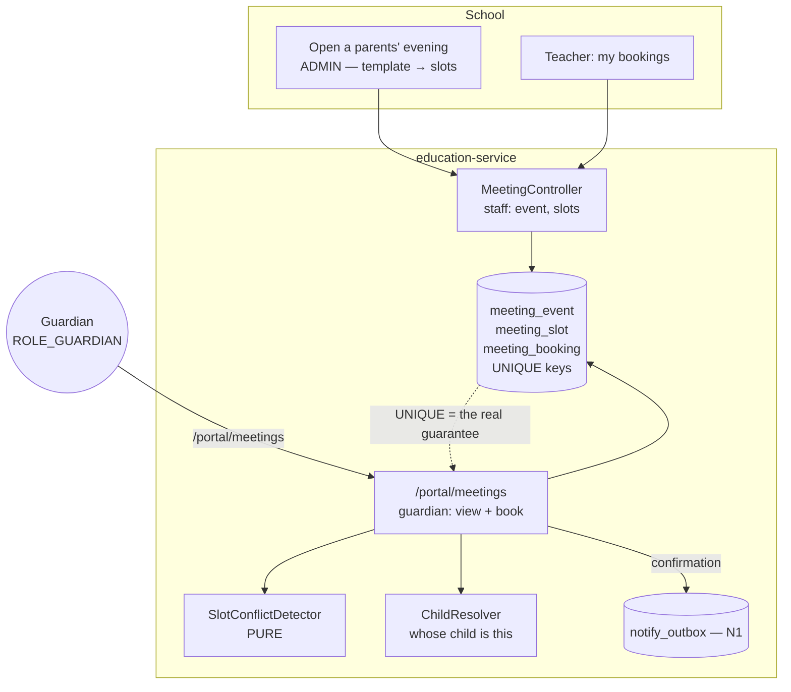
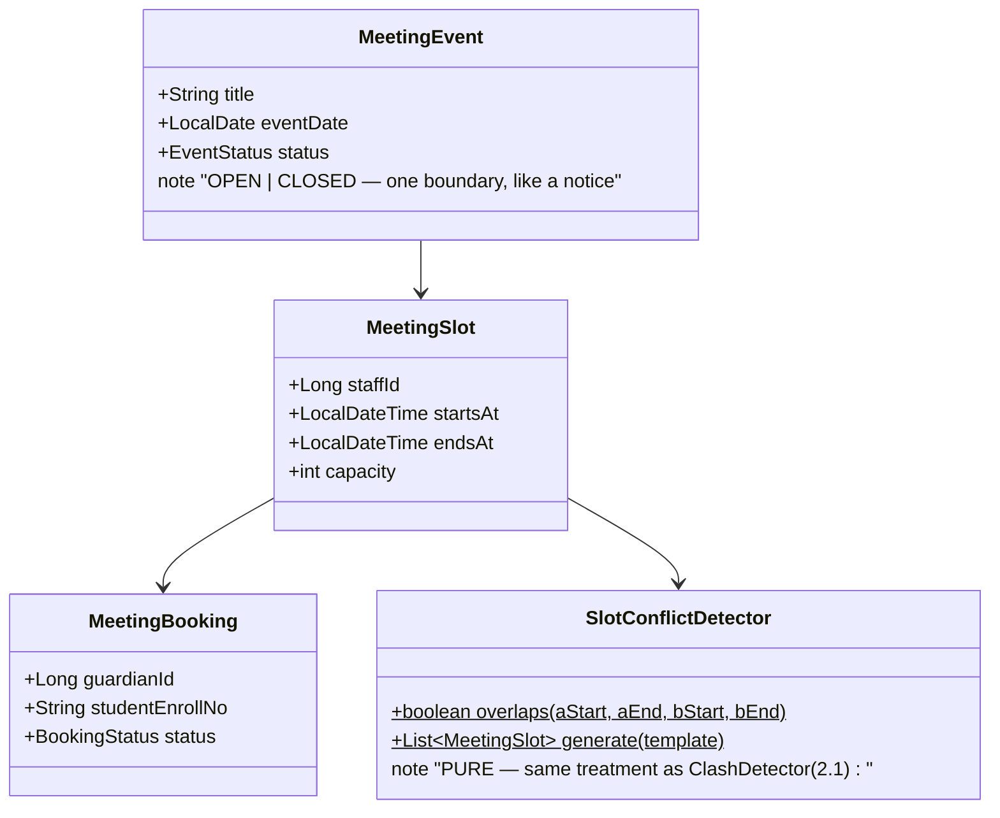
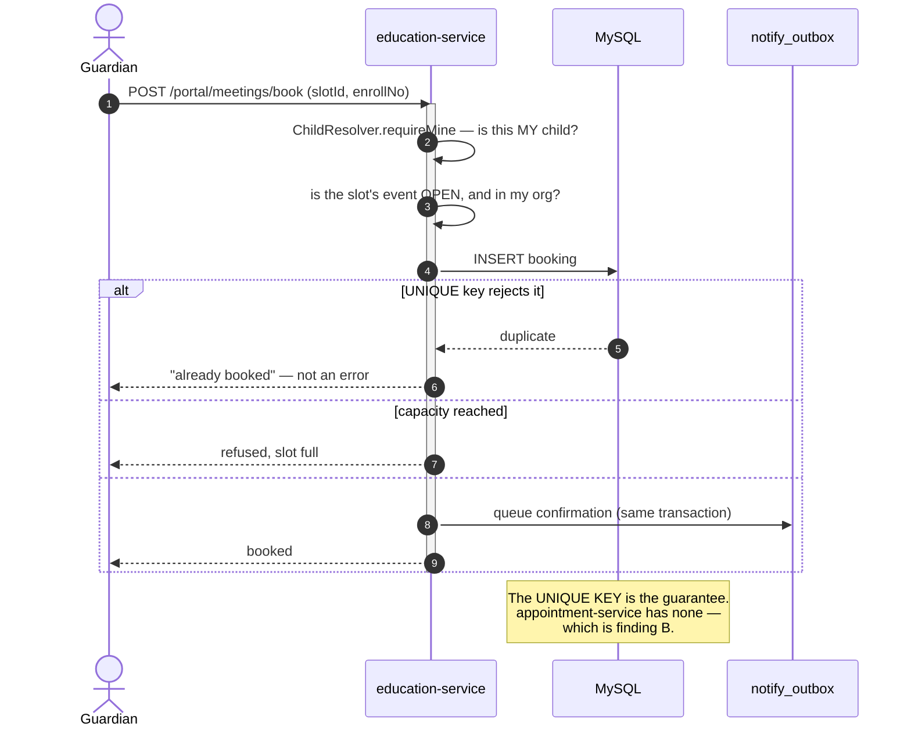

# Slice 3.4 — Guardian–teacher meetings

**Status: DESIGNED — not implemented.** Programme: `education-complete-programme.md` Phase 3.
Produced 2026-08-07, after 3.1 · 3.1b · 3.3 · 3.5 shipped.

**⚠️ This design DEVIATES from the programme's stated approach, on evidence — for the second time, and by
the same mechanism as D-8.** The plan says *"3.4 Guardian–teacher meetings — booking via
`appointment-service`"*, and §3's composition map calls it *"a genuine fit; no new scheduler"*. The
precondition check found that `appointment-service` **is not a scheduler** — it is a clinic domain service —
and that **it cannot prevent double-booking at any layer**. Recorded as **D-9 (§11)**.

**It also found a live defect in a shipped vertical (§1, finding B), which is not education's to fix but
must not go unrecorded.**

---

## 1. Document — what the precondition check found

### What 3.4 is for

A parents' evening: a school offers a set of slots per teacher, guardians book one, and nobody is
double-booked. Also the ad-hoc case — a teacher asks to see a guardian, or a guardian requests a meeting.

### The check, run first

| # | Checked | Found |
|---|---|---|
| 1 | Is `appointment-service` a scheduler? | ❌ **No — it is a CLINIC.** `Doctor`, `Hospital`, `Patient`, `Appointment(hospitalId NOT NULL, fee, patientsToVisit/Appointed/Visited)`. **Finding A.** |
| 2 | Does it prevent double-booking? | ❌ **No — at any layer.** **Finding B, and it is a live defect.** |
| 3 | Does education compose it today? | ❌ No. The §2.1 composition row has always been open |
| 4 | Is there a booking surface for guardians? | ✅ **Yes, new since the plan:** `/portal/**` with a real signed-in guardian (3.1b) and the deny rule already covering it |
| 5 | Is there conflict-detection prior art? | ✅ **`ClashDetector` (2.1)** — pure, 13 tested cases, and a timetable clash is the same shape as a slot clash |

### Finding A — the designated service is a clinic, not a scheduler

Measured, not inferred:

```java
Appointment  → hospitalId (NOT NULL) · doctorId · patientId · fee
               patientsToVisit · patientsAppointed · patientsVisited
Doctor       → speciality · fee · hospitalId · appointmentOfferType
Hospital     → name · logoUrl · country · state · city
```

Every entity is medical, and `hospitalId` is **NOT NULL** — a school cannot book anything without first
being a hospital. "Reuse" would therefore mean mapping **school→Hospital, teacher→Doctor,
guardian→Patient**, and that is not an implementation detail: it is what every future reader, every report,
every API consumer and every DBA would see. A parent appearing as a `Patient` with a `fee` and a
`speciality` is a data model that lies about its own domain.

> **This is D-8's shape exactly.** The plan named a service by its *word* — "appointment", "campaign" — and
> the service's actual model turned out to serve a different capability. Both rows were written before the
> services were built out.

### Finding B — **`appointment-service` allows DOUBLE-BOOKING. This is a live defect in a shipped vertical**

Verified at every layer that could prevent it:

| Layer | Checked | Result |
|---|---|---|
| Service | `AppointmentService.create()` | bare `repo.save(a)` — **no conflict check** |
| Service | grep for `conflict\|overlap\|exists` | **zero hits in the whole service** |
| Database | `V1__baseline.sql`, table `appointment` | `PRIMARY KEY (id)` only — **no unique key on (doctor, datetime)** |
| Typing | `Appointment.dateTime`, `.date` | **`String`**, so even a comparison would be unreliable |

**Two patients can book the same doctor at the same minute, silently, and nothing anywhere notices.** That
is a real bug in the appointment vertical today, independent of education, and it is exactly the
check-then-act class the education review's finding D catalogued — except here there is no check at all.

**It is not this slice's to fix** (a different vertical, with live data and its own dashboard), but it
settles the reuse question on its own: *a service that cannot prevent double-booking cannot provide booking,
whatever it is called.* Recorded so it is not lost.

### Finding C — the pieces 3.4 actually needs already exist, and none of them are in appointment-service

| Need | Where it already is |
|---|---|
| A signed-in guardian who can be shown a booking screen | **3.1b** — real login, and `/portal/**` is already allowlisted |
| A student→guardian relationship to decide *which* teachers matter | **3.1** `ChildResolver` |
| Teachers, and which classes they teach | **1.3 / 2.1** `Staff`, `staff_grades`, `TimetableEntry` |
| Conflict detection as pure, tested logic | **2.1** `ClashDetector` — 13 cases, same shape |
| A confirmation that is durable and retried | **N1 + 3.5** `notify_outbox`, `EduNotifyService.queue()` |
| A record the family can return to | **3.5** the notices pattern — a booking IS a record, not an email |

**So the composition question is not "build vs reuse" — it is "which existing thing".** Every ingredient is
in education or in a shared library already; the only thing appointment-service would contribute is a
schema that describes hospitals.

---

## 2. Design

### D1 — Education owns meeting SLOTS and BOOKINGS

Two tables, mirroring 3.5's shape (a record, not a message):

```
meeting_event   the parents' evening itself — title, date, org
meeting_slot    one teacher × one time window on that event (staffId, startsAt, endsAt, capacity)
meeting_booking one guardian × one slot (guardianId, studentEnrollNo, status)
```

**Why an EVENT and not just slots:** a school runs "Term 1 parents' evening" as a thing it opens and closes.
Without it, "which slots are bookable right now" becomes a date query nobody can reason about, and there is
nowhere to hang the open/closed decision — the same reasoning that gave 1.1 a `Term` entity.

### D2 — **The double-booking rule is a UNIQUE KEY first, and a check second**

```sql
UNIQUE KEY uk_booking_slot (organization_id, meeting_slot_id, guardian_id)   -- one booking per guardian per slot
UNIQUE KEY uk_slot_teacher_time (organization_id, staff_id, starts_at)       -- one slot per teacher per time
```

plus a capacity check in the service, and a **pure `SlotConflictDetector`** for the overlap arithmetic.

**This is finding B's lesson applied before the bug exists rather than after.** 1.3 learned it for marks
("the constraint, not the upsert code, is what makes it true under concurrency"), 2.1 for timetable clashes,
and finding D catalogued twelve check-then-act races that are *still* open because they were written
check-first. A parents' evening is the highest-contention thing this domain has: twenty guardians clicking
at once, on the same six teachers, the evening the invitations go out.

### D3 — A guardian books from the portal; the surface already exists

`GET /portal/meetings` (what is open, and my bookings) and `POST /portal/meetings/book`.

**This is the FIRST WRITE on the portal surface**, and it is a deliberate, narrow exception to 3.1 D4's
"every mapping is GET". Stated plainly because that rule was load-bearing:

- it writes exactly one row type, `meeting_booking`, and nothing else;
- the slot must belong to an **open** event in the caller's org, and the child must be **theirs**
  (`ChildResolver.requireMine`) — so the write is scoped by the same authority as every portal read;
- it is idempotent per (guardian, slot) by the unique key above, so a double-clicked Book is one booking.

> The alternative — a guardian emails the school and staff key it in — is what schools do today and is the
> reason the feature is wanted. A booking surface that cannot book is not the slice.

### D4 — Teachers see their own list; the school sees everything

`meeting_slot` is generated per teacher from a template the school sets (start, end, slot length), so nobody
types twenty rows. A teacher reads their own bookings; ADMIN opens and closes the event.

### D5 — Confirmation reuses 3.5's path exactly

Booking queues a confirmation through `EduNotifyService.queue()` — one message, durable, retried, never on
the request thread. **No new mechanism**, and the fourth consumer of N1's outbox.

### D6 — Scope

| In | Out |
|---|---|
| `meeting_event` · `meeting_slot` · `meeting_booking` + Flyway V27 | composing `appointment-service` (finding A/B → D-9) |
| slot generation from a template; ADMIN opens/closes | fixing appointment-service's double-booking defect (its own slice) |
| guardian books + cancels from `/portal/**` | video links, calendars, ICS export |
| **UNIQUE keys + pure `SlotConflictDetector`** | teacher-initiated meeting *requests* (ad-hoc — see §6) |
| confirmation through N1's outbox | rescheduling; a cancel + re-book covers it |

### Layer answers (§5b)

| Layer | Answer |
|---|---|
| **UI/UX** | guardian: a slot grid per teacher, one tap to book, their booking pinned at the top. Staff: a template ("6–8pm, 10-minute slots") that generates the grid |
| **Service / API** | education-service; two portal endpoints inside the existing allowlist, four staff endpoints |
| **Database** | MySQL — small, transactional, **contention-sensitive**, which is exactly what a unique key is for |
| **Patterns** | DB-enforced idempotency (D2) · pure conflict detector (2.1's shape) · transactional outbox (N1) · derived authority (`ChildResolver`) |
| **Microservice design** | **Deliberately does NOT compose `appointment-service`** — D-9. When scheduling is genuinely cross-cutting, it earns a real scheduling service; today it would inherit a clinic schema and a double-booking bug |
| **Per-org configurability** | `edu.meetings.slotMinutes` (default 10) and `edu.meetings.enabled`, read on the paths they govern |
| **DRY** | conflict logic pure and tested like `ClashDetector`; confirmation through the existing outbox; portal auth through the existing resolvers |

---

## 3. Architecture & UML

### 3.1 Architecture



### 3.2 Class



### 3.3 Sequence



---

## 4. Implement — checklist

- [ ] Flyway **V27**: three tables, **both UNIQUE keys**, indexed `(organization_id, event_id)`.
- [ ] `SlotConflictDetector` — pure `overlaps()` + `generate(template)`, unit-tested **before** anything calls it.
- [ ] `MeetingController` (staff): create event, generate slots, open/close, teacher's own list. ADMIN on
      open/close and generate.
- [ ] Portal: `GET /portal/meetings`, `POST /portal/meetings/book`, `POST /portal/meetings/cancel`.
      **The first portal writes — each one scoped by `ChildResolver` (D3).**
- [ ] Confirmation via `EduNotifyService.queue()` — fourth consumer, no new mechanism.
- [ ] `edu.meetings.enabled` + `edu.meetings.slotMinutes`, read on the paths they govern (C1).
- [ ] Guardian slot-grid UI + staff template screen; i18n × 6.

## 5. Test

**Pure unit — `SlotConflictDetectorTest`:** touching slots do not overlap (10:00–10:10 vs 10:10–10:20) ·
contained · identical · zero-length · a template generates exactly N slots and the last one does not run
past the end.

**Cypress gate — `meetings.cy.js`:**

| # | Case | Asserts |
|---|---|---|
| 1 | staff open an event and generate slots from a template | D4 — nobody types twenty rows |
| 2 | a guardian sees open slots at `/portal/meetings` | the portal surface works for a write-capable feature |
| 3 | a guardian books, and the confirmation is **queued** | D5 — nothing on the request thread |
| 4 | **booking the same slot twice is ONE booking, not an error** | D2 — the unique key, and a double-clicked Book |
| 5 | **a guardian cannot book for another family's child** | `ChildResolver` on a WRITE — the new surface |
| 6 | a full slot is refused | capacity |
| 7 | **a CLOSED event refuses bookings** | the one boundary |
| 8 | a guardian cannot open, close or generate slots | D4, ADMIN tier |
| 9 | a student session cannot book at all | 3.3's audience separation holds on a write |
| 10 | staff unaffected; `edu.meetings.enabled=false` closes it | C2, both directions |

**Regression:** `guardian-portal`, `student-portal`, `notices`, `notification-outbox` (a fourth outbox
consumer), `privilege-map`.

## 6. Open / deferred

- **Teacher-initiated meeting requests** — ad-hoc, needs a request→accept state machine, which is a
  different shape from booking a published slot. Its own slice.
- **`appointment-service`'s double-booking defect (finding B)** — reported here, owned elsewhere.
- **Rescheduling** — cancel + re-book covers it; a move operation adds states for little gain.

---

## 11. D-9 — should meetings compose `appointment-service`, as the plan says? (NEEDS THE USER)

| | Option | Trade-off |
|---|---|---|
| **A** | **Education owns meeting slots and bookings** *(this design)* | Every ingredient already exists (finding C); the unique keys make double-booking impossible from day one. **Cost: education owns three more tables, and §2.1's "appointment" composition row stays open** |
| B | **Generalise `appointment-service` into a real scheduler** — `Doctor→Provider`, `Patient→Attendee`, `Hospital→Venue`, add a slot model and the missing unique keys | Correct long-term, and it would fix finding B. **But it is a rename-and-remodel of a SHIPPED vertical with live data and its own dashboard** — a migration, every consumer updated, plus the defect fix. That is its own slice (or two), not a sub-task of 3.4 |
| C | Map school→Hospital, teacher→Doctor, guardian→Patient | **Rejected.** Semantic abuse a school's data would carry forever, and it inherits the double-booking defect |

**Recommendation: A now, with B as a recorded trigger** — when a third domain wants scheduling, or when the
appointment vertical is next worked on, generalise *then* and fix finding B as part of it. That is the same
extract-at-the-second-caller discipline that produced `common-outbox`, `PortalReadService` and
`NotifyMessage`, applied to a service instead of a class.

**If you prefer B, say so before implementation** — it is a bigger slice than 3.4 itself, and it changes a
vertical that is already in front of users.
