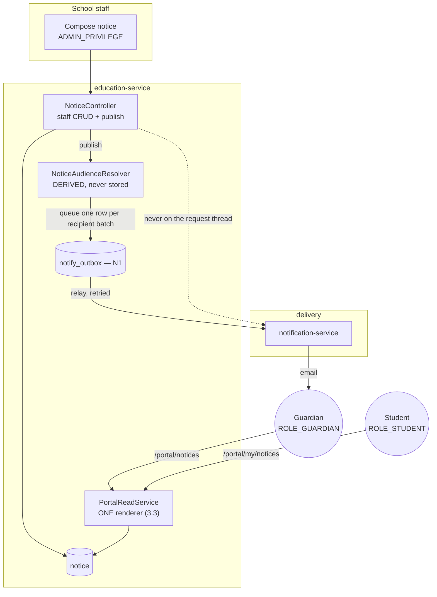
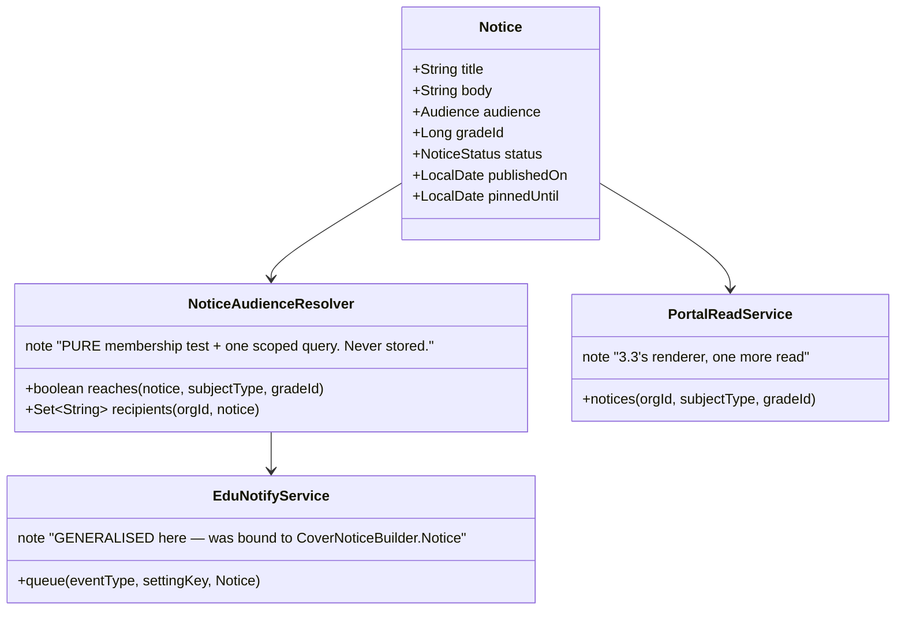
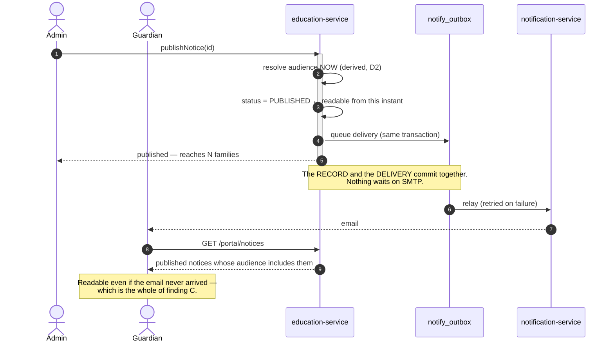

# Slice 3.5 — Notices & circulars

**Status: ✅ DONE & Cypress-GREEN — 10/10 (2026-08-07).** Regression green: `notification-outbox` 7/7
(N1's own gate — `queue()` changed shape), `substitution` 11/11 (the cover-notice caller),
`student-portal` 13/13, `guardian-portal` 11/11, `privilege-map` 11/11 — **53 regression cases**, plus
**208 education unit tests**. Programme: `education-complete-programme.md` Phase 3.

**Shipped under D-8 option C (user decision, 2026-08-07): education owns notices; `campaign-service` stays
the right composition for real CAMPAIGNS** — admissions drives, fee-reminder runs. The plan said
*"broadcast via `campaign-service`"*; the precondition check found that would import consent semantics
**wrong for a mandatory school notice**, and that the portals shipped since the plan was written changed
what a notice *is*. Argued in **finding B**, recorded as **D-8 (§11)**.

**It also finished a job the programme started four slices earlier:** `sendAlerts` was still sending
synchronously against a database-less `notification-service` — the defect N1 fixed for cover notices only.
See **§12** for what implementation found, including a defect in a slice already called done.

---

## 1. Document — what the precondition check found

### What 3.5 is for

A school tells every family the same thing: *closed Friday · fees due on the 10th · sports day is moved ·
exam timetable published.* One message, many recipients, and the school needs to know it arrived.

### The check, run first — the discipline that has now found a real problem three slices running

| # | Checked | Found |
|---|---|---|
| 1 | Does education already broadcast? | ⚠️ **YES, and badly.** `AlertController.sendAlerts` exists and works. **Finding A.** |
| 2 | Is `campaign-service` the right composition? | ❌ **No — and the plan says it is.** **Finding B.** |
| 3 | Has anything changed what a notice *is*? | ⚠️ **Yes: 3.1 and 3.3 shipped.** **Finding C.** |
| 4 | Can N1's outbox carry it? | ⚠️ Not as written — `queue()` takes a concrete `CoverNoticeBuilder.Notice`. **Finding D.** |
| 5 | Does `notification-service` persist anything yet? | ❌ **Still no entities, no migrations** — verified 2026-08-07. Slice 105's G3 stands: delivery is synchronous, unrecorded, never retried |

### Finding A — education already broadcasts, on the exact path N1 was built to replace

`sendAlerts` resolves recipient addresses and calls `emailService.send(...)` **synchronously, on the request
thread**, then stamps the alert `"Sent"`:

```java
Set<String> recipients = consumerEmails(org, uid, consumers);
Map<String, Object> result = emailService.send(heading, body, recipients);   // ← direct, blocking
```

Against a `notification-service` that has **no database**, this means:

- a slow SMTP hop holds a school's HTTP request open, for as many recipients as the school has;
- nothing is retried — a downstream blip loses the message with no record that it was lost;
- **`"Sent"` is stamped from a call that only reports how many addresses were *attempted*.**

**This is precisely the defect N1 fixed for cover notices**, four slices ago, by putting a
`notify_outbox` in front of the send. The alerts path never got it. So 3.5 is not only "build broadcast" —
**a large part of it is finishing a job the programme already started and recorded.**

### Finding B — a school notice is NOT a campaign, and composing one imports the wrong semantics

`campaign-service` is a real marketing engine: `Campaign(type, status, scheduledAt, launch/pause/cancel)`,
`Audience` + `AudienceMember`, `Template`, and counters for `sent · delivered · opened · clicked · bounced ·
unsubscribed`. `AudienceMember.unsubscribedAt` is a first-class field.

**Unsubscribe is the problem, and it is not cosmetic.** A guardian cannot unsubscribe from *"your child's
school is closed tomorrow"* — that message is a duty of care, not marketing. Composing a service whose
member model has an unsubscribe state means one of two outcomes, both bad:

| | If we honour `unsubscribedAt` | If we ignore it |
|---|---|---|
| Consequence | A family silently stops receiving safety notices, and the school is not told | The field is a lie in a shared service, and the next consumer trusts it |

**This is not an argument against composition** — §1.2 stands, and education composes four services already.
It is an argument that **this particular capability is not the one `campaign-service` provides.** The plan's
row was written before either portal existed and reads "broadcast" as one thing; it is two:

- **marketing broadcast** — optional, tracked, unsubscribable → `campaign-service`, correctly, for
  *admissions campaigns and fee-reminder drives*, which education will genuinely want later;
- **a school notice** — mandatory, addressed to the whole school community, permanently readable →
  belongs to education, because the *record* is education's and the audience is derived from enrolment.

> **Recorded as D-8 (§11).** If the user prefers the plan as written, the fallback is stated there — and it
> costs a `notice → campaign` bridge, not a redesign.

### Finding C — THE PORTALS CHANGED WHAT A NOTICE IS, and the plan predates them

When 3.5 was written, a school's only channel to a family was email, so a notice could only *be* an email.
**3.1 and 3.3 shipped since**, and there are now two authenticated surfaces where a family already looks.

That converts a notice from a **message** into a **record with delivery channels**:

```
             ┌── the NOTICE (a record, permanently readable)
   school ───┤
             ├── email  (a delivery of it)
             └── portal (a rendering of it) ← guardians AND students, already built
```

Why it matters, concretely: **an emailed-only notice is unrecoverable.** A family that deleted it, or never
received it, has nothing to return to — and "we sent it" versus "we never got it" is exactly the dispute a
school needs a record to settle. The portal read costs almost nothing here (the surface, the resolvers and
the deny rule all exist), and it is the difference between a notice that can be *checked* and one that can
only be *resent*.

**It also makes the audience question tractable.** A notice targeted at "Class 5 guardians" is a filter over
data education already holds; expressing the same audience inside `campaign-service` would mean exporting
the roster into `AudienceMember` rows that go stale the moment a child transfers — the "stale copy of an
access list" failure 3.1 D1 refused for exactly this reason.

### Finding D — N1's outbox is the right mechanism but the wrong signature

```java
public Outcome queue(String eventType, String enabledSettingKey, CoverNoticeBuilder.Notice notice)
```

It is bound to a concrete builder from 2.2. 3.5 is **the second caller** — which by this codebase's own rule
(`common-outbox`, `common-subledger`, `StaffAbsenceService`, `StudentVisibilityService`, and 3.3's own
`PortalReadService`) is exactly when a thing gets generalised, never before and never speculatively.

---

## 2. Design

### D1 — A notice is an education ENTITY, and the record is the deliverable

`notice` — `title · body · audience · gradeId? · publishedOn · pinnedUntil? · status(DRAFT|PUBLISHED) ·
organizationId`. Written by staff, read by the portals, delivered by email.

**Draft/published, not a workflow.** 2.5 established that this domain does not want approval chains; a
notice needs exactly one boundary — *not yet visible* versus *visible and delivered* — and that boundary is
the publish action.

### D2 — Audience is a DERIVED FILTER, never a stored recipient list

```
WHOLE_SCHOOL · GUARDIANS · STUDENTS · ONE_CLASS(gradeId)
```

Resolved at read time and at send time from enrolment data. **No `notice_recipient` table**, for the reason
3.1 D1 gave and 3.3 inherited: a stored list is a copy of an access decision, and it goes wrong the moment a
child transfers, a guardian link is corrected or a student leaves. A stale recipient list on a *safety*
notice is worse than a stale one anywhere else in this system.

### D3 — Delivery goes through N1's outbox. Nothing sends on the request thread

`EduNotifyService.queue()` is generalised (finding D) to carry a plain `(subject, body, recipients)` notice,
and the cover-notice caller is switched onto it in the same change — extract at the second caller, and leave
one path, not two.

**`sendAlerts` is migrated onto the same path.** It is the same defect, it is one line of behaviour, and
leaving it direct while the new code is queued would be knowingly keeping the bug the slice exists to fix.

### D4 — The portal read is the point, and it is nearly free

`/portal/notices` (guardian) and `/portal/my/notices` (student) render published notices whose audience
includes the caller. Both sit inside the existing `myplus.portal.allowlist=/portal/**`, so **the deny rule
needs no change** — the second consecutive slice for which that is true.

Rendered by **`PortalReadService`** (3.3's extraction), so there is one renderer and two authority checks,
which is the shape 3.3 established.

### D5 — Publishing is `ADMIN_PRIVILEGE`; reading a notice is not privileged at all

Addressing the whole school community is a policy act, the same tier as fee settings and report-card
publication (D-3's map). Reading is open to any authenticated session **whose audience matches** — the
audience filter *is* the authorisation.

### D6 — What a notice is NOT

- **Not per-recipient delivery tracking.** `notification-service` has no database, so a per-family delivery
  receipt would be a fiction. The honest artefact is the outbox row (queued/sent/failed, retried), which is
  real. Per-recipient tracking arrives when slice **105** gives notification-service a datastore.
- **Not scheduled sending.** `Alerts` already carries `deliveryPeriod` and **nothing fires it** (105 G3).
  Adding a second unfired scheduler would repeat the very finding this programme keeps recording; a notice
  publishes when someone publishes it. Scheduling belongs with 105.
- **Not SMS or push.** One channel, working, beats three declared.

### D7 — Scope

| In | Out |
|---|---|
| `notice` entity + Flyway V26 + staff CRUD screen | `campaign-service` composition (finding B → D-8) |
| audience as a derived filter (D2) | a `notice_recipient` table |
| `EduNotifyService.queue()` generalised; **`sendAlerts` migrated onto it** | scheduled sending (105 / G3) |
| `/portal/notices` + `/portal/my/notices`, via `PortalReadService` | per-recipient delivery receipts (105) |
| `edu.notify.notices` switch, read on the path it governs | SMS / push channels |
| i18n × 6 | attachments (D-5) |

### Layer answers (§5b)

| Layer | Answer |
|---|---|
| **UI/UX** | staff: a compose screen with an audience picker that **states the recipient count before publishing**. Portal: a notices card, newest first, pinned ones on top |
| **Service / API** | education-service owns it; five staff endpoints, two portal reads, all inside the existing allowlist |
| **Database** | MySQL — relational, transactional, small, and read by an indexed scoped query. **One new table** |
| **Patterns** | transactional outbox (N1, third→fourth use) · derived audience (3.1 D1) · policy enforcement point + allowlist (3.1b, untouched) · extract-at-the-second-caller (finding D) |
| **Microservice design** | composes `notification-service` for delivery. **Deliberately does NOT compose `campaign-service`** — finding B, D-8 |
| **Per-org configurability** | `edu.notify.notices` (default ON, fails ON — a missed notice is worse than a duplicate, the opposite of `edu.portal.enabled`, and for the reason N1 recorded) |
| **DRY** | one renderer (`PortalReadService`), one send path (`EduNotifyService`), one audience resolver |

---

## 3. Architecture & UML

### 3.1 Architecture



### 3.2 Class



### 3.3 Sequence



---

## 4. Implement — checklist

- [ ] Flyway **V26**: `notice`, indexed `(organization_id, status, published_on)` and
      `(organization_id, grade_id)`.
- [ ] `Notice` + `NoticeStatus` + `NoticeAudience` entities.
- [ ] `NoticeAudienceResolver` — **pure `reaches(...)`** + one scoped recipient query.
- [ ] **Generalise `EduNotifyService.queue()`** off `CoverNoticeBuilder.Notice`; migrate the cover-notice
      caller in the same change.
- [ ] **Migrate `sendAlerts` onto the outbox** (finding A). ⚠️ Behaviour change: the response reports
      *queued*, not *sent* — the alerts screen's message must change with it, or it will lie in a new way.
- [ ] `NoticeController` — list/save/delete/publish, `ADMIN_PRIVILEGE` on publish and delete.
- [ ] `PortalReadService.notices(...)` + `/portal/notices` + `/portal/my/notices`.
- [ ] `edu.notify.notices` in the catalog, read inside the publish path (C1).
- [ ] Staff compose screen with an audience picker that **states the recipient count before publishing**.
- [ ] Portal notices card on both dashboards; i18n × 6.

## 5. Test

**Pure unit — `NoticeAudienceResolverTest`:** WHOLE_SCHOOL reaches both audiences · GUARDIANS excludes a
student · STUDENTS excludes a guardian · ONE_CLASS reaches only that grade · a null grade never matches
ONE_CLASS (**the fail-open case**) · DRAFT reaches nobody.

**Cypress gate — `notices.cy.js`:**

| # | Case | Asserts |
|---|---|---|
| 1 | staff publish a whole-school notice; **the count is stated before publishing** | D1 — the school sees the consequence of the act |
| 2 | a guardian session reads it at `/portal/notices` | finding C — the notice is a record, not just a send |
| 3 | a student session reads it at `/portal/my/notices` | both audiences, one renderer |
| 4 | **a DRAFT is invisible to both portals** | the one boundary that exists |
| 5 | **a GUARDIANS notice is NOT readable by a student**, and vice versa | D2 — the audience filter IS the authorisation |
| 6 | **a ONE_CLASS notice reaches only that class** | the case a stored recipient list would get wrong |
| 7 | publishing **queues** and does not block; the outbox row exists | D3 — nothing on the request thread |
| 8 | a teacher cannot publish | D5, ADMIN tier |
| 9 | `edu.notify.notices=false` stops delivery but **the notice is still readable** | C2 — the switch governs the send, not the record |
| 10 | staff smoke — alerts still work after the `sendAlerts` migration | finding A's regression |

**Regression list:** `notification-outbox.cy.js` (N1's own gate — `queue()` changes shape),
`substitution.cy.js` (the cover-notice caller), `guardian-portal.cy.js`, `student-portal.cy.js`,
`privilege-map.cy.js`, and the education staff smoke (the alerts screen's message changes).

## 6. Risks

- **`sendAlerts` changes observable behaviour**: "sent to 40" becomes "queued for 40". Right, and it must
  reach the UI text, or the screen simply lies in a new way.
- **`queue()` is shared with N1.** Its own gate is the control; if `notification-outbox.cy.js` does not stay
  green, the generalisation is wrong, not the spec.
- **The audience filter is the authorisation** (D5). A bug there is a disclosure, which is why `reaches()` is
  pure and unit-tested before anything calls it.
- **No per-recipient proof of delivery**, and schools will ask for it. The honest answer is the outbox row,
  until slice 105 lands.

---

## 11. D-8 — should notices compose `campaign-service`? (NEEDS THE USER)

**The programme says yes; this design says no, on the evidence in finding B.**

| | Option | Trade-off |
|---|---|---|
| **A** | **Notices owned by education; `campaign-service` not composed** *(this design)* | No unsubscribe semantics on a mandatory notice; audience derived from live enrolment; the notice is a permanent record the portals already render. **Cost: education owns one more table, and the §1.2 composition row for "bulk fee reminders/campaigns" stays open** |
| B | Notices as campaigns in `campaign-service` | Follows the plan as written; gets scheduling and stats for free. **Costs: `unsubscribedAt` on a safety notice, a roster exported into `AudienceMember` rows that go stale, and no portal record unless it is built anyway** |
| C | A now, B later for **marketing** (admissions drives, fee-reminder campaigns) | **Recommended.** The two are genuinely different capabilities; this keeps each where it belongs and leaves the campaign row open for the work it actually fits |

**Recommendation: C.** Build notices here; compose `campaign-service` when education wants a *campaign* —
an admissions drive or a fee-reminder run — which is a real future slice and a correct use of it.

**If you prefer B, say so before implementation:** it is a `notice → campaign` bridge rather than a
redesign, but the unsubscribe question then needs an answer, and it is a safeguarding answer, not a
technical one.

---

## 12. Implementation notes — including a defect in a slice already called done

### 1. The gate found a HOLLOW GREEN in 3.3, one slice after 3.3 was recorded as complete

`notices.cy.js` case 5 (ONE_CLASS) failed on its first run with its own guard message:

```
Error: fixture student has no class — seed one before running this gate
```

Checked against the database rather than assumed: the seeded student fixture had **`grade_id = NULL`**.

**That matters beyond this slice.** `PortalReadService.timetable()` returns an empty list immediately when
`gradeId` is null — and 3.3's gate case *"a signed-in student reads their OWN week"* asserted only
`status === 'SUCCESS'`. **So it passed against an empty timetable**: green, and proving less than it looked.
3.3 was called done on that run.

Fixed in both places, deliberately:
- **3.5** seeds the class in `before()` (a fixture's *existence* is not its *eligibility*), and its ONE_CLASS
  case now requires **two** classes in use — without something to exclude, "reaches only that class" proves
  only "reaches".
- **3.3's own spec** now asserts the fixture student is in a class, with a message saying why. A fixture
  that cannot exercise the read must fail there rather than pass quietly.

> **The standard, and it is the fourth form of one this programme keeps re-learning:** *assert that the
> fixture can EXERCISE the behaviour, not merely that the call succeeded.* 2.1's skipped clash test, 2.4's
> empty class, 3.1b's stale principal, and now a student with no class.

### 2. `@Lob` broke startup, and the house standard was already there

The first cut typed `Notice.body` as `@Lob String`. Hibernate maps that to CLOB and validates it against
MySQL as `tinytext`, so the service refused to boot against V26's `TEXT` column:

```
Schema-validation: wrong column type encountered in column [body] in table [notice];
found [text (Types#LONGVARCHAR)], but expecting [tinytext (Types#CLOB)]
```

**This service has no `@Lob` and no `TEXT` anywhere** — `behaviour_note.description` and
`homework.instructions` are `VARCHAR(2000)`, `homework_submission.feedback` is `VARCHAR(1000)`. Corrected to
`VARCHAR(4000)` on both sides.

V26 had already applied, so it was fixed **in place** rather than patched by a V27 that would immediately
alter a table introduced one commit earlier: the migration was unreleased, existed on one dev box, and the
table held **zero rows** (verified before the repair — the service had never started). The repair was two
statements, and the corrected V26 re-ran clean.

> **Worth stating: schema validation catching this at boot is the control WORKING.** It is also the one
> defect in three slices that no unit test here could have caught — it lives entirely in the entity↔DDL
> contract, which only a real schema sees. **This is precisely what the programme's carried "no empty-tenant
> Testcontainers test" gap (finding E) is for**, and it has now cost a restart.

### ⚠️ POST-SHIP DEFECT — found 2026-08-09 by slice 105's gate, FIXED

**Neither notices nor alerts queued anything from the day this slice shipped until 2026-08-09.** Only cover
notices (N1) ever worked.

`EduNotifyService.enabled(key)` treated a **null** setting key as "switched off" instead of "no switch":

```java
if (!enabled(enabledSettingKey)) return Outcome.DISABLED;   // enabled(null) -> getBool(null)
                                                            // -> unknown key -> null
                                                            // -> "true".equalsIgnoreCase(null) -> FALSE
```

Nothing threw, so the deliberate fail-**ON** `catch { return true; }` never fired. And `queueAll` applies the
switch **once at the top** and then delegates per recipient with a null key — by design, to avoid re-reading
a setting per address — so this hit the **gated** notices path exactly as hard as the ungated alerts path.
`queue(COVER_ASSIGNED, NOTIFY_COVER_SETTING, …)` passes a real key directly and was unaffected, which is why
N1's gate stayed green throughout.

**Fix:** `if (key == null) return true;` — one line, restoring the intent this document already stated.

#### Why three gates and a six-spec regression list all missed it

Every assertion checked the **shape**, never the **count**:

| Where | Asserted | Satisfied by zero? |
|---|---|---|
| `notices.cy.js` publish | `b.object` *has property* `queued`; message matches `/queued/i` | **yes** |
| `notices.cy.js` alerts smoke | same two | **yes** |
| `notices.cy.js` switch-OFF | `queued === 0` | **yes — and it "passed" for the wrong reason**: a control asserting the value the system produced unconditionally proves nothing |
| 105's first draft | `queued` present, message says "queued" | **yes** |

`"Queued for 0 of 40 recipient(s)"` with `status: SUCCESS` reads like an empty audience, not a broken
feature. **The lesson: assert the number, not the key.** A count assertion of `> 0` in any one of those four
places would have caught this on the day it shipped.

Now covered by `EduNotifyServiceTest` (8 always-run cases; **5 of them fail if the fix is reverted** —
verified, not assumed) plus count assertions added to `notices.cy.js` and
`education/notification-delivery.cy.js`.

---

### ⚠️ SECOND POST-SHIP DEFECT — D3 was never actually true. Found + FIXED 2026-08-09

**"Nothing sends on the request thread" (D3) was the design. The code did the opposite.**

`onEnqueued` is an `AFTER_COMMIT` listener, and it ran **inline, inside the caller's commit** — so a publish
performed one SMTP round-trip *per recipient* before the response was written. Case 7 of the test plan
("publishing **queues** and does not block") asserted the outbox row existed, never that the request
returned promptly, so it passed throughout.

It was **masked by the first defect**: `enabled(null)` short-circuited every send, so the hook delivered
nothing and cost nothing. Fixing that exposed this immediately — measured from the live log:

```
[nio-8084-exec-8]  22:26:28.813   outbox delivery failed
[nio-8084-exec-8]  22:26:30.565   outbox delivery failed
...  24 sequential SMTP attempts, ~1.75s apart  =>  ~42s on ONE request thread
```

against the gateway's `timelimiter.timeoutDuration: 20s`. The call was cancelled, the CircuitBreaker
forwarded to `/fallback`, and the caller received `InternalError` — **for a notice that had been queued
perfectly correctly**. Cover notices never hit it: one recipient, ~1.75s, comfortably inside the limit.

**The SMTP credentials were invalid at the same time (`Authentication failed`), and that is a separate
issue.** It matters only because it made each attempt slow enough to cross the limit. **Fixing the password
would have HIDDEN this defect, not fixed it** — working credentials are merely faster per send, a
whole-school notice to forty families would still have approached 20s, and the request thread would still
have been doing SMTP, which D3 forbids outright.

**Fix:** `@Async("notifyExecutor")` on the listener, with a **bounded** pool (`NotifyAsyncConfig`: 2–4
threads, 500 queue, `CallerRunsPolicy` back-pressure — the default executor is unbounded, which would trade
a slow request for an unstable service).

The `REQUIRES_NEW` transaction moved to a separate bean, `NotifyDeliveryRunner`. Both annotations on one
method leaves it to **advisor ordering** whether the transaction is begun on the calling thread and then
used from another — a transaction and its connection crossing two threads. Two beans means each boundary is
applied by its own proxy in an unambiguous order.

Covered by `EduNotifyServiceTest.queueing_does_NOT_deliver_on_the_calling_thread`, which asserts the
delivery runner is **not** called during `queueAll` and that one event is published per recipient.

**Lesson, and it is the same one twice:** *case 7 asserted the artefact (a row exists), not the property
(the request does not block)*. Together with the first defect — asserting `has property 'queued'` rather
than a count — both of this slice's post-ship bugs were invisible to gates that checked that something was
**there** instead of what it **was**.

---

### 3. Alerts got an ungated overload, not the notices switch

Migrating `sendAlerts` onto the outbox could have reused `edu.notify.notices`. It must not: turning notices
off would then silently stop alerts — two unrelated features on one switch. The alerts screen has never had
a toggle, and giving it one while moving the mechanism would change **policy** and **plumbing** in a single
commit, which is how a migration gets blamed for a behaviour nobody asked for. `queueAll(eventType, subject,
body, recipients)` exists for exactly that, documented as such.

**The observable change is deliberate and reached the UI:** the response says *"Queued for 40 of 40"*, and
the alert row's status is now `"Queued"`, not `"Sent"`. The relay sends; this request queues. The gate
asserts the word.

### 4. Guardian notices sit OUTSIDE the child picker

`guardian.js`'s `loadTab` returns early when no child is selected — correct for results and dues, wrong for
notices, which are addressed to the guardian or the school rather than to a child. The notices branch is
therefore checked *above* that guard, so a guardian whose children are not yet placed still sees that the
school is closed tomorrow.

Server-side, the guardian read merges per distinct child class and de-duplicates, so a whole-school notice
appears **once** for a parent of three, not three times.
