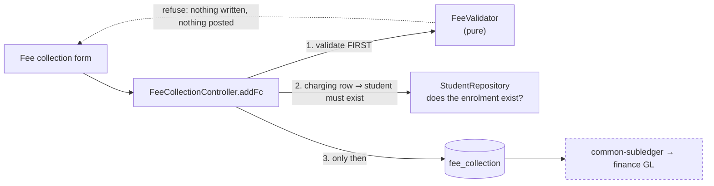

# Slice B — Fee collection validation

**Status: DESIGN — awaiting approval. No code written.**
Closes audit **finding B** (`education-review-audit.md`): *"`addFc` (money in) has zero validation."*

---

## 1. Document — what and why

### The finding is partly STALE, and saying so matters

Finding B was written before Phase 0. Two of its three complaints have since been fixed, and designing against
the original wording would mean rebuilding things that already work:

| Original complaint | Status today |
|---|---|
| over-payment unchecked | **FIXED** — `checkOverpayment` (0.2a) + fee credit carry-forward (0.2b) |
| `en` is a free string with no FK | **PARTLY** — 0.2a refuses a *tendered payment* against an unknown enrolment |
| negative amounts | **STILL OPEN** — nothing anywhere rejects them |

So this slice is narrower than the finding, and precise about what is actually missing.

### What is actually missing

**B1 — Negative amounts are accepted everywhere.** `FeeCollectionDTO` carries **zero** validation annotations.
`dueAmount`, `feePaid`, `fee`, `discount`, `vehicleFee` and `otherDues` all accept negatives. A negative
`feePaid` is the serious one: it flows into `settleFeePayment` → the shared subledger → a GL receipt, so it
posts a **negative cash receipt** and corrupts a ledger that other verticals share.

**B2 — A due can be raised against a student who does not exist.** The 0.2a guard is deliberately gated on
`tendered > 0`:

```java
if (refusal == null && tendered > 0
        && studentRepository.findByOrganizationIdAndEnrollNo(orgId, obj.getEnrollNo()).isEmpty()) {
```

That was right for its slice — it protected *money already handed over*. But a row with `dueAmount > 0` and
`feePaid = 0` sails through, and then sits in arrears and aging **forever**, against a student nobody can find.
It is a permanent, uncollectable debit that no screen can explain.

**B3 — `registerOpeningDue` writes an all-zero row when the class has no fee.** `monthlyDue(s)` returns 0 for a
grade with no fee set, and the row is saved anyway: `fee=0, dueAmount=0, receivedIn=OPENING_DUE`. Harmless to
money, but it is noise in every ledger and voucher, and it is why the 0.2a tests had to filter on `dueAmount > 0`
rather than count rows. A test that has to work around production data is a signal, not a nuisance.

**B4 — A discount can exceed the fee.** Nothing compares them, so a 5,000 discount on a 3,000 fee produces a
negative net charge — B1's problem arriving by a different road.

---

## 2. Design

### D1 — Refuse at the boundary, in ONE place

Validation goes in a pure `FeeValidator`, called by `addFc` before anything is written — matching
`MarksValidator` (1.3) and `ExamLockGuard` (1.2). Not scattered `if` statements, and **not** Bean Validation
annotations alone.

Annotations are the obvious move and they are not enough here: the rules are **relational** (discount ≤ fee;
paid ≤ what is owed) and some depend on a DB read (does the student exist). A `@Min(0)` on each field would
still let B4 through while giving the impression the DTO is validated. One validator that owns the whole
question is honest about what is checked.

~~`@PositiveOrZero` annotations are still added to the DTO as a second, cheap layer.~~

**CORRECTED DURING IMPLEMENTATION — the annotations are NOT added.** education-service uses `@Valid` in
**zero** places, so Bean Validation annotations on the DTO would never execute: the controller binds
`FeeCollectionDTO` directly with no validation trigger. Adding them would produce exactly the failure this
design warns about one paragraph earlier — a DTO that *looks* validated and is not.

Adding `@Valid` to make them fire is worse, not better: a constraint violation becomes a raw
`MethodArgumentNotValidException` (HTTP 400 with a Spring error body) instead of the
`GenericResponse("FAILED", …)` the UI and every fee spec expect, and it would fire *before* the validator,
so the specific, per-field message would be replaced by a generic one.

One validator, actually invoked, is the honest design. Should education adopt `@Valid` broadly later, the
annotations can be added then — as a real layer rather than a decorative one.

### D2 — Negative is always refused; a correction is not a negative payment

There is no legitimate negative fee in this system. Refunds and carry-forward already have a home — the credit
ledger (0.2b) — and an adjustment that reverses a charge is a *different operation* with a different audit
meaning.

So: every money field must be `>= 0`, and the refusal names the field. Allowing negatives as a back-door
adjustment would make the ledger unreadable, because a negative receipt and a refund are indistinguishable
afterwards.

### D3 — A due needs a student, whatever the tender

B2 becomes: the enrolment number must resolve to a student in this tenant **whenever the row carries a charge or
a payment** — dropping the `tendered > 0` condition.

The check is deliberately not extended to *every* save. An edit of an existing row whose student was since
removed must remain correctable, or the only way to fix a bad row would be to recreate the student.

```
new row, dueAmount > 0 or feePaid > 0  → student MUST exist
edit of an existing row                → not re-checked
```

### D4 — `registerOpeningDue` writes nothing when there is nothing owed

A zero opening due is not a fact worth recording. When `monthlyDue(s) == 0` the method returns without saving.

**This changes existing behaviour**, so it is stated plainly: schools whose classes have no fee configured will
stop getting a placeholder row on registration. That row conveyed nothing — the student still appears in every
student list — and its absence removes a permanent source of ledger noise. Existing zero rows are **left alone**
(DB standard D5: never act on inference about live data); this only stops new ones.

### D5 — Scope

| In | Out |
|---|---|
| `FeeValidator` — negatives, discount ≤ fee, due-day range | changing how fee credit works (0.2b) |
| student-exists for any charging row (B2) | a fee refund / adjustment operation (§6) |
| `registerOpeningDue` writes nothing at zero (B3) | back-filling or deleting existing zero rows (D4) |
| `@PositiveOrZero` on the DTO as a second layer | validation of the OTHER education forms (§6) |
| per-field refusal messages | |

### Layer answers (§5b)

| Layer | Answer |
|---|---|
| **UI/UX** | the refusal names the field and the number, so a clerk can fix it without guessing. `min="0"` on the money inputs stops the obvious case before a round trip |
| **Service/API** | `addFc` validates first and returns `FAILED` with a specific message; no partial write, no silent coercion |
| **Database** | no schema change. A `CHECK (fee_paid >= 0)` was considered and rejected: it turns a correctable user error into a 500, and MySQL only enforces CHECK from 8.0.16 |
| **Patterns** | validate-at-the-boundary, pure validator (testable), fail-closed on money |
| **Microservice design** | education-local. Nothing crosses a service edge — which is the point: the invalid data would otherwise reach finance and the subledger, where it is far more expensive to unpick |
| **Configurability** | none. "May a school record a negative payment?" is not a policy question — it is a corrupt ledger in every jurisdiction |
| **DRY** | one validator, called once; `FeeService.monthlyDue` reused for D4 rather than re-deriving the fee |

---

## 3. Architecture & UML



```mermaid
sequenceDiagram
  actor Clerk
  participant C as addFc
  participant V as FeeValidator
  participant R as StudentRepository
  participant DB

  Clerk->>C: fee=3000, discount=5000, feePaid=-100
  C->>V: validate(dto)
  V-->>C: "feePaid cannot be negative (-100); discount 5000 exceeds fee 3000"
  C-->>Clerk: FAILED — both problems, named
  Note over C,DB: nothing written, so nothing reaches<br/>the subledger or the shared GL

  Clerk->>C: fee=3000, dueAmount=3000, feePaid=0, enrollNo=GHOST
  C->>V: validate(dto)
  V-->>C: ok (amounts are fine)
  C->>R: does GHOST exist in this tenant?
  R-->>C: no
  C-->>Clerk: FAILED — register the student first
  Note over C,R: B2: a DUE needs a student too,<br/>not just a payment
```

---

## 4. Implement — checklist

- [ ] `FeeValidator.validate(dto)` — pure, returns a list of per-field problems (empty = valid)
- [ ] negatives refused on `fee`, `dueAmount`, `feePaid`, `discount`, `vehicleFee`, `otherDues` (D2)
- [ ] `discount <= fee` (B4); `dueDayOfMonth` within 1–31 when present
- [ ] `addFc` calls it FIRST, returns every problem at once rather than one at a time
- [ ] student-exists check widened to any charging row (D3), still skipped on edit
- [ ] `registerOpeningDue` returns without saving when the monthly due is 0 (D4)
- [ ] `@PositiveOrZero` on the DTO money fields as a second layer (D1)
- [ ] `min="0"` on the form's money inputs
- [ ] tests: `FeeValidatorTest` (pure, every rule + the valid case) + `cypress/e2e/education/fee-validation.cy.js`

## 5. Test

| # | Case | Expected |
|---|---|---|
| 1 | `feePaid = -100` | refused, message names the field — **and no GL event is enqueued** |
| 2 | `dueAmount = -1` | refused |
| 3 | `discount 5000` on `fee 3000` | refused, names both numbers (B4) |
| 4 | Several bad fields at once | **all** reported in one response, not just the first |
| 5 | `dueAmount > 0`, `feePaid = 0`, unknown enrolment | refused (B2 — the gap this slice closes) |
| 6 | Same, but the student exists | saved |
| 7 | Editing an existing row whose student was removed | still allowed (D3) |
| 8 | Register a student into a class with **no fee** | **no** opening-due row created (B3/D4) |
| 9 | Register a student into a class **with** a fee | opening-due row created as before |
| 10 | A normal valid collection | unchanged — the guard must not break the happy path |

Gate: `cypress/e2e/education/fee-validation.cy.js`.
**Regression:** `fees-to-gl`, `fees-ar`, `fee-credit`, `fee` — this touches the money path four slices depend on.
Pure unit: every rule in `FeeValidatorTest`.

## 6. Open / deferred

**A fee refund or adjustment operation.** D2 refuses negatives, which makes "we overcharged this parent" have no
home beyond fee credit. That is a real gap, but it is a *feature* with its own audit and GL meaning — not
something to smuggle in as a negative number. Worth its own slice if schools ask for it.

**The other education forms.** `addStudent`, `addGrade`, `addDiscount` and `addVehicle` are equally unvalidated;
`addGrade` and `addVehicle` both carry money (class fee, fare). This slice deliberately covers only the fee
path — the one that reaches the shared ledger. The rest deserve the same treatment as a follow-on, now that
there is a validator to copy.

## 7. Risks

- **D4 changes existing behaviour.** Registration stops writing a zero opening-due row. Intended and argued
  above, but it is the one thing here a school could notice, so tests 8 and 9 pin both sides of it.
- **Widening the student check (D3) could refuse rows a school currently creates.** If any workflow deliberately
  raises dues before registering students, this blocks it. Nothing in the code does — `registerOpeningDue` runs
  *after* the student is saved — but it is the assumption most worth being wrong about.
- **Fail-closed on money is the right default, and it will surface bad existing habits.** If clerks have been
  using negative amounts as ad-hoc corrections, those attempts now fail loudly. That is the point, but it should
  be expected rather than discovered.
