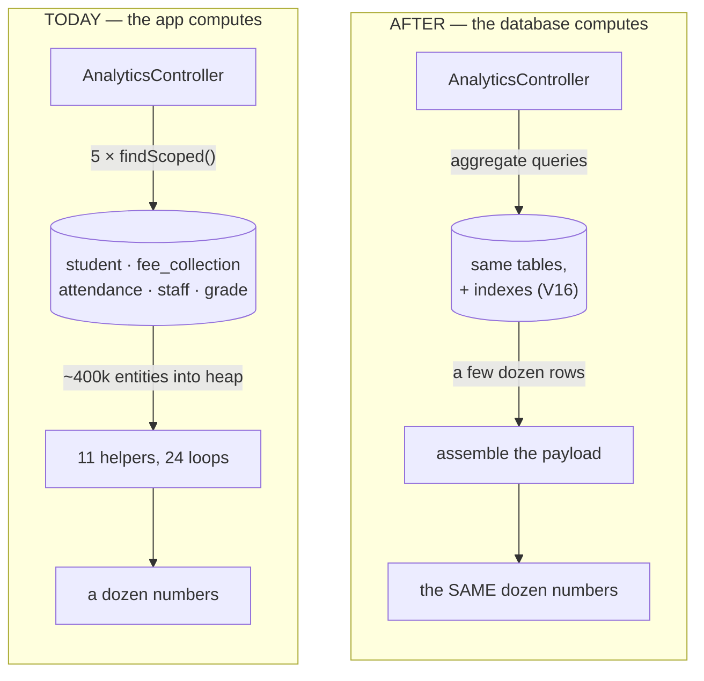
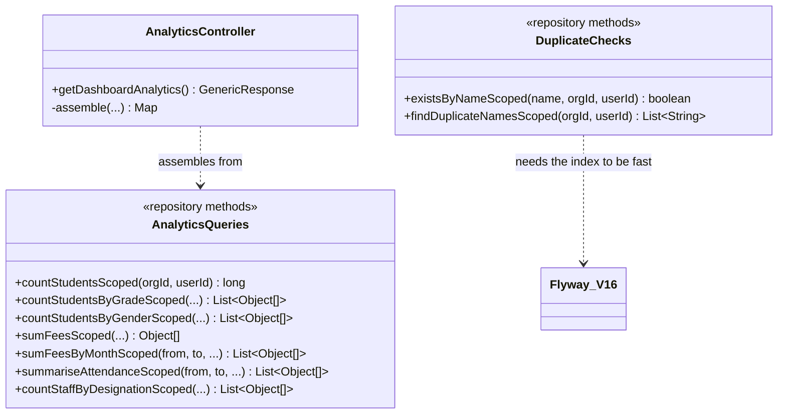
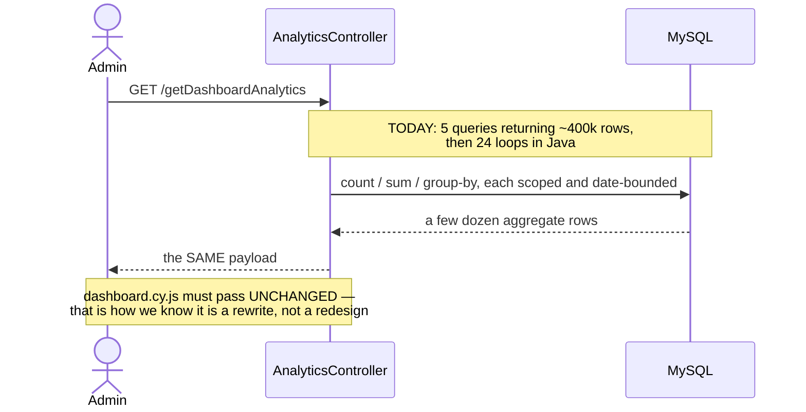

# Finding D — analytics & read performance

**Status: DONE — `mvn test` + Cypress gate GREEN (2026-08-01).**
`dashboard.cy.js` passed **unchanged** — the contract held, which is what makes this a rewrite and not a
redesign — plus `analytics-perf.cy.js`. Flyway **V16** (15 indexes) applied cleanly.

**This closes the education review.** Findings A, B, C and D are all resolved; E is partly done (2 → 10 unit
test classes). Two follow-ups are named in §6 and are NOT part of this slice: the UNIQUE constraints that
would close the check-then-act race, and a Testcontainers test for the empty-tenant aggregate path.
Closes the last open item in `education-review-audit.md`: *"Analytics loads 5 whole tables per dashboard
render"*, plus its two relatives — the in-memory duplicate checks and the unbounded finders.

---

## 1. Document — what and why

### The finding, re-measured against today's code

The audit is still accurate. `AnalyticsController:70-74` runs on **every dashboard render**:

```java
List<Student>        students   = studentRepository.findScoped(orgId, userId);
List<FeeCollection>  fees       = feeCollectionRepository.findScoped(orgId, userId);
List<Attendance>     attendance = attendanceRepository.findScoped(orgId, userId);
List<Staff>          staff      = staffRepository.findScoped(orgId, userId);
List<Grade>          grades     = gradeRepository.findScoped(orgId, userId);
```

…then 11 helpers loop over them in Java to produce a dozen small numbers.

**Attendance is the one that ends the argument.** One row per student per day: a 2,000-student school
generates roughly **400,000 rows a year**, every one of which is hydrated into a JPA entity, held in heap,
and iterated three times (`attendanceTrend`, `attendanceByClass`, the KPI present-count) to compute an
average and a couple of series. The other four tables are smaller but the shape is identical.

### It has already been solved once, in this codebase, correctly

Slice 1.5 needed per-student attendance for report cards and did **not** load the table:

```java
// AttendanceRepository.summariseByStudent — added in 1.5
select a.en, sum(case when lower(a.status) in ('present','p') then 1 else 0 end), count(a)
from Attendance a where … group by a.en
```

That is the whole design of this slice, applied to eleven more numbers. This is not a new pattern to invent;
it is an existing pattern to finish rolling out.

### The second problem is a correctness bug wearing a performance costume

Twelve save endpoints check for duplicates like this:

```java
// GradeController:154 — and eleven more of the same shape
boolean exists = gradeRepository.findScoped(orgId, userId).stream().anyMatch(g ->
        g.getName() != null && g.getName().equalsIgnoreCase(dto.getName()) …);
```

Loading every grade in the tenant to answer "does this one name exist" is the obvious waste. **The
non-obvious part is that it does not actually work:** it is a check-then-act with no constraint behind it,
so two concurrent saves both read "no duplicate" and both insert. That is the same class of defect 1.3 D1
and 1.6 D6 closed with a UNIQUE key — and here it is still open in twelve places.

So D is not purely a performance slice, and pretending otherwise would mean fixing the cost and leaving the
race. See **D3** for why the fix is *not* simply "add UNIQUE constraints".

---

## 2. Design

### D1 — Aggregate in SQL; the controller assembles, it does not compute

Each figure becomes a scoped aggregate query returning a handful of rows. `AnalyticsController` stops being
a calculator and becomes an assembler.

| Today | Becomes |
|---|---|
| `students.size()`, gender split, status split, by-class counts | `count(*)` + three `group by` queries |
| fee sums, collection rate, payment modes, by-class collection | `sum()` + `group by` queries |
| attendance rate, trend, by-class | `group by` — following 1.5's `summariseByStudent` |
| staff count, by-designation | `count(*)` + one `group by` |
| enrol / fee / attendance 12-month trends | `group by year, month`, bounded to the window |

**The 12-month trends must be bounded in the WHERE clause, not sliced in Java.** `last12Months()` currently
builds the window *after* loading everything; the date range belongs in the query, which is also what lets
an index be used.

### D2 — `findScoped` stays. This slice does not touch it

Tempting and wrong. `findScoped` is used by every list screen in the service; changing its return type or
adding pagination to it would ripple through code this slice has no reason to enter, on the same day it
changes the analytics maths.

New aggregate methods are **added alongside**. The unbounded-list problem is real and is handled in D5 —
separately, and smaller than the audit implies.

### D3 — Duplicate checks become indexed `exists` queries. UNIQUE constraints are NOT added, and that is deliberate

Each `findScoped().stream().anyMatch(...)` becomes an `existsBy…Scoped` query plus a supporting index.

**Why not go further and add a UNIQUE constraint, which is the actual fix for the race?** Because live
tenants may already hold duplicates. Adding UNIQUE to a table containing them fails the migration — and per
DB standard **D5 (never act on inference about live data)**, this slice will not guess. A constraint that
cannot be applied on a customer's database is worse than none: it turns the next deploy into an outage.

So the honest split:

| Now, in this slice | Requires a data audit first |
|---|---|
| `exists` + index — kills the full scan, keeps today's exact semantics | UNIQUE constraints that would close the race |

The slice therefore **ships a report query** (`findDuplicateNames`-style, one per checked entity) so the race
can be closed in a follow-up once each tenant's data is known to be clean. Named in §6, not silently dropped.

### D4 — Case-insensitivity: rely on the collation, and say so out loud

Today's checks are `equalsIgnoreCase`. Two ways to reproduce that in SQL:

| Option | Case-insensitive? | Index-usable? |
|---|---|---|
| `where lower(name) = lower(:name)` | yes | **no** — the function defeats the index |
| `where name = :name` | yes, **because MySQL's default collation is CI** | yes |

The second is chosen. The first would produce a query that is honest-looking and still scans the table,
which would leave the slice having changed a lot and fixed nothing.

**The dependency is therefore explicit rather than accidental**: these columns are `utf8mb4` with a
case-insensitive default collation (`utf8mb4_0900_ai_ci` on MySQL 8), and the migration comment says so.
If the platform ever moves to a case-sensitive collation or a different engine, these checks change meaning
— which is exactly the kind of thing that must be written down at the point it is relied upon.

### D5 — The unbounded finders: measure before paging

The audit says *"every `findScoped` returns an unbounded `List`; only pharma-service learned to page these."*
True, but the scale differs enormously by table, and paging a list screen changes a UI contract.

| Table | Rows per tenant | Action |
|---|---|---|
| `attendance` | ~400k/year | **never loaded whole again** after D1 — the analytics path was the only bulk reader |
| `mark`, `fee_collection` | thousands | already read by paper/student/term, not wholesale |
| `student` | hundreds–thousands | list screens page in the UI already; server-side paging is a **separate slice** |
| `grade`, `staff`, `subject`, `guardian`, `owner`, `school`, `vehicle`, `discount` | tens | leave alone — paging these would be ceremony |

So this slice removes the bulk reads that actually hurt and **does not** add pagination to reference tables
where it would be noise. Server-side paging for `student` is scoped out and named in §6.

### D6 — Scope

| In | Out |
|---|---|
| 11 analytics aggregates replacing 5 table loads (D1) | changing `findScoped` (D2) |
| 12 duplicate checks → `exists` + Flyway indexes (D3) | UNIQUE constraints (D3 — needs a data audit) |
| duplicate-report queries so the follow-up is possible | server-side paging for student lists (D5) |
| index coverage for the scoped analytics predicates | caching the dashboard (§6) |
| the same numbers out — this is a rewrite behind an unchanged contract | any change to what the dashboard shows |

### Layer answers (§5b)

| Layer | Answer |
|---|---|
| **UI/UX** | **nothing changes.** The response shape is identical, asserted by the existing `dashboard.cy.js`. A perf slice that alters output is a feature slice in disguise |
| **Service/API** | `/getDashboardAnalytics` unchanged in path, auth and payload; the controller assembles aggregates instead of computing them |
| **Database** | no new tables. Flyway **V16** adds indexes: `(organization_id, name)` per checked entity, plus `(organization_id, att_date)` and `(organization_id, payment_date)` for the trend windows |
| **Patterns** | push-computation-to-the-data (the DB aggregates; the app assembles); batch-not-per-row, already the house rule (1.1 term stamping, 1.4 scale-read-once, 1.5 `loadTerm`); guard-clause `exists` over load-and-filter |
| **Microservice design** | education-local. No new service, no new library, nothing crosses an edge — this is a service tuning its own reads |
| **Configurability** | none, and deliberately so. "How many rows may we load?" is not a policy a school should ever answer |
| **DRY** | one `isPresent` definition — the SQL `in ('present','p')` currently exists in both `AnalyticsController` and 1.5's `summariseByStudent`; this slice leaves ONE |

---

## 3. Architecture & UML







---

## 4. Implement — checklist

- [x] Flyway **V16** — 15 indexes: 9 for the duplicate checks, 6 for the aggregate/date predicates
- [x] aggregate finders on `StudentRepository`, `FeeCollectionRepository`, `AttendanceRepository`, `StaffRepository`
- [x] `AnalyticsController` assembles from aggregates; the 11 helpers and 24 loops are gone
- [x] trends bounded by date **in the query**, not sliced in Java after loading
- [x] 12 duplicate checks → `existsBy…Scoped` (D3), semantics unchanged
- [x] one `isPresent` definition — the Java copy in `AnalyticsController` is deleted; the SQL rule in `AttendanceRepository` (shared with 1.5's `summariseByStudent`) is the only one left
- [x] `findDuplicate*Scoped` per checked entity, so the UNIQUE follow-up is possible
- [x] `cypress/e2e/education/analytics-perf.cy.js` + `dashboard.cy.js` **unchanged**
- [ ] **`AnalyticsAggregateTest` (Testcontainers) — NOT written.** See the corrections below; the
      empty-tenant case genuinely needs it and Cypress cannot reach it.

### Corrections made during implementation

**`vehicle` has no `number` column — it is `vehicle_number`.** The entity field is `Vehicle.number`
(`@Column(name = "vehicle_number")`), so the JPQL reads `v.number` while the index must name the real
column. Caught by checking every column against `V1__baseline.sql` before finalising V16 rather than
after the migration failed; **all 15 indexed columns were verified this way**, and this was the only
mismatch.

**Two single-row aggregates return `List<Object[]>`, not `Object[]`.** A one-row projection is ambiguous
across Hibernate versions (the row, versus the row wrapped in a list). Taking element 0 of a list is
unambiguous everywhere and costs nothing.

**Label ORDER changes, and nothing depended on it.** The breakdown series were previously ordered by
"first encountered while scanning the table" — arbitrary and data-dependent. They now carry a stable
`order by`. Recorded because it is a real output difference, even though `dashboard.cy.js` asserts shape
rather than order, and a legend that reshuffled when a row was inserted was never a feature.

**The cross-tenant duplicate test could not be written honestly.** `demo.education@` and
`owner.education@` share one organization, so there is no second education tenant to prove "another
school may reuse this name" against. Rather than log into another module and back — which would assert
nothing while appearing to pass — the gap is documented in the spec and left to
`save-takeover-idor.cy.js`, which exercises cross-tenant scoping directly.

**No pure unit test, and that is a real gap rather than an oversight.** This slice moved logic *out* of
Java and *into* SQL, which is the point — but it means the usual "pure logic runs on every `mvn test`"
answer does not apply, because there is barely any pure logic left. The remaining risk sits precisely
where Cypress cannot reach it: **a tenant with no students, no fees and no attendance**, where SQL
`sum()` returns NULL and the Java it replaced returned 0. The demo org has data, so the gate cannot
exercise it. Mitigated in code by `coalesce` in every aggregate *and* a null-tolerant `asLong` reader —
belt and braces — but **a Testcontainers test against an empty schema is the honest way to prove it**
and is the first thing to add.

## 5. Test

The test strategy is different from every other slice here, and deliberately: **the correctness bar is "the
numbers did not change".**

| # | Case | Expected |
|---|---|---|
| 1 | `dashboard.cy.js`, untouched | passes — same keys, same values |
| 2 | KPIs against a known fixture | identical to the values the old code produced |
| 3 | A tenant with **no** students/fees/attendance | zeros and empty series, not nulls or a 500 (the old code's `size()` on an empty list was safe; `sum()` in SQL returns NULL) |
| 4 | Attendance spanning >12 months | the trend window is the last 12, bounded by the query |
| 5 | Duplicate name, same tenant | still refused, same message |
| 6 | Duplicate name differing only in case | still refused — D4's collation dependency, asserted rather than assumed |
| 7 | Same name in **another** tenant | still allowed — the scope predicate survived the rewrite |
| 8 | Query count on a dashboard render | bounded and small; **no** query returns more rows than there are classes |

Gate: `cypress/e2e/education/dashboard.cy.js` (existing, unchanged) — a **passing unchanged spec is the
whole point**. Plus `analytics-perf.cy.js` for cases 3, 6 and 7.
**Regression:** every education spec that saves an entity with a name — `sections.cy.js`,
`registration-flow.cy.js`, `student-import.cy.js`, `multi-branch.cy.js`, `promotion.cy.js`.

**Case 3 is the one most likely to bite.** `sum()` over no rows returns NULL in SQL, where `.mapToLong().sum()`
over an empty list returned 0. Every aggregate needs `coalesce`, and a fresh tenant is the fixture that
proves it.

## 6. Open / deferred

**UNIQUE constraints to close the check-then-act race (D3).** The real fix. Needs a per-tenant duplicate
audit first, which the report queries in this slice make possible. **Recommend doing this next** — the race
is a correctness bug, and this slice deliberately only makes it cheap rather than fixing it.

**Server-side paging for student lists (D5).** Real for large schools; a UI contract change, so its own slice.

**Caching the dashboard.** The obvious next lever, and deliberately not pulled: caching an incorrect
computation just serves it faster. Revisit once the aggregates are in and measured.

## 7. Risks

- **This slice rewrites a calculation, so the risk is silently different numbers.** Mitigated by keeping the
  contract fixed and the existing spec unchanged — but it is worth running the old and new endpoints
  side-by-side against one real tenant before this is called done.
- **`coalesce` (case 3).** The empty-tenant path is where SQL and the Java it replaces genuinely disagree.
- **The collation dependency (D4)** is now load-bearing where it used to be incidental. Written into the
  migration comment; anyone changing collation must read it.
- **Indexes are not free on write.** These tables are read far more than written, and the columns are small,
  so the trade is clearly right — but `attendance` takes bulk inserts from the daily register, and that is
  the one place to watch.
