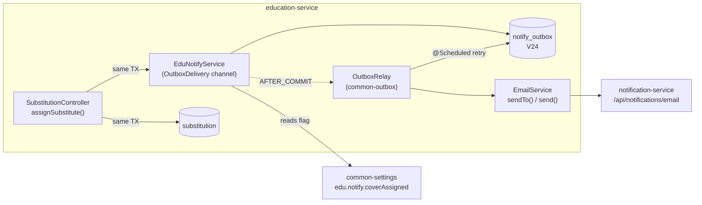
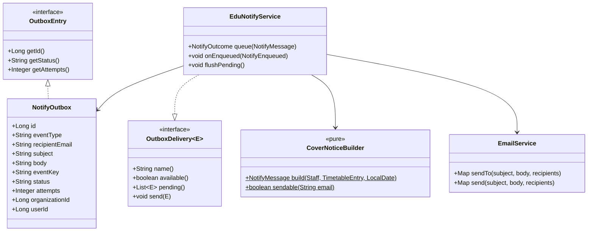
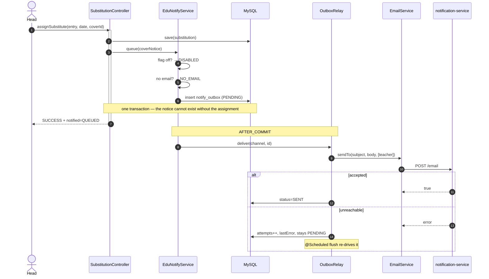

# Slice N1 — notification delivery outbox (2.2 cover-assigned)

**Status: DONE & Cypress-GREEN — 11/11, plus `substitution.cy.js` green as the 2.2 regression (2026-08-06).**
Findings from implementation in §8; the three infrastructure-lost runs and their root cause in §9.
Flyway **V24**.
Non-phase slice, sequenced after 3.1.
Programme: `education-complete-programme.md` — carried requirement *"2.2 → notification"*.
Related: `105-notification-multichannel-broadcast.md` (the platform-side slice; **this one does not
supersede it** — see §2 D1).

---

## 1. Document — what and why

### The programme's premise was wrong, and correcting it is most of the scoping

The carried requirement read *"2.2 + 2.4 + 2.5 all want a real send — the path is a logging stub"*, and §9's
first review draft called it **"hours of work"**. Verified against the code and the slice docs on
2026-08-04, only one third of that is true:

| Slice | Claim | Verified reality |
|---|---|---|
| **2.2** cover assigned | wants a real send | ✅ **True.** `SubstitutionController.notifyCoverBestEffort` calls `appUtil.li(...)` — it logs. The hook, the narrow catch and the after-commit placement are all already right; only the send is missing |
| **2.4** homework set | wants a real send | ❌ **There is no hook at all.** `HomeworkController` contains no notify call of any kind. 2.4 §6 lists guardian notification as *deferred scope*. This is a **new feature with class-sized fan-out**, not a wiring fix |
| **2.5** guardian informed | wants a real send | ❌ **It must NOT send.** 2.5 defines `guardianInformed` as *"the school ticks it when they have spoken to the guardian"* — a record that a **human conversation already happened**. Emailing on that tick would send a second, machine-written message about a conversation that already took place, to a guardian who has already been told |

**2.5 is the one worth stating loudly**, because "wire up the notification hooks" is exactly the kind of
sweep that would have wired it. The field is a *record*, not a *request*. Its slice says so in D5 and its
gate asserts nothing is sent.

**Scope of this slice, therefore: 2.2 only.** 2.4's fan-out is its own slice (§6).

### Why this is not "just call `EmailService.send()`"

That call takes ~20 minutes. It is also the wrong thing, for three reasons that are all standing rules:

1. **It puts an inter-service HTTP call on a write path.** `EmailService.send()` loops recipients
   synchronously on the request thread. The standing performance rule is *keep inter-service calls off hot
   paths*.
2. **A failed send is silently lost.** `slices/105-…md` G3 records that `notification-service` **has no
   database** — no entity, no repository, no Flyway. It is a stateless SMTP relay. Nothing retries, and
   nothing records that a teacher was never told they are covering period 3.
3. **`EmailService.send()` always CCs the admin recipients.** That is correct for its caller (alerts are a
   broadcast, and admins want a copy of what went to 300 guardians). It is wrong for "you are covering 5B
   at 11:00" — see D2.

### What already exists to build on

| Existing | Consequence |
|---|---|
| `common-outbox`: `OutboxEntry`, `OutboxDelivery`, `OutboxRelay` | the reliable-delivery state machine is written and proven **twice** in this service |
| `GlOutboxService` (0.1) and `EduAuditService` (1.3) | two working templates of exactly this shape, in this codebase, by this programme |
| `EmailService` → `NotificationClient` → `lb://notification-service` | the transport works today; `AlertController` uses it in production |
| `@EnableScheduling` present (added in 0.1) | the retry relay will actually run — it was missing once, and without it rows stay PENDING forever |
| 2.2's `notifyCoverBestEffort` | the hook, its after-commit position and its narrow catch are already correct |

**Nothing about the transport is new. This slice adds the one thing missing: the event cannot be lost.**

---

## 2. Design

### D1 — Transactional outbox, the THIRD use of the same relay

`notify_outbox` (V24) + an `OutboxDelivery` channel, mirroring `gl_outbox` and `audit_outbox` exactly.

```
assignSubstitute()  ─┬─ save(substitution)      ┐
                     └─ notify.queue(COVER_…)   ┘ ONE commit
                                │ AFTER_COMMIT
                                ▼
                         OutboxRelay ──> EmailService ──> notification-service
                                ▲                │
                                └── @Scheduled ──┘ retry while PENDING
```

**Named pattern: transactional outbox.** The row is written in the caller's transaction, so the message
exists if and only if the substitution exists. Delivery happens after commit, and failure leaves the row
PENDING for the scheduled relay.

**Why not a queue (Redis/Rabbit).** The whole point is that the message commits *atomically with the
decision*. Only the service's own datastore can do that; anything else reintroduces the dual-write this
pattern exists to remove. This is also §5c's answer.

**This does NOT supersede slice 105, and the two are complementary, not duplicative:**

| | Owns |
|---|---|
| **N1 (this slice), producer side** | the event is never lost — it commits with the decision and retries until delivered |
| **105, consumer side** | delivery is multi-channel, recorded per recipient, and schedulable |

The precedent is exact: `gl_outbox` lives in education **and** `finance-service` keeps its own records.
A producer outbox is not a substitute for a consumer's delivery log.

### D2 — `EmailService.sendTo()`: a targeted send, with `send()` delegating to it

`EmailService.send()` unconditionally adds `education.alerts.admin-recipients` to every message. For a
broadcast alert that is a feature. For a one-teacher operational notice it means **the office is CCd on
every cover assignment in the school** — noise that trains people to filter the sender.

```
sendTo(subject, body, recipients)          ← NEW: exactly the named recipients
send(subject, body, recipients)            ← unchanged behaviour: sendTo(… + adminRecipients)
```

`send()` becomes a two-line delegation, so there is **one sender**, one retry-and-count loop, one place
where a bad address is skipped. DRY, and `AlertController` is untouched.

### D3 — The recipient email is SNAPSHOTTED at enqueue, not resolved at delivery

The row stores the resolved address, not a `staffId` to look up later. Two reasons:

1. **The relay runs with no request context.** It already has to `runAs` the row's identity (the audit
   channel does exactly this); making it also re-resolve a domain record widens what a scheduled job needs
   to know.
2. **Consistency with the platform's snapshot rule.** 1.5 report cards, 1.6 promotion and 3.1's
   `GuardianPortalAccess.email` all snapshot the value at the moment of the decision, precisely so a later
   edit cannot silently restate what was sent.

Accepted cost: correcting a teacher's email does not redirect an already-queued notice. That is the same
trade 3.1 made deliberately, and re-inviting/re-assigning is the explicit act that picks up the new address.

### D4 — No email on record ⇒ the assignment still succeeds, and the response SAYS SO

2.2 D6 is binding: *a failed message must never lose the assignment* — the school still happened. So a
teacher with no email address does not block cover.

But it must not be silent either, which is what today's `appUtil.li(...)` effectively is. The response
carries the outcome:

| `notified` | Meaning |
|---|---|
| `QUEUED` | a notice is queued for delivery |
| `NO_EMAIL` | assigned, but this teacher has no address on record — **nobody has been told** |
| `DISABLED` | assigned; the school has cover notices switched off |

This is the 3.1 lesson applied: the guardian-portal invite **refuses** with a message naming the fix rather
than half-succeeding. Here the operation legitimately proceeds, so the honest form is to succeed and name
what did not happen. It is also what makes the gate able to assert all three branches (C2).

### D5 — `edu.notify.coverAssigned` (BOOL, default ON), read on the path it governs

A school that assigns cover verbally at the morning briefing does not want an email per lesson.

Default **ON** because 2.2 always intended to notify, and per C3 it **fails ON**: if the setting cannot be
read, the notice is queued. The failure mode of an extra email is noise; the failure mode of a missing one
is a teacher not knowing they are covering a class.

**C1 compliance:** the flag is read inside the queue path, not at the screen — and the gate asserts both the
catalog entry and the consumer behaviour (C2), which is exactly the violation `edu.exam.minAttendancePercent`
currently represents.

### D6 — Idempotency and the status machine come from the relay, not from new code

`eventKey` = a UUID per event, as `EduAuditService` does. The relay owns `PENDING → SENT | FAILED`,
`attempts`, and `lastError`. **No new state machine is written in this slice** — that is the whole reason
for reusing `OutboxDelivery`.

### D7 — Scope

| In | Out |
|---|---|
| `notify_outbox` (V24) + `EduNotifyService` channel | 2.4 homework-set fan-out (§6 — its own slice) |
| 2.2 cover-assigned wired through it | **2.5 `guardianInformed` — must not send (§1)** |
| `EmailService.sendTo()` (D2) | SMS / push — `notification-service` exposes `/email` only (105 G1) |
| `edu.notify.coverAssigned` setting | per-recipient delivery records (105 G3, consumer side) |
| `notified` outcome on the response (D4) | scheduled/digest sends (105 G2) |
| a pure `CoverNoticeBuilder` + its unit test | a notification preferences UI |

### Layer answers (§5b)

| Layer | Answer |
|---|---|
| **UI/UX** | the substitution screen reports the notice outcome (D4) instead of implying a send that may not have happened |
| **Service / API** | `notified` added to the existing `GenericResponse`; no new endpoint |
| **Database** | MySQL — §5c: the row **must** commit in the caller's transaction, which only the service's own datastore can do |
| **Patterns** | transactional outbox (D1); strategy via `OutboxDelivery` (DIP — the relay is closed for modification, open for a new channel); value snapshot (D3); pure builder for the message (D6) |
| **Microservice design** | producer-side reliability in education; delivery stays `notification-service`'s job. No new service — this owns no data beyond its own outbox |
| **Per-org configurability** | `edu.notify.coverAssigned` via common-settings (D5) |
| **DRY** | `send()` delegates to `sendTo()` (D2); the relay/state machine is reused, not rewritten |

---

## 3. Architecture & UML

### 3.1 Architecture



### 3.2 Class



### 3.3 Sequence



---

## 4. Implement — checklist

- [ ] **V24** `notify_outbox` — columns as `audit_outbox`, plus `event_type`, `recipient_email`, `subject`,
      `body`. Indexed on `(status, id)` for the relay's queue and on `organization_id` (D3 of the standards).
- [ ] `NotifyOutbox` entity implementing `OutboxEntry`; `NotifyOutboxRepository` with
      `findTop100ByStatusOrderByIdAsc`.
- [ ] `EduNotifyService` — `queue()`, `@TransactionalEventListener(AFTER_COMMIT)`, `@Scheduled` flush;
      channel `name() = "EDU-NOTIFY"`, `available()` = client wired.
- [ ] `CoverNoticeBuilder` — **pure**, static, no Spring: subject/body + `sendable()`.
- [ ] `EmailService.sendTo()`; `send()` delegates (D2). **`AlertController` must not change.**
- [ ] `SubstitutionController.notifyCoverBestEffort` → `notify.queue(...)`, returning the outcome; response
      carries `notified` (D4).
- [ ] `edu.notify.coverAssigned` in `EducationSettingsCatalog` (BOOL, default true) + read in `queue()` (C1).
- [ ] i18n keys for the three outcomes × 6 bundles — `SupportedLanguageTest` fails the build on a missing key.
- [ ] Monolith proxy: the `notified` field must survive the relay to the browser.

## 5. Test

**Pure unit — `CoverNoticeBuilderTest` (runs on every `mvn test`, no Docker):**
subject/body composition · null/blank email is not sendable · an address without `@` is not sendable ·
a teacher with an email is sendable · the body names class, period, date and room · null room omitted.

**Cypress gate — `notification-outbox.cy.js`:**

| # | Case | Asserts |
|---|---|---|
| 1 | catalog exposes `edu.notify.coverAssigned` with type BOOL, default true | C2 catalog half |
| 2 | assign cover to a teacher **with** an email → `notified=QUEUED` | the happy path |
| 3 | assign cover to a teacher **with no** email → `SUCCESS` **and** `notified=NO_EMAIL` | **D4 — the assignment survives; the gap is named, not hidden** |
| 4 | setting OFF → `notified=DISABLED`, and the assignment still succeeds | C2 consumer half + C-standard "verify the OFF path" |
| 5 | setting back ON → `QUEUED` again | the toggle is live, not startup-read |
| 6 | `substitution.cy.js` re-run, unchanged | **2.2's behaviour must be untouched** — this is a regression list entry, per slice B's lesson |
| 7 | a behaviour note with `guardianInformed` ticked sends **nothing** | **§1 — the thing a careless sweep would break** |

**Regression list (contract changes):** `substitution.cy.js` (response shape gains a field),
`behaviour.cy.js` (case 7's guarantee).

## 6. Open / deferred

- **2.4 homework-set fan-out — its own slice.** Class-sized recipients, needs recipient resolution and a
  per-guardian opt-out; the outbox built here is what makes it safe.
- **Slice 105 remains open and is the consumer-side fix** — per-recipient delivery records, scheduled sends,
  SMS. This slice does not touch `notification-service`.
- **No delivery *receipt* in education.** `SENT` means notification-service accepted it, not that a human
  received it. Naming it here so a later reader does not mistake `SENT` for "delivered".
- **`Staff.email` is unverified free text**, the same shape as 3.1's `Guardian.email` finding.

## 7. Risks

- **A stale jar will make this look broken.** The setting is new, and `SettingsService.set()` correctly
  refuses unknown keys — the branch-scope slice lost a full cycle to exactly this. `mvn -pl education-service
  -am clean package` before the gate.
- **`@EnableScheduling` must still be present.** Without it rows stay PENDING forever and the gate would
  still pass, because the gate asserts *queued*, not *delivered*.
- **An outbox row holds a rendered message body.** It is operational text (class, period, date) and no marks
  or behaviour data — worth keeping that way, since outbox rows outlive the event.

---

## 8. Implementation notes — what the code found that the design did not

**1. `EmailService.send()` was refactored, not copied.** `send()` now merges the admin recipients and
delegates to the new `sendTo()`; the per-recipient loop, the `@` check and the counting exist once.
`AlertController` is untouched, which is the point — the broadcast contract it depends on is unchanged.

**2. The channel throws on a failed send, deliberately.** `OutboxDelivery.send()` must throw for the relay
to retry. `EmailService` reports failures as a count rather than an exception, so the channel inspects
`failed` and throws. Swallowing it would leave the row `SENT` with nothing delivered — the exact silent-loss
this slice exists to remove, and 0.2a's lesson about a best-effort catch hiding a real failure.

**3. Three point lookups, not `lookups()`.** The controller already had a `lookups()` helper that loads
subjects, grades, staff and periods in full. Reusing it here would load four whole tables on every
assignment to render three names. `findByIdScoped` ×3 instead (standing performance rule).

**4. The i18n went client-side, and that changed the design's checklist item.** The design said "i18n keys
for the three outcomes". Education's service messages are English strings throughout — `GenericResponse`
carries no locale — so localising the server sentence would have invented a pattern the service does not
have. Instead the response carries the **machine code** (`notified`), `education.js` maps it to one of three
new `ui.js.sbCover*` keys, and all six bundles were updated. **`NO_EMAIL` renders as `alert-warning`, not
`alert-success`** — the cover was assigned, but nobody was told, and that is not a success.

**5. No monolith change was needed.** The proxy relays the raw body (`educationClient.post(...)` returns
`ResponseEntity<String>`), so `object.notified` survives to the browser unaltered. Verified rather than
assumed.

### Gate-spec bugs caught before the run, by verifying instead of assuming

Slice 3.1's lesson — *existence is not eligibility; read the endpoint before choosing the fixture* — was
applied to this spec while writing it, and it caught three defects that would each have cost a cycle:

| # | Assumed | Actual |
|---|---|---|
| 1 | `/getTimetable` returns the grid | it returns `object.entries`, **not** a `collection` — and with no `termId` the query is `(:termId is null and t.termId is null)`, so it returns only null-term rows. Now reads by `gradeId`, exactly as 2.2's green spec does |
| 2 | `saveBehaviourNote` takes `studentEnrollNo` | it takes **`enrollNo`**, and validates `occurredOn` |
| 3 | the note type param is `noteType` | it is **`type`** — `noteType` would have been ignored and silently defaulted to `NEUTRAL`, so the test would have passed while asserting against a note it did not create |

Number 3 is the interesting one: it would have produced a **green that proved nothing**, the same shape as
2.1's skipped test-3 and 2.4's empty class.

---

## 9. Gate run — three runs lost to one infrastructure bug, and what it taught

**Green on the fourth attempt: 11/11, with `substitution.cy.js` green alongside it.** No assertion in this
spec had ever executed before that. **Not one of the three failures was in the slice or the spec**, and no
slice code was changed in response to any of them.

| Run | Symptom | Actual cause |
|---|---|---|
| 1 | `expected 500 to equal 200` in the session hook | education-service down; `/getDashboardData` is a **proxy**, so the monolith answered 500 |
| 2 | `the org has a subject attached to a class` | **the same outage.** `/getUserSubject` returned an error body, `rows()` turned it into `[]`, and the fixture blamed the DATA |
| 3 | `/login?error=true` | the same outage, one layer earlier — auth-service was down too, so the login POST itself was rejected |

### The root cause: `start-all.ps1` used `Start-Process -NoNewWindow`

Every `java.exe` was attached to the **same console** as the launching PowerShell. Console applications
sharing a console all receive `CTRL_CLOSE_EVENT` / `CTRL_C_EVENT` when it goes away, so closing the terminal
tab, pressing Ctrl+C, or simply letting the launching shell exit **killed all 19 services at once**.

**The diagnostic signature is worth memorising: nineteen healthy JVMs stopping simultaneously, with no stack
trace in any log — the logs just stop mid-line.** A crash leaves a trace. A dependency failure kills
services in a staggered order. Only a console teardown does that. The monolith survived every time because
it is launched separately, which is exactly what made the failure look like an education problem.

**Fixed** by launching each service through its own hidden `powershell.exe` that does its own redirection.
The non-obvious part: `Start-Process` must be called **without** `-RedirectStandard*` for `-WindowStyle
Hidden` to be honoured, because redirection forces `UseShellExecute=false` and `WindowStyle` is then
silently ignored — the naive fix yields 19 visible windows.

### Two lessons that outlive this slice

1. **Diagnose the fleet before the code.** Port listeners and log mtimes, first, every time. Run 2 in
   particular read as a data problem and would have sent anyone editing fixtures for an hour.
2. **`rows()` converts an outage into an empty list, and that is why run 2 lied.** The helper returns `[]`
   for any response without an array, so "service down" and "no rows" are indistinguishable to every spec in
   the suite. Making it throw on a non-collection response would turn this whole class of failure into one
   honest message. **Follow-up, not done here** — it touches `cypress/support` and every spec.
