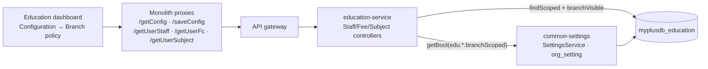
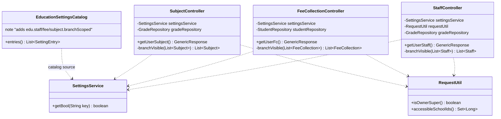
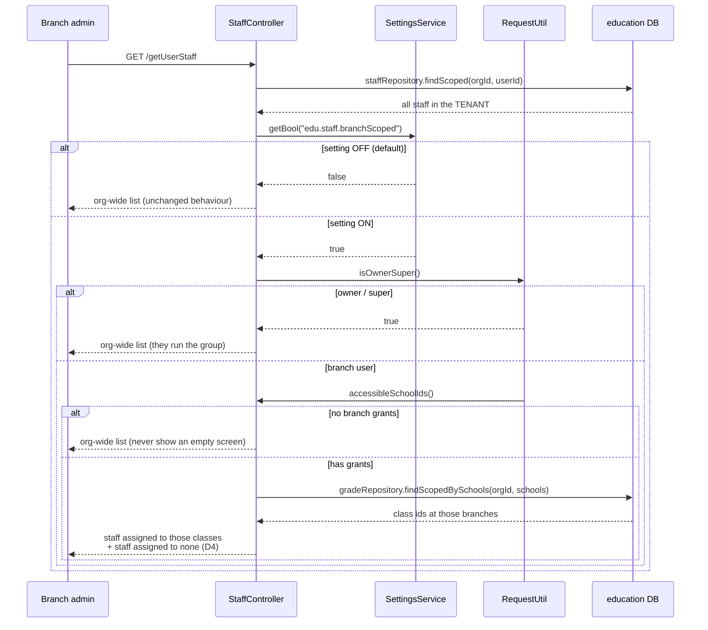

# Education — owner-configurable branch scoping (staff, fees, subjects)

**Status:** ✅ **DONE.** (Programme Phase 0 lists branch-scope settings as complete; the four `edu.*.branchScoped` keys are live and cited as the proven pattern.)

> **Design corrected during implementation.** The design assumed fee collection needed branch scoping built.
> It does **not** — `FeeCollectionController.branchVisible` already implements it, reading
> `FeeSetting.feeCollectionBranchScoped`, which the owner already sets on the **Fee Settings** screen.
> Adding `edu.fee.branchScoped` to the catalog as designed would have created **two switches for one
> behaviour**, with nothing to say which wins when they disagree. Fee was therefore dropped from this slice;
> see §6.
**Branch:** `feature/education-review`
**Follows:** education review step 1 (cross-tenant save takeover) — see `education-review-audit.md`.

---

## 1. Document

### The problem

A school **group** runs several campuses under one organization. Today only two things can be restricted
to a campus — guardians and discounts (`edu.guardian.branchScoped`, `edu.discount.branchScoped`). Everything
else is org-wide, so:

- the Karachi principal sees **every Lahore teacher** in the staff list;
- a branch accountant sees **every campus's fee collections**;
- the subject list is one shared curriculum even when campuses run different syllabi.

For a single-campus school none of this matters, which is why it was never noticed. For a group it is the
difference between a usable branch view and a list the user has to mentally filter every time.

### What this is NOT

This is **not** tenant isolation. Two different customers — St. Mary's and Beaconhouse — are separated by a
hard-coded rule that is not, and must never be, an owner setting: the party harmed by relaxing it is the
*other* tenant, who never consented and is not in the room. That boundary was fixed in step 1 and stays
fixed.

This slice is about **visibility inside one organization**, which is a genuine business policy the owner is
entitled to set.

| Layer | Who is separated | Configurable? |
|---|---|---|
| Tenant (`organizationId`) | Different paying customers | ❌ Never — hard-coded |
| Branch (`schoolId`) | Campuses of one customer | ✅ This slice |

### User value

An owner ticks a box per concern and the branch views narrow to that campus. Default OFF everywhere, so a
single-campus school and every existing group behave exactly as they do today until someone opts in.

---

## 2. Design

### D1 — derive the branch, don't add a column

None of the three entities has a `school_id`, and adding one would mean a migration, a backfill, and a
"which branch does this belong to" question the data cannot answer for shared records. Instead each derives
its branch through a relationship that **already exists** — the same technique the guardian toggle uses
(`Student.guardianId`), and it has a property a column would not: a record spanning two campuses stays
visible from **both**.

| Setting | Entity | Derivation | Rationale |
|---|---|---|---|
| `edu.staff.branchScoped` | `Staff` | `Staff.grades` → `Grade.schoolId` | A teacher assigned to a class at a campus belongs to it; one covering two campuses shows at both |
| `edu.fee.branchScoped` | `FeeCollection` | `FeeCollection.en` → `Student.enrollNo` → `Student.schoolId` | A payment belongs where the student is enrolled |
| `edu.subject.branchScoped` | `Subject` | `Subject.grade` → `Grade.schoolId` | A subject attached to a campus's class belongs to that campus |

### D2 — read-side filter only

Scoping is applied when **listing**, exactly as `GuardianController.branchVisible` does. Writes are not
restricted: a branch admin creating a teacher is not creating it "in" a branch — the assignment to a class
is what places it. This keeps the change small and avoids inventing a second, conflicting ownership model.

### D3 — three escape hatches, all pre-existing

Copied from the guardian implementation so behaviour is uniform:

1. setting OFF (the default) ⇒ org-wide;
2. caller is **owner/super** ⇒ org-wide (they run the group);
3. caller has **no branch grants** ⇒ org-wide (otherwise a fresh admin sees an empty screen and thinks the
   data is gone).

### D4 — records with no derivable branch stay visible

A staff member assigned to no class, a subject attached to no class, a fee whose enroll-no matches no
student: these have no branch, and hiding them would make rows *disappear* the moment a toggle flips. They
remain visible under every setting. Matches the existing `findScopedBySchools` treatment of legacy
`schoolId IS NULL` rows.

> **Trade-off, stated plainly:** this is deliberately permissive. Turning a toggle ON narrows the list but
> does not guarantee a branch user sees *nothing* from another campus — an unassigned record is shared. The
> alternative (hide anything unattributable) makes data vanish silently, which is worse. If a group needs
> the strict version, that is a follow-up with a real `school_id` column and a backfill.

### Endpoint contract

**No new endpoints and no signature changes.** The settings already surface through the shared
common-settings catalog:

| | |
|---|---|
| `GET /getConfig` | already returns the catalog + this org's overrides |
| `POST /saveConfig` | already persists one `key`/`value` |
| Screen | Education → Configuration, group **"Branch policy"** — renders itself from the catalog |

The Configuration screen needs **no change**: `/js/common/settings-form.js` renders whatever the catalog
returns.

### Security

- Settings are org-scoped by `SettingsService`; one org cannot read or write another's.
- `/saveConfig` is already `ROLE_OWNER`/`ADMIN` gated.
- Relaxing a branch toggle can never widen visibility **beyond the tenant** — the org filter runs first,
  in the repository, and this slice does not touch it.

---

## 3. Architecture & UML

### Architecture



### Class diagram



### Sequence — listing staff with the toggle on



---

## 4. Implement

- [x] `EducationSettingsCatalog` — added `edu.staff.branchScoped` + `edu.subject.branchScoped`, group `"Branch policy"`, default `false`
- [x] `StaffController` — injected `SettingsService`; added `branchVisible`; applied to **all three** reads (`getUserStaff`, `getUserStaffs` picker, `getAllStaff`)
- [x] `SubjectController` — injected `SettingsService`; added `branchVisible`; applied to **all three** reads (`getUserSubject`, `getUserSubjects` picker, `getAllSubject`)
- [x] `getUserSubjects` given `@Transactional(readOnly = true)` — it had none, and `Subject.grade` is LAZY under `open-in-view: false`
- [x] Branch set resolved in **one** query per request (`findScopedBySchools`), then an in-memory membership test
- [x] ~~`FeeCollectionController`~~ — **already implemented**; deliberately not duplicated (see §6)
- [x] Unit test: `EducationBranchScopeTest`
- [x] Cypress: `education/branch-scope-settings.cy.js`

**The pickers matter.** `getUserStaffs` / `getUserSubjects` render `<option>` lists. Scoping the table but
not the dropdown would leave a way around the policy — and worse, let a branch user *attach* a record they
cannot see.

**No schema change. No migration.** Settings live in the existing `org_setting` table.

---

## 5. Test

### Cases

| # | Setting | Caller | Expect |
|---|---|---|---|
| 1 | OFF (default) | branch admin | Sees all campuses — today's behaviour, unchanged |
| 2 | ON | owner/super | Sees all campuses |
| 3 | ON | admin with Branch A grant | Sees only Branch A's staff/fees/subjects |
| 4 | ON | admin with **no** grants | Sees all — must not be an empty screen |
| 5 | ON | branch admin | A staff member assigned to **no class** is still visible (D4) |
| 6 | ON | Branch A admin | A teacher assigned to a class at **both** A and B is visible from both |
| 7 | ON | any | Tenant isolation still absolute — never sees another org's rows, toggle irrelevant |

Case 7 is the one that must never regress: this slice changes only *branch* visibility, and step 1's tenant
guard sits underneath it.

### Cypress

`cypress/e2e/education/branch-scope-settings.cy.js`, using the seeded multi-branch fixture
(`loginAsEduOwner` + the two teacher logins from `multi-branch.cy.js`).

```
npx cypress open --e2e        # pick education/branch-scope-settings.cy.js
```

---

---

## 6. Fee collection — already done, deliberately not duplicated

Implementation found `FeeCollectionController.branchVisible` already in place, reading
`FeeSetting.feeCollectionBranchScoped` (default FALSE = org-wide, "a guardian may pay at any campus"),
derived exactly as this design proposed: `FeeCollection.en` → `Student.enrollNo` → `Student.schoolId`. The
owner already controls it — checkbox `#fsFeeBranchScoped` on the **Fee Settings** screen.

So the behaviour asked for exists. What does **not** exist is consistency: the owner now sets one branch
policy on *Fee Settings* and two on *Configuration → Branch policy*.

**Why not just add `edu.fee.branchScoped` too?** Because then two switches would control one behaviour, and
nothing would say which wins. An owner ticking the Configuration box and seeing no change — because the Fee
Settings box is what the code reads — is a worse defect than the inconsistency.

**Follow-up (not this slice):** migrate `feeCollectionBranchScoped` onto the common-settings catalog so all
branch policy sits in one place. That needs a data migration for existing `FeeSetting` rows and removal of
the old checkbox — a small slice of its own, worth doing when you next touch fee settings.

---

## Open question for the owner

**Where should branch policy live?** Right now: staff + subjects + guardians + discounts on *Configuration*,
fees on *Fee Settings*. §6 proposes unifying them. Worth deciding before customers learn the current layout.
