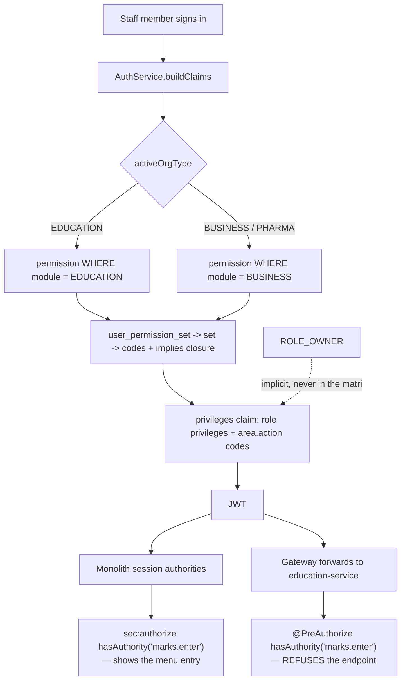

# EDU-PERM-1 — an education owner can say what each member of staff may do

**Status 2026-09-24: SLICE 1 BUILT.** `V16__permission_sets_for_education.sql` applied to dev ·
auth-service **65/65** green · minting is module-aware. Slices 2–5 not started.
⚠ **auth-service needs a rebuild** for the token to carry the new codes.

**Decisions taken** (the user asked for best standards and practice, and to follow a top-tier school system):

- **Taxonomy follows the mainstream SIS** (PowerSchool, Fedena, Arbor/SIMS) rather than names invented here:
  **Principal · Class Teacher · Teacher · Accountant · Front Office**. A headmaster recognises all five.
- **Transport is its own area**, as it is a module of its own in every mainstream SIS — the app has a
  Vehicles screen, so `school.*` is the campus and `transport.*` the fleet. **19 areas**, not 18.
- **A third module value, `COMMON`.** `permission.code` is the PRIMARY KEY, so a code exists once for the
  whole platform — `report.*`, `settings.*` and `team.*` were already seeded as BUSINESS and mean exactly
  the same thing in a school. Duplicating them under another name would give one concept two authority
  strings, which then drift. They become COMMON and every module reads `module IN (<its own>, 'COMMON')`.
  **44 education codes + 8 COMMON.**
- **Nobody loses access on deploy.** The migration places every existing education member on a set that
  reproduces what they reach today — admins on Principal, everyone else on Teacher — which is what V12/V15
  did for shops. This also settles the question about the nine unguarded screens: Teacher holds all nine.
- **Admins keep everything** for now, via the Principal set. Moving them to a narrower set is the owner's
  choice afterwards, not something this deploy imposes.

## 1. The request

> "why ADMIN_PRIVILEGE/SUPER_PRIVILEGE only can register. this is wrong implementation. an owner can use whole
> education system and the owner can set previleges for the user created by him/her which option or menu"

Correct on both counts. The first half — the owner seeing everything — turned out to be a **layout** fault and
is fixed (EDU-MENU: 12 of 25 menu entries were clipped unreachably). The second half is real and is this slice.

## 2. The review — measured, not assumed

| Question | Answer |
|---|---|
| Guards in `educationDashboard.html` using `ADMIN_PRIVILEGE`/`SUPER_PRIVILEGE` | **34** of ~46 |
| Register entries: admin-only vs **no guard at all** | **15** vs **9** |
| Education privileges declared in `role_privileges_education.properties` | **9** (`ADD_STUDENT`, `GET_SUBJECT`, …) |
| …referenced by any `sec:authorize` | **0** |
| …present among the **35** privileges in `myplusdb_auth` | **0** |
| `#permWrap` (the permission matrix) in the education dashboard | **absent** — business has it |
| education-service controllers / endpoint mappings | **36 / 177** |
| …carrying any `@PreAuthorize` | **80** — so **97 are ungated** |
| …gated by an `area.action` code | **0** |

The existing server guards are coarse: `ADMIN_PRIVILEGE` ×36, `DELETE_PRIVILEGE` ×23, `WRITE_PRIVILEGE` ×14,
`ROLE_OWNER` ×2.

**What this adds up to.** An owner has exactly two settings for a member of staff: grant `ADMIN_PRIVILEGE` —
fees, settings, every child's record — or leave them with the 9 unguarded screens that every signed-in
education user can already reach. "A teacher who may only enter marks" cannot be expressed at all.

The declared education privilege vocabulary is **dead configuration**: written down, seeded nowhere, read by
nothing. The same shape as the quote settings that existed in code for months while no tenant could set them.

## 3. What already works, and must not be rebuilt

PERM-1 is sound. It is simply not wired to education.

- `permission` — `code` (`area.action`, *also the authority string*, so `hasAuthority('sale.create')` needs no
  plumbing), `area`, `action`, `label` (a human sentence: "Ring up a sale"), `implies` (a comma-separated
  closure — `sale.create` implies `sale.view,product.view,customer.view`), `sort_order`.
- `permission_set` — `organization_id` (NULL = built-in), `name`, `description`, `scope`, `is_builtin`.
- `user_permission_set` — puts a person on a set.
- The matrix UI (`permissions.js`, `#permWrap`) and the per-member dropdown (`team.js`).
- **An owner holds everything implicitly**, with no row anywhere saying so, precisely so no mis-tick can lock
  an owner out of their own school (design G-4). Keep exactly as is.

So EDU-PERM-1 adds a **vocabulary** and wires up existing machinery. It invents no new mechanism.

## 4. Why the business codes cannot simply be reused

`AuthService.buildClaims` mints permissions for **trade tenants only**, and its comment says why:

> "the catalog is business-shaped — sale, purchase, till, opening balances — so minting it for a member of
> another module grants them permissions their dashboard has no use for and their role never carried."

It records what that cost: V12's migration read "everyone not already placed", and with four modules and a
parent portal in one table **a `ROLE_GUARDIAN` ended up holding `sale.create`**. V14 cleaned the rows.

A school has no till and no supplier. `sale.create` on a headmaster means nothing, and `student.edit` on a
cashier is a real leak. **The catalog must become per-module.**

## 5. The design

### 5.1 One new column turns the boolean into a catalog

`permission` gains **`module VARCHAR(16) NOT NULL DEFAULT 'BUSINESS'`**. Existing rows are business codes and
keep their meaning with no backfill.

Minting then reads:

```
permissions minted = permission WHERE module IN (moduleOf(activeOrgType), 'COMMON')
```

`moduleOf` maps BUSINESS and PHARMA to `BUSINESS`, EDUCATION to `EDUCATION`, and everything else to
`null` — no catalogue, so no codes, which is V14's fail-back unchanged.

`tradeTenant()` stops being the gate for *permissions* (it stays exactly as it is for row scope, which is a
different question — see 5.4). The V12 hazard becomes structural rather than remembered: a guardian cannot
hold `sale.create` because `sale.*` is not in their module.

### 5.2 The education vocabulary — 19 areas · 44 own codes + 8 COMMON

Same `area.action` shape, same `implies` closure, labels written as a sentence a headmaster reads.

| Area | Actions | Screens it governs |
|---|---|---|
| `student` | view, create, edit, delete, promote | Manage Students, Promotion |
| `guardian` | view, create, edit, portal | Guardians, Guardian Portal Access |
| `staff` | view, create, edit, delete | Employee, Owners |
| `attendance` | view, mark, staff | Attendance, Staff Register, Leave |
| `class` | view, edit | Classes, Academic Year |
| `subject` | view, edit | Subjects |
| `timetable` | view, edit, substitute | Timetable, Substitution |
| `exam` | view, edit | Examinations, Grading Scale |
| `marks` | view, enter | Marks Entry |
| `reportcard` | view, generate, publish | Report Cards |
| `homework` | view, set | Homework |
| `behaviour` | view, record | Behaviour |
| `communication` | view, publish | Notices, Parents' evenings, Public Alerts |
| `fee` | view, collect, refund, structure | Fee Collection, Voucher, Settings, Discounts |
| `report` | view, export | Fee Report, Reports, analytics *(COMMON)* |
| `settings` | view, edit | Configuration *(COMMON)* |
| `team` | view, create, edit, delete | Manage Users *(COMMON)* |
| `school` | view, edit | Campus |
| `transport` | view, edit | Vehicles — its own module in every mainstream SIS |

Two deliberate separations:

- **`marks.enter` is not `reportcard.publish`.** A teacher enters marks; releasing a report card to parents is
  the head's act. Collapsing them would make every teacher a publisher.
- **`fee.collect` is not `fee.structure`.** Taking money at the window is daily work; changing what a family is
  charged is not.

### 5.3 Built-in sets — the five a school actually has

Built-ins are `organization_id = NULL, is_builtin = 1`, exactly like the business four, and a school may clone
and edit any of them.

| Set | Holds | Deliberately excludes |
|---|---|---|
| **Standard** | the `view` of everything a teacher sees | every write |
| **Teacher** | `marks.enter`, `attendance.mark`, `homework.set`, `behaviour.record`, `timetable.view`, `student.view`, `reportcard.view` | fees, settings, student records, publishing |
| **Class Teacher** | Teacher + `student.edit`, `guardian.view`, `reportcard.generate`, `communication.publish` | fees, settings, admissions |
| **Bursar** | `fee.*`, `report.view`, `report.export`, `student.view`, `guardian.view` | marks, attendance, settings |
| **Registrar** | `student.*`, `guardian.*`, `class.edit`, `subject.edit`, `staff.view`, `communication.publish` | fees, marks, settings |
| **Administrator** | everything in the module | nothing — the existing admin tier, now expressible |

### 5.4 ⚠ The scope axis does NOT fit a school — and must not be pretended to

`permission_set.scope` is `OWN`|`ALL`, and `OWN` means **rows this user created**. It is minted through
`AuthService`:

```java
boolean rowScoped = rowScopedTenant(activeOrg.getType());   // BUSINESS, PHARMA, MARKETPLACE
String scope = (!rowScoped || isOwner) ? "ALL" : permissionService.scopeFor(user.getId());
```

`EDUCATION` is not row-scoped, so **education tokens are minted `scope.ALL` whatever a set says.** That is
correct and was decided deliberately: a school's staff share their students, and `RowScopedTenantTest` pins it
with the note that changing it is *"a product decision, not a side effect"*.

It also would not help. A teacher did not create the student rows — the office did — so `OWN` would show a
teacher **nothing at all**.

The narrowing a school actually wants is **"my classes"**, which is an *assignment* relation, not an
*authorship* one. It is a different mechanism and a separate slice.

**Decision for v1: the scope control is hidden for education sets and every set is `ALL`.** Showing an OWN/ALL
toggle that the token ignores would be a third dead control in this area, and this slice exists because of the
first two.

### 5.5 Enforcement — the server, then the screen

> "Turning a capability off removes its menu entry **and** refuses its endpoints. A hidden menu alone is
> presentation, not protection."

- **Server (the protection).** 177 mappings. Every **write** gets `@PreAuthorize` on its code. Reads get
  `view` codes, which also closes part of the ~74 ungated READs already on record for this module.
- **Screen (the affordance).** The 34 `ADMIN_PRIVILEGE` guards become their codes — `sec:authorize` resolves
  `hasAuthority('student.edit')` against the same claim with no new plumbing.
- A button that always fails is worse than no button, so the two move together, per screen.

### 5.6 How a request resolves



## 6. Migration

One Flyway script in auth-service, additive and idempotent in the V35/V54 style:

1. `ALTER TABLE permission ADD COLUMN module` (guarded), default `'BUSINESS'` — existing 41 rows keep meaning.
2. `INSERT` the ~55 education codes with `module='EDUCATION'`, guarded by `WHERE NOT EXISTS`.
3. `INSERT` the 5 built-in education sets and their items, likewise guarded.

**No row is updated or deleted, so there is nothing to lose** — this is the opposite of the four irreversible
migrations recorded in the deployment plan. `role_privileges_education.properties`'s 9 dead privileges are left
untouched by this slice; retiring them is a separate cleanup with its own review.

## 7. What could go wrong

| Trap | Guard |
|---|---|
| A code minted into the wrong module — the V12 `ROLE_GUARDIAN`-holds-`sale.create` failure | the `module` column is the mint filter; unit test asserts an education token carries **no** `sale.*` and a business token **no** `student.*` |
| An owner locked out of their own school | owners stay implicit and out of the matrix (G-4). Test: owner with every set deleted still reaches every screen |
| A hidden menu mistaken for protection | each slice ships the endpoint guard **and** its UI guard; the gate calls the endpoint directly with a token that lacks the code |
| The 9 ungated Register screens silently becoming admin-only | they are listed; each gets a `view` code and a named built-in that holds it. A teacher must not lose Marks Entry |
| A set edited while a member is signed in | codes ride the JWT, so they refresh on token refresh — the existing PERM-1 behaviour, documented, not changed here |
| `implies` closure wrong → a set that grants a write without its view | closure computed server-side, as today; test that every `create/edit` code implies its `view` |

## 8. The gate

- **Unit (auth-service)** — the module filter; the `implies` closure; each built-in set's contents; an
  education token carries no business code and vice versa.
- **Cypress (`education-permissions.cy.js`)**, walked on the ladder the standard requires — owner, admin, and
  a **teacher**, **bursar** and **registrar** created for the purpose:
  1. the owner sees the matrix; an admin does not
  2. a Teacher reaches Marks Entry and **cannot** reach Fee Collection — menu *and* endpoint
  3. a Bursar collects a fee and **cannot** enter marks — menu *and* endpoint
  4. an owner whose sets are all deleted still reaches everything (the lockout control)
  5. a code the tenant's module does not own is refused even if hand-added to a set
  6. the 9 previously-unguarded screens are still reachable by a Teacher

## 9. Shipping order

Each slice is independently deployable and leaves the system working.

| # | Slice | Ends with |
|---|---|---|
| 1 | `module` column + education vocabulary + built-in sets + minting | codes ride the token; nothing reads them yet |
| 2 | `#permWrap` + `permissions.js` on the education dashboard | an owner can define and assign sets |
| 3 | Server guards on education-service writes | the protection is real |
| 4 | UI guards replace the 34 `ADMIN_PRIVILEGE` checks | the screen matches what the server allows |
| 5 | (separate) class assignment — "my classes only" | the narrowing 5.4 deliberately leaves out |

Slices 1–2 are safe on their own: sets can be defined before anything enforces them. **Slice 3 is the one that
changes who can do what**, and wants the full ladder walked before it ships.

## 10. Decisions taken — recorded, and still reversible

1. **Taxonomy** — SIS-standard names, as above. Renaming a built-in later is a one-line migration.
2. **The nine unguarded screens** — Teacher holds all nine, so no teacher loses anything.
3. **Scope** — OWN/ALL stays hidden for education; every set is ALL. "My classes only" is slice 5.
4. **Admins** — unchanged on deploy; they land on Principal.

## 11. What the original open questions were

1. **The 18 areas / 5 built-in sets** — do these match how your schools are actually staffed? Names matter:
   Bursar vs Accounts, Registrar vs Office.
2. **The 9 currently-unguarded screens** — Marks Entry, Report Cards, Timetable, Substitution, Leave, Homework,
   Parents' evenings, Notices, Behaviour. Confirm every teacher should keep all nine.
3. **Scope** — accept the v1 decision to hide OWN/ALL for education, with "my classes only" as its own slice?
4. **Does an admin keep everything?** Today `ADMIN_PRIVILEGE` means all 34 guarded screens. Once sets exist, an
   admin could instead be an ordinary member on the Administrator set — cleaner, but it changes what existing
   admin accounts can do on the day it ships.
