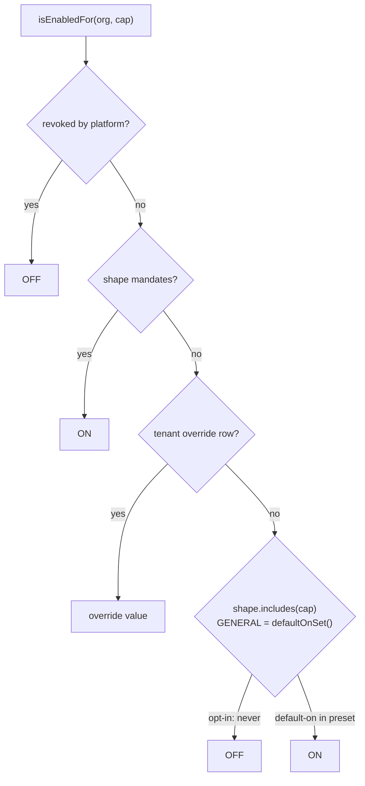
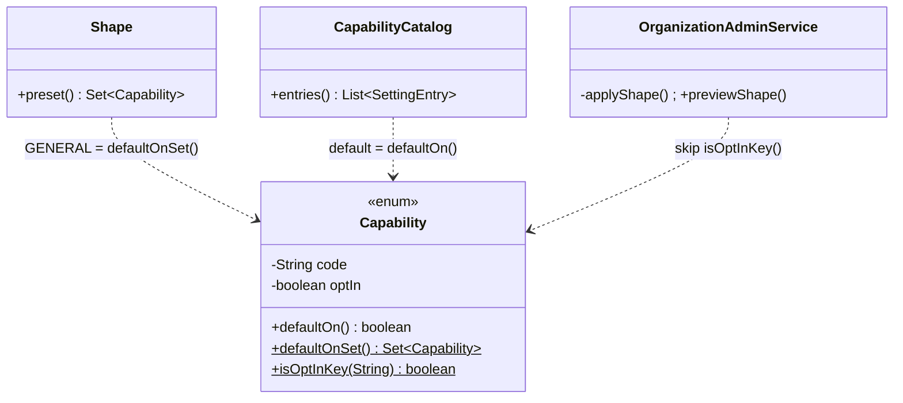

# EX-0a — Opt-in capabilities (default OFF) + `EXPENSE_MANAGEMENT`

**Status:** IMPLEMENTED, unit-green (common-settings 69/0/0 skipped; auth 72/0/0; ShapeChangeKeepsOptInTest seen RED without the fix first). Cypress gate written, waiting for deploy. Branch `feature/expense-management`.
Programme: [`../expense-management-design.md`](../expense-management-design.md) §6.4. Rulings R2, R2b, R-2 (FREE).

## 1. Document

The platform can only express capabilities that are **ON unless an owner turns them off**: `CapabilityCatalog`
hard-codes `true` (`:64`) and the GENERAL shape presets `allOf` (`Shape:42`). That was the right migration
strategy for the 15 capabilities that described what tenants already had. It is wrong for a **new module**:
shipping Expense Management default-ON would put a new menu, a new screen and new ledger postings in front of
every tenant on the deploy.

Ruling R2b: capabilities must support **default OFF** as a platform mechanism. This slice adds it and the first
capability that uses it, `EXPENSE_MANAGEMENT` (`expenseManagement`).

### Two defects this slice must not create (found by the trace)

1. **A business-type change would switch the module off.** `OrganizationAdminService.applyShape` deletes
   **every** `org.cap.*` override (`findByOrganizationIdAndSettingKeyStartingWith("org.cap.")`). No shape presets
   an opt-in module, so a tenant that turned Expenses on and later changes type would lose the screen with its
   financial records — silently.
2. **Most tenants could never switch it on.** `Plan.FREE` is an allowlist and every pre-E1 tenant sits on FREE
   by accident (`@Builder.Default`). A new capability is excluded from FREE by construction, so the write guard
   would answer "not included in your current plan" (the RST-R2a incident).

## 1b. Standards

| Dimension | Rule |
|---|---|
| Business / domain | An opt-in **module** is a decision the owner makes once; it is not a property of the kind of business. So no shape presets it and no shape change touches it |
| SaaS multi-tenancy | Unchanged resolution order — revoked > shape floor > override > preset. Opt-in only changes the preset and the catalog default |
| Live-modules rule | Every existing capability keeps `defaultOn = true` → **zero behaviour change** for the 15; the new one is OFF everywhere on deploy. No migration |
| Microservice boundaries | All in `common-settings` (the shared rule) + auth-service (the owner of capability writes). No service reads a new column |
| Design patterns | **Policy object** (`Capability` carries its own default) instead of a list of exceptions maintained elsewhere — one place, cannot drift between the catalog, the preset and the shape-change code |
| SOLID / DRY | `Capability.defaultOnSet()` used by `Shape.GENERAL`; `Capability.isOptIn(settingKey)` used by auth's shape change. No duplicated lists |
| Testing | Unit: the migration promise restated precisely (every non-opt-in ON, every opt-in OFF); no shape presets an opt-in; shape change keeps opt-in overrides and the preview never lists them; FREE includes it. Cypress gate below |

## 2. Design

| Change | File | What |
|---|---|---|
| D1 | `Capability.java` | `optIn` flag (3-arg constructor = false); `defaultOn()`, `defaultOnSet()`, `isOptInKey(String)`; new value `EXPENSE_MANAGEMENT("expenseManagement", …, optIn=true)`; Javadoc "default ON" → "the default preserves today's behaviour" |
| D2 | `CapabilityCatalog.java` | catalog default = `c.defaultOn()` |
| D3 | `Shape.java` | `GENERAL` preset = `Capability.defaultOnSet()` |
| D4 | `Plan.java` | `FREE` includes `EXPENSE_MANAGEMENT` (R-2) |
| D5 | `OrganizationAdminService.applyShape` | clear only overrides that are **not** opt-in; the memento records the same list |
| D6 | `OrganizationAdminService.previewShape` | skip opt-in capabilities (a shape change never turns them on or off) |

Not changed, deliberately: `Plan.TRIAL/DEMO/PRO` (`allOf` = "may have", a ceiling, not a default);
`CapabilityService.enabledMapFor` / `encodeFor` (they iterate and resolve — an OFF opt-in simply does not appear
in the JWT `caps` claim, which is the correct wire form); `EntitlementService.forOrganization` (operator view
iterates and reports `enabled` via the same resolver — correct as is).





```mermaid
sequenceDiagram
  actor O as Owner
  participant UI as Configuration screen
  participant A as auth-service
  O->>UI: switch "Expense management" ON
  UI->>A: POST /settings org.cap.expenseManagement=true
  A->>A: EntitlementWriteGuard: grantable? (FREE includes it)
  A-->>UI: success
  O->>UI: later: change business type to Pharmacy
  UI->>A: changeOwnShape(pharmacy)
  A->>A: clear org.cap.* EXCEPT opt-in keys; memento
  A-->>UI: expenseManagement still ON
```

## 3. Implement

- [x] D1–D4 common-settings
- [x] D5–D6 auth-service
- [x] unit tests updated + new (§4)
- [x] `capability-shapes.cy.js` case 1 restated (opt-in excluded from "everything on")
- [x] new gate `cypress/e2e/expense/ex-0a-capability-opt-in.cy.js` (run pending deploy)
- [x] shape-change dialog text says opt-in modules are kept (6 languages)
- [ ] build `common-settings` → `install`, then auth-service + every service that resolves capabilities picks up the jar (memory: stale ~/.m2 contract → old jar runs)

## 4. Test

**Unit (`mvn test`)**
- common-settings: every capability with `defaultOn()` is ON for an unconfigured tenant; every opt-in is OFF;
  explicit ON for an opt-in is honoured; no `Shape` preset contains an opt-in; the catalog publishes each
  capability with default = `defaultOn()`; FREE includes `EXPENSE_MANAGEMENT`; `isOptInKey` true only for
  `org.cap.expenseManagement`.
- auth: `applyShape` keeps the `org.cap.expenseManagement` override and clears the others; `previewShape`
  never lists Expense management.

**Cypress gate** `cypress/e2e/expense/ex-0a-capability-opt-in.cy.js` (headed), owner.mobile@ (retail, a real
seeded tenant), `after()` restores OFF:

| # | Case | Regression it catches |
|---|---|---|
| 1 | Unconfigured tenant: `expenseManagement` false, while installments (preset ON) is true | the opt-in leaking ON via GENERAL / the catalog |
| 2 | The Configuration screen shows the **Expense management** switch, **unchecked** | shipped unreachable (no switch) |
| 3 | Owner switches it ON through the screen → `/getCapabilities` says true | the write path refusing it (FREE allowlist) |
| 4 | Owner changes business type retail → pharmacy → retail: still ON | shape change silently deleting the module |
| 5 | Operator entitlement view for this tenant: `expenseManagement` `inPlan` true | FREE plan excluding it |

Manual (Test Book + published page): §EX-0a steps for owner of every business type.

Test guide (published): https://claude.ai/artifact/WyTiq6t4bNH4UBG3CJ9337
