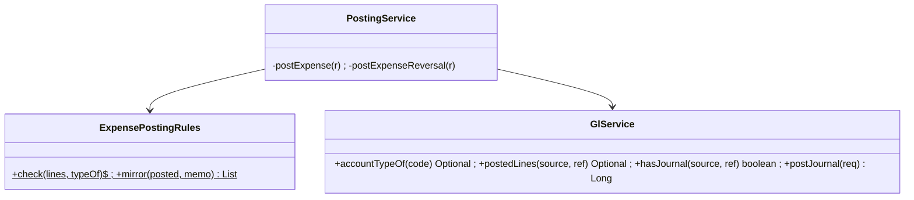

# EX-0b — finance-service: `EXPENSE` / `EXPENSE_REVERSAL` events + expense accounts

**Status:** IMPLEMENTED, unit-green (finance 49/49, 0 skipped; Flyway V8 executed on a MySQL container).
Deploy + live gate run together with EX-1, which is its first caller. Branch `feature/expense-management`.
Programme: [`../expense-management-design.md`](../expense-management-design.md) §5.5–5.6.

## 1. Document

The ledger cannot accept an operating expense. `PostEventRequest` carries document totals and finance picks the
accounts from fixed constants, so an expense — whose debit account is the **tenant's own category mapping**
("Fuel" → 6200 for one shop, 6310 for another) — has no way in. The default chart also has a single expense
account (`5100 Purchases / Expenses`), so even a manual journal cannot separate rent from fuel.

## 1b. Standards

| Dimension | Rule |
|---|---|
| Business / domain | Purchase ≠ expense. The ledger refuses an expense that debits a non-`EXPENSE` account (e.g. `1200 Inventory`) or `5000 COGS`, and one paid from anywhere but cash, bank, AP, reimbursement payable or advance. A void is a **reversing journal**, never an edit or delete, dated the day of the void |
| SaaS multi-tenancy | Accounts resolved per org (`findByOrganizationIdAndCode`); journal lookup scoped by org |
| Live-modules rule | Additive: two new event types, nine new default accounts back-filled lazily by `ensureDefaults()`, one non-unique index. No existing event changes. Dev: **0** tenant accounts on the new codes (checked) |
| Microservice boundaries | finance stays the **only** writer of journals and the **authority** on what is allowed; callers choose accounts only within those rules |
| Design patterns | **Idempotent consumer** (existing `gl_processed_event`); **Specification/rules object** (`ExpensePostingRules`, pure); **Reversal by mirror of the posted journal** (never caller-supplied lines) |
| SOLID / DRY | Balance stays in `GlService.validate`; period lock stays in `postJournal`; the new code adds only what is expense-specific |
| Testing | `ExpensePostingRulesTest` (12): allowed cases, the inventory boundary, COGS, income, odd credit, unknown account, both sides required, mirror nets to zero and balances, mirror keeps account id |

## 2. Design

| # | Change | File |
|---|---|---|
| 1 | `lines` on `PostEventRequest` (EXPENSE only; ⚠ never from a field-by-field outbox) | `dto/PostEventRequest.java` |
| 2 | dispatch `EXPENSE` → `postExpense`, `EXPENSE_REVERSAL` → `postExpenseReversal` | `PostingService.java` |
| 3 | `ExpensePostingRules.check` + `mirror` | new `ExpensePostingRules.java` |
| 4 | `accountTypeOf`, `postedLines`, `hasJournal` | `GlService.java` |
| 5 | `findFirstBy…SourceAndSourceRef`, `existsBy…` | `JournalEntryRepository.java` |
| 6 | default accounts 1300, 2300, 6000–6900 | `GlService.DEFAULT_COA` |
| 7 | `idx_je_org_source_ref` | `V8__journal_source_ref_index.sql` |

Event contract:

```json
{ "eventType": "EXPENSE", "eventKey": "EXP-<org>-<voucherId>-POST", "date": "2026-10-02", "ref": "EXP-000001",
  "lines": [ {"accountCode":"6000","debit":25000.00,"lineMemo":"Rent · Main"},
             {"accountCode":"1000","credit":25000.00,"lineMemo":"Cash"} ] }
{ "eventType": "EXPENSE_REVERSAL", "eventKey": "EXP-<org>-<voucherId>-VOID", "date": "2026-10-05", "ref": "EXP-000001" }
```

New default accounts: `1300 Employee Advances` (asset) · `2300 Employee Reimbursements Payable` (liability) ·
`6000 Rent` · `6100 Utilities` · `6200 Fuel and Transport` · `6300 Repairs and Maintenance` · `6400 Marketing` ·
`6500 Bank Charges` · `6600 Office and Supplies` · `6900 Other Operating Expenses` (all EXPENSE).

```mermaid
sequenceDiagram
  participant E as expense-service outbox
  participant G as GlController /gl/post-event
  participant P as PostingService
  participant R as ExpensePostingRules
  participant L as GlService
  E->>G: EXPENSE (eventKey, ref, lines)
  G->>P: postEvent
  P->>P: ensureDefaults; claim eventKey (duplicate → return)
  P->>L: hasJournal(EXPENSE, ref)?
  alt already posted
    P-->>E: 4xx "already posted"
  end
  P->>R: check(lines, accountTypeOf)
  alt Dr 1200 / Dr 5000 / odd credit / unknown account
    R-->>E: 4xx with the reason
  end
  P->>L: postJournal (validate balance, period lock)
  E->>G: EXPENSE_REVERSAL (ref)
  P->>L: postedLines(EXPENSE, ref) → mirror → postJournal(date = void date)
```



## 3. Implement

- [x] 1–7 above
- [x] `ExpensePostingRulesTest` 12/12; finance suite 49/49, 0 skipped
- [x] Flyway V8 executed on a MySQL container (`ReceiptSeqMigrationTest` migrates to latest)
- [ ] **Prod pre-flight before deploy:** `SELECT organization_id, code, type FROM accounts WHERE code IN
      ('1300','2300') OR code LIKE '6%';` — a tenant row on one of these codes keeps its own name/type; if its
      type is not EXPENSE, the default categories mapped to that code would be refused (loud, not silent)
- [ ] deployed with EX-1

## 4. Test

Unit as above. Live (in the EX-1 gate): post a voucher → trial balance shows Dr 6000 / Cr 1000 by exactly the
amount and stays balanced; void → both accounts back to their prior balance; a category mapped to 1200 is
refused with the boundary message; posting the same voucher twice changes nothing.

Known limit: two deliveries of the same voucher under **different** event keys, at the same instant, could both
pass `hasJournal`. expense-service sends one deterministic key per voucher and action, so the unique
`gl_processed_event` row serialises them. Recorded, not hidden.
