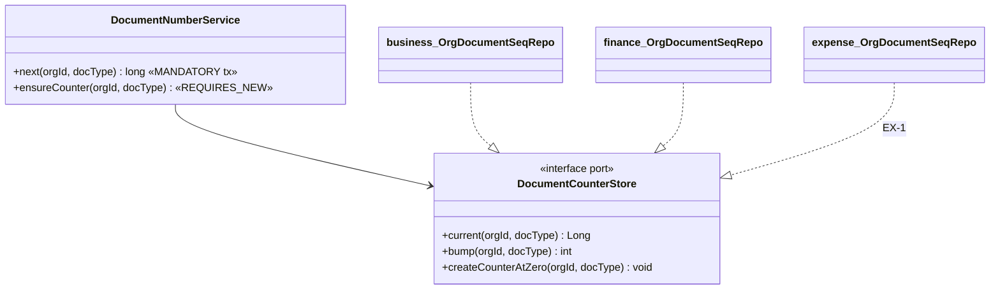

# EX-0c — `common-docnum`: one per-org document-number allocator

**Status:** IMPLEMENTED + tested (ruling R-7 = yes, 2026-10-02). finance DEPLOYED; business-service code done but NOT deployed — another session has uncommitted DR-1 work in business-service that a build would ship. Branch `feature/expense-management`.
Programme: [`../expense-management-design.md`](../expense-management-design.md) §9 R-7.

## 1. Document

Per-org gap-free document numbers (INV-, QTE-, CRN-, RCPT-, PV-…) are allocated by `DocumentNumberService`,
and it exists **twice**: business-service (DOC-INT/V45) and finance-service (V7). The two are the same
three-step algorithm, with the same three native statements, written once and then copied — and the
algorithm is the hard-won part: its comments record **two earlier shapes that broke** (a deadlock, then a
50-second gap-lock timeout on every tenant's first document). EX-1's `expense-service` needs a third copy for
`EXP-` numbers. A third copy is the DRY failure the standards name: the next fix lands in one copy and not the
others.

## 1b. Standards

| Dimension | Rule |
|---|---|
| Business / domain | Fiscal document numbers are per-tenant, gap-free across rollbacks, never re-issued. Unchanged — this slice moves code, not behaviour |
| SaaS multi-tenancy | Counter keyed `(organization_id, doc_type)`; each service keeps its OWN table in its own database |
| Live-modules rule | **No SQL change, no schema change, no migration.** The three statements stay in each service's repository, byte for byte |
| Microservice boundaries | Library, not service: the RULE is shared, the DATA stays local (decision rule: a service only when it owns data + lifecycle + integration) |
| Design patterns | **Ports & Adapters / SPI** — `DocumentCounterStore` port; each service's existing `OrgDocumentSeqRepo` IS the adapter (it already has exactly these three methods). Same shape as `common-credit`'s `CreditStore` |
| SOLID / DRY | One algorithm, three consumers. Business doc-type names move to a business-owned `DocType` holder — the library knows no vertical's documents |
| Testing | Library unit test pins the call ORDER (read → create-if-missing → bump → read) and both refusals. Existing gates unchanged and re-run: business `OrgDocumentSeqConcurrencyTest`, finance `ReceiptNumberConcurrencyTest` (real MySQL, concurrent tills), `PaymentServiceNumberingTest`, plus the business sale/quote/credit-note Cypress that print numbers |

## 2. Design

- `common-docnum` (new module, no `@Entity`): `DocumentCounterStore`, `DocumentNumberService` (algorithm and
  comments moved verbatim), `CommonDocnumAutoConfiguration` (unconditional `@Bean @ConditionalOnMissingBean`;
  the store is resolved lazily so bean ordering against JPA repositories cannot matter — a service with no
  store fails on first call with a clear message).
- business: repo `extends JpaRepository<…>, DocumentCounterStore`; local service deleted; constants →
  `service/DocType.java`; 8 call sites in 7 classes re-pointed.
- finance: repo extends the port; local service deleted; `PaymentService` + 3 tests re-pointed.

RULE 0 count: runtime users of `org_document_seq` = **2 repositories × 3 statements**, both re-pointed, SQL
unchanged. Migrations V45/V46/V63 (business) and V7 (finance) seed the table and are untouched. Callers =
**9** (business 8 in 7 classes, finance 1). Tests touching the class = **4** (1 imports it, 2 mock it, 1 mirrors its SQL).

## 3. Implement

- [x] module + parent `<module>` + business/finance pom dependency
- [x] port, service, auto-config, imports file; unit test
- [x] business: repo, DocType, 8 call sites, delete local service
- [x] finance: repo, PaymentService, tests, delete local service
- [x] build + unit/integration tests (docnum 6, business 368, finance 49; Skipped 0; both MySQL concurrency tests ran). finance redeployed; live: receive-payment 2/2, document-number-integrity 8/8 incl. six concurrent receipts → six distinct numbers. pay-vendor 0/1 = INHERITED STATE (org 6 Purchase tax ON at 10% since 2026-10-01 18:55 UTC, before this session; due 110 is correct) — not this slice. Business redeploy + its number specs PENDING.
- [ ]  (Skipped: 0); redeploy business + finance; Cypress number-printing specs

## 4. Test

Unit `DocumentNumberServiceTest` (common-docnum). Integration: the two existing real-MySQL concurrency tests
must stay green unchanged except imports. Cypress (deployed): a sale, a quote and a credit note still number
in sequence for the tenant (existing `doc-int`/`quote-document` specs).
