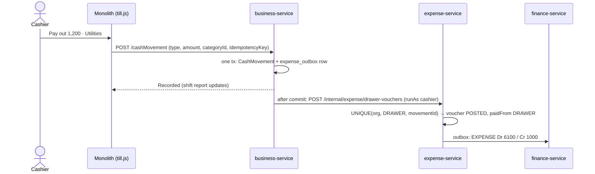

# EX-3 — Till pay-outs reach the books

**Status:** DESIGN + gate written first → implementing. Branch `feature/expense-management`.
Programme: [`../expense-management-design.md`](../expense-management-design.md) §4b F1, §7 EX-3. Ruling R3 (drawer
pay-outs converge onto Expense Management).

## 1. Document
A cashier pays the electricity man 1,200 out of the drawer: **Till → Cash Drawer → Pay out**. Today that writes a
`CashMovement PAY_OUT` with a free-text reason. The shift report subtracts it from expected cash — and nothing else
happens. **The ledger never hears of it**: GL `1000 Cash` stays 1,200 too high and the P&L 1,200 too profitable
(F1, found by the EX programme review). Every shop that pays anything out of the till has books that disagree
with its drawer.

Second defect found by this slice's review: **`/cashMovement` has no duplicate protection.** A double click records
two pay-outs; once pay-outs post to the books, that is two expenses.

## 1b. Standards
| Dimension | Rule |
|---|---|
| Business | The drawer is the source of truth for cash in the shift; the expense is how the ledger learns of it. Pay-out = Dr the category's expense account / Cr **1000 Cash**. A drawer expense is **not voidable from Expenses** — the cash really left the till; a mistake is corrected at the till (a pay-in), so drawer and books cannot disagree |
| Live modules | Capability **OFF → exactly today's behaviour** (no category asked, nothing posted). ON → a pay-out needs a category. PAY_IN and DROP never become expenses. **No back-posting** of past pay-outs (R-4) |
| Tenancy | Org/user from the token; the voucher is created under the cashier's identity, store = the shift's store |
| Boundaries | business-service owns the drawer; expense-service owns the expense; finance owns the journal. business never posts to finance for this — it tells expense-service, which posts like any other expense |
| Patterns | **Transactional outbox** in business (movement + outbox row in ONE transaction; delivery after commit, retried) · **Idempotent receiver** in expense-service: UNIQUE `(organization_id, source, source_ref)` with source `DRAWER`, ref = movement id — a redelivery returns the first voucher · **Idempotency-Key** on `/cashMovement` (UNIQUE `(organization_id, idempotency_key)`) · `PaidFrom` strategy gains `DRAWER → 1000` |
| Security | Receiver at **`/internal/expense/drawer-vouchers`** — no gateway route matches `/internal/**` (BLK-0 pattern), internal secret required. The capability is checked in business **where the cash moved**; a background redelivery carries no capability claim, so the receiver does not re-check it |
| Performance | One outbox row per pay-out; the remote call is after commit, never inside the till transaction |
| Testing | Unit: DRAWER posting lines, idempotent receive, void refused; Cypress: pay-out with module ON → trial balance (6100 Dr, 1000 Cr) + shift report unchanged; OFF → no expense; double submit → one movement, one voucher; Expenses list shows the pay-out marked "Till" and offers no Void |

## 2. Design
- **contracts**: `DrawerExpenseRequest{movementId, categoryId, amount, date, storeId, reason}`, `ExpenseClient`
  (`@PostExchange("/internal/expense/drawer-vouchers")` → `VoucherRef{id, voucherNo}`).
- **expense-service V3**: `expense_voucher.source VARCHAR(16) NOT NULL DEFAULT 'MANUAL'`, `source_ref VARCHAR(64)`,
  UNIQUE `(organization_id, source, source_ref)`. `InternalExpenseController` → `ExpenseVoucherService.recordFromDrawer`
  (replay by source ref; POSTED at once; `paidFrom=DRAWER`). `voidVoucher` refuses `source=DRAWER`.
- **business-service V7x**: `cash_movement.category_id BIGINT`, `idempotency_key VARCHAR(80)` + UNIQUE
  `(organization_id, idempotency_key)`, `expense_voucher_no VARCHAR(20)`; `expense_outbox` (payload JSON — never
  field-by-field). `ShiftService.addCashMovement(type, amount, reason, categoryId, key, …)`: replay by key; PAY_OUT +
  module ON → category required → enqueue. Relay stamps `expense_voucher_no` on the movement when delivered.
- **monolith**: `/cashMovement` proxy passes `categoryId` + `idempotencyKey`; till form shows **Category** for a pay-out
  when the module is on (`[data-capability="expenseManagement"]`); Expenses list shows source "Till".

## 4. Gate (written first) — `cypress/e2e/expense/ex-3-till-pay-outs.cy.js`
1. OFF: a pay-out records as today, no category needed, no expense created.
2. ON: pay-out without a category → refused.
3. ON: pay-out 1,200 Utilities → shift report pay-outs +1,200; an EXP- voucher with source DRAWER; trial balance 6100
   +1,200 and 1000 −1,200.
4. The same Idempotency-Key twice → one movement, one voucher.
5. Void of that voucher → refused ("correct it at the till").
6. UI: Till shows the Category picker for Pay out only when the module is on.
