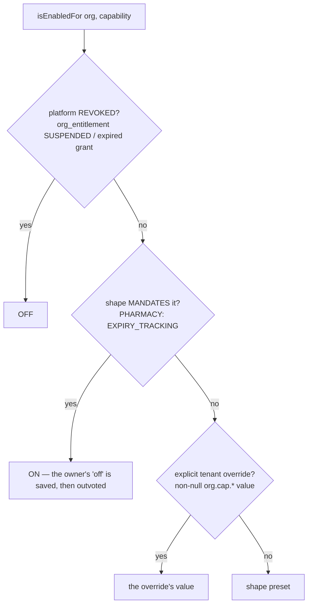
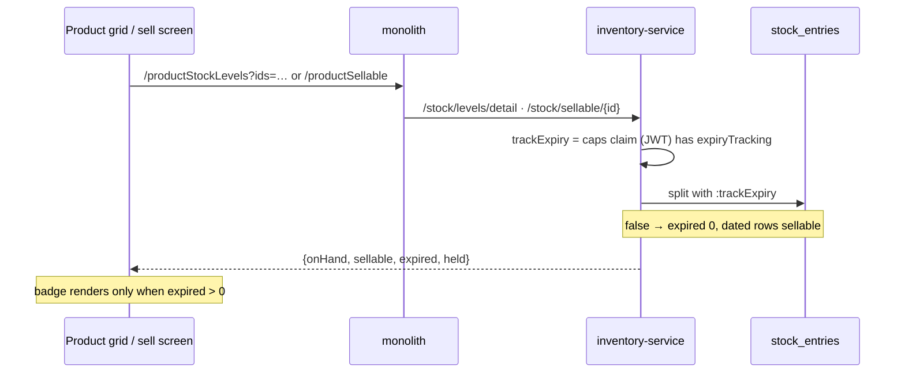

# EXP-1 — `org.cap.expiryTracking` decides whether dated stock is a thing at all

**Status 2026-09-16: ✅ GATED GREEN.** `expiry-tracking-capability.cy.js` 5/5 headed · common-settings 46/46 ·
inventory-service 64/64 (0 skipped, Testcontainers ran) · deployed (auth-service 16:47, inventory-service 16:48).
**NOT COMMITTED.** Option **(b)** chosen by the user.

## 1. The request

> "If `org.cap.expiryTracking` is off, do not show the 'N expired' label on the product datatable's on-hand column."

Right instinct. The review showed that hiding **only the label** would have made the screen lie.

## 2. The review — 8 places act on expiry; exactly 1 consulted the capability

| # | Place | Gated before EXP-1? |
|---|---|---|
| 1 | `catalog-products.js:1404` — grid badge | no |
| 2 | `business.js:2984` — sell screen's identical badge | no |
| 3 | `StockService.getLevelDetail` — `{onHand, sellable, expired, held}` | no |
| 4 | `sellableExpiredByScope(AndIds)` — SQL split on `expiryDate < today` | no |
| 5 | `findForFefo` — **the allocator**: what a sale may reserve (G1) | no |
| 6 | `availableByOrg` — storefront availability | no |
| 7 | business-service `StockController:79` — batch pre-fill | **yes** |
| 8 | purchase expiry field, Quarantine, Pharmacy Alerts menus | client-side hide only |

The column shows **sellable**, and sellable subtracted expired stock. The badge was the only explanation for a
number lower than the shelf. Hide it and a product reads `0` with no reason, while the allocator still refuses it at
the till.

## 3. Live data that confirmed the report

| org | shape / capability | expired entries | units |
|---|---|---|---|
| 6 | none → `GENERAL` → tracking **on** | 438 | 1,200.50 — badge correct |
| 15 | none → `GENERAL` → **on** | 3 | 290.00 — badge correct |
| 41 | `org.cap.expiryTracking = false` → **off** | 3 | 0 |
| **44** | `retail` (no expiry in preset) **+ operator SUSPENDED** → **off** | 5 | **5 — shown "5 expired" for a concept it does not use** |

## 4. Design

Capability **off** → expiry is not applicable to that tenant: `expired = 0`, dated stock counts as sellable, the
allocator does not exclude it. The badge then stops rendering **by itself** (it draws only when `expired > 0`), and
the number beside it stops shrinking at the same moment. **No browser code changed** — the sign the fix is in the
right layer.

Plus a **floor**, because the capability now decides what may be *sold*: a pharmacy switching expiry tracking off
would otherwise start dispensing expired medicine, with every screen reporting it as ordinary stock.

**Resolution order:** `revoked (platform) > shape floor > tenant override > shape preset`.
The floor is **below** the ceiling on purpose: it answers "may this tenant choose otherwise", never "may this tenant
have it at all". An operator's suspension must not be quietly handed back by a preset.

## 5. What changed

| File | Change |
|---|---|
| `common-settings/Shape.java` | `mandatory` set + `mandates()`; `PHARMACY` floors `EXPIRY_TRACKING` (only — `BATCH_TRACKING` and `RX_REQUIRED` stay optional) |
| `common-settings/CapabilityService.java` | floor applied after the ceiling, before the override |
| `inventory/StockEntryRepository.java` | `:trackExpiry` on 4 queries: both splits, `findForFefo`, `availableByOrg` |
| `inventory/StockService.java` | grid split, single-product split, FEFO batch list read the capability |
| `inventory/ReservationService.java` | both allocator call sites read the capability |
| `inventory/PublicStockController.java` | passes `true` explicitly — see §7 |

## 6. Tests

**Unit** — `CapabilityServiceTest` 15 → 19: pharmacy cannot disable expiry · the floor is not blanket (RX, batch
stay choosable) · retail resolves off by preset · **a revoked capability beats the floor**.
**Repository, real MySQL** — `ReservationServiceTest` 11 → 13: `findForFefo` excludes a dated batch with tracking
on and returns it with tracking off · the split reports 100 expired / 0 sellable on, 0 / 100 off.

**Gate** — `cypress/e2e/business/expiry-tracking-capability.cy.js`, fixture `owner.pesticide@` (org 45):

| # | Case | Result |
|---|---|---|
| 1 ⭐⭐ | tracking ON: 7 expired / 0 sellable, and the grid cell shows "7 expired" (positive control) | ✅ |
| 2 ⭐⭐ | tracking OFF: 0 expired / 7 sellable, **no** "expired" in the cell, full shelf figure shown | ✅ |
| 3 ⭐⭐ | tracking OFF: the till's `/productSellable` agrees with the grid | ✅ |
| 4 ⭐⭐ | pharmacy saves "off" → reads back **on**, and stock is expired again | ✅ |
| 5 ⭐ | pharmacy may still switch `rxRequired` off | ✅ |

Org 45's `org.shape`, `org.cap.expiryTracking`, `org.cap.rxRequired` verified **identical before and after** from
MySQL — the snapshot/restore works, and the restore treats a NULL-valued row as absent (restoring it as the string
`"null"` would switch it off).

⚠ **Not proven by the gate, stated:** that a UI *sale* of dated stock completes. The allocator half is proven at the
repository level against real MySQL (§6 unit), which is where the predicate lives.

## 7. Known limits and traps

- **Fixture eligibility.** The obvious fixture, `owner.mobile@`, is org 44 — and an operator has **suspended**
  `expiryTracking`, `batchTracking` and `fefoAllocation` there. It went red 3/5: the write guard refused ON, and the
  floor correctly refused to override a suspension. The product was right both times.
- **The storefront keeps excluding dated stock.** `/api/inventory/public/availability` is anonymous: no JWT, no caps
  claim, and inventory holds none of the 61 `org.cap/org.shape` rows (auth does). It passes `true` — it may offer
  *less* than the till sells, never more.
- **Capabilities are baked in at token mint.** The owner who saves the setting is re-minted immediately (C3c); other
  devices pick it up on their next refresh, up to 15 minutes.
- **Nothing is backfilled.** Expiry dates already on rows stay there; switching tracking back on makes them count
  again. That is deliberate — the dates are data, and the capability decides what they mean.
- The shape floor now exists as a mechanism. Adding a floor to another shape is a one-line decision, but it is a
  decision: it removes a choice from every tenant of that shape.
