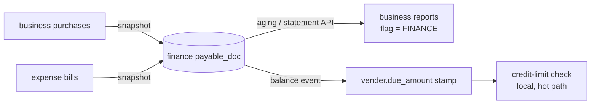

# FP-4 — supplier reads served from finance (per tenant, reversible)

**Status:** REVIEW done → awaiting rulings (§5). Programme: [`../finance-payables-subledger-design.md`](../finance-payables-subledger-design.md).
Follows FP-3 (`d46ec827`).

## 1. Document
Today every supplier figure a shop reads (aging, statement, statement CSV, the supplier balance on the purchase
screen, the credit-limit check, the customer↔supplier position) comes from business-service and knows only
purchases. Since FP-3, expense bills are owed to the same suppliers but appear on none of these. FP-4 serves these
reads from finance's one payables subledger, behind a per-tenant switch (`finance.payables.source = BUSINESS |
FINANCE`), so purchases and bills are one balance — and flipping back restores today's path.

## 1c. RULE 0 trace — what the readers need vs what finance holds
| Reader | Needs | finance `payable_doc` today | Gap |
|---|---|---|---|
| R1 aging (`vendorAging`) | open per bill, aged by date, **USER sees own** (`findOpenBillsScoped`) | open per doc, `doc_date`; **no user_id** | **G3** visibility |
| R2/R3 statement + CSV | bill **as issued (gross)** + **debit-note** credit lines + payments | `amount` = remaining gross **after** returns (return writer `PurchaseService:816-832` shrinks `totalAmount` and refunds `paid`); **no debit notes** | **G1** — a finance statement would show a smaller bill and no debit note: same closing balance, a different trail than the supplier's own |
| bills' due date | expense bill `due_date` | **no due_date column** | **G2** aging by due date impossible |
| R4 supplier list / purchase dropdown `data-due` | `vender.due_amount` (stamped by `recomputePayable`) | — | **G4** needs a finance→business stamp event (new outbox in finance) |
| R5 credit-limit check (purchase hot path) | same stamped `due_amount` — must stay local (no sync call) | — | G4 + **decision**: do bills count toward the limit? |
| R6 customer↔supplier position (DR-2) | supplier side = `due_amount` | — | follows R4 |
| Advances | business floors each supplier at 0 | finance computes them (org 6: 9,620; org 41: 25,200) | **decision** how to show |

Counts: 6 readers switch (R1–R6); 2 stay in business until FP-5 (R7 FIFO open bills, R8 sum — settlement).
Writers unchanged in FP-4.

## 2. Proposed shape (slices)
- **FP-4a — finance learns what the reads need.** V11: `payable_doc` + `issued_amount`, `due_date`, `user_id`;
  debit notes as their own documents (source `PURCHASE_RETURN`, negative open) so a statement reads like today's;
  business and expense snapshots carry them; backfill re-runs once per tenant (marker v2). Gate: per tenant, a
  finance-built statement = today's statement line-for-line, for the purchase-only tenants.
- **FP-4b — the switch for reports.** `GET /api/finance/payables/aging|statement` (scoped like today); business's
  aging/statement/CSV ask finance when the tenant's flag is FINANCE, else today's code. Gate: flag on = flag off
  figures for purchases, plus bills.
- **FP-4c — the stamped balance.** finance emits `PAYABLE_BALANCE_CHANGED(org, party, net)` (outbox) → business
  stamps `vender.due_amount` when the flag is FINANCE → R4/R5/R6 unchanged in code, now including bills.

## 5. Rulings needed
See the questions asked 2026-10-03 (advances, bills in the credit limit, slice order, who flips the switch).
