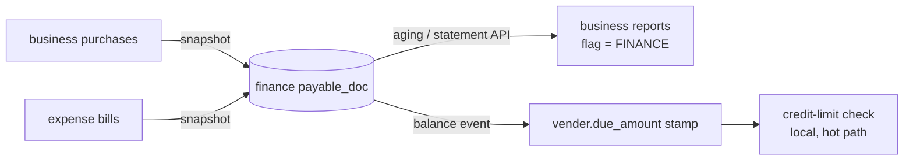

# FP-4 — supplier reads served from finance (per tenant, reversible)

**Status:** FP-4b GREEN 2026-10-03, STAGED (gate 4/4 + regressions 38/38 headed; finance 66; business 405 with 1 foreign error in DR-4 PartyRoleServiceTest; business V74 live; org 13 left on BUSINESS). NEXT FP-4c. FP-4a GREEN 2026-10-03, STAGED (gate 4/4 + regressions 17/17 headed; finance 65, expense 26, business 399 + 1 foreign error in DR-4's PartyRoleServiceTest). Live: finance V11, business V73, expense V5; generation-2 backfill reached every tenant — 813 purchase docs all with issued amount, 43/43 debit notes, 10 bills re-sent. NEXT FP-4b. Programme: [`../finance-payables-subledger-design.md`](../finance-payables-subledger-design.md).
Follows FP-3 (`d46ec827`).

## 1. Document
Today every supplier figure a shop reads (aging, statement, statement CSV, the supplier balance on the purchase
screen, the credit-limit check, the customer↔supplier position) comes from business-service and knows only
purchases. Since FP-3, expense bills are owed to the same suppliers but appear on none of these. FP-4 serves these
reads from finance's one payables subledger, behind a per-tenant switch (`finance.payables.source = BUSINESS |
FINANCE`), so purchases and bills are one balance — and flipping back restores today's path.

## 1c. RULE 0 trace — what the readers need vs what finance holds
| Reader | Needs | finance `payable_doc` today | Gap |
|---|---|---|---|
| R1 aging (`vendorAging`) | open per bill, aged by purchase date, org-wide (`findOpenBillsScoped`: org match; user only for legacy NULL-org rows) | open per doc, `doc_date`, org | none (G3 retracted — verified the scope clause) |
| R2/R3 statement + CSV | bill **as issued (gross)** + **debit-note** credit lines + payments | `amount` = remaining gross **after** returns (return writer `PurchaseService:816-832` shrinks `totalAmount` and refunds `paid`); **no debit notes** | **G1** — a finance statement would show a smaller bill and no debit note: same closing balance, a different trail than the supplier's own |
| bills' due date | expense bill `due_date` | **no due_date column** | **G2** aging by due date impossible |
| R4 supplier list / purchase dropdown `data-due` | `vender.due_amount` (stamped by `recomputePayable`) | — | **G4** needs a finance→business stamp event (new outbox in finance) |
| R5 credit-limit check (purchase hot path) | same stamped `due_amount` — must stay local (no sync call) | — | G4 + **decision**: do bills count toward the limit? |
| R6 customer↔supplier position (DR-2) | supplier side = `due_amount` | — | follows R4 |
| Advances | business floors each supplier at 0 | finance computes them (org 6: 9,620; org 41: 25,200) | **decision** how to show |

Counts: 6 readers switch (R1–R6); 2 stay in business until FP-5 (R7 FIFO open bills, R8 sum — settlement).
Writers unchanged in FP-4.

## 2. Proposed shape (slices)
- **FP-4a — finance learns what the reads need.** V11: `payable_doc` + `issued_amount`, `due_date`, `user_id`;
  debit notes as their own documents (source `PURCHASE_RETURN`, negative open) so a statement reads like today's;
  business and expense snapshots carry them; backfill re-runs once per tenant (marker v2). Gate: per tenant, a
  finance-built statement = today's statement line-for-line, for the purchase-only tenants.
- **FP-4b — the switch for reports.** `GET /api/finance/payables/aging|statement` (scoped like today); business's
  aging/statement/CSV ask finance when the tenant's flag is FINANCE, else today's code. Gate: flag on = flag off
  figures for purchases, plus bills.
- **FP-4c — the stamped balance.** finance emits `PAYABLE_BALANCE_CHANGED(org, party, net)` (outbox) → business
  stamps `vender.due_amount` when the flag is FINANCE → R4/R5/R6 unchanged in code, now including bills.

## 3. FP-4a design — finance holds the statement trail
Data facts (dev, 2026-10-03): 43 debit notes, **0** without a purchase, **0** whose supplier differs from their
purchase's, 3 on cash purchases (no supplier — excluded on both sides). So debit notes attach per purchase, losslessly.
A void is a full return + VOID stamp: its statement shows the bill and an equal debit note (nets 0) — mirrored as is.

- **contracts** `PayableSnapshot` + `issuedAmount`, `dueDate`, `notes: List<PayableNote{noteNo, noteDate, amount}>`
  (null = "not sent", leave notes as they are; empty = "none").
- **finance V11**: `payable_doc` + `issued_amount DECIMAL(19,2) NULL`, `due_date DATE NULL`; `payable_note`
  (org, payable_doc_id, note_no, note_date, amount) — a statement trail, NOT read by any balance query (open/net/
  reconciliation stay on `payable_doc`, so no existing reader changes: 5 readers checked — sumOpen, netBySupplier,
  netBySourceAndSupplier, findOpen, reconciliation). Upsert replaces a doc's notes under the same version guard.
  `GET /api/finance/payables/statement?partyType&partyId[&sources=PURCHASE]` — BILL = issued (fallback amount), DEBIT_NOTE
  credits, PAYMENT credits from the payment ledger (`findByPartyScoped`, same id-desc order; DR-4 set-off naming), built by
  the SAME `common-subledger StatementBuilder` business uses. `sources=PURCHASE` = business's view (reconciliation use).
- **business V73**: `payable_outbox.payload` 2000 → 8000 (notes ride in it); `payable_backfill.generation` (default 1);
  the backfill re-runs every tenant below generation 2. Snapshot: issued = `issuedTotal ?: total + tax` (the statement's
  rule); notes read on the purchase's own connection inside the before-completion process (JDBC), or by repository on
  the backfill path.
- **expense V5**: one PAYABLE outbox row per existing bill (SQL), so finance gets `issuedAmount`/`dueDate` — no manual step.

**Gate `cypress/e2e/finance/fp-4a-statement-trail.cy.js`:** (1) every owner.business supplier: finance statement with
`sources=PURCHASE` = business `/vendorStatement` line-for-line (date, number, type, debit, credit, balance); (2) a purchase
return adds the same DEBIT_NOTE on both; (3) a void nets 0 on both; (4) an expense bill and its payment appear on the
full finance statement and not on business's.

**Also changed:** `common-subledger`'s auto-configuration now registers `SubledgerService` only when `FinanceClient` is
on the classpath (finance has no commerce-contracts; unconditional, it would not start). business and education have
the class — unchanged for them.

## 4. FP-4b design — the switch, and the reports that follow it

**Reconciliation measured before design (dev, 2026-10-03):**

| org | business Σ due | finance purchase net | finance all open | GL 2000 | business−finance | finance−GL |
|---|---|---|---|---|---|---|
| 6 demo.business | 11,130 | 11,030 | 1,410 | 12,275.50 | **100** | −10,865.50 |
| 13 owner.business | 9,700 | 9,700 | 11,020 | 11,020 | 0 | 0 |
| 20 marketplace | 270,000 | 270,000 | 270,000 | 288,000 | 0 | −18,000 |
| 41 Shahzad Mobile | 0 | 0 | −25,200 | 288,000 | 0 | −313,200 |
| 44, 46, 15 | = | = | = | = | 0 | 0 |

⚠ **Finding FP-4b-GL (own defect, not this slice):** orgs 20 and 41 both carry ONE 288,000 PURCHASE journal of
2026-08-23 — org 41's only AP journal. Likely a purchase posted under two tenants. To investigate separately.

**Ruling 5 (2026-10-03):** the switch is REFUSED unless business − finance = 0 (the screens will show the same
figures); the GL 2000 difference is SHOWN to the operator as a warning, not a block.

- **Where the switch lives:** business V74 `payables_source` (organization_id PK, source BUSINESS|FINANCE, reason,
  switched_by, switched_at, and the evidence at the moment: business_due, finance_purchase_net, gl_difference). Not a
  Configuration setting — that screen is the owner's, and this is not the owner's to flip. No row = BUSINESS.
- **Who:** `CurrentUser.isPlatformOperator()` (ROLE_ADMIN — the console rule for entitlements/plans), else 403.
  Reason required. Every flip audited (`PAYABLES_SOURCE_SWITCHED`). Back to BUSINESS is always allowed (rollback).
- **API (business):** `GET /payables-source?organizationId=` → source + the reconciliation (business due, finance
  purchase net, difference, finance all-open, GL 2000, GL difference, canSwitch); `POST /payables-source`
  {organizationId, source, reason}. Finance figures read as that tenant (`runAs(operator, org)`). Console: a
  "Supplier balances" card on the tenant panel (monolith `platform/payables-source` proxy).
- **finance:** `GET /api/finance/payables/aging` — open documents bucketed by `due_date ?: doc_date` with the same
  `AgingCalculator`, plus `advances` (suppliers whose net across all live documents is below zero).
- **business reads when FINANCE:** `vendorAging` → finance aging, names re-read from business (business owns names);
  advances returned beside the rows and shown under the aging table. `vendorStatement` (and its CSV) → finance's FULL
  statement (bills included), after the same anti-IDOR vendor check. Finance unreachable → an error, **never a silent
  fallback** to business (it would show a different number with no warning — §0b).

**Gate `cypress/e2e/finance/fp-4b-payables-switch.cy.js`:** (1) owner cannot read or flip the switch; (2) operator sees
org 13 difference 0 and the GL figure; org 6 (difference 100) refused; reason required; (3) org 13 → FINANCE: aging
equals the BUSINESS aging per supplier plus bills, the statement shows a bill and its payment, CSV too; (4) back to
BUSINESS: the bill is gone from the statement. after(): org 13 left on BUSINESS.

## 5. Rulings (2026-10-03)
1. Advances: **shown as their own figure** ("Advance 9,620"), never netted into other suppliers.
2. Expense bills **count** in the supplier balance and credit limit (total exposure).
3. Order **4a → 4b → 4c**, each gated.
4. The per-tenant switch is **operator-only**, refused unless that tenant's reconciliation difference is 0.
5. That difference is **business − finance** (blocks); **finance − GL 2000** is shown as a warning (FP-4b-GL tracked separately).
