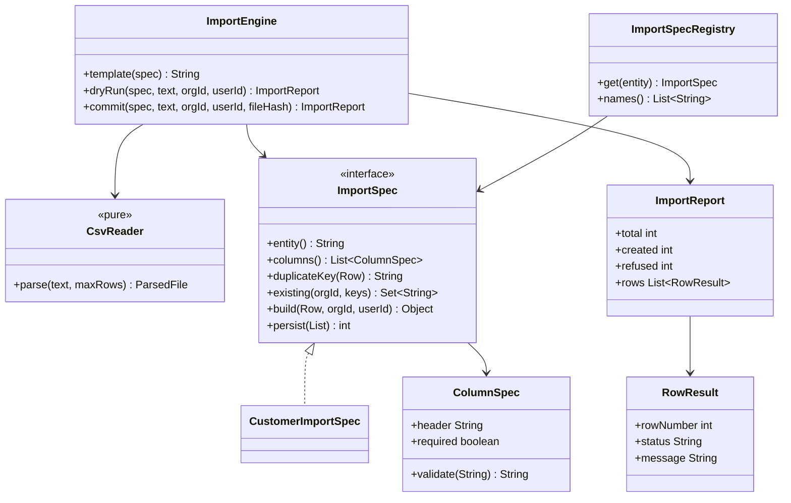
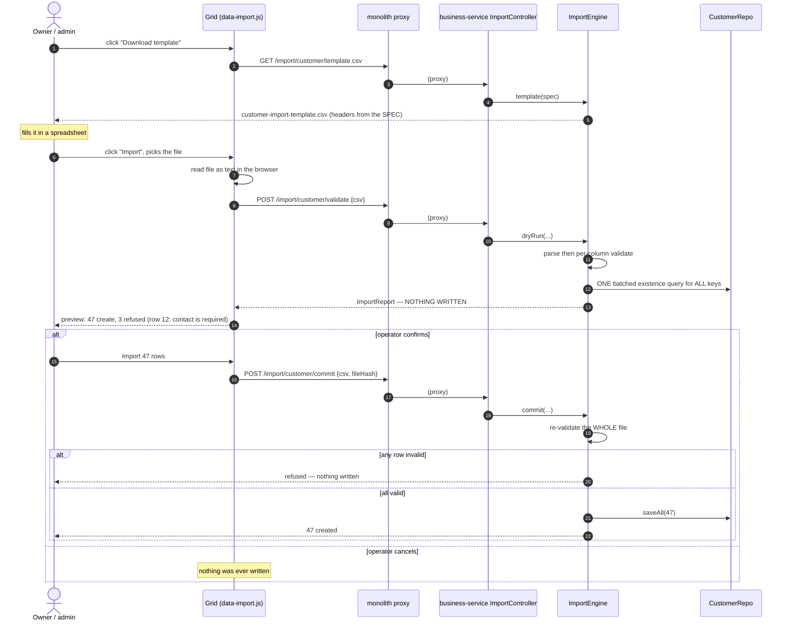
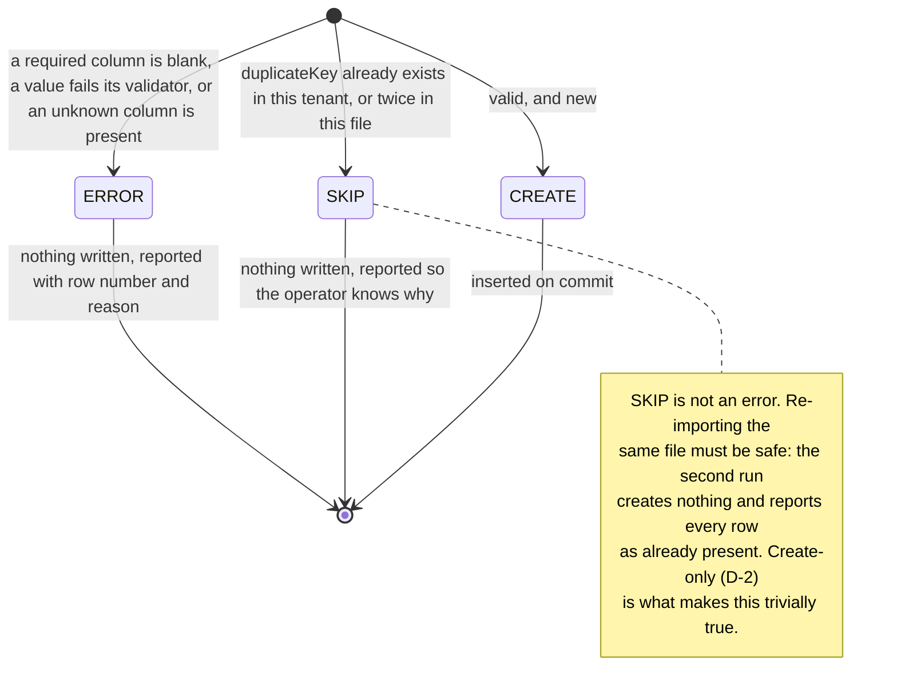

# Import I1 — CSV template + import, first entity: Customer

*Design gate — no code until this is approved.*

Written 2026-08-19. Parent standards: [SAAS-BUILD-STANDARDS.md](../SAAS-BUILD-STANDARDS.md) ·
Multi-tenancy: [ARCHITECTURE-MULTITENANCY.md](../ARCHITECTURE-MULTITENANCY.md)

---

## 1. The requirement

> A button on each data table to download a template to fill with data, and a button to import that filled
> file back into the system.

### 1.1 Decisions taken 2026-08-19 (asked and answered — these are the slice's fixed points)

| # | Question | Answer | What it removes from scope |
|---|---|---|---|
| **D-1** | CSV only, or `.xlsx` too? | **CSV only** | No Apache POI, no SheetJS. Zero new dependencies |
| **D-2** | Does import UPDATE existing rows? | **Create-only** | No diff preview of changed fields, no "one bad file rewrites the price list" failure mode, no update-authority question |
| **D-3** | Which entities get the button? | **Product and Customer only** | Vender, Company, ItemType, ItemUnit, Stores, PriceRule are OUT. Sell/Purchase/Orders/Quote were never candidates (§2.3) |
| **D-4** | First slice | **Customer** | Product is I2 |

**D-2 is the decision that makes this slice small and safe.** Create-only means the import can never destroy
existing data: the worst outcome of a bad file is rows that were not created. Everything below is designed
around holding that guarantee absolutely — an import that "mostly" creates is an import that updates.

---

## 2. Verified state of the code (read 2026-08-19, not assumed)

### 2.1 The grid button mechanism — one insertion point, four copies

`loadDataTable()` is a single shared initialiser keyed on `tableV` (the section name; `main.js:427` sets
`tableV = getAll = val` on section switch). It already composes a `buttons: []` array:

```js
buttons: ['pageLength'].concat(…).concat([
    lazyExcelButton({footer: true}),   // PERF-4b — library loaded on first click
    {extend: 'print', footer: true},
    lazyPdfButton({...})
])
```

| Fact | Where | Consequence for this slice |
|---|---|---|
| One shared `buttons` array | `business.js:1081-1124` | Adding two buttons is ONE edit, not one per grid |
| `lazy-export.js` defines `lazyExcelButton`/`lazyPdfButton` **globally** | `js/common/lazy-export.js:179` | The established pattern for a shared grid button. I1 follows it: `js/common/data-import.js` |
| `loadDataTable` exists in **FOUR copies** | `business.js:1081` · `education.js:218` · `welfare.js:158` · `agriculture.js:7` | See §7 — I1 touches only business.js, deliberately |
| Some grids bypass it | `tableSellReport` (`business.js:31`), `tablesi` (`:97`), and the hand-rolled `tableQuote`/`tablePriceRule`/`tableStores`/`tableOrders`/`tableTeam` | Irrelevant: none of them is Customer or Product |

### 2.2 What exists for CSV

| | State |
|---|---|
| `CsvWriter` — `business-service/util/CsvWriter.java` | ✅ RFC-4180, CRLF, quotes/commas/newlines handled, **CSV-injection guard** on `= + - @`, unit-tested (`CsvWriterTest`). `write(List<String> headers, Collection<? extends List<?>> rows)` — exactly the shape a template needs |
| A CSV **reader** | ❌ **Does not exist anywhere on the platform.** This is the net-new code in I1 |
| `MultipartFile` anywhere | ❌ None. No upload endpoint exists in any service |
| `POST /api/catalog/products/import` | ⚠️ Exists, **ungated** (no `@PreAuthorize` — while `DELETE /{id}` in the same controller requires `DELETE_PRIVILEGE`), uncapped, **zero callers platform-wide**, and it **repairs** bad rows rather than refusing them. Built for the item→product migration (slice 33 U2). **Not reused by I1** — see §3.1. Settled separately in §9 |

### 2.3 Why Sell / Purchase / Orders / Quote are not candidates

Not "not yet" — **wrong in kind**. These are numbered documents with side effects: an invoice moves stock,
writes the GL outbox, hits the tax register and changes AR. Inserting one does not produce a sale; it produces
a row the books disagree with. Replaying them through `SagaSellService` would mint new invoice numbers and is a
bulk *sale*, not an import. A tenant's history arrives as **one opening-balance document per customer**, which
is a finance slice, not this one.

### 2.4 The Customer write path today — and why I1 does not reuse either half of it

**`CustomerController.addCustomer` (`:163-230`) is the registration screen's path.** Two findings:

1. **Its duplicate check is an in-memory full scan, per call, on NAME only:**
   ```java
   boolean exists = customerService.findOwnScoped(orgId(), userId()).stream()
           .anyMatch(c -> c.getName()!=null && c.getName().equalsIgnoreCase(dto.getName()));
   ```
   For a 2 000-row import that is 2 000 full table reads. It is also scoped to the **creator's own** rows, so
   two users in one org can each create "Irfan Medical Store". I1 must not inherit this shape (§4.4).
2. It correctly derives `customerType` via `CustomerType.orDefault`, preserves `dueAmount`/`dueDate` on edit
   because they are **owned by `recomputeDue`**, and stamps the P4a credit account in its own transaction.

**`CustomerService.saveUpdateCustomer` (`:232-283`) is the SALE path's resolve-or-create.** It must **not** be
reused for import: it matches an existing customer by Query-By-Example on a probe built *after*
`setUserId(actor)`, so the probe includes the acting user. **This is the D2c defect** (OMS O7) — the outlet is
created by the owner, the sale runs as someone else, the probe cannot match, and a duplicate customer is
created with no credit limit. An import running through it would manufacture that defect in bulk.

**I1 writes through its own explicit create path** with an explicit, batched duplicate check. Stated as a
decision rather than an accident, because "reuse the existing save" is the obvious-looking call and is wrong
here for a reason a reader cannot infer.

### 2.5 The schema constraint that shapes the write

`Customer` maps to `@Table(name = "customer")`, and `V1__baseline.sql` creates that table **`ENGINE=MyISAM`**
(67 of business-service's baseline tables are; V8's own comment confirms `sell`/`purchase` are too).

**MyISAM has no transactions.** A `@Transactional` bulk insert into it writes 400 rows, fails on 401 and rolls
back **nothing**. So I1 cannot get all-or-nothing from Spring; it gets it from **validating the entire file
before writing a single row** (§4.2). This is a constraint to design around here, and separately a
platform-level finding worth its own remediation slice — not something to fix inside an import feature.

### 2.6 Fields, and which of them a human may supply

| Column | Import? | Why |
|---|---|---|
| `name` | ✅ required | |
| `contact` | ✅ required | `nullable = false` on the entity |
| `email`, `address`, `city`, `cnic` | ✅ optional | |
| `licenseNo`, `licenseExpiry` | ✅ optional | The outlet's trade/drug licence — already modelled |
| `customerType` | ✅ optional | Blank ⇒ `CustomerType.orDefault`, matching `addCustomer` exactly. **B2B/B2C channel derives from this**, so it must not be left NULL |
| `creditLimit`, `paymentTermsDays` | ✅ optional | Plain configuration, not a balance |
| **`dueAmount`** | ❌ **REFUSED** | A cached balance owned by `recomputeDue`, backed by the AR ledger. A number here with no invoices behind it puts the master and the ledger permanently out of agreement — the GL drift the POS/Retail standards audit exists to name. **Opening balances are documents, not a column** |
| **`creditBalance`** | ❌ REFUSED | Same reason — backed by the `store_credit_txn` ledger (SF-5) |
| `partyId`, `creditAccountCustomerId`, `assignedRepUserId` | ❌ not in the template | Cross-service / stamped identifiers. §8 records what an imported row does NOT get |
| `customerId`, `organizationId`, `userId`, `dated`, `updated` | ❌ never | Identity and tenancy are the server's |

**A column present in the file but not in the spec is an ERROR, not an ignored field.** Silently dropping
`dueAmount` would let an operator believe they imported balances.

---

## 3. The one design decision everything else follows from

### 3.1 An import REFUSES. A migration REPAIRS. They cannot share a code path.

`ProductImportService` — the existing bulk import — deliberately repairs bad input:

* blank SKU → `ITEM-<clientRef>`
* clashing SKU → suffixed `-2`
* blank name → the SKU

**For the migration it was written for, that is correct**, and its javadoc's reasoning is sound: *"incomplete
data shouldn't drop the item — it must still map so it stays sellable."* A migration's job is that nothing is
lost.

**For a file a human typed, it is the exact opposite of what is wanted.** A typo becomes a real row nobody
asked for, with no error shown, and the shopkeeper discovers it at the till. An import's job is that nothing
**wrong** is created.

> **I1's rule: every row either creates exactly what the operator wrote, or is refused with the reason and the
> row number. There is no third outcome.** No defaulting a required field, no de-duplicating a name by
> suffixing it, no truncating an over-length value.

This is why I1 does not extend `ProductImportService`, and it is the assertion the Cypress gate turns on
(§6.2).

---

## 4. Design

### 4.1 Shape — Template Method + Strategy, as a library

The engine owns *parse → validate → classify → report → write*. Each entity supplies an `ImportSpec`. New
entity = new spec, no engine change (Open/Closed).

**A library (`common-import`), not a service** — it owns no data, no lifecycle and no integration, so the
standing rule is library-by-default. It has no Spring dependency beyond `@Component` on the registry.



**`ImportSpecRegistry` is what makes the button appear.** The client asks the server which entities are
importable; a grid with no spec gets no buttons. There is structurally no way to ship a button that posts into
a void — the inverse of the "capability ships unreachable" failure this programme has hit three times.

### 4.2 The flow — dry run is not optional



**Why the commit re-validates the whole file rather than trusting the dry run:** the dry run's verdict is a
*read*, and rows can be created by someone else between the two calls. Re-validating is also what lets the
commit be a single all-or-nothing decision on MyISAM (§2.5) — the check happens entirely before the first
`INSERT`.

### 4.3 Row classification



**`ERROR` anywhere refuses the WHOLE file.** Not per-row partial commit. Two reasons: MyISAM cannot roll back
a partial write (§2.5), and a half-imported file leaves the operator with no way to know which half — they fix
three rows, re-upload, and now have to reason about which of the 47 already exist. All-or-nothing is both the
safer and the simpler contract.

### 4.4 The duplicate key, and doing it in ONE query

**Key = `contact`, normalised** (trimmed, whitespace-stripped), org-scoped. Not `name`: two branches of one
chain legitimately share a name, and `addCustomer`'s name-only check (§2.4) already lets duplicates through
between users in one org. Contact is the field the sale path's own matching leans on.

The check is **one query for the whole file**:

```java
// ONE round trip: SELECT contact FROM customer WHERE organization_id = ? AND contact IN (…)
Set<String> taken = customerRepo.existingContactsScoped(orgId, allKeysInFile);
```

versus `addCustomer`'s `findOwnScoped(...).stream().anyMatch(...)` per row. This needs a new repository method
and — per **D3/D3b** — the index that serves it: `(organization_id, contact)`. Shipped in the same migration,
not after. That index also improves the existing registration screen's dup check if it is ever moved off the
full scan.

**In-file duplicates count too.** Two rows with the same contact: the first is `CREATE`, the second `SKIP`.
Reported, never silently collapsed.

### 4.5 API

All on business-service, proxied by the monolith (an endpoint with no proxy is review finding **R7**, hit three
times in the OMS programme — the proxies ship *with* the slice).

| Method | Path | Auth | Returns |
|---|---|---|---|
| `GET` | `/import/entities` | authenticated | `["customer"]` — what the grid draws buttons for |
| `GET` | `/import/{entity}/template.csv` | owner/admin | `text/csv`, `Content-Disposition: attachment` |
| `POST` | `/import/{entity}/validate` | owner/admin | `ImportReport` — **writes nothing** |
| `POST` | `/import/{entity}/commit` | owner/admin | `ImportReport` |

* **`@PreAuthorize("hasAuthority('ADMIN_PRIVILEGE')")` on all but `/entities`.** Bulk-creating master data is
  an owner operation. Note the asymmetry this fixes by example: `/products/import` today creates unlimited
  rows ungated while deleting one product needs `DELETE_PRIVILEGE`.
* **Caps, server-side:** max 5 000 rows and max 2 MB of text, refused with a readable message. `?size=100000`
  is the unbounded read with extra steps (O4's lesson) — the same applies to a write.
* **Idempotency on commit:** key = `i1-{orgId}-{entity}-{sha256(csv)}`, through the existing
  `IdempotencyRecord`. A double-click imports once.
* **DTOs at the boundary**, `GenericResponse` envelope (business-service's monolith-facing convention), never
  entities. `/products/import` returns a raw list — I1 does not copy that.

### 4.6 The template is generated from the spec — never from the grid

The tempting implementation is `buttons.exportData()` client-side, since DataTables already has it. **It
produces a file that cannot be imported back**: the grid's columns are *display* columns — formatted currency,
the hidden id column, the checkbox column, the actions column, the last-rate `<div>` markup, and whatever the
operator has hidden or reordered.

The template is rendered **server-side by `CsvWriter` from `spec.columns()`** — the same list the parser
validates against, so the header cannot drift from what the parser accepts. That single fact is what makes the
round trip reliable, and it is the most common way an import feature quietly fails.

Template contents: one header row, plus **one example row** showing the expected date format (`yyyy-MM-dd`) and
a blank optional column.

### 4.7 The UI

`js/common/data-import.js`, sibling to `lazy-export.js` and following its shape:

```js
buttons: ['pageLength'].concat(…).concat([
    lazyExcelButton({footer: true}),
    {extend: 'print', footer: true},
    lazyPdfButton({...})
]).concat(importButtons(tableV))   // ← [] unless a spec is registered for this entity
```

* `importButtons(entity)` returns `[]` when the entity has no spec — so Sell, Purchase and every other grid are
  unchanged, with no per-grid conditionals to maintain.
* The preview modal uses the shared **`uiConfirm`** machinery — never `window.confirm`, and Cypress drives it
  by `[data-ui-confirm="ok"]`.
* File is read as text in the browser and POSTed as JSON. **No `MultipartFile`** — none exists on the platform
  today, and CSV-only (D-1) means the payload is text. Avoids new multipart config across the gateway and the
  monolith proxy.
* i18n: new keys added to **all six** bundles, aligned.
* The refused-rows list is rendered with `escHtml()` — the message echoes operator-supplied cell content.

---

## 5. What must NOT change

* **`SagaSellService` / `saveUpdateCustomer` / `recomputeDue` are untouched.** I1 adds no money logic and does
  not alter the sale path.
* **No balances are importable.** `dueAmount` and `creditBalance` stay owned by their ledgers (§2.6).
* **`addCustomer` keeps working exactly as it does.** I1 adds a second, explicit path; it does not refactor the
  registration screen's save. (Its full-scan dup check is noted in §9 as separable follow-up, not fixed here —
  changing the registration screen's duplicate semantics mid-import-slice would be scope the gate cannot cover.)
* **One-way dependency.** Everything lands in business-service; no new cross-service call.

---

## 6. Test plan

### 6.1 Unit — runs on every `mvn test`, no Docker

`CsvReaderTest` — quoted fields, embedded comma / quote / newline, CRLF and LF, BOM, ragged rows, blank
trailing lines, the row cap, and **injection neutralisation on read** (a cell starting `= + - @`).

`CustomerImportSpecTest` (pure Mockito) — required-column refusal, unknown-column refusal, `dueAmount` present
in the file is an ERROR, blank `customerType` defaults to `orDefault`, malformed `licenseExpiry` refused,
in-file duplicate contact → second row SKIP, existing contact → SKIP.

`ImportEngineTest` — **one ERROR row refuses the whole file and `persist` is never called** (the central
guarantee, asserted on the collaborator, not on a returned message).

### 6.2 Gate — `customer-import.cy.js`, headed

| Case | Asserts |
|---|---|
| Template downloads and its header equals the spec's columns | The round-trip contract, not "a file arrived" |
| A clean file of 3 rows: dry run reports 3 CREATE **and the customer count is unchanged** | Dry run writes nothing — the property, not the report |
| Commit creates exactly 3, and each is readable with the values from the file | Values, not row count alone |
| **A file with one bad row is refused, and the customer count is UNCHANGED** | ⭐ **The case that carries the slice.** Asserts the master is untouched — *"the response said error"* passes under a partial write too |
| Re-importing the same file creates nothing and reports 3 SKIP | Create-only idempotence |
| A file with a `dueAmount` column is refused | Balances cannot enter through a spreadsheet |
| A non-admin gets 403 from the server | Not a hidden button |
| A second tenant cannot see the first's customers after import, **and the owner can** (positive control) | Org scoping — with the positive control the D2 false pass established as mandatory |

**Explicitly avoided assertions**, per this programme's five artefact-not-property incidents: "the upload
returned success", "a report object came back", `.to.match(/\S/)` on a field that may be absent. Every case
above asserts a **count or a value in the master**, which is the thing a defect would move.

### 6.3 Regression

`sell` (shares the dashboard template and the grid initialiser), `b2b-customer-type` (customerType defaulting),
`credit-limit` (the credit-account stamp on new customers), `method-authz`, plus
`mvn -pl business-service test`.

---

## 7. Deliberately NOT in I1

* **Product import** — I2. Product spans catalog + inventory (opening stock, batch, expiry, FEFO) and the
  item↔product bridge. Proving the mechanism on the simpler master first is the point of D-4.
* **Extracting `loadDataTable`'s four copies.** I1 edits `business.js` only, because Customer and Product are
  both business-module grids. Education/welfare/agriculture get nothing and need nothing. The duplication is
  real and is recorded in §9 — but a DRY refactor of four modules' grid initialiser, inside an import slice,
  is a change the import's gate cannot cover.
* **Opening balances / historical invoices** — a finance slice (§2.3).
* **Export in template shape.** The natural counterpart, and worth having, but I1 is the import half.

---

## 8. Known limitations — stated, not papered over

**An imported customer is not bridged to party-service.** `addCustomer` and the sale path both call
`bridgeCustomer`; I1's create path will call it too, best-effort, but a party-service outage means imported
rows land unbridged and are absent from Contact-360 until re-bridged. There is no re-bridge sweeper today.

**An imported customer is its own credit account.** Same as any newly registered customer (P4a) — it falls back
to its own limit, never to "no limit", and is re-stamped on the next group edit. Correct, but worth knowing
before importing a chain's branches: **the hierarchy is not importable in I1** and must be set afterwards.

**`assignedRepUserId` is not set**, so imported outlets are unassigned — which under D2d's rule reads as
"visible to every rep", not "hidden". Intended, and the same behaviour as any manually created outlet.

**No rollback after commit.** MyISAM (§2.5). All-or-nothing is achieved by validating before writing, which
covers *bad data* completely — it does not cover a database or JVM failure mid-`saveAll`. Accepted for a
create-only import of master data; the recovery is `backup-db.sh`.

---

## 9. Recorded separately — NOT fixed by this slice

1. **`POST /api/catalog/products/import` is ungated, uncapped and has zero callers.** Per the R4 precedent
   (*dead code that encodes a closed defect is a loaded gun*), it should be gated + capped + given its caller,
   or deleted. **I2 must settle this** rather than adding a second product import beside it.
2. **`addCustomer`'s duplicate check is an in-memory full scan on name only**, scoped per creator. The
   `(organization_id, contact)` index I1 ships makes the batched fix cheap when someone takes it.
3. **67 business-service tables are MyISAM** — no transactions on `customer`, `sell`, `purchase`. Every
   `@Transactional` write path over them is non-atomic. Verify against the live schema
   (`SHOW TABLE STATUS`) before acting; if confirmed, this deserves its own remediation slice.
4. **Backup is a script, not a proven process.** `backup-db.sh` is good and its own footer says *"a backup you
   have never restored is a hope."* Confirm the cron job is installed, rehearse a restore, and copy dumps
   off-box. **This — not the import — is what answers data loss.**

---

## 10. Gate

```
mvn -pl common-import install -DskipTests     # new library
mvn -pl business-service -am clean package -DskipTests
mvn -pl business-service test                 # CsvReaderTest + CustomerImportSpecTest + ImportEngineTest
mvn clean install -DskipTests                 # monolith: buttons, modal, proxies, i18n
```

Restart business-service (migration: `(organization_id, contact)` index) and the monolith. Then headed:
`customer-import.cy.js`. **Regression:** `sell`, `b2b-customer-type`, `credit-limit`, `method-authz`.

---

## 11. DECIDED 2026-08-19 — how the preview reports SKIP vs ERROR

**Asymmetric: refusals in full, skips collapsed to a count.**

The principle: **an ERROR is a call to action** — the operator must edit the file and re-upload. **A SKIP is
not** — the row already exists, which is the outcome they wanted. Prominence tracks *required action*, not row
count.

**The re-import case decides it**, because it is the most common SECOND interaction with this feature. 500 rows
go in, 20 are refused, the operator fixes those 20 and re-uploads **the whole file** — nobody hand-builds a
20-row file. The report is then 480 SKIP + 20 CREATE, and under "list everything equally" the twenty rows that
matter are buried under 480 that do not. That is the design failing precisely where it is most used.

| Element | Behaviour |
|---|---|
| Headline | Three counts: `20 to create · 480 already exist · 3 refused` |
| **Refused** | **Always expanded**, sorted first, full table: row number + reason |
| **Already exist** | **One collapsed line**, click to expand. Row number + the contact that matched — a suspicious operator can check without everyone else scrolling past it |
| Confirm button | States the **CREATE** count: *"Import 20 customers"*, never *"Import 500"*. An operator who clicks a button saying 500 and gets 20 will believe it failed |
| 100% SKIP | **No confirm button at all.** Nothing to do — say so, rather than offering a button that does nothing |

**Also included: "Download report as CSV" on the preview.** At 480 skips nobody reads a modal, but a file the
operator can open beside their spreadsheet reconciles properly. Nearly free — `CsvWriter` exists and the report
is already structured rows — and it gives the refusal list a life beyond a modal that gets closed by accident.

Gate addition: a case asserting the confirm button's label carries the **create** count while the file also
contains skips (the number an operator acts on, not the file's size).

---

## 12. BUILT 2026-08-19 — what shipped, and three departures from §4

**Nothing has been compiled, run or gated yet.** The user runs all builds; §10 is the sequence.

| | |
|---|---|
| `common-import` (new module) | `CsvReader` (RFC-4180, quotes/embedded newlines/CRLF/BOM/row cap), `ColumnSpec`, `ImportSpec`, `RowResult`, `ImportReport`, `ImportEngine`, `ImportSpecRegistry` + `CommonImportAutoConfiguration`. Holds no `@Entity` and no persistence dependency |
| business-service | `CustomerImportSpec`, `ImportController` (5 endpoints), `CustomerRepo.existingContactsScoped`, **V41** `idx_customer_org_contact` |
| monolith | `ImportProxyController` (5 proxies), `BusinessRestClient.postJsonString`, `js/common/data-import.js`, one `.concat()` in `business.js`'s `loadDataTable`, script tag, **16 i18n keys × 6 bundles (all aligned at 1969)** |
| tests | `CsvReaderTest` (13), `ImportEngineTest` (18), `CustomerImportSpecTest` (16), `customer-import.cy.js` (18) |

### 12.1 Departure 1 — the template ships with NO sample row

§4.6 specified "one example row showing the expected date format". **Built without one**, because writing it
exposed the trap: whatever the sample contains, an operator who does not delete it gets one of two bad
outcomes — a junk customer imported into their live master, or a refusal on their very first attempt caused
by a row the system itself wrote. The second is not hypothetical: the natural sample for `customerType` is
its own hint, `WALK_IN | RETAILER | WHOLESALE | VIP`, which is not a valid value.

The guidance it would have carried is delivered where it is actually needed instead — the validators name
the expected shape in the refusal (*"'licenseExpiry' must be a date as yyyy-MM-dd — got '31-12-2027'"*) — and
because the dry run writes nothing, learning that costs one click rather than a corrupted master. Each
`ColumnSpec` still carries its hint; only where it surfaces changed.

### 12.2 Departure 2 — the formula guard REFUSES, and only on text columns

§6.1 said "injection neutralisation on read". Built as a **refusal**, and applied to **TEXT columns only**.

*Refusal rather than neutralisation* because rewriting a cell would break §3.1's rule that a row is created
exactly as written or not at all — an import that silently altered a customer's name is the behaviour this
slice exists to reject.

*Text-only* because a leading `-` is a perfectly good negative number, and a blanket guard on `= + - @` would
have refused every negative credit limit. Numeric columns are protected by being parsed as numbers, which
`=1+1` fails on its own. Both halves are gated: a formula in `name` is refused, `-250` in `creditLimit` is not.

### 12.3 Departure 3 — no idempotency key on commit, and that is deliberate

§4.5 specified `i1-{orgId}-{entity}-{sha256(csv)}` through `IdempotencyRecord`. **Not built**, because the
slice's own semantics already provide it more broadly: create-only + a duplicate check means a replayed file
finds every contact present and creates nothing. A key would guard a double-click and nothing else; the
semantics also cover the operator who re-uploads the same file an hour later having forgotten. Gated by
*"re-importing the same file creates nothing"*, which asserts the customer count is unchanged.

**What this does NOT cover, stated plainly:** two *simultaneous* commits of the same file could both pass
their dry run and both write, because the duplicate check is a read and `customer` has no unique constraint
on `contact` to catch the loser. A key would not have helped either — two different requests, two different
moments. The real fix is a unique index, which V41 deliberately does not create (§ the migration's own
comment: live tenants may already hold duplicate contacts, so `UNIQUE` would fail the migration). Recorded
rather than papered over.

### 12.4 Two things found while building, worth carrying forward

**The report download would have 500'd.** The browser must submit a real `<form>` for a download's filename
to survive, so it posts form-encoded — while the proxy was written taking `@RequestBody`. The proxy now takes
`@RequestParam` and translates to JSON for the service. Same family as D4's defect #1 (`@RequestParam` +
`@RequestBody` on one method), caught here by writing the client and the server in the same sitting.

**The buttons had a first-draw race.** `importButtons()` is called synchronously while DataTables builds its
toolbar, but the entity list arrives over HTTP — so a grid opened in the same tick as page load would draw no
buttons and keep none until the section was re-opened. Delaying every grid on the platform behind one
optional fetch would be the worse trade, so `data-import.js` back-fills through the Buttons API once the list
lands. Worth noting because the gate would probably have passed anyway: Cypress logs in first, so the fetch
had always landed by the time a section opened. **A race a gate cannot reliably see is still a race.**

---

## 13. GATE RUN 1 — RED. One defect, mine, in V41.

**Result: 0 passing, 1 failing, 16 skipped.** The failure was in `beforeEach` (`cy.loginAsOwner`), so no import
case ever ran.

### 13.1 One cause, three layers of symptom

The reported error was *"downstream token still valid (GenericResponse) — expected + actual"* at
`commands.js:81`, which reads like an auth problem and is not one.

| Layer | What was seen |
|---|---|
| Cypress | `loginAs`'s `validate()` refused the session |
| Monolith | `/getBusinessDashboardStats` answered **`200 {"status":"ERROR"}`** — the proxy catching a downstream failure |
| business-service | **crash-looping** (`Up 16 seconds`, then `Up 10 seconds`, while every other container had been up 2 hours) |
| Root cause | **`V41 failed: ERROR 1071 — Specified key was too long; max key length is 1000 bytes`** |

`docker ps` was the decisive first command, exactly as the platform note says: one container with an uptime of
seconds among twenty at two hours is the whole diagnosis. **A bare `{"status":"ERROR"}` from a proxy means the
service is not answering — it is not a reason to debug the caller.**

### 13.2 The defect: MyISAM's 1000-byte key limit

```
organization_id  bigint        =    8 bytes
contact          varchar(255)  = 1020 bytes   (utf8mb4, verified: CHARACTER_OCTET_LENGTH = 1020)
                                 ────────────
                                   1028  >  1000   ✗
```

`customer` is **MyISAM** — now confirmed against the LIVE schema (`information_schema.tables` reports
`ENGINE=MyISAM`), where §2.5 had only inferred it from the baseline dump. MyISAM caps a key at **1000 bytes**;
InnoDB would have accepted this at 3072.

**Why it was not obvious, which is the transferable part.** Every other index on `customer` —
`idx_customer_org_user`, `_org_type`, `_org_rep`, `_org_credit_account` — is `(organization_id, <bigint>)`.
**V41 is the first index on this table to carry a wide varchar**, so the limit had never been approached in
41 migrations. §2.5 had already identified MyISAM as load-bearing *for transactions* and I did not carry the
same constraint across to the *index*: the fact was known, its second consequence was not drawn.

**Fix: `contact(64)`** — a 64-character prefix, 8 + 64×4 = 264 bytes. The migration now carries the arithmetic
and a *"do not tidy the (64) away"* note, because a prefix looks like an accident to a later reader.

### 13.3 Verified rather than assumed: the prefix still serves the query

A prefix index that stops serving the predicate would trade a crash for a silent full scan — the exact O(n²)
the batched check exists to avoid — so this was measured against the live table (885 rows), not reasoned about.
Both candidate shapes were created, `EXPLAIN`ed and dropped:

| Index | `type` | `key_len` | rows | filtered |
|---|---|---|---|---|
| `(organization_id, contact(64))` | `range` | 267 | 6 | 100% |
| `(contact(64), organization_id)` | `range` | 267 | 6 | 100% |

**Identical.** So the prefix genuinely serves `contact IN (…)`, and the platform's org-first convention is kept.

*One observation recorded, not acted on:* left to choose freely the optimiser preferred the existing
`idx_customer_org_type` (`ref_or_null`, est. 2 rows) over either new index. That is a statistics artefact of
this dev dataset — few rows for org 1 — and inverts with a tenant of any size, where filtering by contact is
far more selective than filtering by org. Noted so a later reader who runs `EXPLAIN` on a small database is
not surprised.

### 13.4 No manual database cleanup is needed

V41 left `flyway_schema_history` with `version=41, success=0`. `FlywayConfig.repairThenMigrate` runs
`repair()` before `migrate()` on every start, which drops failed markers and realigns checksums — so the
corrected V41 applies cleanly on the next boot with no `DELETE` by hand. (This is also why editing a failed
migration in place is safe here, where normally it would not be.)

### 13.5 What would have caught this before the gate — and it is a standard we are not meeting

**business-service has NO Flyway migration test.** Only `marketplace-service` and `pharma-service` have one,
platform-wide. Standard **D2** requires that migrations execute in `mvn test` against an empty database, and
this defect is precisely what that catches: the baseline creates `customer` as MyISAM explicitly, so a
Testcontainers MySQL run would have failed on V41 in `mvn test` rather than in a headed browser three layers
away from the cause.

Not added inside this slice, deliberately — running 41 existing migrations against a fresh container for the
first time may surface unrelated failures, and that is its own piece of work rather than a rider on an import
feature. **Recommended as the next slice after I1**, and listed with §9's other recorded items.

---

## 14. GATE — ✅ GREEN 17/17 (run 3). Run 2 was 16/17; the one failure was in the SPEC.

**`cy.openSection('SellDiv')` failed: no `<option>` with that value.** `#registrationType` carries exactly
three — `CompanyDiv`, `CustomerDiv`, `VenderDiv`. The sale screen is a different picker (`#sellType`, reached
by `cy.openSellSection('sellDiv')`), and a grep confirmed my spec was the **only** caller of
`openSection('SellDiv')` anywhere in the suite. Straightforwardly my error.

**The fix is not the corrected value, and that is the point worth recording.** The obvious repair —
`openSellSection('sellDiv')` — would have gone green while proving nothing:

> `#sellDiv` is the **till**. It builds no grid through `loadDataTable` at all, so "no import buttons" is true
> there whatever the registry says. The assertion would have passed for a reason unrelated to the mechanism
> under test.

Sixth instance of this programme's recurring shape, and the first caught in a spec I had just written to
avoid it. **An absence assertion is only evidence when the thing being absent could otherwise have been
present.**

**Changed to `VenderDiv`**, which is a strictly better negative control on three counts: it runs the *same*
`loadDataTable` with the *same* buttons array as Customer, so the registry lookup is the only variable; it is a
real master and a plausible import candidate deliberately scoped out by D-3, so its emptiness is a decision
rather than a screen-type accident; and the case's own Customer half is the positive control that proves the
buttons can appear at all.

**The other 16 passed**, including the three that carry the slice: one bad row leaves the customer count
unchanged, the template header matches the parser exactly, and a re-import creates nothing.

### 14.1 ✅ Gate green — `customer-import.cy.js` 17/17, 2026-08-19

Three runs. Run 1 red on a real defect (V41, §13); run 2 red on a spec error (§14); run 3 **17/17**.

**Still outstanding before I1 is DONE** — the Cypress gate is one of the cadence's steps, not all of them:

| | Command | State |
|---|---|---|
| Unit — new library | `mvn -pl common-import test` | ⬜ never run |
| Unit — owning service | `mvn -pl business-service test` | ⬜ never run since the slice landed |
| Regression | `sell`, `b2b-customer-type`, `credit-limit`, `method-authz` | ⬜ |

`mvn test` is not optional and `-DskipTests` does not satisfy it (§1.6 of the build standards, and the
incident behind that rule: a service's unit suite failed to COMPILE for two whole phases while those phases
were reported green on Cypress alone). `CustomerImportSpecTest` in particular has never been compiled — and
it is the one that pins the balance-column refusal and the batched-query shape.

### 14.2 What the green run actually proves

The three cases carrying the slice all passed, and each was written so that the obvious weaker assertion
would NOT have caught its defect:

* **one bad row refuses the WHOLE file** — asserts the customer count is unchanged, and that the two valid
  rows are absent *by name*. "The response said FAILED" passes under a partial write; a count does not.
* **the template header is exactly the parser's columns** — string equality, not `contains`. A drift in
  order or in which columns are optional fails loudly.
* **re-importing the same file creates nothing** — the property that makes create-only safe, and the reason
  no idempotency key was needed (§12.3).

Plus: `dueAmount` refused whole, a formula cell refused while `-250` is accepted, a non-admin refused **by the
server**, and tenant scoping proved with its positive control first.
