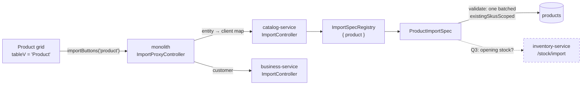

# Import I2 — CSV template + import for Product

*Design gate — no code until this is approved.*

Written 2026-08-20. Predecessor: [import-I1-customer-csv.md](import-I1-customer-csv.md) (DONE, gate 17/17).
Completes the scope set on 2026-08-19: **Product and Customer only**.

---

## 1. What carries over unchanged from I1

The engine exists and is proven. `common-import` — `CsvReader`, `ColumnSpec`, `ImportSpec`, `ImportEngine`,
`ImportSpecRegistry` — is a library with no persistence dependency, and its guarantees are already gated:

* a dry run writes nothing;
* **one bad row refuses the whole file** — never a partial commit;
* create-only, so a replayed file is inert;
* an import **refuses**, it does not repair (I1 §3.1);
* the template is generated from `spec.columns()`, the same list that validates the upload.

**So I2 is not an engine change.** It is one new `ImportSpec`, plus the three genuinely new problems below.

---

## 2. The three problems Product has that Customer did not

### 2.1 Product is owned by a DIFFERENT SERVICE

Customer lives in business-service, where `ImportController` and the registry already sit. **Product lives in
catalog-service.** Nothing about the engine prevents this — it is a library — but the *reachability* wiring
assumes one service:

| Piece | Today | For Product |
|---|---|---|
| `ImportSpecRegistry` | one per service, populated by that service's beans | catalog-service gets its own, holding only `ProductImportSpec` |
| `ImportController` | business-service | a second one in catalog-service |
| Monolith proxy | `/import/**` → `BusinessRestClient`, unconditionally | must route **per entity**: `customer` → business, `product` → catalog |
| `GET /import/entities` | returns business-service's registry | must **merge** both services' registries, or the grid sees only half |

**The routing table is the design decision here.** Two shapes:

| | Approach | Assessment |
|---|---|---|
| **A** | **Monolith holds an entity → client map** (`customer`→`BusinessRestClient`, `product`→`CatalogRestClient`), and `/import/entities` calls both and concatenates | ✅ **Recommended.** Honest about where masters live, and the map is three lines. Each service keeps its own spec beside the data it writes. Cost: one more place to edit when a third entity is added — but that edit is unavoidable in any design where the monolith must know which service to call |
| **B** | Put `ProductImportSpec` in **business-service** and have it write through `CatalogClient` | ❌ business-service would own the rules for a master it does not store, and every validation would need a remote call. It also re-creates the coupling decomposition exists to prevent |

**A also degrades correctly:** if catalog-service is down, `/import/entities` returns business-service's half
and the Customer buttons still work — the same "no spec, no button" rule, applied per service.

### 2.2 SKU is OPTIONAL in the product master — so what is the duplicate key?

Customer's key was `contact`, which is `nullable = false`. Product has no such field: `name` is the only
required column, and duplicate names are **deliberately allowed** (`/name-check` warns, it does not refuse).

Measured against the live catalogue rather than guessed:

```
total products      1581
without a SKU         10   (0.6%)
without a barcode   1543   (97.6%)
```

**SKU is the only viable key.** Barcode is absent from 97.6% of the catalogue, so it cannot identify a row;
name is not unique by design.

The 0.6% matters though, because it means *"SKU is required"* is a genuine change of rule at the import
boundary — the app allows a product with no SKU, and the importer would not. That is defensible (an import
needs an identity, and a re-import needs one even more) but it is **the user's call**, not mine — see §5 Q2.

Note `sku` is indexed but **not unique**, and `products` is **InnoDB** — so a `(organization_id, sku)` index
costs ~1039 bytes against InnoDB's 3072 limit and needs **no prefix**. The MyISAM trap that broke V41 does not
apply here; stated explicitly so nobody copies `contact(64)` across by analogy.

### 2.3 A product with no stock is a catalogue, not an inventory

Stock lives in **inventory-service** (`POST /stock/import`, taking `StockImportLine{productId, quantity,
batchNo, expiryDate, purchasePrice, costPrice}`). So "import my products" as a shopkeeper means it, spans
**two** services, and pharma needs batch + expiry or FEFO is meaningless.

This is where I1's central guarantee weakens, and it must be said plainly:

> **The engine's all-or-nothing promise is per-service.** If products commit and the stock call then fails,
> the tenant has products with no stock. Recoverable — re-import the stock sheet — but it is no longer "one
> bad row and nothing happened".

Three options, §5 Q3.

---

## 3. Verified state (read 2026-08-20)

| | |
|---|---|
| `catalog-service` deps | **no `common-import`** — one pom line to add. Testcontainers already present |
| `ProductDTO` | only `name` is `@NotBlank`. `sku`, `barcode`, `unit`, `manufacturer`, `sellingPrice`, `taxRate`, `taxCodeId`, `categoryName`, `rxRequired`, `controlledSubstance` all optional |
| `ProductRepository` | has `existsBySkuScoped` / `findBySkuScoped` (single-row). **A batched `existingSkusScoped(orgId, userId, skus)` is new** — the one-query-per-file rule from I1 §4.4 |
| Category | resolved **find-or-create by name per tenant** (`ProductImportService.resolveCategory`) — reusable behaviour, and the right one for an import |
| `POST /stock/import` | exists, takes a list, returns a count. **Ungated** (no `@PreAuthorize`) |
| Product grid | `catalog-products.js:189` sets `tableV = 'Product'`, and it routes through the shared `loadDataTable`, so **the buttons appear with no UI change at all** once the registry lists `product` |

### 3.1 The existing `/api/catalog/products/import` must be settled by this slice

Recorded in I1 §9.1 and still true:

* **ungated** — no `@PreAuthorize`, while `DELETE /products/{id}` in the same controller needs `DELETE_PRIVILEGE`;
* **uncapped** — an unbounded write on the product master;
* **zero callers** — `CatalogClient.importProducts` is declared in `commerce-contracts` and invoked nowhere;
* **it repairs rather than refuses** — blank SKU → `ITEM-<ref>`, clash → `-2` suffix, blank name → the SKU.

**Its purpose is discharged.** It was built for the item→product migration (slice 33 U2), and V8 has since
dropped `item`, `item_catalog_map` and `stock` — I2's own Flyway test asserts those tables are gone. So the
migration it served is complete and cannot recur.

Leaving it in place while adding a second, stricter product import is the worst outcome: two endpoints writing
the same master under opposite rules, one of them ungated. §5 Q4.

---

## 4. Design



**Columns** (subject to Q2): `sku`, `name`, `description`, `categoryName`, `unit`, `manufacturer`,
`sellingPrice`, `taxRate`, `barcode`, `rxRequired`, `controlledSubstance`.

**Refused columns**, on I1's rule that an unknown column fails the file rather than being ignored:
`lastPurchaseRate`, `lastSaleRate`, `lastRateAt` — these are **stamped by the purchase and sale flows**
(slice 107) and are derived facts, not attributes. Importing them would be the `dueAmount` mistake in a
different costume: a number in a cell that no transaction stands behind.

`isActive` is not offered either — every imported product is active; deactivation is an action, not an import.

---

## 5. DECIDED 2026-08-20 — all four answered

| # | Decision |
|---|---|
| **Q1** | **catalog-service** holds `ProductImportSpec`; the monolith routes per entity and merges both registries |
| **Q2** | **`sku` is REQUIRED** in the product template |
| **Q3** | **Products only.** Opening stock is deferred to I3 — *not* the second sheet I recommended |
| **Q4** | **Delete** `/api/catalog/products/import` and its contract |

### 5.1 Q3's consequence, stated plainly

A tenant who imports 1 500 products has 1 500 products and **zero sellable stock**. Every one of them
shows as out of stock at the till until stock is added by hand or by I3. That is a real half-delivery
from the shopkeeper's point of view, and it is the accepted cost of keeping I2's all-or-nothing
guarantee inside one service. Recorded here so I3 is understood as *completing* this feature rather
than extending it.

**What this buys:** no cross-service partial state, no compensating story to invent, and the same
single-service atomicity I1 was gated on.

### 5.2 The superseded question set

**Q1 · Where does `ProductImportSpec` live?** Recommend **catalog-service** (§2.1 A), with a per-entity
routing map in the monolith proxy and `/import/entities` merging both registries.

**Q2 · Is `sku` REQUIRED in the product template?** Recommend **yes**. It is the only usable duplicate key,
99.4% of the live catalogue already has one, and without it a re-import cannot tell a repeat from a new
product — which would silently double a tenant's catalogue on the second upload. The cost is that the 0.6%
without a SKU cannot be imported until one is invented for them.

**Q3 · Does I2 include opening stock?** Three shapes:
* **(a) Products only** — smallest, keeps all-or-nothing intact, and the shopkeeper still has to add stock by
  hand. Stock becomes I3.
* **(b) A second sheet** — `product-stock-import-template.csv` (`sku`, `quantity`, `batchNo`, `expiryDate`,
  `costPrice`), imported after the products, resolving `sku` → `productId`. Two files, two all-or-nothing
  imports, no cross-service partial state. **Recommended.**
* **(c) Optional stock columns on the product template**, fanning out to inventory in one action. One file for
  the operator, but it breaks the per-file atomicity guarantee (§2.3) and needs a compensating story.

**Q4 · What happens to `/api/catalog/products/import`?** Recommend **delete** it, with
`ProductImportService`, `CatalogClient.importProducts` and the `ProductImportLine`/`ProductImportResult`
contracts — per the R4 precedent that *dead code encoding a closed defect is a loaded gun*. Alternative: gate
it with `ADMIN_PRIVILEGE` and cap it, leaving two product-import paths with opposite semantics.

---

## 6. Test plan (once the above are answered)

**Unit** — `ProductImportSpecTest`, mirroring `CustomerImportSpecTest`: required columns refused, unknown
column refuses the file, `lastPurchaseRate` present is an ERROR, category find-or-create, one batched SKU
query for the whole file, blank optional columns accepted.

**Gate** — `product-import.cy.js`, and the case that carries the slice is the same shape as I1's:
**a file with one bad row leaves the product count unchanged.** Plus: the template header equals the parser's
columns; re-import creates nothing; a non-admin is refused by the server; the Product grid shows both buttons
while the Vendor grid shows neither (proving the registry now spans two services).

**Regression** — `product` specs, `sell` (product picker), `purchase`, `pos-order-parity`.

---

## 7. BUILT 2026-08-20

**Nothing compiled, run or gated yet** — the user runs all builds.

| | |
|---|---|
| **Deleted** | `ProductImportService`, `ProductImportServiceTest`, `ProductImportLine`, `ProductImportResult`, `CatalogClient.importProducts`, `ProductController.importProducts`. **Zero references remain** (verified by grep before and after) |
| catalog-service | `ProductImportSpec`, `ImportController` (5 routes, `ADMIN_PRIVILEGE`), `ProductRepository.existingSkusScoped`, **V9** `idx_products_org_sku`, `common-import` on the pom |
| monolith | `ImportProxyController` rewritten for per-entity routing + envelope normalisation; `CatalogRestClient.postJsonString` |
| shared | **`CsvWriter` moved** business-service → `common-import`; `ImportEngine.templateCsv(spec)` added |
| tests | `ProductImportSpecTest` (18), `product-import.cy.js` (13) |
| UI | **no change at all** — `showProducts()` sets `tableV='Product'` and calls the same `loadDataTable`, so the buttons appear from the registry alone |

### 7.1 `CsvWriter` moved rather than copied

Catalog needed a CSV writer for its template and `CsvWriter` lived in business-service. Copying it would have
duplicated the **quoting and formula-guard logic** — precisely the code that must have one definition, since a
divergence produces files one service can write and the other cannot parse. Moved to `common-import`, which
already owned `CsvReader`; three callers updated (`FinanceReportController`, `SellController`, business-service's
`ImportController`) and `CsvWriterTest` moved with it.

The module name now covers both directions, which is slightly awkward for a report EXPORT that has nothing to
do with importing. Accepted: one definition of CSV quoting beats a tidy name.

`ImportEngine.templateCsv(spec)` was added at the same time, so "what a template looks like" is stated once
rather than in each of the two controllers.

### 7.2 The envelope seam — the part most likely to break silently

business-service answers in `GenericResponse` (`{status, message, object}`); catalog-service in `ApiResponse`
(`{success, message, data}`). `data-import.js` was written against the first.

Normalised **in the monolith proxy**, not in the browser: the browser keeps one contract and never learns
which service stores what. A refused commit is mapped to `{status:'FAILED', message, object:report}` so the
per-row reasons survive — using `ApiResponse`'s all-args constructor, since it offers no `error(message, data)`
factory and inventing a second envelope for one endpoint would be worse.

**Why this is the risky part:** a mistake here does not throw. It produces an import that appears to work and
reports nothing, or buttons that never appear. Hence the gate's first case asserts *both* entities arrive
through one merged listing.

### 7.3 Two things deliberately NOT copied from I1

**No prefix on the index.** `products` is InnoDB (3072-byte keys), so `(organization_id, sku)` at ~1028 bytes
needs none. I1's `contact(64)` existed only because `customer` is MyISAM at 1000. The migration says so
explicitly — copying the prefix across by analogy would have been cargo-culting a fix for a constraint that
does not apply here.

**Category is find-or-create, which breaks "refuse, never repair" on purpose.** A category is not the thing
being imported; it is a grouping. Requiring an operator to pre-create thirty of them before their first upload
would make the feature unusable for exactly the tenant it exists for. Nothing is guessed or corrected — the
category is created with the name as written — and it is called out here because it is the slice's one
deliberate exception to its own rule.

### 7.4 Gate

```
mvn -pl common-import install -DskipTests        # CsvWriter moved in
mvn -pl commerce-contracts install -DskipTests   # two DTOs deleted
mvn -pl catalog-service -am clean package -DskipTests
mvn -pl catalog-service test                     # ProductImportSpecTest
mvn -pl business-service -am clean package -DskipTests   # CsvWriter import changed in 3 files
mvn clean install -DskipTests                    # monolith: proxy routing + CatalogRestClient
```

Rebuild the **catalog-service, business-service and monolith images** (Docker mode leaves a container on old
code otherwise), restart catalog-service for **V9**, then headed: `product-import.cy.js` (13 cases).

**Regression:** `customer-import` (the proxy it shares was rewritten — this is the one that matters most),
`product-crud`, `sell`, `purchase`.

---

## 8. GATE RUN 1 — 3 passing, 10 failing. One defect, mine, and TWO false passes.

### 8.1 The defect: catalog-service is a FULL-PATH service

Every catalog controller declares the whole path — `/api/catalog/products`, `/api/catalog/categories`,
`/api/catalog/tax-codes`. My `ImportController` copied business-service's bare `/import/...` mapping. The
gateway's own config explains why that cannot work:

```yaml
- id: catalog-service
  Path=/api/catalog/**
  # No StripPrefix: catalog-service controllers are mapped at the full /api/catalog/... path.

- id: business-service
  Path=/api/business/**
  - StripPrefix=2
```

So `CatalogRestClient` sent `/api/catalog/import/entities`, the gateway forwarded it intact, catalog matched
nothing, and every catalog-side call 404'd. The monolith proxy caught each one and answered
`{"status":"ERROR"}` or a 502 — which is why ten cases failed with symptoms that looked nothing like a routing
bug.

**Fixed:** `@RequestMapping("/api/catalog/import")` on the class, routes made relative. The *why* is now in the
class javadoc so it is not "tidied" back to match business-service's shape.

**Third occurrence of this exact trap.** O5a hit it when the shared `/settings` controller was unreachable on
inventory-service (*"inventory maps at /api/inventory/... with NO StripPrefix"*), and noted then that
finance-service would need the same care. The transferable rule: **before adding a controller, check whether
its service is prefix-stripped — the two conventions coexist on this platform and nothing in the code says
which you are in.**

### 8.2 TWO cases passed while nothing worked — both now have positive controls

More useful than the defect, because these would have stayed green:

**`one bad row refuses the WHOLE file`** — the case that carries the slice — **passed with catalog-service
entirely unreachable.** It asserted "status is not SUCCESS" (true of an outage) and "the product count is
unchanged" (also true of an outage). Both held for a reason that had nothing to do with refusing a file.

Now requires the report to exist and to name **exactly one** refused row, so the file must actually have been
read and judged. *An assertion that holds when the feature is absent is not evidence the feature works.*

**`the deleted migration endpoint is gone`** — asserted only `status !== 200`, which any outage satisfies.
Now proves catalog-service is **live and routable** first, then requires **404 specifically**: a deleted route
on a running service, not a dead service.

This is the seventh instance of the artefact-not-property shape in this codebase's history, and the second
found inside a spec written in full knowledge of it. The lesson keeps needing restating in a new costume:
**when a whole dependency can vanish, every "it refused" assertion needs a positive control proving the thing
was reachable at all.**

### 8.3 What genuinely passed

`a non-admin is refused by the SERVER` (5.2 s) — real: it exercises business-service's session and the
monolith proxy, neither of which was broken.


---

## 9. GATE ✅ GREEN — `product-import.cy.js` 13/13 (run 3), 2026-08-20

Run 1: 3/13 (the `/api/catalog` prefix defect, §8). Run 2: 12/13. Run 3: **13/13**.

### 9.1 Run 2's single failure was a test that COULD NEVER have worked

`the deleted migration endpoint is gone` expected **404** and got **401**. Probing showed why, and it was worse
than an off-by-one status code:

| Request | Deleted route | Live route |
|---|---|---|
| **Unauthenticated** (what the spec did) | 401 | 401 |
| **Authenticated** | 500 | 200 |

**Unauthenticated, the gateway's JWT filter answers before it resolves a route at all** — so a deleted path and
a live one are indistinguishable, and the assertion could never have carried information whatever number it
expected.

And 404 was never available either: **catalog-service answers 500 for ANY unmapped path** — verified against
`/api/catalog/definitely-not-a-route`, which also returns 500. Its `GlobalExceptionHandler` swallows the
no-handler case into a generic error. Pre-existing platform behaviour, not introduced here (§9.2).

**Rewritten to compare against a REFERENCE rather than a magic number:** authenticate, prove a live route
answers 200, then require the deleted route to answer *exactly as a never-existed route does*. That also
survives the platform later fixing its 404 handling — both sides would move together.

### 9.2 Recorded, not fixed: catalog-service returns 500 for an unmapped path

A missing route is indistinguishable from a server error, which is precisely what made the above confusing. It
belongs with the `GlobalExceptionHandler` work already noted platform-wide (R2/R3: *seven services still have
their own copy of that handler*), not inside an import slice.

### 9.3 Regression

| Spec | Result |
|---|---|
| `customer-import` | ✅ **17/17** — the proxy it shares was rewritten for per-entity routing, so this is the one that proves I2 broke nothing |
| `product-crud` | ✅ **14/14** |
| `sell` | ⚠️ 30/31 — **pre-existing, see §10** |
| `purchase` | ⚠️ 21/22 — **pre-existing, see §10** |

---

## 10. Two regression failures that are NOT this slice's — diagnosed, not fixed

`sell.cy.js` *"Reset Invoice Item button…"* and `purchase.cy.js` *"Cancel closes the form modal"* both fail
with the same message: a click refused because the element **is being covered by `<div class="ao-box">`** — the
global "Please wait…" AJAX overlay.

### 10.1 The screenshot settled it, not the source

The failure screenshot's XHR log shows what happens after `waitForAppReady()` passes:

```
(xhr) GET 200 /getUserPurchase?q=-1
(xhr) GET 200 /catalogProducts?page=1&size=500
(xhr) GET 200 /catalogProducts?page=2&size=500      ← overlay back up, click lands here
```

**The mechanism:** the product-picker preload fetches the catalogue **sequentially, one page at a time**. The
overlay is driven by jQuery's global `ajaxStart`/`ajaxStop`, which fire when the first request begins and the
*last* one finishes — so **between two pages there are zero requests in flight**, `ajaxStop` fires, the overlay
hides, `waitForAppReady` passes, the next page starts, and the overlay returns underneath the click.

There are now **1 609 products = 4 pages**, so there are three such gaps per section open. A latent race made
reachable by catalogue growth.

### 10.2 Why it is not I2 — checked rather than asserted

* **I2 changed no browser code at all.** Its edits are two controllers, a repository, a spec, a migration and
  the monolith proxy, which serves only `/import/**`.
* **`/import/entities` does not appear in the failing XHR sequence.** The requests that re-raise the overlay
  are the purchase screen's own preload.
* **My spec runs added 12 products** (1 597 → 1 609). At 500 per page that is **4 pages either way** — the
  page count, and therefore the number of gaps, is unchanged.
* An earlier hypothesis — that `/import/entities` was slow enough to raise the overlay — was **measured and
  disproved**: 12–23 ms against a 220 ms show-delay. *An explanation that does not account for all the
  evidence is a reason to stop, not to edit.*

### 10.3 Three possible fixes, at very different blast radii — NOT applied

| | Fix | Blast radius |
|---|---|---|
| **A** | `waitForAppReady` also waits for the overlay to *stay* hidden past `SHOW_DELAY_MS` | The shared helper — **every spec on the platform**. Costs ~250 ms per call and is still fundamentally a sleep |
| **B** | The two specs intercept the preload and wait on it | Two files. Precise, but each new spec must remember it — the failure mode the helper's own comment describes |
| **C** | **Fix the app:** stop refetching 2 000 products page-by-page on every section open | The real defect, and `business.js` already carries a comment about this exact cost. A perf slice, with its own gate |

**C is the honest answer** and A/B are workarounds for a real inefficiency. None applied: the standing rule is
to stop on a test failure and share the diagnosis before changing code, and A in particular would alter the
timing of every spec in the suite.

---

## 11. REVISED 2026-08-20 — Q2 reversed, and a UI defect that made the preview invisible

Two things the user found by using the feature.

### 11.1 `sku` is now OPTIONAL, and NAME carries both checks

**Q2's original answer — "require sku" — is withdrawn.** The reasoning for it was sound on the numbers (only
0.6% of live products lack a SKU) but wrong in principle: **the master permits a product with no SKU, and an
import has no business being stricter than the screen it supplements.**

What the requirement was actually protecting is the **duplicate check**, and that had to survive the reversal.
A row with no key at all is re-created on every import of the same file, so a shopkeeper re-uploading a
corrected spreadsheet silently doubles the products in it — nobody notices until the till shows two of
everything. That is the failure the rule existed to prevent, and dropping the rule must not drop the
protection.

**So the duplicate key moved to `name`** — the one field every row is required to have:

| | Before | Now |
|---|---|---|
| `sku` | required | **optional** |
| `name` | required | required (**the empty check**) |
| Duplicate key | `sku` | **`name`** (**the duplicate check**) |
| Index behind the batched lookup | V9 `(organization_id, sku)` | **V10 `(organization_id, name)`** |

**The consequence, stated plainly:** two genuinely different products that share a name cannot both be
imported — the second is reported as already present. The master itself allows duplicate names
(`/name-check` warns rather than refuses), so **this is stricter than the screen**, in the safe direction: a
wrongly-skipped row is reported and fixed by editing one cell, whereas a wrongly-created one is silent.

`existingSkusScoped` was **deleted** rather than left behind — R4's rule that dead code encoding a closed
decision is a loaded gun. V9 stays useful: `existsBySkuScoped` / `findBySkuScoped` still serve the product
master's own single-row lookups.

### 11.2 The import preview was rendering INVISIBLY — for both entities

Reported as *"product/validate and customer/validate not displaying proper message on UI"*. Two faults
compounding, and the panel was not merely ugly but completely unseen:

1. **The dialog CSS was never injected.** `confirm-dialog.js` calls `injectStyles()` inside `open()`, so the
   `.uiC-*` stylesheet exists only once a confirm or alert has been opened on that page. The preview builds
   `.uiC-backdrop` / `.uiC-card` markup directly and never went through `open()`.
2. **`.uiC-backdrop` starts at `opacity: 0`** and becomes visible only with `.is-open`, which the preview
   never added. So even where the CSS *did* exist — a page where some other dialog had already opened — the
   panel was fully transparent.

Either alone would have been enough. Together they meant an operator uploaded a file and saw nothing happen.

**Fixed** by exposing the injector as `window.uiDialogStyles()` (sharing the injector rather than copying the
CSS keeps one definition of what a dialog looks like) and adding `.is-open` on the next frame.

**Why no test caught it:** every gate case drives the panel through Cypress, which finds elements in the DOM
whether or not they are painted. The panel *was* there and its content *was* correct — it simply could not be
seen. **A DOM assertion is not a visibility assertion**, and this is the second time in this programme that a
screenshot rather than a selector was needed to see a UI defect.
