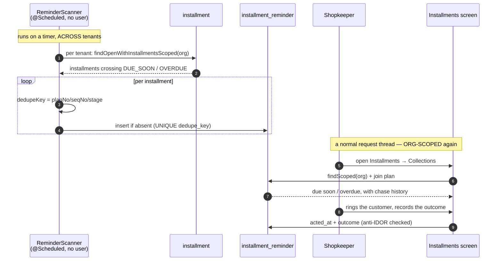

# INST-3a — the due-date scanner and the collections worklist

**Requirement R4, "remind".** Parent design: `../installment-dues-reminders-design.md`.
Status: **DONE + GREEN 2026-08-21** — `installment-reminders.cy.js` 9/9, first run, no defects;
`installment-worklist` + `installment-screen` regression green. (See §9.) Supersedes the reminder sketch in the parent doc §R4
where the two disagree.

---

## 1. What changed about the requirement, and why the slice got smaller

The parent design assumed reminders go *out* — an outbox, message templates, quiet hours, an SMS provider.
Review found the decisive fact: **the sale screen collects a name and a phone number, and nothing else.**
`Customer.email` exists as a column but the installment sale panel never asks for one, so an email reminder
for a handset buyer has no address to go to. `Channel.SMS` is a deliberate no-op pending a provider decision.

A scanner shipped on email alone would have created reminder rows, dead-lettered every one, and shown green
throughout — the *assert-the-artefact-not-the-property* failure this programme has already paid for twice.

**Decision (customer, 2026-08-21): the worklist first, no sending yet.** The shop phones people from a list,
using the numbers it already has.

That removes three things from the slice, and it is worth being explicit that they are removed **because they
became meaningless, not because they were deferred as hard**:

| Dropped | Why |
|---|---|
| Message templates | There is no message. |
| Quiet hours | Nothing is sent, so there is no wrong hour to send it in. |
| Outbox delivery machinery (`status`/`attempts`/relay) | An outbox is a queue of things to **send**. With no transport, `POSTED`/`FAILED`/attempt counts are ceremony that describes nothing. |

## 2. What is being built instead, and why it is a *record*, not an outbox

The thing the shop actually lacks is not a queue. It is an answer to **"have we already chased this person,
and what did they say?"** That is not derivable from the plan rows — the Installments screen can already
compute *who is overdue right now*, and that is exactly why it is not enough. A worklist that cannot remember
a phone call makes the shop ring the same customer three times and never ring another.

So: `installment_reminder` is a **log of chases**, one row per installment per stage.

Calling it an outbox would import delivery semantics that have no referent today, and INST-3b would then
inherit a table whose columns lie. The row does carry a `dedupe_key`, and that key is deliberately **the same
string a future SMS send will use** — so INST-3b plugs a transport into an existing idempotent record rather
than redesigning this.

## 3. ⚠ The seam this slice will fail at, if it fails

**A `@Scheduled` method runs on a thread with no authenticated user.** Every read in business-service is
org-scoped through `RequestUtil` and the `findScoped` family, and all of them are meaningless here.

The two relays already in this service *look* like precedent and are not. `GlOutboxService.flushPending` and
`AuditService` read rows that were **enqueued on a request thread**, already stamped with their tenant — the
scheduled half never needs to know an org exists.

This scanner is the opposite shape: it **originates** rows, so it must read installments across every tenant
and stamp the org from the row it read. Three rules follow, and they are the whole risk of the slice:

1. The scanner calls **explicitly cross-tenant queries**, named so that they cannot be mistaken for scoped
   ones. In the end there is exactly **one** — `findTenantsWithOpenPlansAcrossTenants()`, returning ids and no
   customer data — because the scanner iterates tenants rather than sweeping by date. See §9.
2. `organizationId` on the reminder is copied **from the plan**, never from a context that does not exist.
3. Every **read-back** path — the worklist endpoint, the mark-as-chased action — is a normal request-thread
   path and **is** org-scoped, and is anti-IDOR checked. The scanner's cross-tenant licence stops at the
   scanner.

Getting rule 3 wrong leaks one tenant's debtors to another. That is the assertion the gate leads with.

## 4. Flow

## 5. Stages

Two, and no more, because each must correspond to a *different thing the shop does*:

| Stage | Fires when | What the shop does |
|---|---|---|
| `DUE_SOON` | `dueDate` is within `remind.beforeDays` and outstanding > 0 | a courtesy call before the date |
| `OVERDUE` | `dueDate < today` and outstanding > 0 | a collection call |

An installment therefore produces **at most two** reminder rows in its life, which is what the UNIQUE
`dedupe_key` enforces. Re-defaulting after a part payment does not re-fire: the key contains the stage, not
the date the scanner ran, so a row already recorded is never recorded again.

**`OVERDUE` is still not a stored status on the installment.** INST-1 established that overdue is
`dueDate < today AND outstanding > 0`, derived, so the screen and the reminder cannot disagree. The scanner
evaluates that same predicate; the reminder row records *that we noticed*, which is a different fact from
*being overdue* and is legitimately storable.

## 6. Settings

| Key | Default | Notes |
|---|---|---|
| `pos.installment.remind.enabled` | `false` | A default is not a decision — the scanner is inert for every tenant that has not asked. |
| `pos.installment.remind.beforeDays` | `3` | How early `DUE_SOON` fires. |

⚠ `SettingsService.getChoice` **lower-cases before matching and falls back silently** (parent doc F1). Read
these as booleans/integers by key, and treat a missing setting as the default rather than as a signal.

## 7. Schema — `V43__installment_reminder.sql`

InnoDB, VARCHAR not ENUM (adding an enum value needs `ALTER … MODIFY` or writes fail with *Data truncated*).

| Column | Why |
|---|---|
| `dedupe_key` VARCHAR(120) **UNIQUE** | One row per installment per stage, enforced by the database rather than by the scanner remembering. Same shape and length as `notification_broadcast.dedupe_key`, so INST-3b can pass it straight through. |
| `organization_id` | Copied from the plan. Indexed with `stage` — the worklist's only query. |
| `plan_id`, `installment_id`, `customer_id` | The join targets the worklist needs without a second lookup per row. |
| `due_date`, `stage`, `noticed_at` | What was due, how urgent, and when we first saw it. |
| `acted_at`, `outcome`, `note` | Nullable. The half that makes it a collections tool rather than a list. |

## 8. Gate — `installment-reminders.cy.js`

Leading case is **tenant isolation**, not function: a second org's overdue customer must not appear on this
org's worklist, with a positive control proving the row exists at all so the assertion cannot pass by the
worklist being empty.

Then: the scanner is inert when the setting is off (with the positive control that it fires when on); one
installment yields exactly one row per stage across repeated scans; a recorded outcome survives; and a plan
paid off before the scan produces nothing.

**The property, not the artefact:** "a reminder row exists" is not the claim — "the shopkeeper can see who to
ring today, and can tell that they already rang them" is.

---

## 9. Implementation notes — DONE + GREEN

Three things came out differently from §3–§7 above, all discovered in the code rather than at the desk.

### The scanner iterates TENANTS; it does not sweep instalments by date

§3 said "read installments across every tenant". The code does not, and should not. `V42` created
`idx_installment_org_due (organization_id, due_date, status)` — which **leads with the org**, so a cross-tenant
date range cannot use it at all and would table-scan `installment` on a timer.

Iterating tenants is also simply the right shape: the enable switch is per tenant, so the scanner has to
resolve a setting per org regardless. A tenant that has not switched reminders on now costs **one boolean
lookup and zero row reads**. The only cross-tenant query left is
`findTenantsWithOpenPlansAcrossTenants()`, which returns **ids and no customer data** — the licence is as
narrow as it can be made, and its name says what it is.

### ⚠ `scanTenant` is deliberately NOT `@Transactional`, and the first draft was wrong

It was annotated, and that would have been a defect twice over.

It is called from `scanAllTenants` **in the same class**, and a self-invocation never passes through the
Spring proxy — so the annotation was decorative. Worse, had it taken effect it would have been *actively
harmful*: the duplicate-key catch cannot rescue a transaction a constraint violation has already marked
rollback-only, so one lost race between two overlapping passes would have destroyed **the whole tenant's
scan** at commit, surfacing as the familiar useless "Transaction silently rolled back".

The fix is `findOpenWithInstallmentsScoped` — a fetch join, so the walk needs no open session, the scan runs
with no surrounding transaction, and each `save()` is its own. A lost race now costs exactly the one row it
lost. The fetch join also removes the per-plan query the lazy walk would have issued.

### The worklist is a second view inside the Installments screen, not a screen of its own

It answers a different question about the same plans — *"who do I ring today?"* rather than *"what is
outstanding?"* — and a shopkeeper who must remember two menu entries for one job uses neither.

Opening the screen always returns to the Plans tab, and `#installmentEmpty` is no longer blanket-toggled with
the table: it is a conditional message, and toggling it as if it were part of the view announced "no
installment plans yet" over a table full of them.

### What shipped

| | |
|---|---|
| Schema | `V43__installment_reminder.sql` — UNIQUE `dedupe_key`, no `status`/`attempts` columns |
| Server | `InstallmentReminder`, `InstallmentReminderRepo`, `ReminderScanner`, `InstallmentReminderService`, `ReminderViewDTO`, 3 endpoints |
| Settings | `pos.installment.remind.enabled` (off), `pos.installment.remind.beforeDays` (3) |
| Monolith | 3 proxy routes, shipped in the same commit — an endpoint with no proxy is finding R7 |
| UI | Collections tab on `#InstallmentDiv`, 20 keys × 6 bundles |
| Unit | `ReminderScannerStageTest` — **6 pass, 0 skipped**, no container |
| Gate | `installment-reminders.cy.js` — 9 cases, tenancy first |

**Deliberately still absent:** anything that sends. `Channel.SMS` remains a no-op and this slice did not make
it one row less honest.

---

## 10. Why this gated green first time

INST-1 took four gate runs; this took one. The difference is the same one INST-2 showed: **defect rate tracks
BOUNDARIES CROSSED, not lines written.**

This slice crossed few. It writes one new table nothing else reads, it adds no field to an existing wire
contract, it changes no existing write path, and it touches no money — the scanner reads plans and writes
reminders, and the receipt path, the allocator, the invoice and the GL are all untouched. The two genuinely
new seams were both identified **before** implementation and written into §3: the request-less thread, and the
point where its cross-tenant licence has to stop.

The three defects that *were* caught were caught by reading the code rather than by the gate — a
self-invoked `@Transactional` that would have been decorative and harmful, a `uiPromptConfirm` contract taken
on trust from its name, and an `#installmentEmpty` toggle that would have announced "no plans" over a table
full of them. **Naming the risky seam in the design is what makes it cheap to check for; a seam nobody wrote
down is one nobody looks at.**
