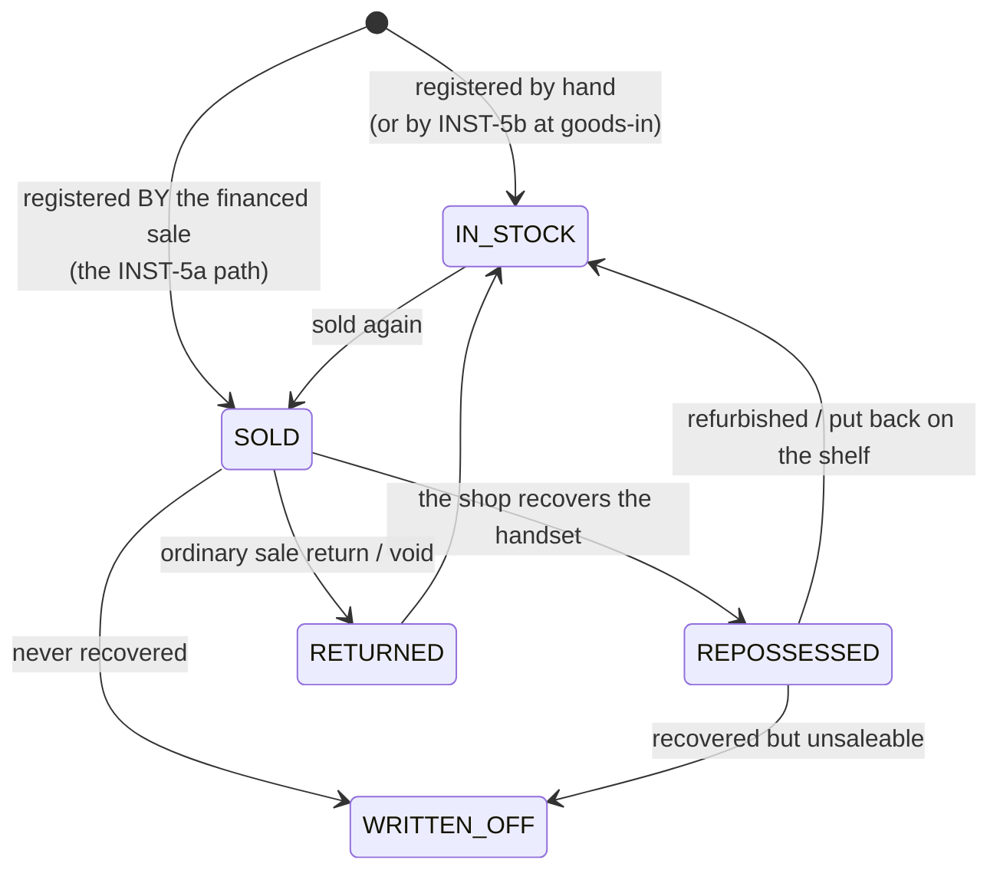
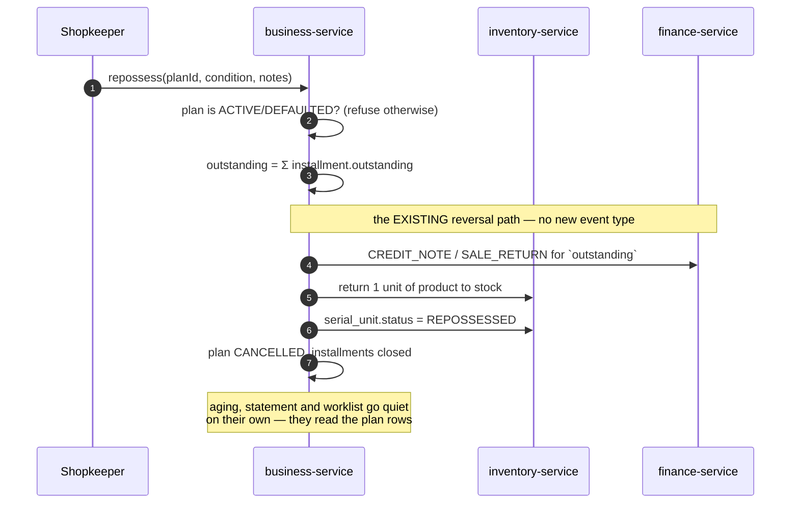

# INST-5 — serialised units and repossession

**"What makes the shop safe"** (parent design §8). Parent: `../installment-dues-reminders-design.md`.
Status: **INST-5a DONE + GREEN 2026-08-22** — `installment-repossession.cy.js` **13/13**,
business-service unit **157 / 0 fail**, `common-installment` **67 / 0 skip**.
§7 answered by the customer: FORFEIT. INST-5b (full serialisation) not started and not required.

---

## 1. Review — what is actually there today

| Claim | Verified |
|---|---|
| The IMEI is captured | Yes — `installmentPlan.assetRef`, free text, written by INST-1. |
| It is checked for reuse | **No. Nowhere.** `assetRef` is written and read back for display, and that is the whole of its life. |
| Inventory tracks units | **No.** `StockEntry` is a *batch* row — `productId`, `warehouse`, `batchNo`, `lotNo`, `expiryDate`, and a `Float quantity`. There is no per-unit identity anywhere in the platform. |
| A repossession path exists | **No.** |
| A sale reaches stock how | The saga: `reserve` → `confirm`, with `release`/`returnStock` to unwind. `ReservationPick` already records *which batch* a reservation drew from. |
| GL events for unwinding a sale | `SALE_RETURN`, `CREDIT_NOTE`, `VOID_SALE` all exist already. |

**So the exposure is concrete, not theoretical.** Today the same IMEI can be sold twice on two live plans and
nothing objects; and when a customer stops paying altogether the shop is left with a defaulted plan, a handset
it may physically recover, and no way to put that handset back on the shelf or close the debt.

## 2. Where this belongs — inventory-service, not the installment code

A serialised unit is a **stock lifecycle fact**: received, in stock, sold, returned, repossessed, scrapped.
That lifecycle is inventory-service's to own, and repossession *moves stock*, which is inventory's job.

Putting a `serial_unit` table in business-service because installments are the first caller would be the
**D-9 mistake** — the same one that has HR's Staff/Leave/Substitution embryo trapped inside education-service
today, where nothing else can reach it. Installments are the first consumer of serialisation, not its owner.

It is also not an installment-shaped capability at all. Electronics, appliances, generators and vehicles all
want per-unit identity whether or not anybody finances them; a shop selling a handset for cash has exactly the
same warranty and theft questions. Financing is simply the case where getting it wrong costs the most.

## 3. Scope — 5a now, 5b only if the shop asks for it

Full serialisation means serials captured at **purchase**, picked at **sale**, and reconciled on every stock
screen. That is not a slice; it changes the receiving flow, the sale flow, the saga and every grid. Proposing
it as one piece of work would be the "scaling the work down is the user's call" rule read backwards — so it is
split, and the split is at a real joint.

| | Scope | Why here |
|---|---|---|
| **INST-5a** *(this slice)* | `serial_unit` in inventory · uniqueness · plan link · **repossession** | Everything needed to stop a handset being financed twice and to recover one. Nothing else changes. |
| **INST-5b** *(later, optional)* | serials captured at goods-in, picked at sale, on the stock grids | Real serialised inventory. Worth doing when the shop wants warranty/theft traceability on *cash* sales too — not required by anything INST-1..5a does. |

5a deliberately does **not** pretend the shop has serialised inventory. A unit gets registered when it is
financed (or by hand), which is exactly the population the shop needs to control.

## 4. The model



`serial_unit`: `organization_id`, `product_id`, `serial_no`, `status`, `warehouse_id`, `plan_id`,
`invoice_no`, `customer_id`, `notes`, timestamps.

**`UNIQUE (organization_id, serial_no)`** is the whole safety property, and it is a database constraint rather
than a service check because the check-then-insert race is exactly how two cashiers at two tills finance the
same handset in the same second. Scoped to the org, not global: two unrelated tenants may legitimately hold
the same manufacturer serial, and a global unique would let one shop's data block another's sale — a
cross-tenant leak wearing a constraint's clothes.

## 5. Repossession — expressed in primitives that already exist

**No new GL event. No new `PostingEventRequest` field. No `gl_outbox` column.**

That is not economy for its own sake: a new posting field needs five separate copy points or it silently
vanishes, which is how `4200 Sales Discount` sat empty in every tenant for months while three specs stayed
green. A design that adds no field cannot reproduce that defect.

A repossession is two things the platform can already do, plus one row it cannot:

1. **The unpaid balance is credited off** — the existing `CREDIT_NOTE` / `SALE_RETURN` path, against the plan
   invoice, for the amount still outstanding. The receivable goes to zero through the route every other
   reversal in this system already uses.
2. **The handset returns to stock** — the existing inventory return, one unit.
3. **The unit's status becomes `REPOSSESSED`** — the only genuinely new fact.

The plan is then `CANCELLED`, and — because INST-1 made `SUM(installment.outstanding)` equal the invoice's
balance and INST-2 made the statement and aging read from those rows — the worklist, the aging report and the
statement all go quiet on their own. **Nothing needs telling twice.** That equality is worth re-gating here
rather than assumed, since this is the first flow that unwinds a plan.

## 6. Flow



## 7. ⚠ The one question that is the customer's, not mine

**What happens to the money the customer already paid?**

A buyer who paid 30,000 of 60,000 and has the handset taken back has, in effect, paid 30,000 to use a phone
for a few months. Three defensible answers, and they are not equivalent — they differ in revenue, in tax, and
in what the shop can be held to:

| | Treatment | Consequence |
|---|---|---|
| **Forfeit** ✅ **CHOSEN 2026-08-22** | Payments made are kept. Only the **unpaid** balance is credited off. | Simplest, and the design above assumes it. The 30,000 stays as revenue. |
| **Refund part** | Payments are returned less a usage or restocking charge. | Needs a refund path and a charge policy; the charge is new revenue that needs an account. |
| **Full unwind** | The whole sale is reversed and all payments refunded. | Cleanest accounting, rarely what a shop wants; the handset came back used. |

§5 is written for **forfeit**, because it is both the local norm and the only one of the three that needs no
new money movement — **and forfeit is what the customer chose**, so §5 stands unchanged and no refund path,
fee account or `PostingEventRequest` field enters this slice.

<b>The consequence worth stating plainly:</b> the only money that moves on a repossession is the credit note
that clears the unpaid balance. Everything already collected simply stays collected. That is why this slice
can be built without touching the receipt path, the allocator, or the GL contract.

Two smaller ones, defaulted rather than blocking — say if either default is wrong:

- **A repossessed unit's stock value.** Defaulted to bringing it back at the plan's cost, not at full retail;
  a used handset is not new stock.
- **Whether repossession needs a privilege of its own.** Defaulted to yes — it writes off money, which is the
  class of action `@PreAuthorize` already guards for voids and deletes.

## 8. Gate — `installment-repossession.cy.js`

Leading case: **the same IMEI cannot be financed twice** — with a positive control that the first sale
succeeded, so the refusal cannot pass by both sales having failed.

Then, and this is the case that matters most: **the trial balance after a repossession.** Not the invoice, not
the plan screen — the books. The 4200 incident had three green specs sitting on top of an empty account for
months because every one of them asserted the document rather than the ledger.

Also: a repossessed plan leaves the collections worklist and the aging report without either being told;
`SUM(installment.outstanding)` still equals the invoice balance afterwards (INST-1's invariant, first tested
here against a flow that *unwinds*); the unit is back in stock and sellable; and a plan that is already
`COMPLETED` or `CANCELLED` refuses repossession in words a shopkeeper can act on.

---

## 9. Implementation notes — INST-5a DONE + GREEN

### ⚠ `serial_unit` was DROPPED from 5a, and §2 still stands

§2 argues at length that serialisation belongs in inventory-service. It does. But building the registry *in
this slice* would have been building a capability nothing here needs — the criticism `Channel.java` makes of
inventing an SMS provider to fill an enum, repeated.

Checked against the three behaviours 5a actually promises:

| Behaviour | Needs a serial registry? |
|---|---|
| One handset cannot be financed twice | **No** — that is a fact about PLANS, and plans are business-service's |
| Repossess and restock | **No** — the existing quantity-based inventory return already does it |
| Know which IMEI a plan financed | **No** — it is on the plan already |

So 5a enforces *"one live plan per serial"*, which is not serialisation at all. When real serialisation arrives
it goes in inventory exactly as §2 describes. **Dropping it removed a second service, a contract change and a
distributed-consistency problem from a slice that never needed them.**

### V44 emulates a partial unique index, because a plain one would have been a bug

`UNIQUE (organization_id, asset_ref)` would block the shop from ever re-selling a handset it legitimately
repossessed — the CANCELLED plan still holds the serial. MySQL has no filtered index, so the standard
emulation is a STORED generated column that is NULL for rows the constraint must ignore:

```sql
live_asset_ref GENERATED ALWAYS AS (
    CASE WHEN status IN ('ACTIVE','DEFAULTED') THEN asset_ref ELSE NULL END) STORED
```

Because it is derived from `status`, **cancelling a plan frees its serial by itself.** A release that
application code has to remember is a release that eventually does not happen.

### ⚠ The serial check had to move BEFORE the sale, and the first version was a live defect

The check began life as a throw inside `InstallmentPlanService.create`, which is `@Transactional` and joins
the sale's transaction. **A business refusal thrown in a nested transaction marks the caller rollback-only**,
so the tidy message would have been replaced by "Transaction silently rolled back" — the trap this programme
has already paid for twice. The V44 constraint would have done the same on INSERT.

Reading the call site also showed the existing contract: if plan creation fails, **the sale stands** and a
note says the plan did not. Right for a technical hiccup; wrong for a serial financed to somebody else, where
the sale itself should not happen — and `SagaSellService` commits the invoice in its own `REQUIRES_NEW`
transaction, so a refusal raised during plan creation always arrives too late.

Fix: `validateSerial()` **returns** a message instead of throwing, and `addSell` calls it **before** anything
is written. The database constraint remains the race guard; the query exists so the refusal can NAME the plan
already holding the serial.

### Forfeit falls out of the arithmetic rather than being a rule

Only the **unpaid balance** is credited off, so afterwards `paidAmount == grandTotal` and there is no
overpayment for anything to refund. `paidAmount` on the posting event is zero for the same reason. Revenue
reverses **proportionally**, cost reverses **in full** — the money is split between the parties, the goods are
not.

### Configuration where TENANTS differ, parameters where TRANSACTIONS differ

Five settings, all off or conservative by default. Whether a shop repossesses is tenant policy; whether *this*
handset came back smashed is a fact about one repossession and is a **request parameter**. A tenant-level
"always restock" would eventually put a broken handset into sellable stock with nothing questioning it.

`protectedGoodsPct` is the one worth keeping: in many consumer-credit regimes goods become *protected* once a
share of the price is paid, after which taking them can void the debt entirely. It measures against the **cash
price**, so a large down payment counts — measuring against the financed balance alone would under-count
exactly the customers the rule protects.

### Caught by reading, not by the gate

A `#instReposseCondition` element that **was never created** — the condition would have silently always been
`GOOD`, restocking damaged handsets forever. Now a real select, read at click time.

### ⚠ Build note

`common-installment` gained a class, so **`mvn -pl business-service` alone FAILS** — it resolves the library
from `~/.m2` and gets the old jar. Build with `-am`, or install the library first.

### What shipped

| | |
|---|---|
| Schema | `V44__plan_live_asset_unique.sql` |
| Library | `RepossessionPolicy` (pure) — **14 tests, 0 skipped**; library total **67** |
| Server | `RepossessionService`, `validateSerial`, `findLiveByAssetRef`, `/repossessPlan` (owner-gated) |
| Settings | 5, all off/conservative by default |
| Monolith | proxy route, same commit |
| UI | IMEI + condition select + Repossess on the schedule panel, 9 keys × 6 bundles |
| Unit | business-service **150 pass / 0 fail** (13 known Testcontainers skips) |
| Gate | `installment-repossession.cy.js` — 12 cases, duplicate-IMEI and the TRIAL BALANCE leading |

---

## 10. The defect the gate caught — a rule I had already written and then broke

The first gate run failed on one assertion: **`expected -0.02 to equal 0`**.

`creditOffBalance` derived the credit note by multiplying the invoice by a rounded fraction:

```
frac   = 40000 / 60000, scale 6 HALF_UP  = 0.666667
retSub = 60000 × 0.666667                = 40000.02      ← not 40000
```

AR held 40,000 and the note wrote off 40,000.02, leaving the customer **permanently two paisa in credit** —
a residue on their statement forever and a phantom row on the aging report, which is the sort of thing that
makes a shopkeeper stop trusting the books.

### Why the trial balance did not catch it

**It still balanced.** The posting was internally self-consistent; it was simply for the wrong amount. Only
the *closing balance* — what the customer actually owes — showed the error. That is the argument for asserting
what a person is owed rather than that the ledger is internally tidy, and it is a sharper version of the 4200
lesson rather than a repeat of it: 4200 was an account nobody looked at, this was an account that balanced.

### The rule

`ScheduleGenerator` exists for exactly this: **a total is ALLOCATED, never derived by rounding a proportion**,
and the residual lands on one component so the parts sum to the whole exactly. I wrote that rule in INST-1 and
then broke it in INST-5. Extracted as `RepossessionService.creditSplit`:

```java
creditTax = taxTotal × frac, to 2dp    // tax must reconcile to the RATE — it is filed with an authority
creditNet = outstanding − creditTax    // the residual, so net + tax == outstanding EXACTLY
```

### Why the fixture nearly hid it

60,000 and 40,000 divide badly **by accident**. A price and part-payment that divided cleanly would have
passed. So the fix ships with two guards rather than one:

* `RepossessionCreditSplitTest` — 7 cases including a **sweep over ~1,500 gross/part-payment combinations**,
  asserting the parts sum to the whole for all of them. No container, no skips.
* A gate case at **59,999 sold and 17,777 paid**, asserting the closing balance is `0` **to the paisa** and
  the aging report carries no phantom row. Deliberately not a tolerance: a tolerance would have passed the
  original defect.

**A fixture that divides cleanly is not a test of rounding.** Pick numbers that are awkward on purpose.

business-service unit tests after the fix: **157 pass / 0 fail** (13 known Testcontainers skips).

---

## 11. The flake, and the split that fixed it — DONE + GREEN 2026-08-22

The second gate run failed with no assertion error at all: every hook from the middle of the file onward
failed on `downstream token still valid`, and the re-login that `cy.session` then attempted was itself
bounced back to `/login`.

That is the failure `cypress/support/commands.js` documents in full: the auth JWT lives **15 minutes**, while
`cacheAcrossSpecs` deliberately holds ONE login for the whole run, so any run longer than the token lifetime
dies from the middle onward "for a reason no individual spec could explain". The proxy answers a dead token
with `200 {"status":"ERROR"}` rather than failing loudly, which is why it reads as an application bug.

A third run was green, which confirms the cause was elapsed time rather than anything in the code.

**But this spec is the longest in the suite** — 13 cases, each seeding a product, ringing up a sale, taking a
payment and running a repossession — so it sits right on the boundary and will fail again on a slow machine.
The natural split is by subject, which the file already has as two `describe` blocks:

| | |
|---|---|
| `installment-serial.cy.js` | the three serial rules — no repossession needed | **3/3 green** |
| `installment-repossession.cy.js` | the ten repossession cases | **10/10 green** |

447 lines became 118 + 393, all 13 cases preserved, both finishing well inside the token window.

**A gate that is intermittently red is worse than a gate that is shorter.** An intermittent failure teaches
people to re-run rather than to read, and the next real defect it catches gets re-run away with it.

### Two things the split surfaced that were not the point of it

**Each file was cleaning up settings it did not own.** The serial half was resetting five repossession keys it
never set, while the repossession half set `writeOffBalance` and `remind.enabled` and restored neither. The
second is the one that mattered: `remind.enabled` left on runs the reminder scanner for every later spec, and
this suite has already been bitten by a spec that set a server-wide switch and walked away — period-close left
the books locked and reddened every sale spec after it. **Each file now resets exactly the keys it writes,
including the ones whose value happens to match the default.**

**The serial spec inherited five helpers it never calls** — `trialBalance`, `plansFor`, `customerNamed`,
`list`, `parse`. Removed: a dead helper advertises a capability the file does not have, the same reason
`existingSkusScoped` came out of the CSV slice.

The small per-file helpers (`uniq`, `setConfig`, `monthsOut`, `sellOnPlan`) stay duplicated. All seven
installment specs already define them that way, so extracting a shared fixture module would have turned a
test-only split into a refactor touching six green specs. Worth doing one day as its own piece of work; not as
a side effect of this one.

---

## 12. Follow-on: the sequence collision the gate surfaced (2026-08-22)

Gating the Installments grid produced twelve `Duplicate entry ... uq_plan_org_seq` / `uq_ch_org_invoice_seq`
failures inside one minute. The *trigger* was an artefact — two Cypress specs running at once — but the
*defect* was real and had nothing to do with this slice.

Per-org document numbers are `MAX(seq) + 1`. The UNIQUE constraints exist because that is racy (V42 says so),
and they prevent the corruption. **Nothing caught the violation and took the next number**, so the losing
till's sale died as "Transaction silently rolled back because it has been marked as rollback-only".

Fixed with `SequenceRetry`. Two findings worth keeping:

**Two different races arrived at the same catch and needed opposite answers.** `SagaSellService` already
caught `DataIntegrityViolationException` and assumed the idempotency-key race, returning "the winner's
invoice". A sale that had merely lost the race for a *number* was looked up by a key nobody had used, found
nothing, and rethrew — the sale lost. The recogniser is therefore an explicit **list of constraint names**:
`uq_installment_plan_seq` and `uq_plan_live_asset` both look similar and must NOT be retried.

**The retry has to run where a new transaction begins.** `writePending` was already `REQUIRES_NEW`;
`InstallmentPlanService.create` joined the caller, which is why `createInstallmentPlan` logged "the SALE
stands" while the sale did not. It is now `REQUIRES_NEW` — which matches reality anyway, since the invoice
commits in its own transaction before the plan is written.

**Still open:** `credit_note_seq` and `debit_note_seq` have **no unique constraint**, so they do not fail
under concurrency — they mint duplicate document numbers silently.
