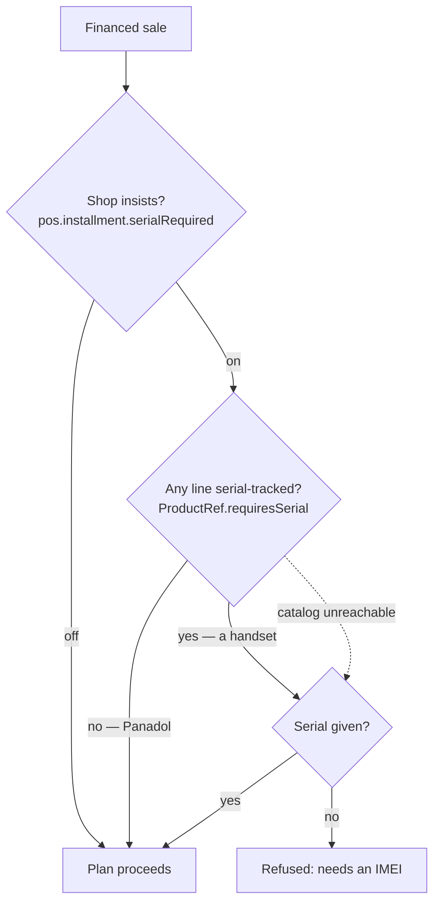

# INST-5b — a serial can only be required of something that has one

**Status:** DESIGN + IMPLEMENTED, gate pending.
**Reported:** *"I logged in with Shahzadahmad7576600@gmail.com and selling Panadol and getting validation
error 'This sale needs an IMEI or serial number before it can go on a plan.' why?"* — followed by
*"all products do not have IMEI or serial number then how we can fix it?"*

---

## 1. Why it happened — measured, not inferred

| Fact | Source |
|---|---|
| The account owns org **41, Shahzad Mobile Shop** | `myplusdb_auth.organizations` |
| `pos.installment.serialRequired = true`, set **2026-09-06 22:54:38** | `myplusdb.org_setting` |
| **Panadol** is `requires_serial = 0` | `myplusdb_catalog.products` id 2505 |
| The org has **3 untracked products and 1 tracked** | same table, grouped |

So this was the shop's own setting, not spec pollution — it was turned on alongside
`guarantorsRequired = 2` and the repossession settings, within two minutes on the Configuration screen.

**The defect is that the check never asked the product.**

```java
// before
public String validateSerial(Long orgId, String assetRef) {
    if (serial == null) {
        boolean required = settingsService.getBoolFor(orgId, "pos.installment.serialRequired");
        return required ? "This sale needs an IMEI or serial number…" : null;
    }
```

`orgId` and `assetRef`, and nothing else. A tenant-wide boolean applied to every financed sale regardless of
what was on it.

**That makes the refusal unsatisfiable.** A serial requirement means "type the serial this item has"; applied
to an item that has none, there is no keystroke that clears it. The shop could not finance 3 of its 4
products, and the rule protected nothing extra on the fourth.

## 2. The fact that was missing already existed

`ProductRef.requiresSerial` has been on the catalog contract all along, and `SerialUnitService` states the
doctrine in its own header: *"policy `requiresSerial` says whether THIS product must have one"*.
`SagaSellService` honours it per line on the ordinary sale path. **The installment check was the one place
that asked the tenant and never the product.**

So this is not a new concept — it is applying the existing one where it was skipped.

## 3. Design



**Both must be true: the shop insists, AND there is something to insist on.**

### Two decisions worth stating

**One batch call, on financed sales only.** The whole block sits inside `installmentPlan != null`, and
`productRefs(ids)` already exists in `SellController` as a batch lookup. `SagaSellService` records the
standing rule against per-line remote calls on the sale path; one call on the small minority of sales that
are financed does not breach it.

**⚠ It fails CLOSED.** If catalog cannot be reached, `productRefs` returns an empty map and we cannot tell
whether the item is tracked — so the old, stricter behaviour is kept and the serial is still required. A
guard that switches itself off when a dependency blinks reads as protection while providing none; that is the
same reasoning as the capability check immediately above it in the same method. The cashier can still
complete the sale by typing the serial, so nobody is stuck — and nobody silently loses a rule they turned on.

## 4. Changes

| File | Change |
|---|---|
| `service/InstallmentPlanService.java` | `validateSerial(orgId, assetRef, itemIsSerialTracked)` |
| `controller/SellController.java` | resolves the sale's ProductRefs; fails closed |
| `config/BusinessSettingsCatalog.java` | the setting says it applies to tracked products only |
| `cypress/…/installment-serial.cy.js` | fixture flags its product; **new case** for the untracked one |

**No schema change.** `requires_serial` already exists and is already set per product.

## 5. ⚠ The gate fixture was silently invalidated

`installment-serial.cy.js` seeded a plain product and asserted the rule refused it. After this change an
unflagged product sells, so that case would have **passed while testing nothing**. The fixture now flags the
product via `/setProductTracking` and asserts the flag took.

The two cases are deliberately paired: one proves the rule still bites for a tracked product, the other that
it lets an untracked one through. Either alone is satisfied by a build that has the other backwards.

## 6. For the shop

Nothing to reconfigure — `serialRequired` can stay on. The one tracked product still demands its IMEI; the
other three sell on terms. To make another product demand one, mark it serial-tracked on the product itself.

---

# SER-6 — the serial box follows the product (the UI half)

**Asked for:** *"also implement show/hide sellSerials on the sale form when user selection of product from
sellItemDD"*.

INST-5b stops the server demanding a serial that cannot exist. SER-6 stops the screen asking for it. Fixing
only the server leaves a cashier looking at a box they must not fill; fixing only the screen leaves the
refusal reachable by anyone who types into it.

## How the flag reaches the screen

`ProductPickerDTO` gains `requiresSerial` — a 4th field on the deliberately-lean PERF-8 projection. The
alternative was a `/productStock` round trip per selection to read one boolean, on the hot path. A boolean
against a 92-byte row is the cheaper answer, and the DTO's own doc now records why the bar was cleared.

It rides to the browser as `data-requires-serial` on the `<option>`, exactly as `data-price` already does, so
picking an item costs no extra call.

## ⚠ Three orthogonal reasons to hide one cell

`applyPosFields` states the contract: *"neither may write inline styles the other has to fight"*.

| Class | Set by | Means |
|---|---|---|
| `.cap-off` | `capabilities.js` | the tenant has no serial tracking at all |
| `.pos-hidden` | `applyPosFields` | the tenant switched the field off |
| **`.serial-na`** | **`applySerialFieldVisibility`** | **this product has no serial** |

Any one hides the cell; none can un-hide what another hid. That is only true because all three are classes —
an inline `display` would beat the stylesheet and drag the field back onto the compact row.

## ⚠ Hiding is not enough — the value must go

A hidden input is still submitted: `display:none` is kept by FormData, only `disabled` is dropped. A serial
left from the previous line would ride along on a product that cannot take one, and the server would refuse
the line for a value the cashier can no longer see. So the box is cleared as it is hidden, and `serial:clear`
fires so SER-4's condition note goes with it.

**Nothing selected leaves the box shown** — the screen is built around scanning before picking.

## ⚠ The cache had to learn a new rule

`product-picker.js` caches the option markup, and `setProductTracking` was **not** in its invalidation list.
It did not need to be: the projection carried no flags. Now it does, so marking a product tracked while the
picker was cached would leave the till hiding the box for a product that had just started needing one.

The rule this establishes: **a write belongs in `MUTATES` when it changes anything the PROJECTION carries**,
not merely when it adds or removes a product.

## ⚠ A gate case that would have tested nothing

Case 5 first did the write with `cy.request` and then re-opened the screen. Both halves were wrong:
`cy.request` bypasses the page's jQuery so `ajaxComplete` never fires, and re-visiting drops the cache by
destroying the page. It would have passed on a build with no invalidation at all. It now posts through the
page's own `$.post` and re-reads `ProductPicker.load` on the same page, with no reload.
