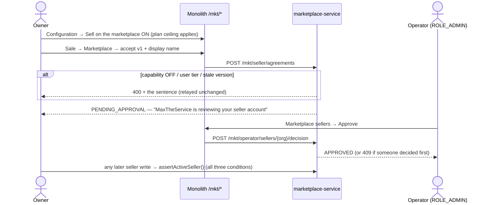

# MKT-0a: Marketplace selling capability + seller onboarding

**Live verification 2026-10-03:** headed gate **8/8 on a live stack** (48/48 across MKT-0a…1e in one run) and every manual case walked step by step and recorded — [live verification](../marketplace/live-verification-2026-10-03.md). The status below is the record from before that run.

**Status:** IMPLEMENTED, unit-green. **Headed Cypress gate written (run 2026-10-03, see above)**: this container has no
running stack (no Docker daemon, no MySQL). Results:
- `common-settings` **70 / 0 / 0 skipped**
- `auth-service` **72 / 0 / 0**, including `ShapeChangeKeepsOptInTest` 2/2
- `marketplace-service` **221 run / 0 failed / 23 skipped**. The 23 skips are the Testcontainers tests, so **V24
  has not been executed against MySQL** (D2a: reported, not counted as green).
- The monolith compiles. The seller fragment renders through `SpringTemplateEngine` in en/ur/ar with every key
  resolved.

Branch `claude/e2e-analysis-testing-docs-999pqb`. Programme: [`../marketplace-multiseller-design.md`](../marketplace-multiseller-design.md).
Rulings R-MKT-1…7 accepted 2026-10-03.

## 1. Document

A business must be able to say "sell my stock on the MaxTheService marketplace", and MaxTheService must be able to
say "yes" or "not yet". Before this slice neither was possible: there was no switch, no agreement and no seller
record.

**Three conditions, three owners.** A seller may sell only when all three hold. Each is shown on its own line on the
seller screen, because each is fixed by a different person:

| Condition | Owner | Where |
|---|---|---|
| `marketplaceSelling` capability ON | the business owner, bounded by the plan | `org.cap.marketplaceSelling` (common-settings) |
| Seller + data-sharing agreements accepted, current version | the owner or an admin | `mkt_agreement_acceptance` |
| Seller account APPROVED | MaxTheService (platform operator) | `mkt_seller_account` |

**Why the third exists (found by the trace, recorded in the design's rulings).** `Plan` is a ceiling that only
removes, and TRIAL/DEMO/PRO are `allOf`. So a PRO owner can switch the capability on without MaxTheService knowing.
The capability alone could not carry "MaxTheService vets its sellers".

## 1b. Standards

| Dimension | Rule |
|---|---|
| Business / domain | Source §9: data use is a written data-sharing agreement, never "consignment". §20: seller onboarding precedes any live order. Acceptance is per version and append-only, so what a seller agreed to at the time of any order stays provable |
| SaaS multi-tenancy | Tenant rows keyed by the JWT org. The client never sends an org on tenant paths. Operator paths key on `ROLE_ADMIN` via `CurrentUser.isPlatformOperator()`, never `ADMIN_PRIVILEGE` (every tenant owner holds that). A tenant posting to the operator route is refused at the monolith (`@PreAuthorize`) **and** at the service |
| Live-modules rule | Opt-in (EX-0a mechanism): OFF for every tenant on deploy. Two new tables; no existing column changes. The 15 default-ON capabilities are untouched (asserted) |
| Microservice boundaries | Capability in common-settings (the shared rule). Seller account and acceptances in marketplace-service (owns the marketplace aggregate). Monolith: proxy + screens only |
| Design patterns | **State machine** (`MarketplaceStateMachines.SELLER_ACCOUNT`; the screen's buttons follow the same edges). **Guard / Policy** (`MarketplaceSellerService.assertActiveSeller`, the one check every later seller write calls). **Optimistic lock** (`@Version` + client-sent version on decisions) |
| SOLID / DRY | `SellerAccess` mirrors `ExpenseAccess` (fail-closed capability, owner/admin tier). One JS file per screen. Responses read through `api-response.js` (standard 8c) |
| Testing | Unit: opt-in list explicit; FREE excludes it; no shape presets it; shape change keeps it (auth). Seller lifecycle, idempotent acceptance, stale version, stale decision (409), reason required, tenant ≠ operator, fail-closed capability against a real `SecurityContext`. Mutation-checked (§5). Cypress gate `mkt-0a-capability-entitlement.cy.js`, 8 cases, first case drives the real UI |

## 2. Design

**Schema (V24, idempotent, VARCHAR statuses per the expense-service recipe, not MySQL ENUM):**
`mkt_seller_account` (UNIQUE `organization_id`, `(status, applied_at)` index for the operator queue, `version`) and
`mkt_agreement_acceptance` (UNIQUE `(organization_id, agreement_code, agreement_version)`).

**Lifecycle:** `PENDING_APPROVAL → APPROVED | REJECTED`; `APPROVED → SUSPENDED → APPROVED`;
`REJECTED → PENDING_APPROVAL` (by re-accepting). A suspended seller cannot lift its own suspension by re-accepting.

**Contracts:**

| Monolith route | → marketplace-service | Who |
|---|---|---|
| `GET /mkt/seller` | `GET /mkt/seller` | any member: `{capabilityOn, requiredVersion, agreements, agreementsCurrent, account, canSell}` |
| `POST /mkt/acceptAgreement {version, displayName}` | `POST /mkt/seller/agreements` | owner/admin, capability ON |
| `GET /platform/mkt/sellers?status=&page=&size≤100` | `GET /mkt/operator/sellers` | `ROLE_ADMIN` |
| `POST /platform/mkt/decideSeller {organizationId, decision, reason, version}` | `POST /mkt/operator/sellers/{org}/decision` | `ROLE_ADMIN` |

**UI:** Sale → **Marketplace** (`#navMarketplaceSeller`, `data-capability="marketplaceSelling"`) opens
`#MarketplaceDiv` (`fragments/marketplace-seller.html`, `/js/common/marketplace-seller.js`). Operator console →
**Marketplace sellers** (`#platMktSellers`, `/js/platform/marketplace-sellers.js`). i18n: 34 keys × 6 bundles
(parity 2677 each). JS reads only `ui.js.*`.

## 3. Architecture & UML

## 4. Implement

- [x] `Capability.MARKETPLACE_SELLING` opt-in, not in `Plan.FREE`; `OptInCapabilityTest` lists opt-ins explicitly
- [x] `capability-shapes.cy.js` `OPT_IN` list gains `marketplaceSelling` (the one hand-kept list, found by grep)
- [x] V24, entities, repositories, `SellerAccess`, `MarketplaceSellerService`, controller
- [x] Monolith proxy `MarketplaceSellerController` + seller fragment + JS + operator panel + JS + i18n ×6
- [x] Unit tests (16 new) + `SELLER_ACCOUNT` reachability
- [ ] **Headed Cypress gate** on a running stack: `npx cypress run --headed --env mkt=0a --spec cypress/e2e/marketplace/mkt-0a-capability-entitlement.cy.js`
- [ ] `FlywayMigrationTest` with Docker, reading `Skipped: 0`
- [ ] Manual walk (manual-testing page, MKT-0a section)

## 5. Test

**Mutation check.** With `assertActiveSeller` no longer requiring APPROVED, `guardNamesTheGap` and `lifecycle` go red.
Restored afterwards.

**Found on the way, not a product defect.** A standalone render harness reported every new English key unresolved.
`passay-1.0.jar` ships its own `messages.properties`, which shadowed the app's base bundle because the harness put
the app's classes last on the classpath. The app puts its own classes first. With the order fixed, all three
locales resolve. Also, `target/classes` had a stale `messages_en.properties` from a `master` build in the same
directory; this branch has no such file, and a clean build does not produce one.

**Gate cases (written before this slice was built, rewritten against the implemented contract):**
01 the real UI (switch on → read → accept → reviewing) · 02 OFF for a tenant that never opted in · 03 refused write
records nothing (positive control) · 04 user tier refused · 05 version/who/when + idempotent + stale version ·
06 only the operator decides; suspension reason reaches the screen · 07 operator console buttons follow the
lifecycle · 08 tenant cannot read the operator list (positive control).
