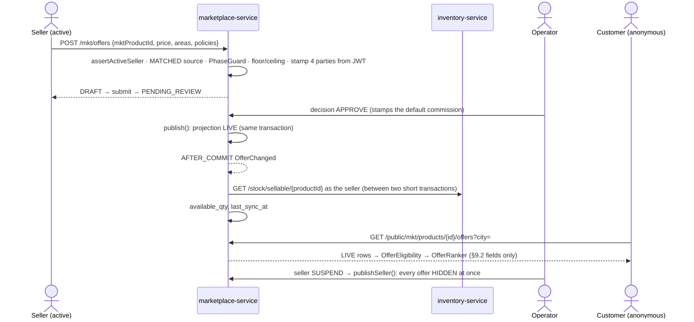

# MKT-1c: Offers, policies, approval and the published projection

**Live verification 2026-10-03:** headed gate **11/11 on a live stack** (48/48 across MKT-0a…1e in one run) and every manual case walked step by step and recorded — [live verification](../marketplace/live-verification-2026-10-03.md). The status below is the record from before that run.

**Status:** IMPLEMENTED, unit-green. **Headed Cypress gate written (run 2026-10-03, see above)** (no running stack in this
container). `marketplace-service` **262 run / 0 failed / 23 skipped**. The skips are Testcontainers, so **V26 has
not been executed against MySQL** (D2a). The monolith compiles. The seller fragment renders in en/ur/ar with every
key resolved. `business-service`, `pharma-service`, `inventory-service` and `marketplace-service` test-compile
against the changed `InventoryClient`. Programme: [`../marketplace-multiseller-design.md`](../marketplace-multiseller-design.md).
Depends on MKT-0a (`assertActiveSeller`) and MKT-1b (a MATCHED source is required).

## 1. Document

A matched product is not yet something a customer can buy. The **offer** is: one seller's price, cities, delivery
promise, warranty and returns for one marketplace product (source §5.3). MaxTheService approves it before it is
shown, and the customer sees a **projection** of it that holds only what the customer may see (source §9.2–9.3).

**The rule that shapes everything (source §3, §22): the browser never chooses a party.** Seller, stock owner,
custodian and fulfiller are stamped from the token on every save. In Phase 1 they are all the seller
(`MERCHANT`). Supplier, platform and consignment stock are refused until their phases.

## 1b. Standards

| Dimension | Rule |
|---|---|
| Business / domain | Offer per seller per product (the Amazon / Mirakl offer model). Warranty names its real provider; MaxTheService is never assumed (R14.2). Policies are **append-only**: to change terms the operator creates a new one and deactivates the old, so what was sold keeps its terms |
| SaaS multi-tenancy | `mkt_offer` is keyed by the JWT org; reads and writes are `findByIdAndOrganizationId`, so another seller's offer reads as "No such offer." (same as a non-existent id). `mkt_policy` and price limits are platform rows: operator-only (`ROLE_ADMIN` via `CurrentUser.isPlatformOperator()`), refused at the monolith (`@PreAuthorize`) **and** at the service |
| Live-modules rule | Two nullable columns on `mkt_product` and three new tables. No existing module's table changes. The public route is a new anonymous GET; nothing else is opened |
| Microservice boundaries | marketplace-service owns offers, policies and the projection. inventory-service stays the owner of stock: the projection **asks** `GET /stock/sellable/{productId}` as the seller (new `InventoryClient.getSellableDetail`, an existing endpoint). It never stores a stock history |
| Design patterns | **State machine** `MarketplaceStateMachines.OFFER` (DRAFT → PENDING_REVIEW → APPROVED/REJECTED; APPROVED ⇄ SUSPENDED). **Read-model projection** (`mkt_offer_projection`, written in the same transaction as the offer). **Transactional outbox-lite**: `OfferChanged` → `@TransactionalEventListener(AFTER_COMMIT)` → stock sync, plus a `@Scheduled` sweep. **Optimistic lock** on offer edits and decisions |
| SOLID / DRY | Ranking, eligibility and city matching come from the MKT-1a domain (`OfferRanker`, `OfferEligibility`), the code checkout will use. Commission terms are validated by `CommissionPolicy` (MKT-1a) at creation. One error-relay path in the monolith controller |
| Testing | 27 unit cases across four classes, plus mutation checks (§5). Gate `mkt-1c-offers.cy.js`, 11 cases: the first drives the seller UI, the fifth the operator console; refusals carry positive controls |

## 2. Design

**Schema (V26, idempotent, VARCHAR statuses, no JSON/TEXT/ENUM):**
- `mkt_product` + `price_floor`, `price_ceiling` (nullable: no limit until the operator sets one).
- `mkt_policy`: type WARRANTY / RETURN / COMMISSION, the terms as columns, `active`, `is_default` (one default
  commission at a time). Never updated except `active`/`is_default`.
- `mkt_offer`: UNIQUE `(organization_id, mkt_product_id)` (one offer per seller per product in Phase 1), the four
  party ids, prices, `delivery_areas`, `promise_hours`, three policy ids, `approval_status`, `paused`, `version`.
  **No stock column**: availability is inventory's.
- `mkt_offer_projection`: one row per offer. `status` LIVE / HIDDEN plus exactly the §9.2 fields: seller display
  name, price, promise, areas, warranty and return terms, `available_qty`, `last_sync_at`. There is no cost, margin,
  purchase, supplier or movement column, and a unit test reads the entity's fields to prove it.

**What is trusted from where:**

| Field | Source |
|---|---|
| seller / stock owner / custodian / fulfiller | JWT org (stamped on every save; client values are not even bound) |
| the product the offer sells | the seller's MATCHED `mkt_product_source` (no match → refused) |
| regulated status, stock source phase | `PhaseGuard` (MKT-1a) |
| price, cities, promise, warranty/return choice | the seller, within the operator's floor/ceiling and active policies |
| commission | the operator's default COMMISSION policy, stamped at approval. Never the seller's choice |
| sellable quantity | inventory-service, live, as the seller |

**LIVE rule (one place, `OfferProjectionService.publish`):** offer APPROVED and not paused, **and** seller account
APPROVED, **and** marketplace product APPROVED and not regulated. Anything else is HIDDEN. A seller decision
(suspend, reinstate) re-publishes every offer of that seller in the same transaction (`publishSeller`).

**Public read:** `GET /marketplace/public/products/{id}/offers?city=&sort=&qty=`, anonymous, permitted for GET only
in `SecSecurityConfig`. The monolith proxies through the gateway's allow-listed `/api/marketplace/public/` with
3 s / 5 s timeouts. It reads LIVE projection rows and applies `OfferEligibility` (city, quantity, price limits,
staleness), then `OfferRanker`.

**Contracts:**

| Monolith route | → marketplace-service | Who |
|---|---|---|
| `POST /mkt/saveOffer` | `POST /mkt/offers` | active seller (create when no `id`; a partial edit keeps what it does not mention) |
| `POST /mkt/submitOffer {id}` | `POST /mkt/offers/{id}/submit` | active seller; needs warranty + return policy |
| `GET /mkt/myOffers` · `GET /mkt/getOffer?id=` | `GET /mkt/offers` · `/mkt/offers/{id}` | seller (own org) |
| `GET /mkt/sellerPolicies` | `GET /mkt/policies` | seller: active WARRANTY + RETURN only |
| `GET /platform/mkt/offerQueue?status=` | `GET /mkt/operator/offers` | `ROLE_ADMIN` |
| `POST /platform/mkt/decideOffer {id, decision, note, version}` | `POST /mkt/operator/offers/{id}/decision` | `ROLE_ADMIN`; APPROVE \| REJECT \| SUSPEND \| REINSTATE; reject/suspend need a note |
| `GET /platform/mkt/policies` · `POST /platform/mkt/createPolicy` · `POST /platform/mkt/deactivatePolicy {id}` | `/mkt/operator/policies[/{id}/deactivate]` | `ROLE_ADMIN` |
| `POST /platform/mkt/productLimits {id, priceFloor, priceCeiling}` | `POST /mkt/operator/products/{id}/limits` | `ROLE_ADMIN` |
| `GET /marketplace/public/products/{id}/offers` | `GET /public/mkt/products/{id}/offers` | anyone |

**UI:** the seller's Marketplace screen gains "My offers" (`#mktOffersBox`: form `#mktOfferForm`, table
`#mktOffersTable` with `tr[data-offer-id]` and a `[data-status]` badge; Pause/Resume on live offers). The operator
console gains "Offer approvals" (`#platMktOffers`, `#mktOfferQueue`, buttons `[data-decision]`) and "Marketplace
policies" (`#platMktPolicies`, form `#mktPolicyForm`, Deactivate only). i18n: 40 keys × 6 bundles (2756 each, none
missing, computed by script). This includes `ui.js.loadFailed`, which the 0a/1b JS already used and had been
falling back to English.

## 3. Architecture & UML

## 4. Implement

- [x] V26, `MarketplacePolicy`, `MarketplaceOffer`, `MarketplaceOfferProjection`, repositories, `OFFER` state machine
- [x] `MarketplacePolicyService`, `MarketplaceOfferService`, `OfferProjectionService`, `PublicOfferService`, controller
- [x] `InventoryClient.getSellableDetail` (existing inventory endpoint `StockController#sellable`)
- [x] Monolith: 11 proxies + public proxy + `SecSecurityConfig` GET permit + seller block + 2 operator panels + i18n ×6
- [x] 27 unit cases + mutation checks; full suite 262/0/0 (23 skipped)
- [ ] Headed gate: `npx cypress run --headed --env mkt=1c --spec cypress/e2e/marketplace/mkt-1c-offers.cy.js`
- [ ] `FlywayMigrationTest` with Docker (`Skipped: 0`)
- [ ] Manual walk (MKT-1c section of the manual-testing page, cases M-1c-00…08)

## 5. Test

**Mutation checks.**
- Removing the stock-owner stamp from `save` turns `partiesStamped` red. Restored, and verified restored.
- Letting the LIVE rule ignore the seller account's status turns `liveRule` red. Restored.

**Defects caught by tracing before the first run:**
- The stock sync runs from an AFTER_COMMIT listener reached by a self-call. A `@Transactional` method there would
  neither open a new transaction (proxy bypassed) nor commit (the finished one is joined). It now uses a
  programmatic `TransactionTemplate(REQUIRES_NEW)`, with the remote call **between** the two short transactions.
- Finding the seller's matched source by scanning a page of proposals would miss it beyond 100. It uses a
  dedicated repository query now.

**Requirements this slice covers only in part (stated, not counted as done):**

| Requirement | Built in 1c | Left, and where |
|---|---|---|
| MKT-R7.4 operator rules | commission rules, price floor/ceiling, warranty/return policies | max discount and promotion approval (no promotion model yet, MKT-2); ranking defaults (MKT-1d sort); delivery fee and tax policy (MKT-1e checkout) |
| MKT-R7.5 seller configures | price, cities, promise, warranty/returns within rules, pause | quantity is inventory's (by design); seller-funded promotion (MKT-2) |
| MKT-R14.1 warranty display | provider, months, start (delivery), covers, excludes, claim process | service centre and end date shown at order time (MKT-1e snapshot) |

**Known limits, stated:**
- A seller may edit an APPROVED offer's price without re-review, within the floor/ceiling. This is deliberate
  (price changes are routine). The approval covers the seller and product, and the limits cover the price.
- Two concurrent "create default commission" calls could leave two defaults; `defaultCommission()` then picks one.
  Operator-only and rare; a unique partial index is not available in MySQL. Recorded for MKT-1g, which reads the
  commission at settlement.
