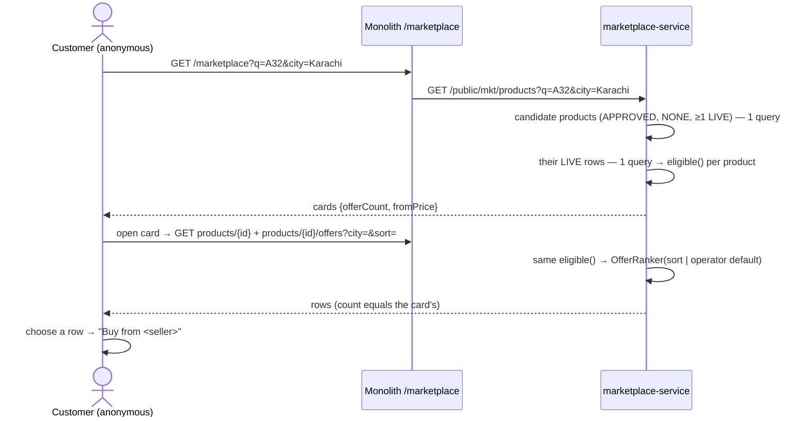

# MKT-1d: Public catalogue, offer comparison, customer sort

**Status:** IMPLEMENTED, unit-green; the page was driven in Chromium against a stub API (30/30). **Headed Cypress gate
written and NOT yet run** (no running stack). `marketplace-service` **272 run / 0 failed / 23 skipped** (Testcontainers:
**V27 and the search query have not run against MySQL**, D2a). Programme: [`../marketplace-multiseller-design.md`](../marketplace-multiseller-design.md).
Depends on MKT-1c (LIVE projection rows, `PublicOfferService`, the anonymous offers read).

## 1. Document

This is the first slice a customer sees. A shopper searches "Galaxy A32", sees **one** card saying
"Available from 2 sellers · From Rs. 51,500", opens it, compares the two shops side by side, sorts them the way they
care about, and picks one. The pick is explicit and named on the button: "Buy from Shahzad Mobile Shop" (source §5.4,
§7.1–7.3). Checkout itself is MKT-1e; in 1d the button records the choice and says ordering opens next.

**Three rules that shape the slice:**
1. **The card and the offer table cannot disagree.** "Available from 2 sellers" must mean the table shows 2. Both
   numbers come from the same function (`PublicOfferService.eligible`) with the same city and the same guardrails.
2. **A sort is a preference, never a way around the rules** (§7.6). Ineligible offers (unapproved, paused, suspended
   seller, outside the city, outside the price limits, stock unconfirmed for 30 minutes, regulated) are removed
   *before* sorting; an unknown sort falls back to the default instead of failing.
3. **Nothing is chosen for the customer** (§7.3). No offer is pre-selected; the Buy button is disabled until the
   customer chooses, and then names the seller.

### 1a. Trace (RULE 0)

| What | Found | Consequence |
|---|---|---|
| Existing `/marketplace` page | none (the single-shop `/store` exists, hard-coded English) | new page, translated through the six bundles |
| Callers of `MarketplaceOfferProjectionRepository` | 7 call sites in 4 methods: `publish` (reads its own row, writes status + terms), `syncStock` (reads, writes qty + sync time), `sweep` (LIVE, oldest sync first), `PublicOfferService.offers` (LIVE rows of one product). `findByStatusAndLastSyncAtBefore` has **no caller** | the search adds 1 reader (LIVE rows of a page of products). 2 writers, both unchanged; 1d writes nothing to the projection |
| Ranking with no sort | `OfferRanker` → `DEFAULT_CHAIN` (promise → price → promotion → rating → distance → history) | "Recommended" = the default chain |
| Data behind each sort | price, promise, warranty months, return days: present. Rating, distance, promotion: **no source yet** | only the 4 sorts with data are offered on screen; the other 3 still parse (no error) and fall through to the chain |
| Gateway | `JwtAuthenticationFilter` allow-lists the prefix `/api/marketplace/public/` | no gateway change |
| Service security | `SecurityConfig` permits `/public/**` | no change |
| Monolith security | GET `/marketplace/public/**` permitted (MKT-1c) | add GET `/marketplace` (the page) |
| JS translation | `LocaleInterceptor` puts `ui.js.*` into `window.__MSG`; `i18n.js` gives `t()`/`tHas()`; neither needs jQuery | the public page loads only `i18n.js` + `api-response.js` + its own module, no jQuery |
| Operator "ranking default" (R7.4, deferred here by MKT-1c) | no platform-wide settings store exists (common-settings is per tenant) | a one-row-per-key `mkt_platform_setting` table in marketplace-service |

## 1b. Standards

| Dimension | Rule |
|---|---|
| Business / domain | One product, N offers (the Amazon "Other sellers on Amazon" / Takealot / Daraz model). Explicit choice; the cheapest is never forced. Freshness is shown ("Stock checked 4 min ago"), never implied |
| SaaS multi-tenancy | Anonymous reads of platform rows only. A card carries the seller's **display name** and id, never cost, margin, supplier or another tenant's internals (the 1c projection guarantee) |
| Live-modules rule | One new table (`mkt_platform_setting`). No existing table or read changes |
| Microservice boundaries | marketplace-service ranks and counts; the monolith only proxies and renders. No call to catalog or inventory on a browse: the projection is the read model (R18.1) |
| Design patterns | **Read model / CQRS** (projection) · **Strategy** (`OfferRanker` per sort) · **Single source for counts** (`eligible`) · **Progressive enhancement**: search is a real `<form method="get">`, so the URL is shareable and the back button works |
| Performance | Search pages ≤ 24 cards, one query for the products and one for their LIVE rows (no N+1). Input debounced 300 ms; requests in flight are aborted when superseded. The page ships no jQuery |
| Accessibility | Labels on every control, `aria-live` result count, keyboard-operable choice (real radio buttons), focus moves to the offer table on open, ≥ 44 px targets, RTL for ur/ar |
| SOLID / DRY | The ranking, eligibility and sort parsing are MKT-1a's. The proxy moves from `RestTemplate` to `RestClient` (Spring 6.1), the current Spring HTTP client |
| Testing | Unit: card count = table length for the same city; stale/paused/suspended excluded from both; LIKE wildcards escaped; unknown sort → default; default sort setting validated. Gate `mkt-1d-public-catalogue.cy.js` drives the real page |

## 2. Design

**Schema (V27, idempotent):** `mkt_platform_setting (setting_key VARCHAR(64) PK, setting_value VARCHAR(255) NOT NULL,
updated_by_user_id BIGINT, updated_at DATETIME(6), version INT)`. Phase 1 key: `public.defaultSort`
∈ {`RECOMMENDED`, `LOWEST_PRICE`, `FASTEST`, `WARRANTY`, `RETURN_POLICY`}, absent ⇒ `RECOMMENDED`.

**Contracts:**

| Monolith route | → marketplace-service | Answer |
|---|---|---|
| `GET /marketplace` | (page) | `marketplace.html`, anonymous |
| `GET /marketplace/public/products?q=&city=&page=&size≤24` | `GET /public/mkt/products` | page of cards `{id, name, brand, category, offerCount, fromPrice, fastestPromiseHours}`; products with 0 eligible offers for the city are left out |
| `GET /marketplace/public/products/{id}` | `GET /public/mkt/products/{id}` | `{id, name, brand, model, variant, colour, size, packSize, condition, category, defaultSort, sorts[]}`; not approved / regulated → "No such product." |
| `GET /marketplace/public/products/{id}/offers?city=&sort=` | (MKT-1c) | unchanged shape; a missing or unknown sort now applies the operator's default |
| `GET/POST /platform/mkt/defaultSort` | `GET/POST /mkt/operator/settings/default-sort` | `ROLE_ADMIN` only |

**Search:** `q` trimmed, cut to 80 characters, LIKE wildcards `%` `_` escaped with `!` (and `!` doubled), matched case-insensitively against canonical name,
brand and model. Only APPROVED, non-regulated products with at least one LIVE row are candidates; their LIVE rows
come in one `IN` query and go through `eligible` (city, staleness, price limits). A product left with 0 is dropped
from the page, so a page may hold fewer than `size` cards; `hasMore` comes from the candidate page. Known limit:
`LIKE '%q%'` scans; fine for the pilot catalogue, FULLTEXT or a search engine when it is not.

**Page (`/marketplace`):** one page, two states driven by the URL (`?q=&city=` → results; `?product=` → offers),
`history.pushState` so back returns to the results. City is a text field remembered per browser (R-MKT-11, the pilot
city list, is still open). Offer row: seller, price, delivery promise, warranty (provider, months), returns, stock
check time, a "No ratings yet" placeholder until ratings exist. Buy button: disabled → "Buy from <seller>"; on click
it shows "Ordering opens soon. You chose <seller> at Rs. <price>." (MKT-1e replaces this).

## 3. Architecture & UML

## 4. Implement

- [x] V27 + `MarketplacePlatformSetting` + repository + `MarketplaceSettingsService` (operator-only, validated)
- [x] `PublicOfferService`: `eligible()` shared by search and offers; `search()` (2 queries, ≤ 24 cards); `product()`;
      operator default sort; server-computed `checkedSecondsAgo`
- [x] Controller routes; monolith proxy moved to `RestClient` with `UriComponentsBuilder` encoding; security GET
      `/marketplace`; operator "Order customers see first" control
- [x] `marketplace.html` + `/js/marketplace/marketplace-public.js` (no jQuery) + 50 i18n keys × 6 (2808 each)
- [x] 10 new unit cases + mutation check; gate rewritten (10 cases); 8 manual cases; RTM recomputed
- [ ] Headed gate: `npx cypress run --headed --env mkt=1d --spec cypress/e2e/marketplace/mkt-1d-public-catalogue.cy.js`
- [ ] `FlywayMigrationTest` with Docker (`Skipped: 0`) — also the first real run of the JPQL search
- [ ] Manual walk (MKT-1d section, M-1d-01…08)

## 5. Test

**Unit.** `PublicOfferServiceTest` 12 (6 new) and `MarketplaceSettingsServiceTest` 4: the card count equals the table
for the same city; stale and out-of-city offers leave both; "from" recomputes; LIKE wildcards escaped and long text
cut; at most 24 cards; no sort → operator default, unknown → operator default, explicit Recommended → the chain; a
stale stored default never breaks a browse; regulated or unapproved reads as "No such product."; only sorts with data
can be the default; tenant refused.

**Mutation check.** Letting the card ignore the city (`eligible(p, rows, null, …)`) turns `cardFollowsGuardrails`
red. Restored, and verified restored.

**The page, driven for real.** The template was rendered by Thymeleaf with the real bundles (en, ur, ar, fr: 0
unresolved keys, `dir=rtl` for ur/ar) and driven in Chromium with the three reads stubbed to the service's shapes:
30/30 checks covering gate cases 01–05 and 10. These include: exact card text; Back returns to results; sort order;
sort survives reload; nothing pre-selected; keyboard choice; "Buy from <seller>"; the Lahore message; unknown sort
→ Recommended; "No such product."; a seller name containing markup shown as text; every control labelled; no
sideways scroll at 375 px; touch targets ≥ 44 px; no script errors in en and ur. This exercises the page, not the
service or the database.

**Defects caught by re-reading before the run:**
- "Stock checked 4 min ago" first compared the server's zone-less `lastSyncAt` with the shopper's clock, which is
  wrong by the time-zone difference. The age is now computed on the server (`checkedSecondsAgo`).
- Back first guessed from `document.referrer`, which does not change on in-page navigation; it now uses
  `history.state` set when a card is opened.
- An explicit "Recommended" from the customer would have been replaced by the operator's default; `resolve`
  treats it as a choice.
- The JPQL `ESCAPE '\'` would break under MySQL (a backslash escapes the closing quote); the escape character is
  `!`.

**Requirements covered in part (stated, not counted as done):**

| Requirement | Built | Left, and where |
|---|---|---|
| MKT-R7.1 filters | price, fastest, warranty, returns; explicit choice | nearest (no geography yet), promotion (MKT-2), rating (no rating source) |
| MKT-R7.2 display | seller, price, promise, warranty, returns, stock check time | distance (no geography); rating shows "No ratings yet" |
| MKT-R18.2 projection | price, promise, area, availability, last sync, seller | promotion, rating, "seller online" |

**Known limits, stated:**
- `LIKE '%q%'` scans `mkt_product`. Fine for the pilot catalogue; FULLTEXT or a search engine when it is not.
- A page may hold fewer than 24 cards when the city filter drops products; "Show more" follows the candidate page.
- Every page receives all `ui.js.*` strings (the app-wide `LocaleInterceptor` mechanism): about 70 KB in English and
  190 KB in Urdu before compression. A per-page subset is a platform-wide improvement, not a 1d change.
- The Buy button ends at "Ordering opens soon" until MKT-1e.
