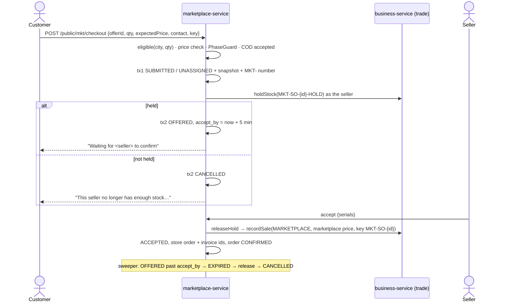

# MKT-1e: One-seller checkout, stock hold, seller acceptance window

**Live verification 2026-10-03:** headed gate **10/10 on a live stack** (48/48 across MKT-0a…1e in one run) and every manual case walked step by step and recorded — [live verification](../marketplace/live-verification-2026-10-03.md). The status below is the record from before that run.

**Status:** IMPLEMENTED, unit-green; the shopper's page and the seller's table were driven in Chromium against stubs
(20/20 and 7/7). **Headed Cypress gate written (run 2026-10-03, see above).** `marketplace-service` **293 run / 0 failed / 23
skipped** (Testcontainers: **V28 has not run against MySQL, and the application context with the new beans has not
been started**; both are D2a, reported, not counted as green). Monolith 78/0/0. Programme: [`../marketplace-multiseller-design.md`](../marketplace-multiseller-design.md) §5.4,
§5.7. Depends on MKT-1d (the chosen offer) and MKT-1c (offers, policies, projection).

**Split (decided here, recorded in the design §8):** MKT-1e covers **cash on delivery**: checkout, hold, the seller's
acceptance window, the seller's sale and invoice, expiry, tracking. MKT-1e2 covers the **platform customer account**
(R-MKT-5), **online payment** collected by the platform (R-MKT-2), and **customer cancellation / My orders**. Online
payment needs the settlement ledger's direction of money (MKT-1g) to be correct, so it is not built half-way here.

## 1. Document

A shopper who chose "Buy from Shahzad Mobile Shop" fills in name, phone, address and city, chooses cash on delivery,
and places the order. **Nothing is promised that the seller has not confirmed** (source §10, §18.5): the page says
"Waiting for Shahzad Mobile Shop to confirm", the stock is held for the seller, and the seller has 5 minutes to accept
or reject. Accept → the sale is recorded **in the seller's own books** through the same O1 sale path the till uses
(R-MKT-1: the seller is the merchant of record) and the order becomes CONFIRMED. Reject or no answer in time → the
stock is released and the order is CANCELLED with the reason shown to the shopper.

### 1a. Trace (RULE 0)

| What | Found | Consequence |
|---|---|---|
| Existing storefront checkout | `CheckoutService.place` → `OrderService.placePublic`: `TradeClient.recordSale` (reserve FEFO, invoice, tax, COGS, GL, idempotent on key) | the seller's sale reuses `recordSale`; no second sale path |
| `placePublic` reuse? | hard-codes `source=STOREFRONT`, `channel=STOREFRONT`, may **split into a backorder** (O5c), links a per-store customer | a dedicated `OrderService.placeMarketplace` beside it, reusing its private helpers (`asStore`, `reverseQuietly`, numbering, notification). A marketplace order is all-or-nothing |
| Readers of `orders.source` | 3: `OrderRepository.findPage` filter (request param), `DispatchInvoiceService` (acts on `FIELD` only), `toDTO` | a new value `MARKETPLACE` is safe; column is `varchar(255)` (not ENUM) |
| Readers of the sale `channel` | 1: `InternalSalesController` logs it | `MARKETPLACE` is safe |
| Line price on the sale | `SagaSellService`: a positive `sellRate` overrides the catalogue price (the cashier's rate) | the invoice carries the **marketplace** price the shopper agreed to |
| Serial-tracked items (phones) | `SerialUnitService.validateForSale` refuses a serial-tracked line with no serial | the seller enters the IMEI(s) when accepting; checked **before** the hold is released |
| Stock hold | `TradeClient.holdStock(holdKey, lines)` / `releaseHold(key)`, idempotent on key; order holds expire after `orderHoldMinutes` (3 days) | the marketplace releases on reject/expiry itself; inventory's expiry is only the backstop |
| Hold → sale | the sale cannot consume a hold; O7 D1c releases then sells | same here: release, then sell. The milliseconds between are a known race (stated, §5) |
| Order numbers | `common-docnum` (`DocumentNumberService.next`, MANDATORY tx, allocate late) used by business/finance/expense; not yet by marketplace | add it: `org_document_seq` + `OrgDocumentSeqRepo`, series `MKT` under the platform org 0 |
| COD acceptance per seller | `ShippingPolicy.codEnabled(org)` | a seller who does not take cash refuses COD at checkout |
| Anonymous POST + CSRF | `CookieCsrfTokenRepository.withHttpOnlyFalse()`; `/storefront/**` is CSRF-exempt | the marketplace checkout is **not** exempted: the page sends the CSRF token |
| State machines | `MarketplaceStateMachines.ORDER` (SUBMITTED → CONFIRMED / CANCELLED), `SELLER_ORDER` (UNASSIGNED → OFFERED → ACCEPTED / REJECTED / EXPIRED → CANCELLED), `AcceptanceTerms` (MERCHANT: 5 min, hold 10) | used as they are |

## 1b. Standards

| Dimension | Rule |
|---|---|
| Business / domain | Never optimistic (§0b): PENDING until the seller answers. Merchant of record = seller (sale + invoice + tax in the seller's books). Order-time **snapshot** of every party, policy and price as columns (source §13), so a later policy change never rewrites a past order |
| SaaS multi-tenancy | The shopper names no org: the seller comes from the offer. The seller sees only seller orders of its JWT org (another org's id → "No such order."). Operator list: `ROLE_ADMIN` only. Tracking needs order number **and** phone |
| Live-modules rule | New tables only; the existing `orders` table gains rows with `source = MARKETPLACE` (varchar). `placePublic`, the till, and `SagaSellService` are not changed |
| Microservice boundaries | marketplace-service owns the marketplace order; business-service owns the sale (via `recordSale`); inventory owns stock (via the trade hold) |
| Design patterns | **Saga with compensation** (hold → accept → sale; reject/expire → release) · **Idempotency key** on checkout and on the sale (`MKT-SO-{id}`) · **Optimistic lock** on accept/reject · **Snapshot** · **Scheduled sweeper** with conditional transitions (safe on two instances) · remote calls **between** short transactions, never inside one |
| Security | CSRF token on the anonymous POST; server prices everything (client price only detects a change); quantity 1–10; phone and address length-bounded; the tracking read answers "No such order." for a wrong phone |
| Testing | Unit: idempotent replay; price change detected; city not served refused; two sellers refused (PhaseGuard); hold failure → CANCELLED and the shopper told; accept → sale request carries marketplace price, COD, serials, key; accept after deadline refused; reject releases; sweeper expires and releases exactly once; tracking needs the right phone. Gate `mkt-1e-checkout-acceptance.cy.js` |

## 2. Design

**Schema (V28, idempotent, no JSON/TEXT/ENUM):**
- `org_document_seq` (the common-docnum counter; same DDL as expense-service).
- `mkt_order`: `order_no` UNIQUE, `idempotency_key` UNIQUE, status, payment_mode (`COD`), payment_status (`UNPAID`),
  customer name/phone/address/city, subtotal, delivery_fee (0 in Phase 1, see §5), total, cancel_reason, version.
- `mkt_seller_order`: `mkt_order_id`, `seller_organization_id`, acceptance_status, `accept_by`, `hold_key`, `held`,
  `store_order_id`, `store_order_no`, `invoice_no`, reject_reason, decided_by_user_id, decided_at, version. Indexes:
  `(seller_organization_id, acceptance_status, accept_by)` for the seller's queue; `(acceptance_status, accept_by)` for
  the sweeper.
- `mkt_order_line`: the snapshot — offer, product, source product, name, qty, unit price, line total, stock source,
  the four party ids, warranty (policy id, provider, months, starts), returns (policy id, days), commission (policy
  id, basis, rate, fixed), promise hours, settlement_status `NOT_ELIGIBLE`.

**Checkout (anonymous):** `POST /public/mkt/checkout {offerId, quantity, expectedPrice, customerName, customerPhone,
address, city, idempotencyKey}`.
1. Replay: an existing order with this key is returned as it is.
2. Re-read the offer and its projection; it must be eligible **for this city and quantity** (the 1d `eligible`).
3. Price: the server's. `expectedPrice` differing → "The price changed to Rs. X. Please review and place the order
   again." (nothing created).
4. PhaseGuard: one seller, MERCHANT, not regulated. COD must be accepted by the seller.
5. **tx 1:** `mkt_order` SUBMITTED + `mkt_seller_order` UNASSIGNED + snapshot lines + order number. Commit.
6. **Remote:** `holdStock` as the seller, key `MKT-SO-{id}-HOLD`.
7. **tx 2:** held → OFFERED, `accept_by = now + 5 min` → "Waiting for <seller> to confirm". Not held → seller order
   CANCELLED, order CANCELLED, "This seller no longer has enough stock. Please choose another offer."

**Seller:** `GET /mkt/seller-orders?status=` · `POST /mkt/seller-orders/{id}/accept {version, serials[]}` ·
`POST /mkt/seller-orders/{id}/reject {version, reason}`.
- Accept: own org, OFFERED, before `accept_by` (else "This order expired before it was accepted."). Serial-tracked
  lines without enough serials are refused **before** anything changes. Then: release the hold → `placeMarketplace`
  (recordSale: marketplace price, no tender = COD receivable, serials, key `MKT-SO-{id}`) → tx: ACCEPTED + store order
  ids, order CONFIRMED. A sale refusal re-holds (best effort) and leaves the order OFFERED with the reason shown.
- Reject: reason required; release; REJECTED → CANCELLED; order CANCELLED "The seller could not fulfil this order."

**Sweeper** (every 30 s, bounded batch): OFFERED past `accept_by` → EXPIRED → release → CANCELLED, "The seller did
not confirm in time." UNASSIGNED older than 2 minutes (a crash between tx 1 and the hold) → release (by key, harmless
if nothing was held) → CANCELLED. Each transition is conditional on the state it expects, so two instances cannot
both act.

**Tracking (anonymous):** `GET /public/mkt/orders/{orderNo}?phone=` → order status, seller name, lines, the snapshot
terms, and the time left to confirm. Wrong phone → "No such order."

**Operator:** `GET /mkt/operator/orders?status=` (newest first, paged).

**Monolith routes:** `POST /marketplace/public/checkout` (anonymous, **with CSRF token**), `GET
/marketplace/public/orders/{no}?phone=`; seller `GET /mkt/incomingOrders`, `POST /mkt/acceptOrder`, `POST
/mkt/rejectOrder`; operator `GET /platform/mkt/orders`.

**UI:** public page — after "Buy from <seller>", a checkout form (quantity, name, phone, address, city, COD notice,
total from the server) → "Waiting for <seller> to confirm · Order MKT-000123" refreshing every 10 s until CONFIRMED or
CANCELLED; a tracking view `?order=&phone=`. Seller fragment — "Incoming orders" with a live countdown to `accept_by`,
Accept (IMEI field per unit) and Reject (reason). Operator console — "Marketplace orders".

## 3. Architecture & UML

## 4. Implement

- [x] V28 (`org_document_seq`, `mkt_order`, `mkt_seller_order`, `mkt_order_line`) + entities + repositories;
      `common-docnum` wired (`OrgDocumentSeqRepo`, copied from expense-service)
- [x] `MarketplaceCheckoutService` (checkout, tracking, operator list) · `SellerOrderService` (queue, accept, reject)
      · `MarketplaceOrderSweeper` (expire, orphans, release retries) · `OrderService.placeMarketplace`
- [x] Operator acceptance window (`checkout.acceptMinutes`, 1–60, default 5) — needed by the gate, and the source
      says the window is configurable
- [x] Controller + monolith proxies; security: POST `/marketplace/public/checkout` only, CSRF **enforced**
- [x] Public page: checkout, waiting/confirmed/cancelled view with server countdown and 10 s refresh, tracking by
      number + phone (phone kept in sessionStorage, never in the URL) · seller "Incoming orders" (countdown, IMEI per
      unit, accept/reject) · operator "Marketplace orders" + window · 58 i18n keys × 6 (2865 each; one unused 1d key
      removed)
- [x] 21 unit cases + 2 mutation checks; gate rewritten (11 cases); 10 manual cases (+1 moved to 1e2); RTM recomputed
- [ ] Headed gate: `npx cypress run --headed --env mkt=1e --spec cypress/e2e/marketplace/mkt-1e-checkout-acceptance.cy.js`
- [ ] `FlywayMigrationTest` + a context start with Docker (`Skipped: 0`)
- [ ] Manual walk (MKT-1e section, M-1e-01…11)

## 5. Test

**Unit (executed).** `MarketplaceOrderFlowTest` (18) drives the REAL checkout, seller and sweeper services over
in-memory tables with only the remote edges mocked: SUBMITTED/OFFERED, never confirmed; idempotent replay with one
hold; price change refused before anything is created; city and quantity eligibility; hold refused → CANCELLED and
told; an inventory outage is "not held"; three-orders-per-phone guard across phone formats; COD off refused; input
bounds; tracking needs number and phone; accept releases **then** sells at the marketplace price with key
`MKT-SO-{id}`; IMEIs required before the hold is let go; a refused sale re-holds and stays OFFERED (and the flag says
so); accept at the deadline refused; tenancy and suspended seller; reject needs a reason, cancels and releases; the
sweeper respects the grace, expires once, releases; acceptance-window bounds. `OrderServiceMarketplaceSaleTest` (3):
channel MARKETPLACE, marketplace price, IMEIs, no tender (COD), replay never re-sells, a failed order write reverses
the sale. (`OrderServiceTest` needs Docker, so these are plain unit tests on purpose.)

**Mutation checks.** Removing the IMEI check before release turns `serialsBeforeRelease` red; making the sweeper
ignore the grace turns `sweeperExpires` red. Both restored and verified restored.

**Screens, driven for real against stubs of the service's shapes.**
- Shopper (20/20): Buy opens checkout for the chosen seller; quantity bounded by availability; total follows it;
  missing fields refused on the page; a refusal shows the server's sentence and starts a new attempt; a lost answer
  retries with the **same** idempotency key; never optimistic; the URL holds the order number, never the phone;
  countdown from the server; turns CONFIRMED by itself; tracking asks for the phone, refuses a wrong one, strips a
  phone from a shared link; no script errors; no sideways scroll at 390 px.
- Seller (7/7): order, items, contact; countdown m:ss from the server and ticking; one IMEI field per unit; the
  server's refusal on the row with the button usable; accept posts id, version and serials by line; the accepted
  row shows the invoice and the store order.

**Found by the trace or by re-reading, fixed before any run:**
- The sale cannot consume a hold, and a serial-tracked phone cannot be sold without its IMEI: the IMEI is checked
  **before** the hold is released, so a missing IMEI never leaves the stock unprotected.
- `placePublic` would have split a marketplace order into a backorder and stamped it STOREFRONT: a dedicated
  `placeMarketplace` beside it, sharing its helpers.
- An anonymous checkout that holds stock is an abuse vector (the gateway's rate limiter is opt-in): at most 3 waiting
  orders per phone, phones stored as digits so formatting cannot dodge it.
- A re-hold after a failed sale left `held = false`, so a later release retry would have skipped it.
- The operator console's four hand-kept panel lists would each have needed the new panel (one already missed two):
  replaced by one class rule.
- `#mktBuyNote` (1d's placeholder) became dead once Buy opens checkout: removed, with its unused translation key.
- Harness-only, not product: the stub compared the phone as typed where the server compares digits.

**Requirements covered in part (stated, not counted as done):**

| Requirement | Built | Left, and where |
|---|---|---|
| MKT-R8.1 customer relationship | MaxTheService order number, tracking, support wording | platform customer account and My orders (MKT-1e2) |
| MKT-R10.4 hold record | the trade hold by key, its quantity and the seller order's `accept_by`, `held` | showing reservation ids and expiry on a screen |
| MKT-R20.1 pilot payments | cash on delivery | one online option (MKT-1e2, platform-collected, needs MKT-1g's ledger) |

**Known limits, stated:**
- Release-then-sell leaves milliseconds in which another sale could take the released stock; the accept then fails
  with the reason, re-holds, and stays OFFERED. Closing it needs the sale to consume a hold (an edit to
  `SagaSellService`, the single revenue path), which is not this slice's to make.
- The sweeper relies on optimistic locking, not a distributed lock; two instances double-read but never double-act.
- Delivery fee is 0 (in the seller's price) until a delivery-fee policy exists (R7.4, MKT-1e2/1g).
- Each order number is taken even when the hold then fails (the cancelled order keeps it): the series stays gapless.
